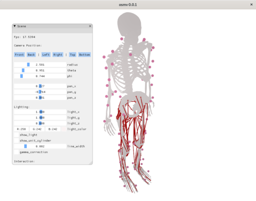

# osmv 

> A thin UI for building OpenSim models

`osmv` is a standalone UI for building
[OpenSim](https://github.com/opensim-org/opensim-core) models. It is
designed as a proof-of-concept GUI with the intent that some of its
features may be merged into the official [OpenSim GUI](https://github.com/opensim-org/opensim-gui).

Architectrually, `osmv` mostly uses C/C++ that is directly integrated
against the [OpenSim core API](https://github.com/opensim-org/opensim-core) and otherwise only
uses lightweight open-source libraries that can be built from source
on all target platforms (e.g. SDL2, GLEW, ImGui). This makes `osmv`
fairly easy to build, integrate, and package.

`osmv` started development in 2021 in the [Biomechanical Engineering](https://www.tudelft.nl/3me/over/afdelingen/biomechanical-engineering)
department at [TU Delft](https://www.tudelft.nl/). It is funded by the
Chan Zuckerberg Initiative's "Essential Open Source Software for
Science" grant.

# 🚀 Installation

> 🚧 **ALPHA-STAGE SOFTWARE** 🚧: OSMV is currently in development, so
> things are prone to breaking. If a release doesn't work for you,
> report it on the [issues](https://github.com/adamkewley/osmv/issues)
> page, try a different [release](https://github.com/adamkewley/osmv/releases) 
> or try a passing build from [the actions page](https://github.com/adamkewley/osmv/actions)

*Latest release: 0.0.2 (released 12th Apr 2021)*

| OS | Link | Comments |
| - | - | - |
| Windows 10 | [.exe](https://github.com/adamkewley/osmv/releases/download/0.0.2/osmv-0.0.2-win64.exe) | |
| Mac (Catalina onwards) | [.dmg](https://github.com/adamkewley/osmv/releases/download/0.0.2/osmv-0.0.2-Darwin.dmg) | The DMG is unsigned, so you will probably need to open Finder -> Applications -> right click osmv -> open -> handle security prompt |
| Ubuntu Focal (20) | [.deb](https://github.com/adamkewley/osmv/releases/download/0.0.2/osmv_0.0.2_amd64.deb) | |
| Debian Buster (10) | [.deb](https://github.com/adamkewley/osmv/releases/download/0.0.2/osmv_0.0.2_amd64.deb) | |

# 🏗️  Building

No full-fat build documentation available (yet ;)). However, you can
*probably* just run the CI build scripts because they don't rely on any
GitHub (CI) specific tricks (e.g. see [action](.github/workflows/continuous-integration-workflow.yml)). The
build scripts should work on a standard C++ developer's machine (as long as you have a C/C++ compiler, 
CMake, etc. installed):

| OS | Build Script | Usage Example |
| - | - | - |
| Windows | [.bat](scripts/build_windows.bat) | `git clone https://github.com/adamkewley/osmv && cd osmv && scripts\build_windows.bat` |
| Mac | [.sh](scripts/build_mac-catalina.sh) | `git clone https://github.com/adamkewley/osmv && cd osmv && scripts/build_mac-catalina.sh` |
| Ubuntu/Debian | [.sh](scripts/build_debian-buster.sh) | `git clone https://github.com/adamkewley/osmv && cd osmv && scripts/build_debian-buster.sh` |

