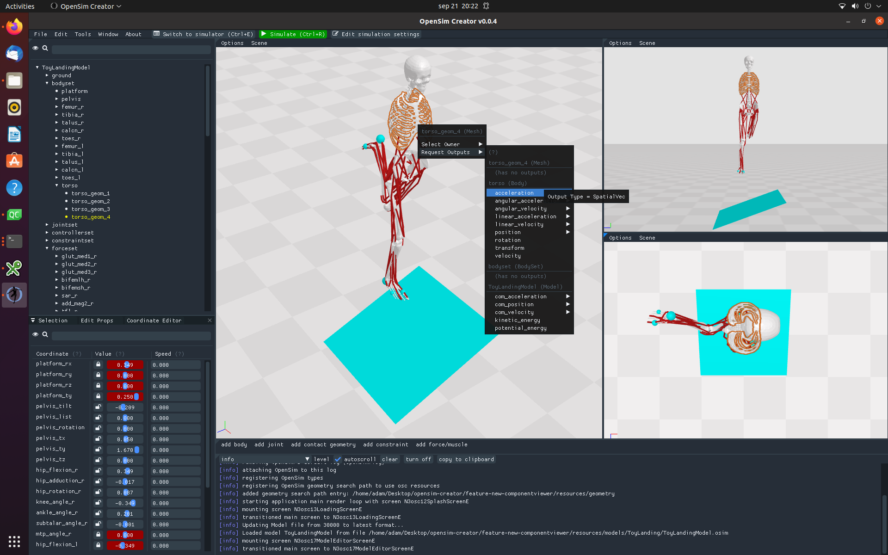

# OpenSim Creator 

> A UI for building OpenSim models

- 📥 Want to download it? [Download the latest release here](../../releases/latest)
- 📚 Want to learn the basics? [Watch Introduction Videos Here](https://www.youtube.com/playlist?list=PLOPlDtRLhp8c2SWLCQKKd-l4__UainOYk)
- 🐛 Found a bug or want to request a feature? [Post it on the issues page](../../issues)
- ❓ Have a question? [Go to the discussions page](../../discussions)
- 📖 Want to cite the project? [See the citation section of this README](#citing)

## 👓 Overview

OpenSim Creator (`osc`) is a standalone UI for building and editing
[OpenSim](https://github.com/opensim-org/opensim-core) models. It is available
as a freestanding all-in-one [installer](../../releases/latest) for Windows 10 (or newer),
MacOS Ventura (or newer), and Ubuntu 20 (or newer).

Architecturally, `osc` is a C++ codebase that is directly integrated against
the [OpenSim core C++ API](https://github.com/opensim-org/opensim-core). It otherwise only
uses lightweight open-source libraries that can easily be built from source (e.g. [SDL](https://www.libsdl.org/), [ImGui](https://github.com/ocornut/imgui), and [stb](https://github.com/nothings/stb))
to implement the UI on all target platforms. This makes `osc` fairly easy to build, integrate, and package.

`osc` started development in 2021 in the [Biomechanical Engineering](https://www.tudelft.nl/3me/over/afdelingen/biomechanical-engineering)
department at [TU Delft](https://www.tudelft.nl/). It is currently funded by the
[Chan Zuckerberg Initiative](https://chanzuckerberg.com/)'s "Essential Open Source Software for
Science" grant (Chan Zuckerberg Initiative DAF, 2020-218896 (5022)).

<table align="center">
  <tr>
    <td colspan="2" align="center">Project Sponsors</td>
  </tr>
  <tr>
    <td align="center">
      <a href="https://www.tudelft.nl/3me/over/afdelingen/biomechanical-engineering">
        
         
        Biomechanical Engineering at TU Delft
      </a>
    </td>
    <td align="center">
      <a href="https://chanzuckerberg.com/">
        
         
        Chan Zuckerberg Initiative
      </a>
    </td>
  </tr>
</table>

## 🚀 Installing

You can download a release from the [📥 releases](../../releases) page. The latest
release is [📥 here](../../releases/latest). Also, OpenSim Creator is regularly built
from source using GitHub Actions, so if you want a bleeding-edge--but unreleased--build
of OpenSim Creator check [⚡ the actions page](../../actions) (downloading a CI build
requires being logged into GitHub; otherwise, you won't see download links).

### Windows (10 or newer)

- Download an `exe` [release](../../releases)
- Run the `.exe` installer, continue past any security warnings
- Follow the familiar `next`, `next`, `finish` wizard
- Run `OpenSimCreator` by typing `OpenSimCreator` in your start menu, or browse to `C:\Program Files\OpenSimCreator\`.

### Mac (Ventura or newer)

- Download a `dmg` [release](../../releases)
- Double click the `dmg` file to mount it
- Drag `osc` into your `Applications` directory.
- Browse to the `Applications` directory in `Finder`
- Right-click the `osc` application, click `open`, continue past any security warnings to run `osc` for the first time
- After running it the first time, you can boot it as normal (e.g. `Command+Space`, `osc`, `Enter`)

### Ubuntu (20 or newer)

- Download a `deb` [release](../../releases)
- Double-click the `.deb` package and install it through your package manager UI.
- **Alternatively**, you can install it through the command-line: `apt-get install -yf ./osc-X.X.X_amd64.deb` (or similar).
- Once installed, the `osc` or `OpenSim Creator` shortcuts should be available from your desktop, or you can browse
  to `/opt/osc`

## 📖 Citing/Acknowledging

OpenSim Creator doesn't have a central _written_ software publication that you can cite (yet 😉). However, if you _need_ to directly cite OpenSim Creator (e.g. because you think it's relevant that you built a model with it), the closest thing you can use is our DOI-ed Zenodo releases (metadata available in this repo: `CITATION.cff`/`codemeta.json`):

> Kewley, A., Beesel, J., & Seth, A. (2024). OpenSim Creator (0.5.12). Zenodo. https://doi.org/10.5281/zenodo.11086325

If you need a general citation for the simulation/modelling technique, you can directly cite OpenSim via this paper:

> Seth A, Hicks JL, Uchida TK, Habib A, Dembia CL, et al. (2018) **OpenSim: Simulating musculoskeletal dynamics and neuromuscular control to study human and animal movement.** _PLOS Computational Biology_ 14(7): e1006223. https://doi.org/10.1371/journal.pcbi.1006223

## 🥰 Contributing

If you would like to contribute to OpenSim Creator then thank you 🥰: it's people like you
that make open-source awesome! See [CONTRIBUTING.md](CONTRIBUTING.md) for more details.

## 🏗️  Building

> **Note**: The build instructions here are for general users who just want to build OSC.
>
> Because everyone's C++ build environment is *slightly* different, there are no catch-all build
> instructions that will work for everyone. Instead, we recommend reading + running the automated
> build scripts, or reading some of the basic tips-and-tricks for Visual Studio or QtCreator (below).

### Windows (10 or newer)

1. Get `git`:
    1. Download+install it from https://git-scm.com/downloads
    2. Make sure to add it to the `PATH`. Usually, the installer asks if you want this. If it doesn't ask, then you may need to add it manually (google: "Modify windows PATH", add your `git` install: `C:\Program Files\Git\bin`)
    3. Verify it's installed by opening a terminal (`Shift+Right-Click` -> `Open Powershell window here`) and run `git`
2. Get C++20-compatible compiler (`Visual Studio 17 2022`):
    1. Download+install it from https://visualstudio.microsoft.com/downloads/
    2. Make sure to select C/C++ development in the installer wizard when it asks you what parts you would like to install
3. Get `cmake`:
    1. Download+install it from https://cmake.org/download/
    2. Make sure to add it to the `PATH`. Usually, the installer asks if you want this. If it doesn't ask, then you may need to add it manually (google: "Modify windows PATH", add your `cmake` install: `C:\Program Files\CMake\bin`)
    3. Verify it's installed by opening a terminal (`Shift+Right-Click` -> `Open Powershell window here`) and run `cmake`
4. Get `NSIS`:
    1. Download+install it from https://nsis.sourceforge.io/Download
5. Get `python` and `pip`:
    1. Download from https://www.python.org/downloads/
    2. Make sure `python` and `pip` are added to the `PATH` (the installer usually prompts this)
    3. Verify they are installed by opening a terminal (`Shift+Right-Click` -> `Open Powershell window here`) and run `python --help` and `pip --help`
6. Build OpenSim Creator in a PowerShell terminal:
    1. Open a PowerShell terminal (`Shift+Right-Click` -> `Open Powershell window here`)
    2. Clone `opensim-creator`: `git clone https://github.com/ComputationalBiomechanicsLab/opensim-creator`
    3. `cd` into the source dir: `cd opensim-creator`
    4. Run the build script: `python .\scripts\build_windows.py` (**warning**: can take a long time)
7. Done:
    1. The `osc-build` directory should contain the built installer

### Mac (Ventura or newer)

1. Get `brew`:
    1. Go to https://brew.sh/ and follow installation instructions
2. Get `git`: 
    1. Can be installed via `brew`: `brew install git`
3. Get C++20-compatible compiler (e.g. `clang` via brew, or newer XCodes):
    1. OpenSim Creator is a C++20 project, so you'll have to use a more recent XCode (>14), or
       install a newer `clang` from brew (e.g. `brew install clang`)
4. Get `cmake`:
    1. Can be installed via `brew`: `brew install cmake`
5. Get `python` and `pip` (*optional*: you only need this if you want to build documentation):
    1. Can be installed via `brew`: `brew install python`
6. Build OpenSim Creator in a terminal:
    1. Clone `opensim-creator`: `git clone https://github.com/ComputationalBiomechanicsLab/opensim-creator`
    2. `cd` into the source dir: `cd opensim-creator`
    3. If you have multiple C++ compilers, make sure that the `CC` and `CXX` environment variables
       point to compilers that are compatible with C++20. E.g. `export CXX=$(brew --prefix llvm@15)/bin/clang++`
    4. Run the build script: `scripts/build_mac.sh` (**warning**: can take a long time)
6. Done:
    1. The `osc-build` directory should contain the built installer

### Ubuntu (20 or newer)

1. Get `git`:
    1. Install `git` via your package manager (e.g. `apt-get install git`)
2. Get a C++20-compatible compiler:
    1. Install `g++`/`clang++` via your package manager (e.g. `apt-get install g++`)
    2. They must be new enough to compile C++20 (e.g. clang >= clang-11)
    3. If they aren't new enough, most Linux OSes provide a way to install a newer compiler
       toolchain (e.g. `apt-get install clang-11`). You can configure which compiler is used
       to build OpenSim Creator by setting the `CC` and `CXX` environment variables. E.g.
       `CC=clang-11 CXX=clang++-11 ./scripts/build_debian-buster.sh`
3. Get C++20-compatible standard library headers (usually required on Ubuntu 20):
    1. `sudo apt-get install libstdc++-10-dev`
3. Get `cmake`:
    1. Install `cmake` via your package manager (e.g. `apt-get install cmake`)
    2. If your cmake is too old, build one from source, see: https://askubuntu.com/a/865294
4. Get `python` and `pip` (*optional*: you only need this if you want to build documentation):
    1. Install `python3` and `pip3` via your package manager (e.g. `apt-get install python3 pip3`)
5. Build OpenSim Creator in a terminal:
    1. Clone `opensim-creator`: `git clone https://github.com/ComputationalBiomechanicsLab/opensim-creator --recursive`
    2. `cd` into the source dir: `cd opensim-creator`
    3. If you have multiple C++ compilers, make sure that the `CC` and `CXX` environment variables point to
       compilers that are compatible with C++20. E.g. `export CC=clang-12`, `export CXX=clang++-12`
    4. Run the build script: `scripts/build_debian-buster.sh`
6. Done:
    1. The `osc-build` directory should contain the built installer

## 💻 Setup Development Environment

These are some generic tips that might be handy when setting up your own development environment.

### Visual Studio 2022

- Run [build_windows.py --skip-osc](scripts/build_windows.py) (described above) to get a complete build of
  OSC's dependencies.
- In Visual Studio 2020, open `opensim-creator` as a folder project
- Later versions of Visual Studio (i.e. 2017+) should have in-built CMake support that automatically detects that the folder is a CMake project
- Right-click the `CMakeLists.txt` file to edit settings or build the project
  - You may need to set your configure command arguments to point to the dependencies install (e.g. `-DCMAKE_PREFIX_PATH=$(projectDir)/osc-dependencies-install`)
- Use the `Switch between solutions and available views` button in the `Solution Explorer` hierarchy tab to switch to the `CMake Targets View`
- Right-click the `osc` CMake target and `Set As Startup Project`, so that pressing `F5` will then build+run `osc.exe`
- (optional): switch the solution explorer view to a `Folder View` after doing this: the CMake view is crap for developing osc
- You should now be able to build+run `osc` from `Visual Studio`
- To run tests, open the `Test Explorer` tab, which should list all of the `googletest` tests in the project

### QtCreator

- Run the appropriate (OS-dependent) buildscript (described above)
- Open QtCreator and then open the `opensim-creator` source directory as a folder
- For selecting a "kit", QtCreator *usually* detects that `osc-build` already exists (side-effect of running the buildscript). You *may* need to "import existing kit/build" and then select `osc-build`, though
- Once QtCreator knows your source dir (`opensim-creator/`) and build/kit (`opensim-creator/osc-build`), it should be good to go
