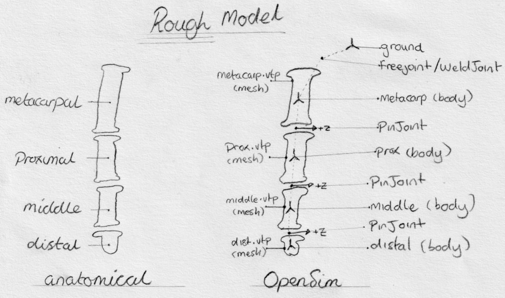

.. _chal1:

Challenge 1: Model a Finger
===========================

In this challenge, you will try to create a basic human finger model:

    An extremely rough topological diagram of the model you need to create. The mesh files (``metacarp.vtp``, ``prox.vtp``, ``middle.vtp``, and ``dist.vtp``) can be downloaded :download:`here <_static/opensim-creator_challenge1_finger-meshes.zip>`. You can use any approach you like to create this model. The hints section might help, though :-).

Overview
--------

A common hurdle in biomechanical modelling is designing an appropriate model in the first place. This basic challenge exercises some of the earliest steps of creating a new OpenSim model. Specifically, **importing external mesh data**, **creating bodies**, and **adding joints**. Once you feel comfortable with those steps, you will be able to create OpenSim models that can be viewed in a variety of tools, can be simulated, and can be built on top of (e.g. by adding muscles, adding contact surfaces, refining parameters, etc.).

Challenge Statement
-------------------

Create an OpenSim model of a human finger. Requirements:

- It should be saved as an ``.osim`` file that can be sucessfully loaded in both OpenSim Creator and the offical OpenSim GUI.

- It should contain four bodies corresponding to the four bones of a finger. Reccommended names for the bodies: ``metacarp``, ``prox``, ``middle``, and ``dist``.

- The bodies should be represented with :download:`these mesh files <_static/opensim-creator_challenge1_finger-meshes.zip>`

- It should contain three pin joints between the finger bodies. The pin joints should be oriented such that the pin axis rolls in the direction that you'd expect a human finger to roll.

- It *may* contain an additional weld joint between the ``metacarp`` body and ``ground``. This joint will "anchor" the finger in the scene so that the remaining joint coordinates can be altered to test whether the finger moves in the correct manner.

- It *may* have somewhat convincing body masses. The ``distal`` body should weigh the least and the ``metacarp`` body should weigh the most. **Open question**: How would you figure this out? External data sources? Mesh volume?

Hints
-----

You can work on this exercise however you want. Here are some general hints, though:

- It's *a lot* easier to edit an OpenSim model if you are familiar with high-level, general OpenSim concepts. For example, knowing how components in an OpenSim model form a topography that must connect to ground makes it easier to decide where/how to connect joints. Editing spatial properties is easier if you know OpenSim's relative coordinate system, etc. See :ref:`tut1` for a basic tutorial that covers these topics.

- The OpenSim Creator editor UI can be used to edit component properties, model coordinates, and add things into the model. :ref:`tut1` is a basic tutorial on that. :ref:`tut2` is a more-involved tutorial that covers it in more detail.

- The Mesh Importer feature in OpenSim Creator makes it easier to import mesh files, add bodies, and join things with joints without having to "manually" work with OpenSim concepts. This isn't useful to know when working on *existing* OpenSim models, but it is useful to know when working on *new* models.

- The OpenSim Creator editor UI automatically reloads saved ``.osim`` files whenever they are externally edited. This means you can leverage any existing OpenSim documentation/tooling that manipulates ``.osim`` files.
