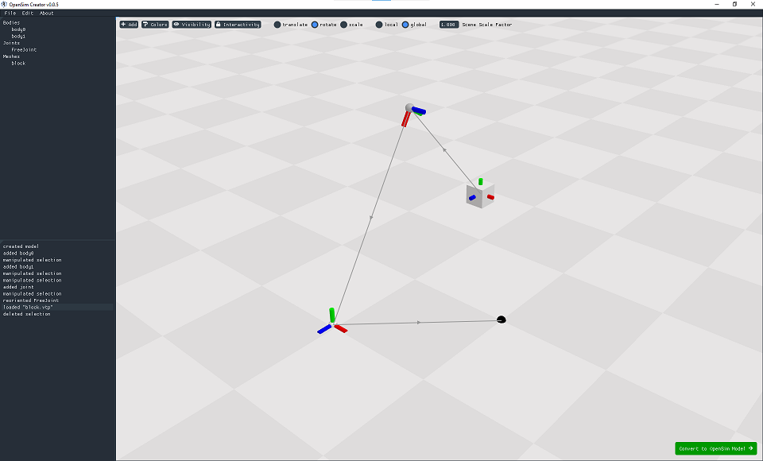
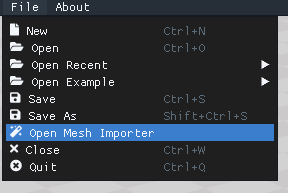

.. _doc_meshimporterwizard:

Mesh Importer Wizard
====================

This is a standalone documentation page for the Mesh Importer Wizard feature in OpenSim Creator:

    The mesh importer UI. The importer is specifically designed to make importing meshes as free-form as possible. In the UI, you can freely move meshes, bodies, and joints before converting everything into a standard OpenSim model.

.. warning::

    🚧 This documentation is work in progress 🚧. The mesh importer wizard is a new feature in OpenSim Creator and is still being changed frequently. Because of that, this documentation might not be accurate.

TODO
The mesh importer is designed to be *a lot* more relaxed about how/when things can be placed in the scene. Key differences:

* **You can add bodies whenever/wherever you want in the scene**. The mesh importer will automatically add a ``FreeJoint`` if it detects that the body isn't connected to ground. Connections between bodies and joints can be modified at any time. A body's location in 3D space is free-form and the mesh importer will automatically compute the ``OffsetFrame`` necessary to place the body in the exported OpenSim model.

* **You can freely move, orient, and scale anything in the scene - including joints**. The mesh importer uses an absolute coordinate system, rather than a relative one (OpenSim's default). This is a disadvantage when simulating relative quantities (e.g. joint angles), but can be simpler to work with when initially designing the topology of a model. You can move any element in the scene without having to worry about relative coordinate systems, attached elements shifting around, etc.

* **There are more tools for placement/orientation**. Because of the above points (free-form placement, absolute coordinate systems), the mesh importer has more tools available for freely placing things in the model. E.g. it contains tools for orienting things along mesh points, moving elements between other elements, etc.

The mesh importer is "looser" than the main ``osim`` editor. However, it's disadvantage is that it doesn't directly edit an ``osim`` file. Rather, it edits a simplified "model" that can be exported to the (more complex) ``osim`` format. For this reason, the mesh importer is recommended a *first-step* utility that helps set up the top-level model (e.g. body placement, joint placement) such that it's ready for ``osim`` editor to tackle the more complicated steps (adding/editing forces, contact surfaces, muscles, etc.).

Accessing
---------

The mesh importer UI can be accessed from the File menu in the splash screen or in the editor:

    Mesh importer button location in the main menu.

This will replace whatever is open in the current screen with the mesh importer screen.

Key Features
------------

This is a kitchen-sink list mesh importer features that you might find useful, rather than an authoritative guide on how to use the importer. Experimenting with the importer yourself is the fastest way to explore the benefits/pitfalls of these features.

- All scene elements in the mesh importer can be freely moved, rotated, and (if manipulating a mesh) scaled. The mesh importer will converts all positions + orientations into OpenSim's relative coordinate system during the import phase.

- You can import meshes through the "Add" menu, or by right-clicking the scene and using the context menu, or by dragging + dropping mesh file(s) into the window.

- You can directly import and attach a mesh to a body by right-clicking a body and using the "attach mesh to this" item. The mesh will be loaded, reoriented to match the body, and attached to the body.

- You can create joints from bodies to other bodies (or ground) by right-clicking a body and clicking "join to".

- The joint type of any added joint can be edited by right-clicking the joint center.

- All scene elements are also accessible through the hierarchy panel. This is especially useful when the scene is very complex and contains a lot of overlapping elements.

- The visualization, locking, and color of elements in the scene can be customized. This is useful in more-complex scenes.

- The visualizer has a "scale factor" parameter that can be adjusted to make the frames and floor texture smaller/bigger. This is especially useful when working on extremely small/large models (e.g. insects).

- All scene elements can be safely deleted/renamed

- All operations have undo/redo support. Undo/redo is implemented as a labelled history. You can manually navigate to any entry in that history in the "History" panel.

- Reopening the mesh importer remembers the last state of the mesh importer. This means that you can import a model, see if it works (simulates well, is well-formed in OpenSim), and then go back and make further edits in the importer (if necessary).
