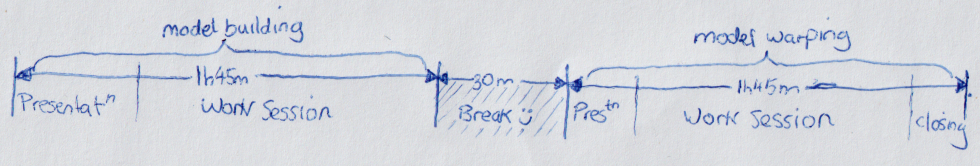

ESMAC 2025 Workshop
===================

.. warning::

    This explanation is :red:`work in progress`. We plan on updating/polishing
    this documentation in mid-August to early-September before ESMAC 2025 in
    response to feedback.

    If you're on the team, or going to ESMAC, and you spot a problem or would
    like things to be different, then leave a comment on the `ESMAC 2025 Workshop Development Issue`_.

The OpenSim Creator team will present **"Building Patient-Specific Musculoskeletal
Models with OpenSim Creator"** at the European Society for Movement Analysis in
Adults and Children (ESMAC). This documentation is a guidebook for that workshop.

📅 When/Where
-------------

The workshop shall be held at the ESMAC conference on the afternoon of the 10th
September 2025. The exact time and room is still to-be-decided (:red:`TODO`).

🧑🏽‍🔬 Organizers and Helpers
------------------------------

- Adam Kewley
- Ajay Seth
- :red:`Other helpers TODO`

👩‍💻 Before You Arrive
-----------------------

We recommend attendants prepare for the workshop in the following ways:

- **Download and install OpenSim Creator**. The work sessions will focus
  on using OpenSim Creator's features for model building and warping.
  The :ref:`installation` page outlines the procedure.
- **(optional) Download and install OpenSim**. To answer attendants' specific
  modelling questions, team members may recommend OpenSim GUI/API. OpenSim
  can be downloaded from the `OpenSim SimTK Page`_. Setting up a scripting (API)
  environment is described in the `OpenSim Scripting Documentation`_.
- **(optional) Familiarize Yourself with the basics of OpenSim/modelling**. The
  work sessions may be easier to follow if you have already gone through an early
  tutorial, such as :doc:`make-a-pendulum`.

**If you are already working on an OpenSim model**, bring it along. The workshop
is structured such that work sessions' walkthroughs and exercises can *usually* be
completed with any model. The work sessions are an ideal time to ask specific
questions about creating your model.

🗺️ Workshop Overview
--------------------

The workshop will last around four hours, with a thirty minute break in the
middle. There will be three presentations at the start, middle, and end of
the workshop.

    A (very 🙃) rough schedule for the workshop. The longest parts will be
    work sessions in which we'll go through some walkthroughs, specific
    features, and answer attendants' questions.

The first half of the workshop will be focused on model building. The work
session will include feature demonstrations by the team, specific model
building walkthroughs (e.g. building a basic model), and a chance for attendants
to explore OpenSim Creator or work on their own model with help from the team.

The second half of the workshop will focus on model scaling/warping. We
will introduce our latest beta workflow, :doc:`the-model-warper`, and explain
how it can be used to create subject-specific models. The work session will be
a chance for attendants to give this workflow a try and provide us with feedback
about it - this time can also be used to continue exploring OpenSim Creator and
build models.

📚 Workshop Materials
---------------------

The materials for the workshop and all documentation pages are published under
a `CC BY 4.0 <https://creativecommons.org/licenses/by/4.0/deed.en>`_ license.
We will keep hosting these materials at `docs.opensimcreator.com <https://docs.opensimcreator.com>`_
after the workshop has ended.

1. Presentation: Model Building with OpenSim Creator
^^^^^^^^^^^^^^^^^^^^^^^^^^^^^^^^^^^^^^^^^^^^^^^^^^^^

LINK: `Presentation, Model Building with OpenSim Creator`_

**TODO**: once everything is basically ready in OneDrive, publish a final(ish)
version to files.opensimcreator.com, put a screenshot of the first slide here
and link to the download.

2. Work Session: Model Building
^^^^^^^^^^^^^^^^^^^^^^^^^^^^^^^

LINK: `Work Session, Model Building`_

**TODO**: once everything is basically ready in OneDrive, publish a final(ish)
version to files.opensimcreator.com, put a screenshot of the first slide here
and link to the download.

**TODO**: download links for any supplamentary data that attendants might need
during this session (e.g. meshes).

3. Break
^^^^^^^^

LINK: `Backdrop, Break`_

**TODO**: once everything is basically ready in OneDrive, publish a final(ish)
version to files.opensimcreator.com, put a screenshot of the first slide here
and link to the download.

Chill out for 30 minutes. Stretch your legs, chat to other attendants, etc.

4. Presentation: Model Warping with OpenSim Creator
^^^^^^^^^^^^^^^^^^^^^^^^^^^^^^^^^^^^^^^^^^^^^^^^^^^

LINK: `Presentation, Model Warping with OpenSim Creator`_

**TODO**: once everything is basically ready in OneDrive, publish a final(ish)
version to files.opensimcreator.com, put a screenshot of the first slide here
and link to the download.

5. Work Session: Model Warping
^^^^^^^^^^^^^^^^^^^^^^^^^^^^^^

LINK: `Work Session, Model Warping with OpenSim Creator`_

**TODO**: once everything is basically ready in OneDrive, publish a final(ish)
version to files.opensimcreator.com, put a screenshot of the first slide here
and link to the download.

**TODO**: download links for any supplamentary data that attendants might need
during this session (e.g. meshes).

6. Presentation: Closing Thoughts, Outlook
^^^^^^^^^^^^^^^^^^^^^^^^^^^^^^^^^^^^^^^^^^

LINK: `Presentation, Closing Thoughts`_

**TODO**: once everything is basically ready in OneDrive, publish a final(ish)
version to files.opensimcreator.com, put a screenshot of the first slide here
and link to the download.

**TODO**: Make sure the survey link is for the respondants, not the editors.

`Survey for OpenSim Creator Model Building Workshop`_

.. _OpenSim SimTK Page: https://simtk.org/projects/opensim
.. _OpenSim Scripting Documentation: https://opensimconfluence.atlassian.net/wiki/spaces/OpenSim/pages/53089359/Scripting
.. _ESMAC 2025 Workshop Development Issue: https://github.com/ComputationalBiomechanicsLab/opensim-creator/issues/1081
.. _Presentation, Model Building with OpenSim Creator: https://tud365-my.sharepoint.com/:p:/r/personal/akewley_tudelft_nl/Documents/2025_ESMAC-OpenSimCreatorWorkshop/1_Model%20Building%20with%20OpenSim%20Creator.pptx?d=w741836bb5fc24492aeabea26c4ef49e0&csf=1&web=1&e=Jqwc8r
.. _Work Session, Model Building: https://tud365-my.sharepoint.com/:p:/r/personal/akewley_tudelft_nl/Documents/2025_ESMAC-OpenSimCreatorWorkshop/2_Work%20Session%20Model%20Building.pptx?d=wcc76a2637c354612b118fb934d494a6f&csf=1&web=1&e=HBrVQe
.. _Backdrop, Break: https://tud365-my.sharepoint.com/:p:/r/personal/akewley_tudelft_nl/Documents/2025_ESMAC-OpenSimCreatorWorkshop/3_Break.pptx?d=wc4a47228b84c411fb93959ed4560c450&csf=1&web=1&e=BIfq62
.. _Presentation, Model Warping with OpenSim Creator: https://tud365-my.sharepoint.com/:p:/r/personal/akewley_tudelft_nl/Documents/2025_ESMAC-OpenSimCreatorWorkshop/4_Model%20Warping%20with%20OpenSim%20Creator.pptx?d=w46186c240d954422bfe6660352c3fce9&csf=1&web=1&e=xC2RqH
.. _Work Session, Model Warping with OpenSim Creator: https://tud365-my.sharepoint.com/:p:/r/personal/akewley_tudelft_nl/Documents/2025_ESMAC-OpenSimCreatorWorkshop/5_Work%20Session%20Model%20Warping.pptx?d=w87554a93c2e24d67b7a6b4bc373f2a1b&csf=1&web=1&e=f20p8z
.. _Presentation, Closing Thoughts: https://tud365-my.sharepoint.com/:p:/r/personal/akewley_tudelft_nl/Documents/2025_ESMAC-OpenSimCreatorWorkshop/6_Closing%20Thoughts%20and%20Outlook.pptx?d=w8ed7523e920449ebbca6f886d26c6301&csf=1&web=1&e=EJoInk
.. _Survey for OpenSim Creator Model Building Workshop: https://forms.office.com/Pages/DesignPageV2.aspx?subpage=design&FormId=TVJuCSlpMECM04q0LeCIe85Hb1mJVfpCldOXrckn9LdUM0VVV1daMks5NU9STzJYNlBJTlJTUVRXUCQlQCN0PWcu&Token=ca70514d1ba64a3baccffa0c4f0338a3
