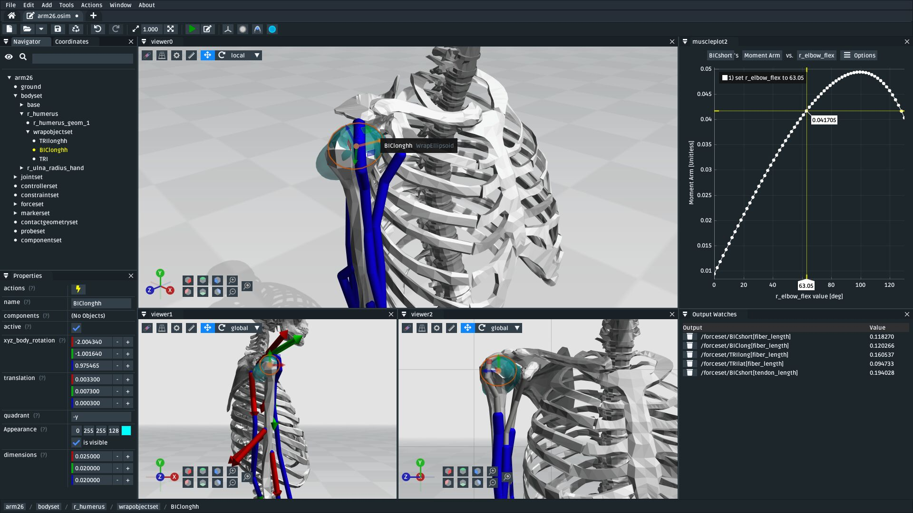

OpenSim Creator Documentation
=============================

OpenSim Creator is a UI for building OpenSim models. These pages are the official
documentation for OpenSim Creator, where you can find installation instructions,
tutorials that cover specific workflows/features, the development guide, and other
related links.

    Screenshot of OpenSim Creator's ``osim`` editor workflow.

Table of Contents
-----------------

.. toctree::
   :maxdepth: 2
   :caption: Setup
   :numbered:

   installation

.. toctree::
   :maxdepth: 2
   :caption: Tutorials
   :numbered:

   make-a-pendulum
   make-a-bouncing-block
   the-mesh-importer
   the-mesh-importer-advanced
   the-mesh-warper
   preview-experimental-data
   station-defined-frames
   make-a-lower-leg
   the-model-warper

.. toctree::
   :maxdepth: 2
   :caption: Development
   :numbered:

   building-from-source
   development-environment
   contributing
   the-release-process

.. toctree::
    :caption: Other Links

    OpenSim Creator GitHub <https://github.com/ComputationalBiomechanicsLab/opensim-creator>
    OpenSim Creator Forum <https://github.com/ComputationalBiomechanicsLab/opensim-creator/discussions>
    OpenSim Creator Bug Tracker <https://github.com/ComputationalBiomechanicsLab/opensim-creator/issues>
    OpenSim GitHub <https://github.com/opensim-org/opensim-core>
    OpenSim Documentation <https://simtk-confluence.stanford.edu/display/OpenSim/Documentation>

.. _Indices and Tables:

Indices and tables
==================

* :ref:`genindex`
* :ref:`search`

.. _OpenSim GUI: https://github.com/opensim-org/opensim-gui
.. _GitHub: https://github.com/ComputationalBiomechanicsLab/opensim-creator
