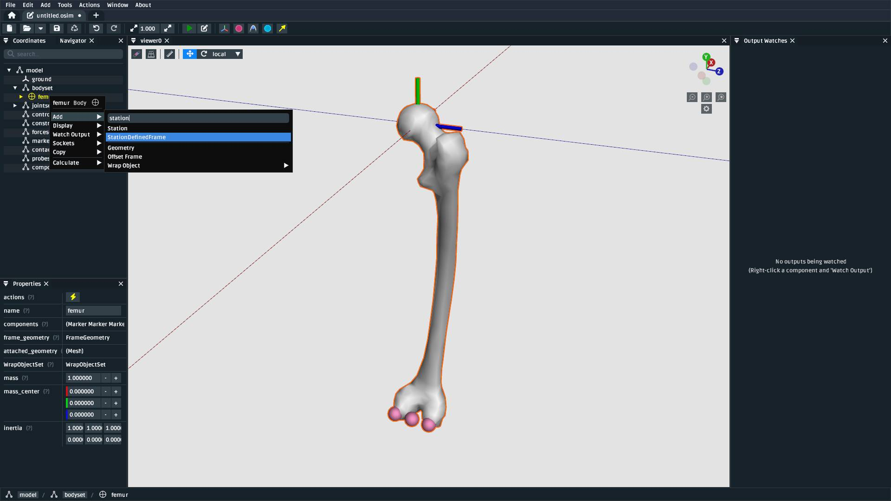
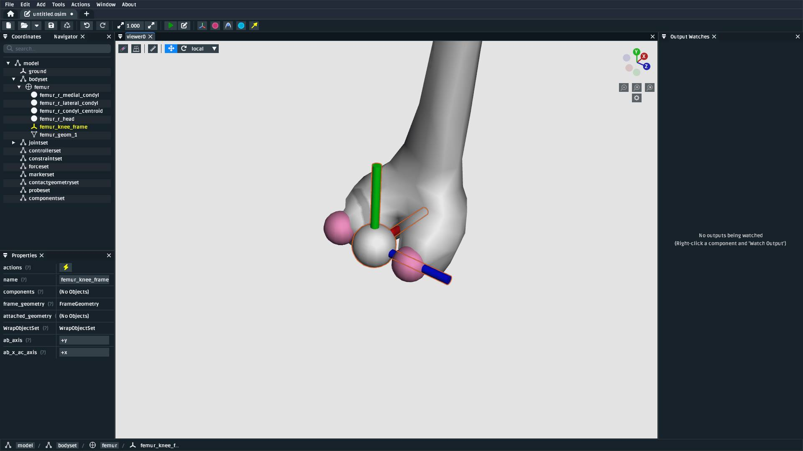

Make a Knee
===========

.. warning::

    This tutorial is new ⭐, and ``StationDefinedFrame`` s require OpenSim >= v4.5.1. The content
    of this tutorial should be valid long-term, but we are waiting for OpenSim GUI v4.6 to be
    released before we remove any "experimental" labelling. We also anticipate adding some handy
    tooling around re-socketing existing joints and defining ``StationDefinedFrame`` s.

In this tutorial, we will be making a basic model of a knee using OpenSim Creator:

    TODO: screenshot of the final knee model

This tutorial will primarily use the model editor workflow to build a new model that
contains some of the steps/components necessary to build a human model. In essence, the
content here will be familar to that in :doc:`make-a-bouncing-block`, but with a focus
on using landmark data, :doc:`station-defined-frames`, and wrap surfaces to build a
model of a biological system.

Prerequisites
-------------

This tutorial assumes you:

- Have a basic working knowledge of OpenSim, which is covered in :doc:`make-a-pendulum`
  and :doc:`make-a-bouncing-block`.
- (*optional*) The modelling process will also include adding a ``StationDefinedFrame`` to
  the model. The details of how they work is explained in :doc:`station-defined-frames`.
- (*optional*) The building process uses externally-provided landmarks in a CSV. If you
  would like to know how to manually place landmarks on a mesh, we recommend reading
  through :doc:`the-mesh-importer`.

Topics Covered by this Tutorial
-------------------------------

* Creating an OpenSim model by adding bodies and joints
* Adding a ``StationDefinedFrame`` to the model in order to define anatomically
  representative joint frames.
* Adding a muscle to the model
* Adding a wrap surface to the model and associating muscles to that surface.

Download Resources
------------------

In order to follow this tutorial, you will need to download the associated
resources :download:`download here <_static/the-model-warper/walkthrough-model.zip>`.

Create a New Model
------------------

Create a blank model from the home screen (explained in :ref:`create-new-model`).

.. _add-femur-body:

Add a Femur Body
----------------

Add a femur body with the femur mesh (``femur_r.vtp``) attached to it to the
model. For this model, use the following parameters:

.. figure:: _static/make-a-knee/add-femur-body.jpeg
    :width: 60%

    Create a body called ``femur`` and attach the ``femur_r.vtp`` geometry to it. The
    mass and intertia can be handled later. The ``femur`` should initially be joined
    to ``ground`` (the knee joint comes later in the process).

Adding bodies is explained in more detail in :ref:`add-body-with-weldjoint` and
:ref:`create-the-foot`.

.. _import-femur-landmarks:

Import Femur Landmarks
----------------------

This model will use a landmark-defined approach to defining the knee frame (explained
in :doc:`station-defined-frames`). To do that, we'll need landmarks on the femur that
correspond to the points that can be used to define the knee's parent frame. The landmarks
we will use roughly correspond to those explained in `Grood et. al.`_, but our definition
will use the Z axis to define knee extension/flexion (Grood et. al. use the X axis) because
OpenSim's ``PinJoint`` always uses the Z axis for rotation.

You can use the point importer in the model editor from the top menu bar, located at ``Tools`` ->
``Import Points``. It will show a popup that you can use to import the source femur knee
landmarks file (``femur_r_knee-frame.landmarks.csv``) as markers that are attached to
the ``femur`` body:

.. figure:: _static/make-a-knee/import-femur-landmarks.jpeg
    :width: 60%

    The ``Import Points`` dialog, with ``femur_r_knee-frame.landmarks.csv``. Make sure to
    select ``femur`` as the body to attach the landmarks to. Otherwise, they will end up
    attached to ``ground``.

.. _add-sdfs-to-femur-condyls:

Add a StationDefinedFrame for the Femur Condyls
-----------------------------------------------

Now that the appropriate landmarks are imported into the model, you can now add a
``StationDefinedFrame`` to ``femur`` that computes the knee's coordinate system
(frame) from those landmarks.

To do that, you'll need to right-click the ``femur`` body and then ``Add`` a
``StationDefinedFrame`` component to it that connects to the appropriate (imported)
markers:

    The ``StationDefinedFrame`` can be added as a child of ``femur`` by right-clicking
    the ``femur`` component and using the ``Add`` menu to add the ``StationDefinedFrame``.

.. figure:: _static/make-a-knee/add-femur-sdf.jpeg
    :width: 60%

    When creating the ``StationDefinedFrame``, make the ``femur_r_condyl_centroid`` the frame
    ``origin_point`` and ``point_a``, ``femur_r_head`` the ``point_b``, ``femur_r_lateral_condyl``
    the ``point_c``. Addtionally, specify that ``ab_axis`` is ``+y`` and ``ab_x_ac_axis`` is ``+x``.
    The relationship between these landmarks specifies the knee's coordinate system.

    Once added, you should be able to see the ``StationDefinedFrame`` in the model. This is the "parent"
    half of a joint definition in OpenSim.

Add a Tibia Body
----------------

Similar to :ref:`add-femur-body`, add a tibia body with the tibia mesh (``tibia_r.vtp``)
attached to it to the model. For this model, use the following parameters:

.. figure:: _static/make-a-knee/add-tibia-body.jpeg
    :width: 60%

    Add the ``tibia`` body to the model with these properties. Make sure to attach the
    ``tibia_r.vtp`` mesh to the body.

To save some time, the provided tibia mesh data (``tibia_r.vtp``) is already defined with
respect to the knee origin, which means that we do not need to define a ``StationDefinedFrame``
for the tibia.

Add a Muscle Between the Femur and the Tibia
--------------------------------------------

Now that both bodies have been added and joined with a ``PinJoint``, we can define muscles
that connect the two bodies.

TODO: describe adding relevant landmarks/stations or whatever is necessary in order to
create a muscle that has one point on the femur and one point on the tibia. Point out that
it's going to look kind of shit initially because it will take the shortest path between the
two (i.e. it'll clip through the meshes etc.)

Add a Knee Wrap Cylinder Wrap Surface
-------------------------------------

TODO: describe adding a knee wrap surface to the relevant body (accessible via the UI by
right-clicking the relevant body -> Add -> WrapSurface or similar).

Associate the Muscle with the Wrap Surface
------------------------------------------

TODO: describe why wrap surfaces are separate from their interaction set (it makes logical sense
but users routinely are confused by this extra step). Associated by right-clicking muscle
and following the relevant menu option.

Summary
-------

TODO: short summary that summarizes the various steps taken to build the model, what the model's
simplications/shortcomings are, and suggestions for future improvements/steps.

.. _Grood et. al.:  https://doi.org/10.1115/1.3138397
