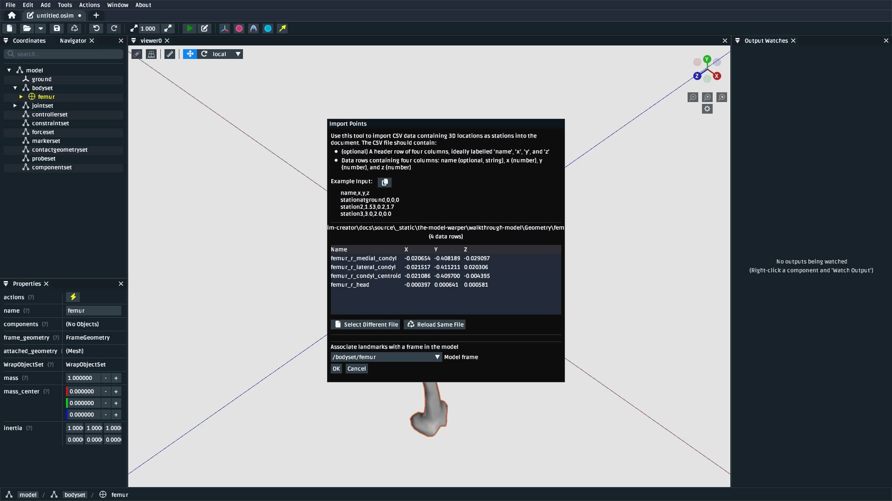

Make a Knee
===========

.. warning::

    This tutorial is new ⭐, and ``StationDefinedFrame`` s require OpenSim >= v4.5.1. The content
    of this tutorial should be valid long-term, but we are waiting for OpenSim GUI v4.6 to be
    released before we remove any "experimental" labelling. We also anticipate adding some handy
    tooling around re-socketing existing joints and defining ``StationDefinedFrame`` s.

In this tutorial, we will be making a basic model of a knee using OpenSim Creator:

    The model created by this tutorial. It contains two bodies, one joint, one muscle,
    and a wrap surface. This covers the basics of using OpenSim Creator's model editor
    to build a model with biological components (see :doc:`make-a-bouncing-block` for
    a more mechanical example).

This tutorial will primarily use the model editor workflow to build a new model that
contains some of the steps/components necessary to build a human model. In essence, the
content here will be similar to that in :doc:`make-a-bouncing-block`, but with a focus
on using landmark data, :doc:`station-defined-frames`, and wrap surfaces to build a
model of a biological system.

Prerequisites
-------------

This tutorial assumes you:

- Have a basic working knowledge of OpenSim, which is covered in :doc:`make-a-pendulum`
  and :doc:`make-a-bouncing-block`.
- (*optional*) The modelling process will also include adding a ``StationDefinedFrame`` to
  the model. The details of how they work is explained in :doc:`station-defined-frames`.
- (*optional*) The building process uses externally-provided landmarks in a CSV. If you
  would like to know how to manually place landmarks on a mesh, we recommend reading
  through :doc:`the-mesh-importer`.

Topics Covered by this Tutorial
-------------------------------

* Creating an OpenSim model by adding bodies and joints
* Adding a ``StationDefinedFrame`` to the model in order to define anatomically
  representative joint frames.
* Adding a muscle to the model
* Adding a wrap surface to the model and associating muscles to that surface.

Download Resources
------------------

In order to follow this tutorial, you will need to download the associated
resources :download:`download here <_static/the-model-warper/walkthrough-model.zip>`.

Create a New Model
------------------

Create a blank model from the home screen (explained in :ref:`create-new-model`).

.. _add-femur-body:

Add a Femur Body
----------------

Add a femur body with the femur mesh (``femur_r.vtp``) attached to it to the
model. For this model, use the following parameters:

    Create a body called ``femur`` and attach the ``femur_r.vtp`` geometry to it. The
    mass and intertia can be handled later. The ``femur`` should initially be joined
    to ``ground`` (the knee joint comes later in the process).

Adding bodies is explained in more detail in :ref:`add-body-with-weldjoint` and
:ref:`create-the-foot`.

.. _import-femur-landmarks:

Import Femur Landmarks
----------------------

This model will use a landmark-defined approach to defining the knee frame (explained
in :doc:`station-defined-frames`). To do that, we'll need landmarks on the femur that
correspond to the points that can be used to define the knee's parent frame. The landmarks
we will use roughly correspond to those explained in `Grood et. al.`_, but our definition
will use the Z axis to define knee extension/flexion (Grood et. al. use the X axis) because
OpenSim's ``PinJoint`` always uses the Z axis for rotation.

You can use the point importer in the model editor from the top menu bar, located at ``Tools`` ->
``Import Points``. It will show a popup that you can use to import the source femur knee
landmarks file (``femur_r.landmarks.csv``) as markers that are attached to
the ``femur`` body:

    The ``Import Points`` dialog, with ``femur_r.landmarks.csv``. Make sure to
    select ``femur`` as the body to attach the landmarks to. Otherwise, they will end up
    attached to ``ground``.

.. _add-sdfs-to-femur-condyls:

Add a StationDefinedFrame for the Femur Condyls
-----------------------------------------------

Now that the appropriate landmarks are imported into the model, you can now add a
``StationDefinedFrame`` to ``femur`` that computes the knee's coordinate system
(frame) from those landmarks.

To do that, you'll need to right-click the ``femur`` body and then ``Add`` a
``StationDefinedFrame`` component to it that connects to the appropriate (imported)
markers:

.. figure:: _static/make-a-knee/add-station-defined-frame-menu.jpeg
    :width: 60%

    The ``StationDefinedFrame`` can be added as a child of ``femur`` by right-clicking
    the ``femur`` component and using the ``Add`` menu to add the ``StationDefinedFrame``.

    When creating the ``StationDefinedFrame``, make the ``femur_r_condyl_centroid`` the frame
    ``origin_point`` and ``point_a``, ``femur_r_head`` the ``point_b``, ``femur_r_lateral_condyl``
    the ``point_c``. Addtionally, specify that ``ab_axis`` is ``+y`` and ``ab_x_ac_axis`` is ``+x``.
    The relationship between these landmarks specifies the knee's coordinate system.

.. figure:: _static/make-a-knee/after-femur-sdf-added.jpeg
    :width: 60%

    Once added, you should be able to see the ``StationDefinedFrame`` in the model. This is the "parent"
    half of a joint definition in OpenSim.

Add a Tibia Body
----------------

Similar to :ref:`add-femur-body`, add a tibia body with the tibia mesh (``tibia_r.vtp``)
attached to it to the model. For this model, use the following parameters:

    Add the ``tibia`` body to the model with these properties. Make sure to attach the
    ``tibia_r.vtp`` mesh to the body.

    To save some time, the provided tibia mesh data (``tibia_r.vtp``) is already defined
    with respect to the knee origin, which means that we do not need to define a
    ``StationDefinedFrame`` for the tibia.

Add a Muscle Between the Femur and the Tibia
--------------------------------------------

Now that both bodies have been added and joined with a ``PinJoint``, we can define muscles
that connect the two bodies.

To add a muscle to a model, the model must contain at least two pre-existing locations that
can be used as muscle points. These can either be added manually (via the ``Add`` menu) or
imported (as in :ref:`import-femur-landmarks`). We'll combine both approaches here.

To add a ``Marker`` manually, you can right-click the ``femur`` and use the ``Add`` menu to
add a ``Marker`` component, followed by manually placing it on the femur mesh:

    One way to define muscle points is to manually add a ``Marker`` component to the model
    attached to the appropriate body (here, ``femur``) and then manually move the marker to
    the correct location.

.. figure:: _static/make-a-knee/manually-place-femur-muscle-origin-marker.jpeg
    :width: 60%

    Once a ``Marker`` has been added, it can be manually moved around with the mouse, or
    you can edit its ``location`` property (if necessary, with respect to a different frame).

To add a ``Marker`` from an external data source (CSV), follow the same procedure as
:ref:`import-femur-landmarks`, but import ``tibia_r_muscle-point.landmarks.csv`` instead
and ensure the marker is attached to the ``tibia`` body:

    Another way to define muscle points is to use the ``Import Points`` tool to import
    external data from a CSV as ``Marker``\s. Remember to specify ``tibia`` as the associated
    frame.

Once you have two locations in the model they can be used to create a muscle (see
also: :ref:`mesh-importer-add-muscle-paths`). Use the ``Add`` menu to add a
``Millard2012EquilibriumMuscle`` to the model that uses the two points:

    When adding a ``Millard2012EquilibriumMuscle``, pick the two markers as its path points. This
    choice can be edited later, if necessary.

    The muscle will then be added to the model but, because it isn't associated with any ``WrapGeometry``,
    it will clip through the bone meshes. This will be fixed in the next section.

**Note**: With the muscle created, you can now delete the ``Marker``\s that were used to initialize it: they
have served their purpose. The resulting muscle isn't connected or related to the ``Marker``\s from which
it was created.

Add a Knee Wrap Cylinder Wrap Surface
-------------------------------------

Now that a muscle has been added to the model, you'll see a problem: the muscle clips through
the bone meshes! This is because we haven't told OpenSim how the muscle should wrap around things.

To set up a wrapping cylinder that approximates the shape of the bones around the knee, you can
right-click the body that the wrapping cylinder should be added to and then add it:

    You can use ``femur``'s context menu to add a ``WrapCylinder`` to it.

    The ``translation``, ``quadrant``, ``radius``, and ``length`` of the ``WrapCylinder``
    should be edited to match the underlying femur geometry, so that the muscle wrapping
    over the knee is more realistic.

    The muscle won't wrap over the cylinder yet. That's handled in the next step.

Associate the Muscle with the Wrap Surface
------------------------------------------

Once the ``WrapCylinder`` has been added, you'll notice that the muscle isn't wrapping over the
cylinder yet. This is because OpenSim uses "Path Wrap"s to describe how a muscle is associated
with ``WrapGeometry`` in the model. To create this association, you can right-click a muscle and
add a path wrap:

    Add a path wrap to the muscle in order to associate the muscle with the ``knee_wrap``
    ``WrapCylinder``.

    After adding the path wrap, the muscle should now correctly wrap over the X quadrant
    of the ``WrapCylinder``, which more closely mimics how an anatomically-correct muscle
    would wrap over the knee.

Summary
-------

TODO: short summary that summarizes the various steps taken to build the model, what the model's
simplications/shortcomings are, and suggestions for future improvements/steps.

.. _Grood et. al.:  https://doi.org/10.1115/1.3138397
