Make a Lower Leg
================

.. warning::

    This tutorial is new ⭐, and uses ``StationDefinedFrame``\s, which require OpenSim >= v4.5.1.
    The content of this tutorial should be valid long-term, but we are waiting for OpenSim GUI
    v4.6 to be released before we remove any "experimental" labelling. We also anticipate
    adding some handy tooling around re-socketing existing joints and defining ``StationDefinedFrame``\s.

In this tutorial, we will be making a basic model of a lower leg using OpenSim Creator:

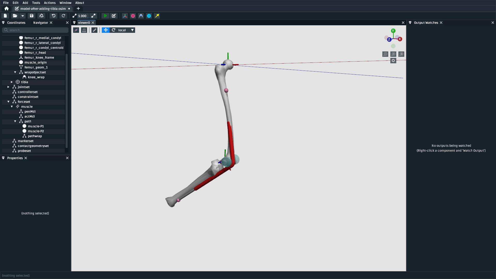

    The model created by this tutorial. It contains three bodies, two joints, one muscle,
    and a wrap surface. This covers the basics of using OpenSim Creator's model editor
    to build a model with biological components (see :doc:`make-a-bouncing-block` for
    a more mechanical example).

This tutorial will primarily use the model editor workflow to build a model from scratch
that contains some of the steps/components necessary to build a human model. In
essence, the content here will be similar to that in :doc:`make-a-bouncing-block`, but
with a focus on using landmark data, :doc:`station-defined-frames`, and wrap surfaces
to build a model of a biological system.

Prerequisites
-------------

This tutorial assumes you:

- Have a basic working knowledge of OpenSim, which is covered in :doc:`make-a-pendulum`
  and :doc:`make-a-bouncing-block`.
- (*optional*) The modelling process will also include adding a ``StationDefinedFrame`` to
  the model. The details of how they work is explained in :doc:`station-defined-frames`.
- (*optional*) The building process uses externally-provided landmarks in a CSV. If you
  would like to know how to manually place landmarks on a mesh, we recommend reading
  through :doc:`the-mesh-importer`.

Topics Covered by this Tutorial
-------------------------------

* Creating an OpenSim model by adding bodies and joints.
* Adding ``StationDefinedFrame``\s to the model in order to define anatomically
  representative joint frames.
* Adding a muscle to the model.
* Adding a wrap surface to the model and associating muscles to that surface.

.. _make-a-lower-leg-resources-link:

Download Resources
------------------

In order to follow this tutorial, you will need to download the associated
resources (:download:`download here <_static/the-model-warper/walkthrough-model.zip>`)
and unzip them on your computer.

Create a New Model
------------------

Create a new model, as described in :doc:`make-a-pendulum` (:ref:`create-new-model`).

Add a ``pelvis`` Body
---------------------

Add a pelvis body. For this model, use the following parameters:

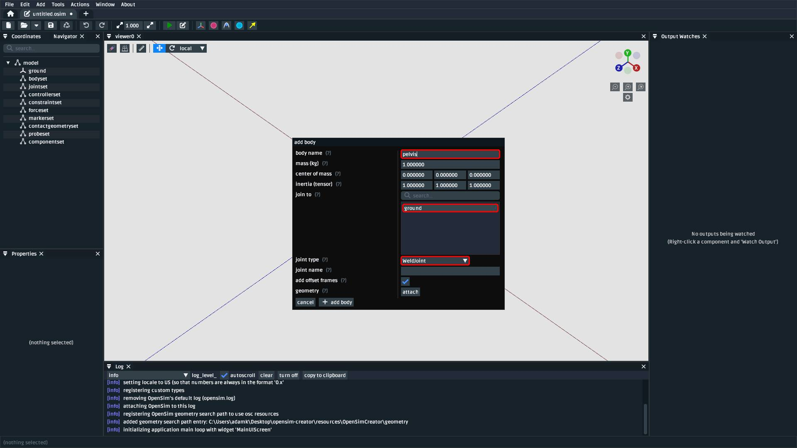

    Create a body called ``pelvis``. The mass and intertia can be handled later.
    ``pelvis`` should be joined to ``ground`` with a ``WeldJoint``.

Adding bodies is explained in more detail in :ref:`add-body-with-weldjoint` and
:ref:`create-the-foot`.

Attach Pelvis Meshes to the ``pelvis`` Body
-------------------------------------------

The resources zip described in :ref:`make-a-lower-leg-resources-link` contain two
separate pelvis meshes for the left- and right-side. For this model, we are simplifiying
the pelvis to a single rigid body (``pelvis``), so both meshes need to be attached to it.

To attach meshes to ``pelvis``, right-click it in the ``Navigator`` panel and use
the ``Add > Geometry`` context menu to attach each pelvis mesh:

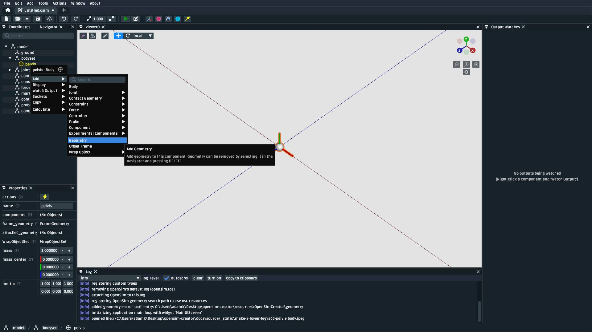

    Use ``pelvis``'s context menu to ``Add > Geometry`` to it, then select the
    two pelvis meshes (``pelvis_l.vtp`` and ``pelvis_r.vtp``).

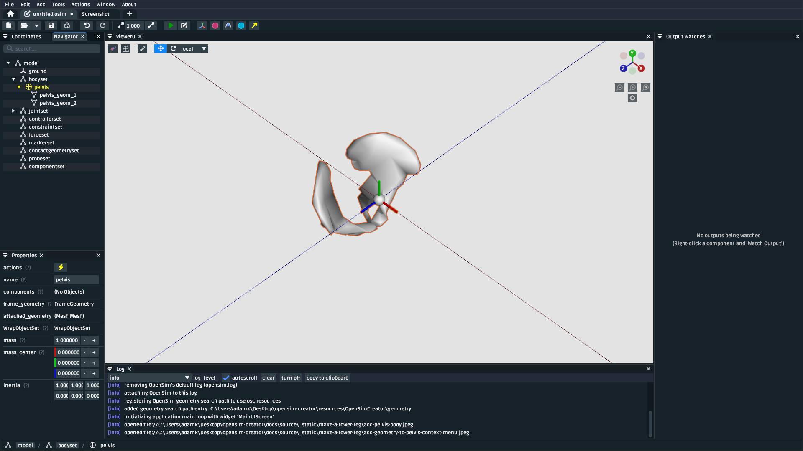

    The model, after attaching both pelvis meshes to the ``pelvis`` body.

.. _import-pelvis-landmarks:

Import Pelvis Landmarks
-----------------------

This model will use a landmark-defined approach to define the hip and knee joint
frames (explained in :doc:`station-defined-frames`). To do that, we'll initially
import landmarks on the ``pelvis`` body and (later) on a femur body. The landmarks
we will use roughly correspond to those explained in `Grood et. al.`_; however, our
knee joint definition will use the Z axis to define knee extension/flexion (Grood
et. al. use the X axis) because OpenSim's ``PinJoint`` always uses the Z axis
for rotation.

To import the landmarks, you can use the point importer in the model editor from
the top menu bar, located at ``Tools > Import Points``. It will show a popup
that you can use to import the pelvis landmarks file (``pelvis.landmarks.csv``) as
markers that are attached to the ``pelvis`` body:

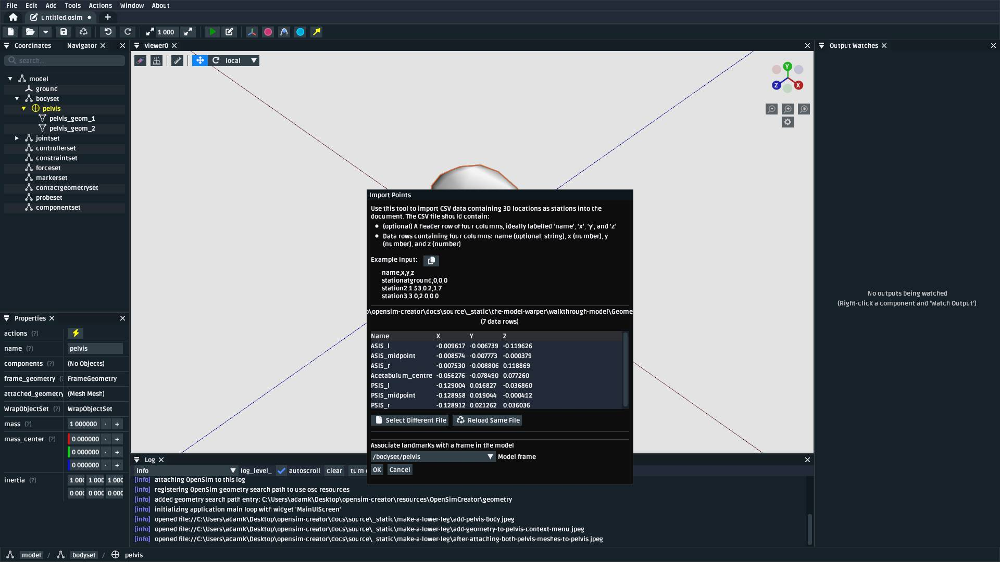

    The ``Import Points`` dialog, with ``pelvis.landmarks.csv`` loaded. Make sure to
    select ``/bodyset/pelvis`` as the body to attach the landmarks to. Otherwise, they
    will end up attached to ``ground``.

.. _add-pelvis-sdf:

Add a ``StationDefinedFrame`` on ``pelvis`` for the Hip Joint
-------------------------------------------------------------

Now that the appropriate ``pelvis`` landmarks are imported into the model, you can now add a
``StationDefinedFrame`` to ``pelvis`` that defines the pelvis-side (parent) of the hip joint,
which is described in the following two figures:

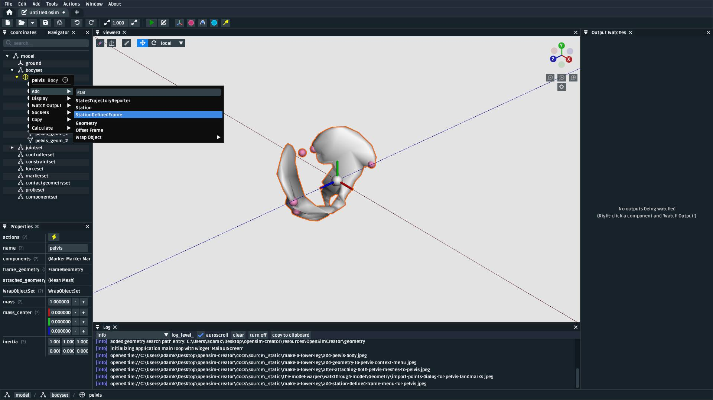

    The ``StationDefinedFrame`` can be added as a child of ``pelvis`` by right-clicking
    the ``pelvis`` component in the ``Navigator`` panel and using the ``Add`` menu to
    add the ``StationDefinedFrame``.

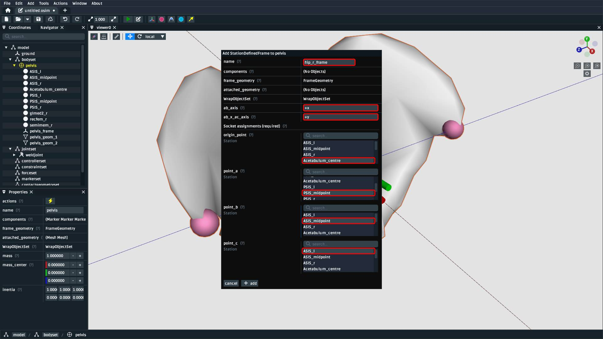

    When creating the ``StationDefinedFrame``, call it ``hip_r_frame``, make ``Acetabulum_centre``
    the frame ``origin_point``, ``PSIS_midpoint`` ``point_a``, ``ASIS_midpoint`` ``point_b``,
    and ``ASIS_l`` ``point_c``. Addtionally, ensure that ``ab_axis`` is ``+x`` and
    ``ab_x_ac_axis`` is ``+y``.

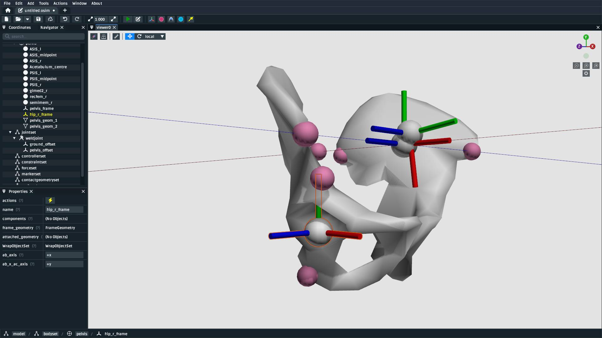

    The relationship between the landmarks defines the ``hip_r_frame`` (highlighted).

.. _add-femur-body:

Add a Femur Body
----------------

Add a femur body with the femur mesh (``femur_r.vtp``) attached to the ``hip_r_frame``
we just defined. For this model, use the following parameters:

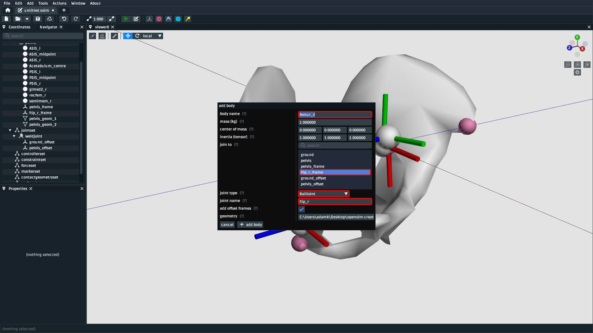

    Create a body called ``femur_r`` and attach the ``femur_r.vtp`` geometry to it. The
    mass and intertia can be handled later. ``femur_r`` should initially be joined
    to ``hip_r_frame`` (the knee joint comes later in the process).

Adding bodies is explained in more detail in :ref:`add-body-with-weldjoint` and
:ref:`create-the-foot`.

.. _import-femur-landmarks:

Import Femur Landmarks
----------------------

This process is exactly the same as :ref:`import-pelvis-landmarks`, but we are now
importing ``femur_r.landmarks.csv`` and attaching them to the ``femur_r`` body:

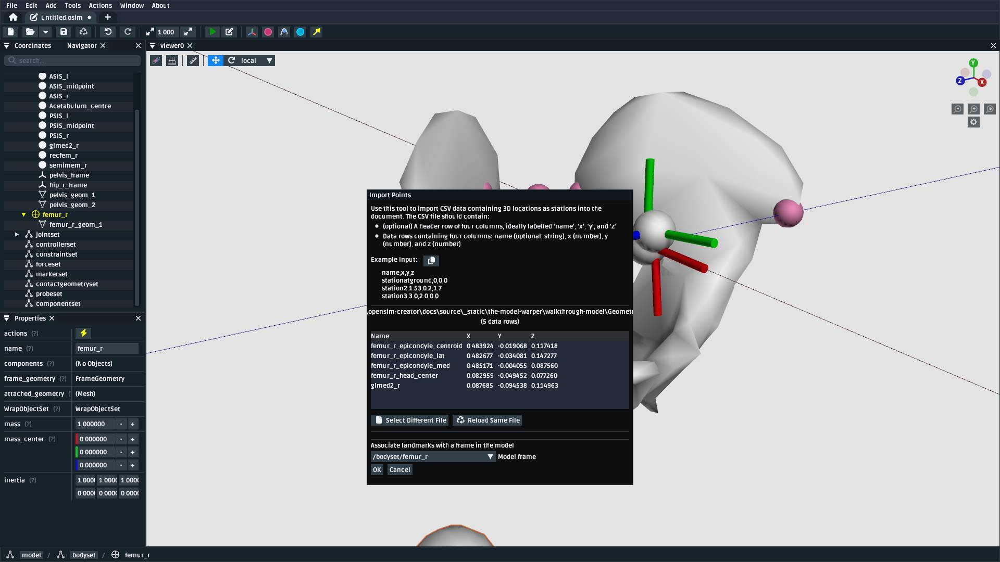

    The ``Import Points`` dialog, with ``femur_r.landmarks.csv``. Make sure to
    select ``femur_r`` as the body to attach the landmarks to. Otherwise, they will end up
    attached to ``ground``.

.. _add-sdf-hip:

Add a ``StationDefinedFrame`` on ``femur_r`` for the Hip Joint
--------------------------------------------------------------

This process is exactly the same as :ref:`add-pelvis-sdf`, but we are now defining
a frame based on the landmarks attached to ``femur_r``:

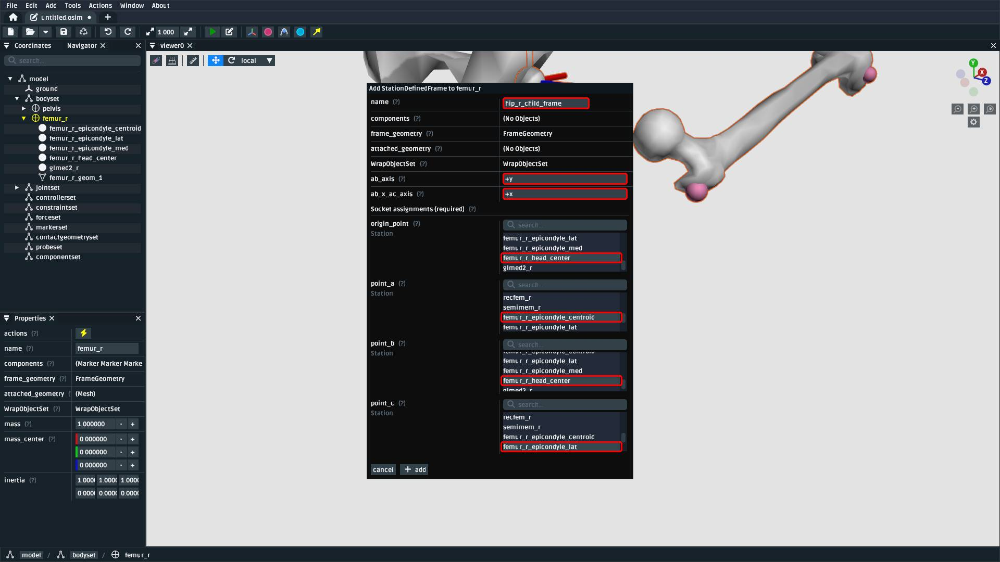

    When creating the ``StationDefinedFrame``, call it ``hip_r_child_frame``, make 
    ``femur_r_head_centre`` the ``origin_point`` and ``point_b``, ``femur_r_epicondyle_centroid`` ``point_a``,
    and ``femur_r_epicondyle_lat`` ``point_c``. Addtionally, specify that ``ab_axis``
    is ``+y`` and ``ab_x_ac_axis`` is ``+x``.

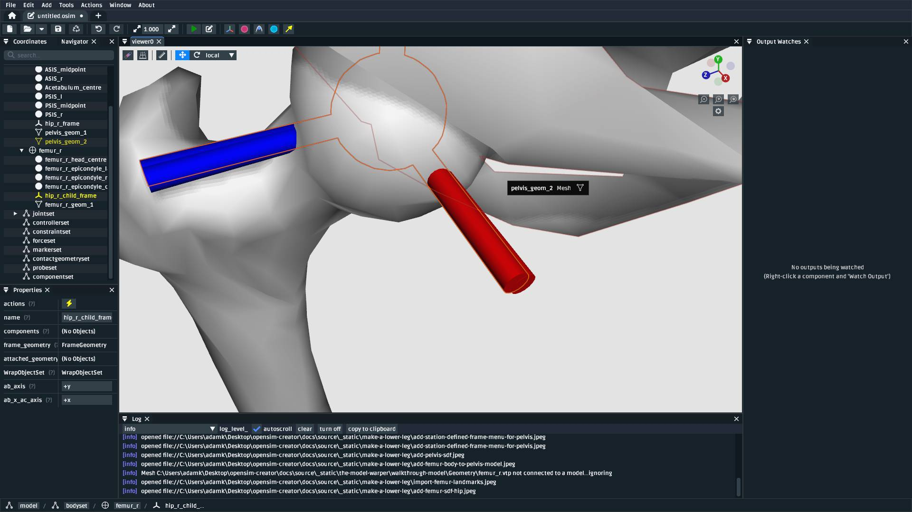

    The relationship between the landmarks defines the hip joint's child frame
    (highlighted) which is slightly different from the body frame (not-highlighted).

.. _change-hip-child-frame:

Reassign the Hip Joint's Child Frame to the ``StationDefinedFrame``
-------------------------------------------------------------------

With a ``StationDefinedFrame`` created on ``femur_r``, you can now reassign the
hip joint (``hip_r``) to use that frame definition instead of the existing default
one (``femur_r_offset``). To do that, right-click the appropriate joint in the
``Navigator`` panel and use the ``Sockets`` menu to reassign its ``child_frame``:

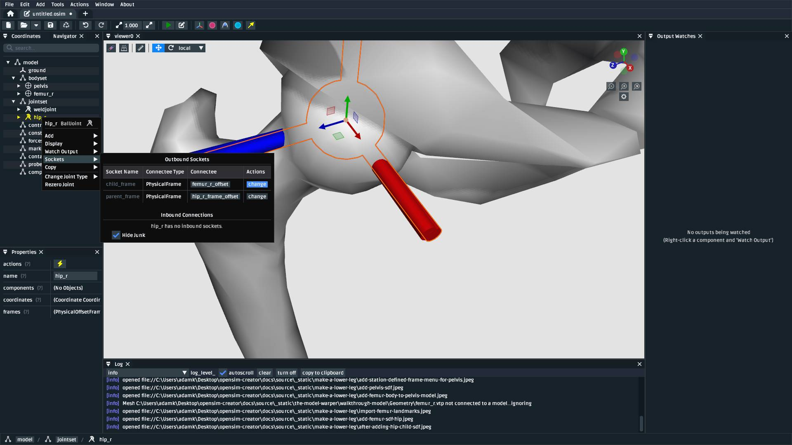

    Use the ``Navigator`` panel to find and right-click the hip joint (``jointset/hip_r``),
    then find ``child_frame`` in the ``Sockets`` menu and ``change`` it to the
    ``StationDefinedFrame`` created in the previous step (``/bodyset/femur_r/hip_r_child_frame``).

.. _add-sdf-knee:

Add a ``StationDefinedFrame`` on ``femur_r`` for the Knee Joint
---------------------------------------------------------------

For the knee joint, we can create another ``StationDefinedFrame`` on ``femur_r`` at the
epicondyle centroid. The steps are similar to :ref:`add-sdf-hip` but, this time, we define
the ``origin_point`` as the ``femur_r_epicondyle_centroid`` landmark instead of
the ``femur_r_head_centre``.

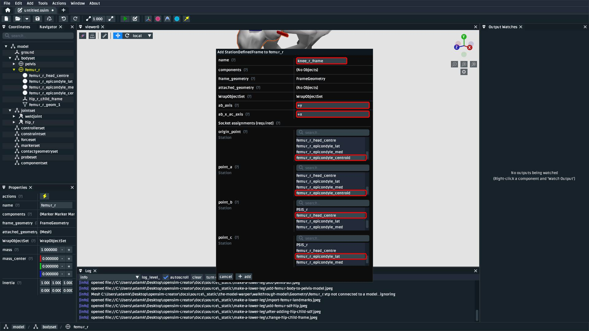

    When creating the ``StationDefinedFrame`` for the knee,  call it ``knee_r_frame``, make
    the ``femur_r_epicondyle_centroid`` the frame ``origin_point`` and ``point_a``, 
    ``femur_r_head_centre`` ``point_b``, and ``femur_r_epicondyle_lat`` ``point_c``. Addtionally,
    specify that ``ab_axis`` is ``+y`` and ``ab_x_ac_axis`` is ``+x``.

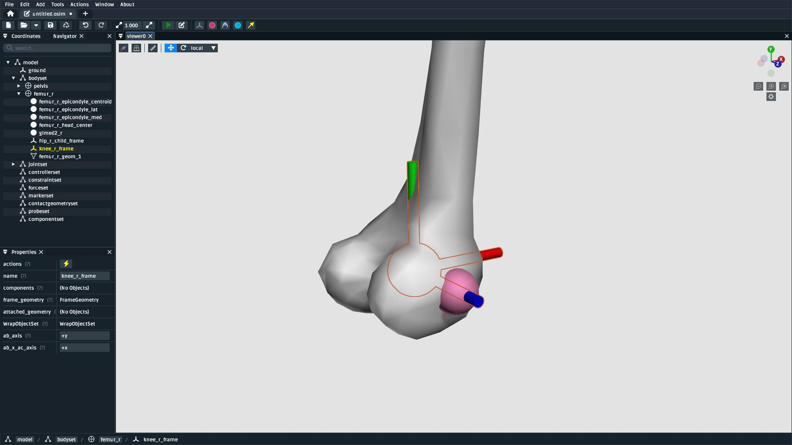

    The relationship between these landmarks specifies the knee's coordinate system. Once added, you
    should be able to see the ``StationDefinedFrame`` in the model. This is the "parent" half of the
    knee joint definition in OpenSim.

Add a Tibia Body
----------------

Similar to :ref:`add-femur-body`, add a tibia body with the tibia mesh (``tibia_r.vtp``)
attached to it to the model. For this model, use the following parameters:

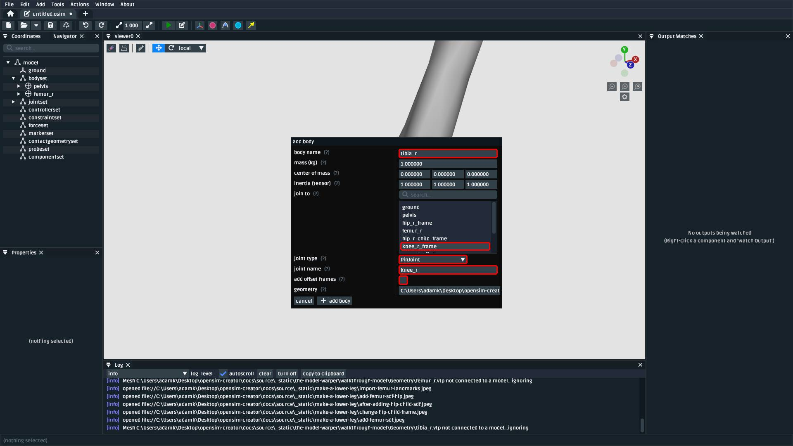

    Add the ``tibia`` body to the model with these properties. Make sure to attach the
    ``tibia_r.vtp`` mesh to the body.

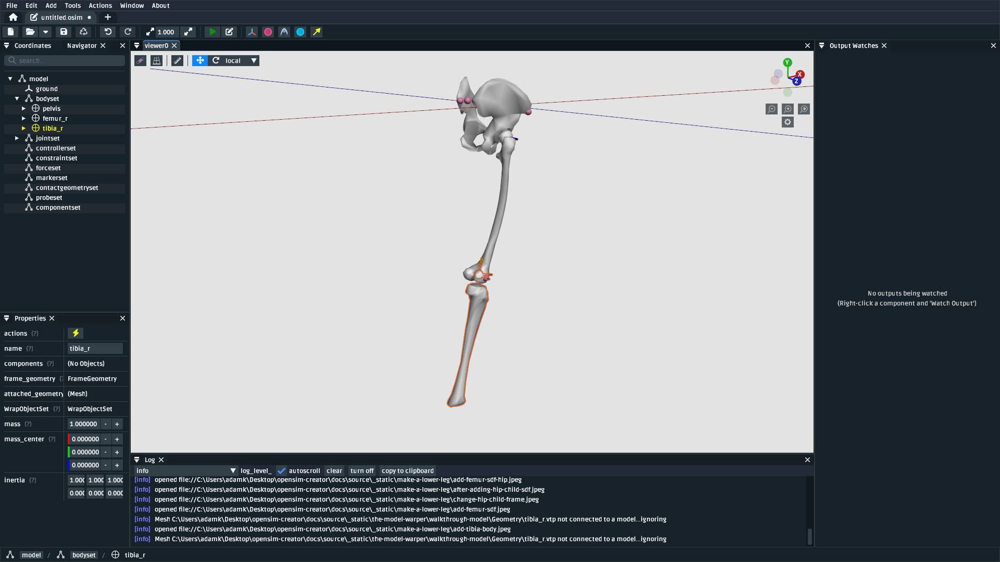

    To save some time, the provided tibia mesh data (``tibia_r.vtp``) is already defined
    with respect to the knee origin, which means that we do not need to define a
    ``StationDefinedFrame`` for the tibia.

Add a Muscle Between the Femur and the Tibia
--------------------------------------------

Now that both bodies have been added and joined with a ``PinJoint``, we can define muscles
that connect the two bodies.

To add a muscle to a model, the model must contain at least two pre-existing locations that
can be used as muscle points. These can either be added manually (via the ``Add`` menu) or
imported (as in :ref:`import-femur-landmarks`). We'll combine both approaches here.

To add a ``Marker`` manually, you can right-click the ``femur_r`` and use the ``Add`` menu to
add a ``Marker`` component, followed by manually placing it on the femur mesh:

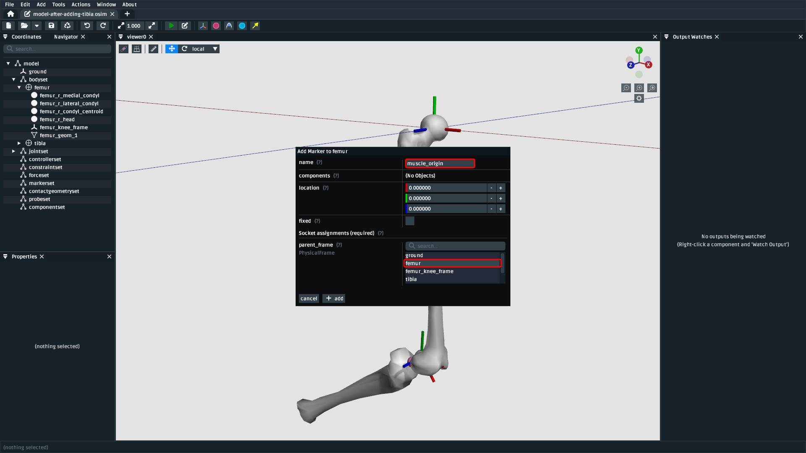

    One way to define muscle points is to manually add a ``Marker`` component to the model
    attached to the appropriate body (here, ``femur_r``) and then manually move the marker
    to the correct location.

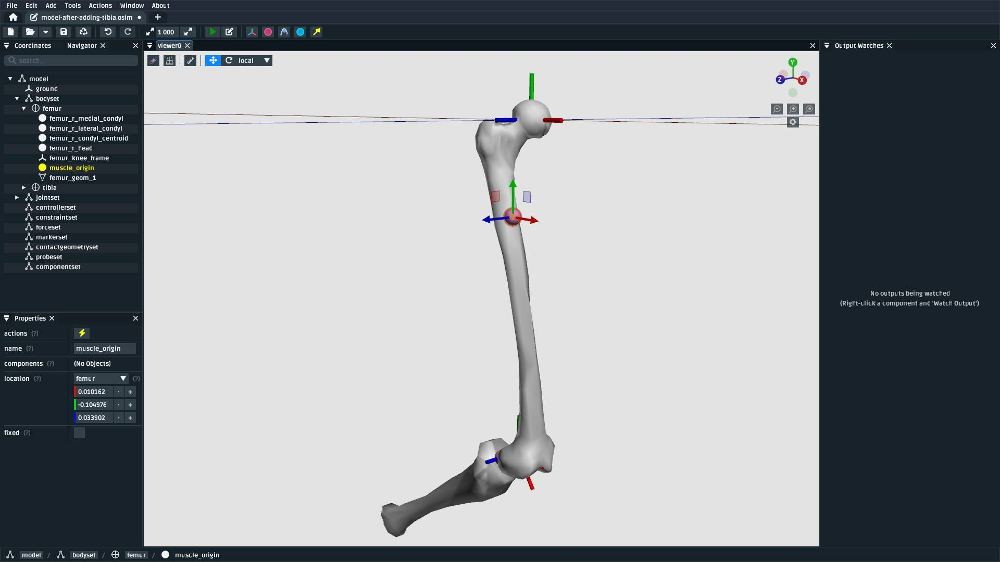

    Once a ``Marker`` has been added, it can be manually moved around with the mouse, or
    you can edit its ``location`` property (if necessary, with respect to a different frame).

To add a ``Marker`` from an external data source (CSV), follow the same procedure as
:ref:`import-femur-landmarks`, but import ``tibia_r_muscle-point.landmarks.csv`` instead
and ensure the marker is attached to the ``tibia`` body:

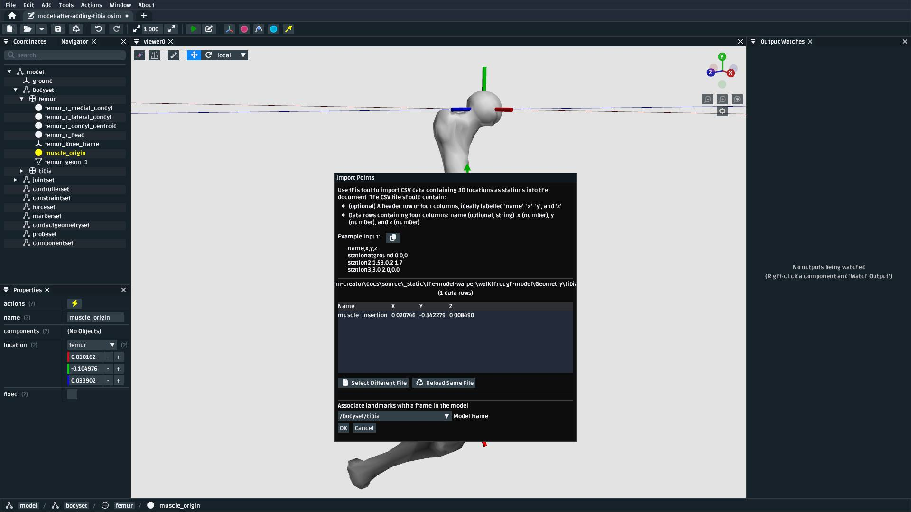

    Another way to define muscle points is to use the ``Import Points`` tool to import
    external data from a CSV as ``Marker``\s. Remember to specify ``tibia`` as the associated
    frame.

Once you have two locations in the model they can be used to create a muscle (see
also: :ref:`mesh-importer-add-muscle-paths`). Use the ``Add`` menu to add a
``Millard2012EquilibriumMuscle`` to the model that uses the two points:

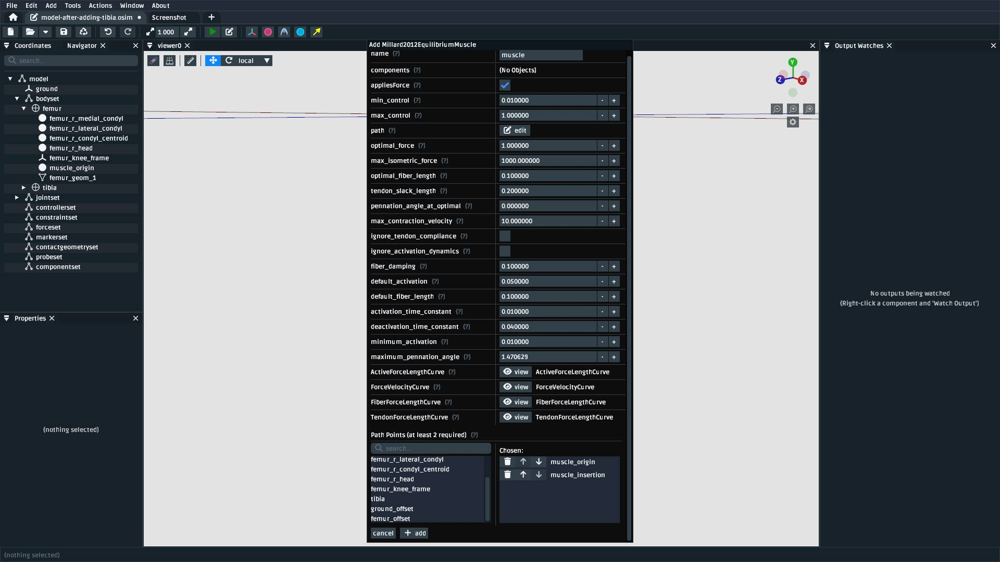

    When adding a ``Millard2012EquilibriumMuscle``, pick the two markers as its path points. This
    choice can be edited later, if necessary.

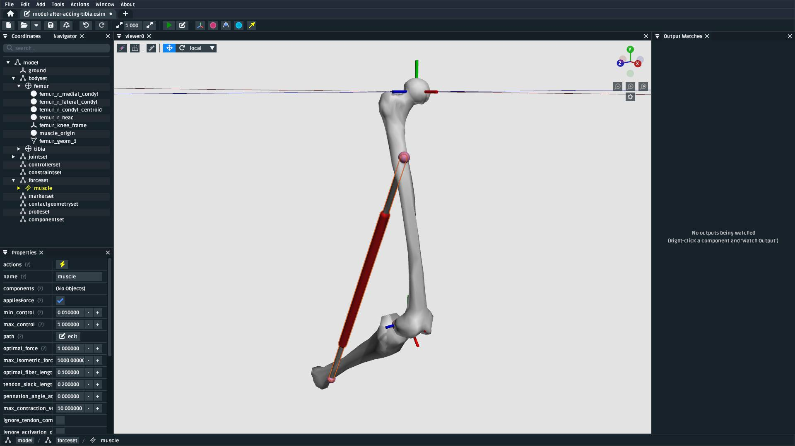

    The muscle will then be added to the model but, because it isn't associated with any ``WrapGeometry``,
    it will clip through the bone meshes. This will be fixed in the next section.

**Note**: With the muscle created, you can now delete the ``Marker``\s that were used to initialize it: they
have served their purpose. The resulting muscle isn't connected or related to the ``Marker``\s from which
it was created.

Add a Knee Wrap Cylinder Wrap Surface
-------------------------------------

Now that a muscle has been added to the model, you'll see a problem: the muscle clips through
the bone meshes! This is because we haven't told OpenSim how the muscle should wrap around things.

To set up a wrapping cylinder that approximates the shape of the bones around the knee, you can
right-click the body that the wrapping cylinder should be added to and then add it:

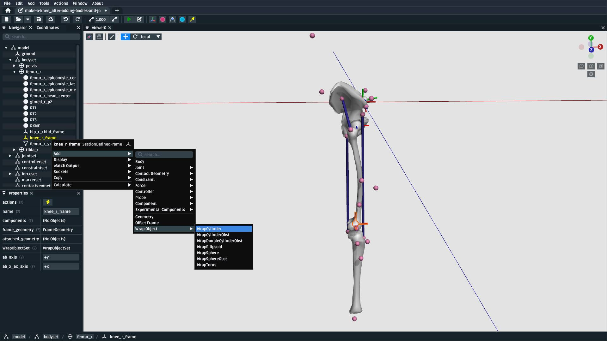

    You can use ``femur_r``'s context menu to add a ``WrapCylinder`` to it.

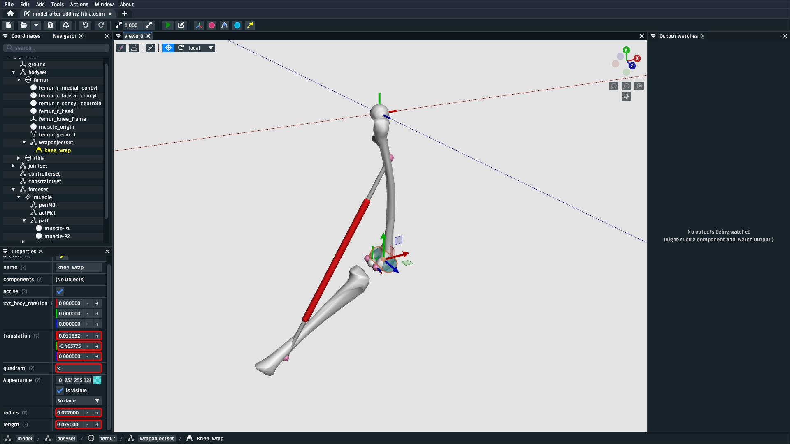

    The ``translation``, ``quadrant``, ``radius``, and ``length`` of the ``WrapCylinder``
    should be edited to match the underlying femur geometry, so that the muscle wrapping
    over the knee is more realistic.

    The muscle won't wrap over the cylinder yet. That's handled in the next step.

Associate the Muscle with the Wrap Surface
------------------------------------------

Once the ``WrapCylinder`` has been added, you'll notice that the muscle isn't wrapping over the
cylinder yet. This is because OpenSim uses "Path Wrap"s to describe how a muscle is associated
with ``WrapGeometry`` in the model. To create this association, you can right-click a muscle and
add a path wrap:

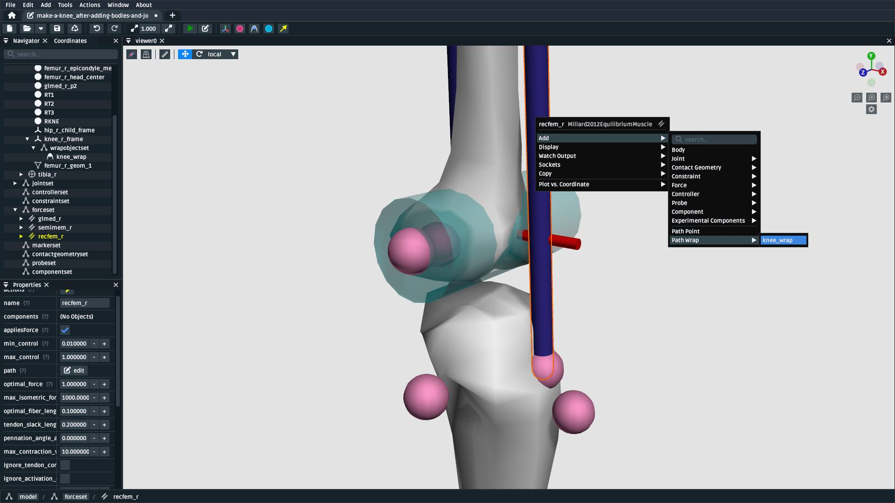

    Add a path wrap to the muscle in order to associate the muscle with the ``knee_wrap``
    ``WrapCylinder``.

    After adding the path wrap, the muscle should now correctly wrap over the X quadrant
    of the ``WrapCylinder``, which more closely mimics how an anatomically-correct muscle
    would wrap over the knee.

Summary
-------

This tutorial was a brief overview of some of the available techniques for building a
biological model using OpenSim Creator's model editor workflow. The key points are:

- It's possible to import/export 3D point data from/to CSV files, which can be handy when using
  external scripts/tools.
- You can use ``StationDefinedFrame``\s to define frames based on anatomical landmarks. How
  they work is explained in more detail in :doc:`station-defined-frames`. ``StationDefinedFrame``\same
  have the advantage that they are usable with warping algorithms that operate on points (see
  :doc:`the-mesh-warper` and :doc:`the-model-warper`).
- There's a few ways to add muscles to a model. Muscles can be created from at least two other
  locations in the model. This means that you can import/place those points before creating the
  muscle. Alternatively, you can create a dummy muscle and edit the path later on.
- Wrap geometry is crucial when designing muscle paths that wrap over geometry like bones. Wrapping
  is usually a two-step process (add the wrap geometry, associate the geometry with a path).

Next Steps
----------

TODO: model warper, mesh warper, mesh importer.

.. _Grood et. al.:  https://doi.org/10.1115/1.3138397
