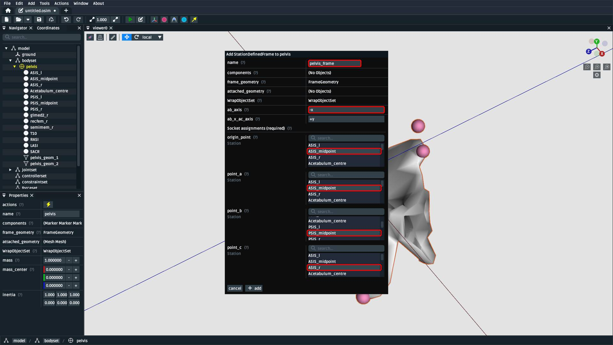
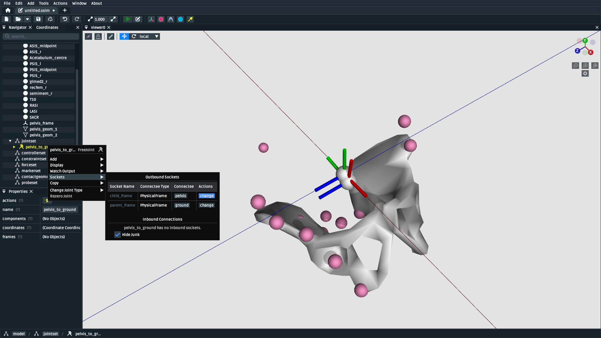
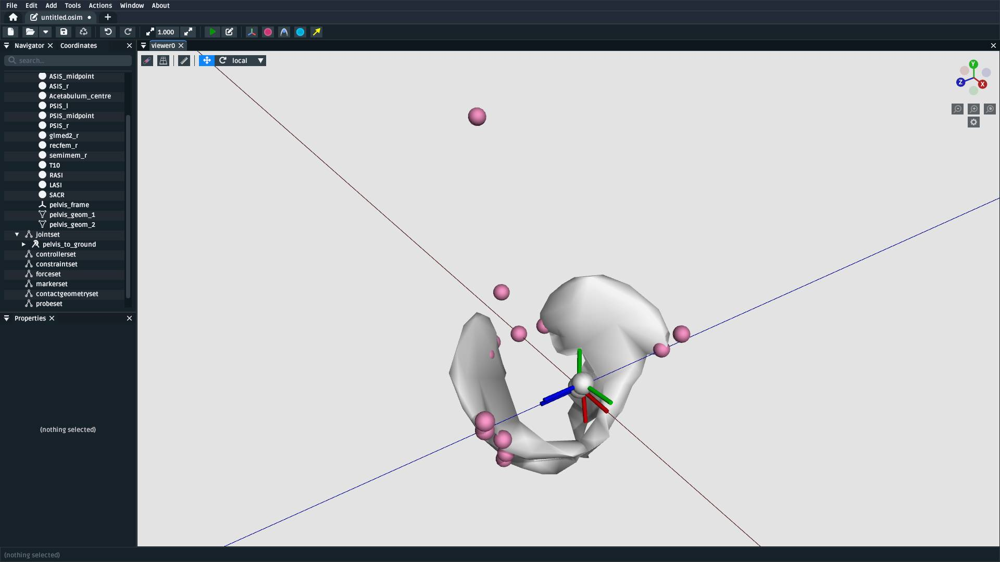
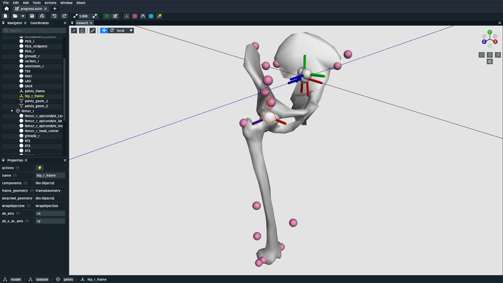
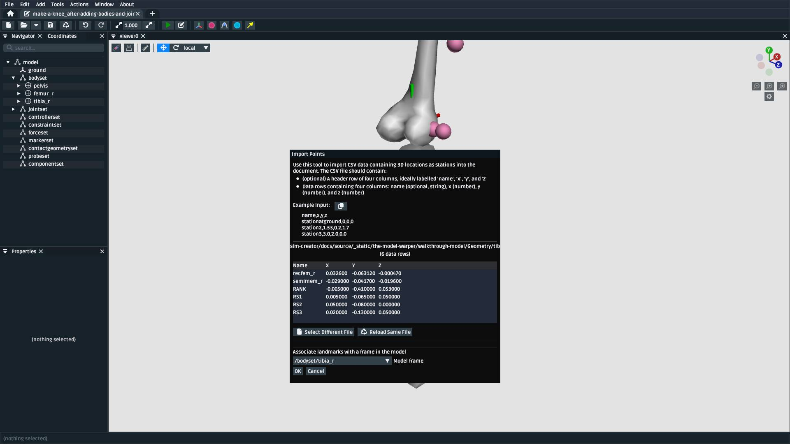
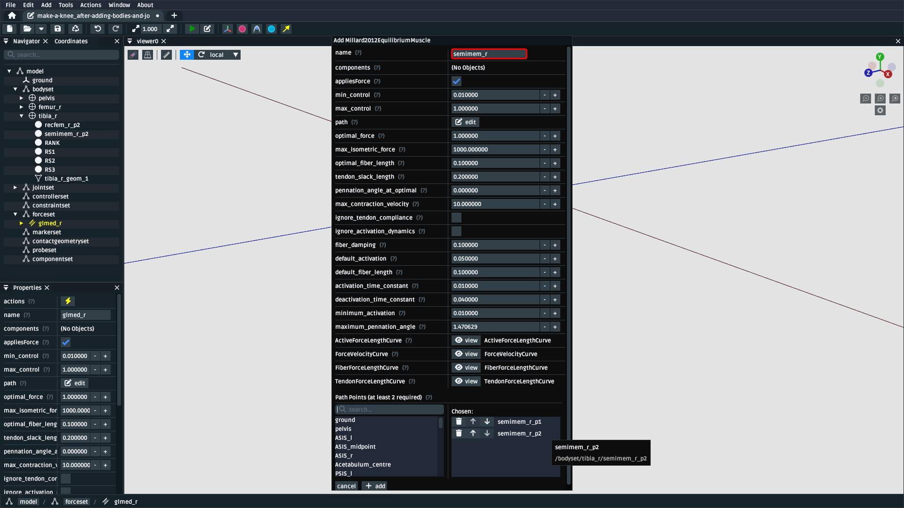
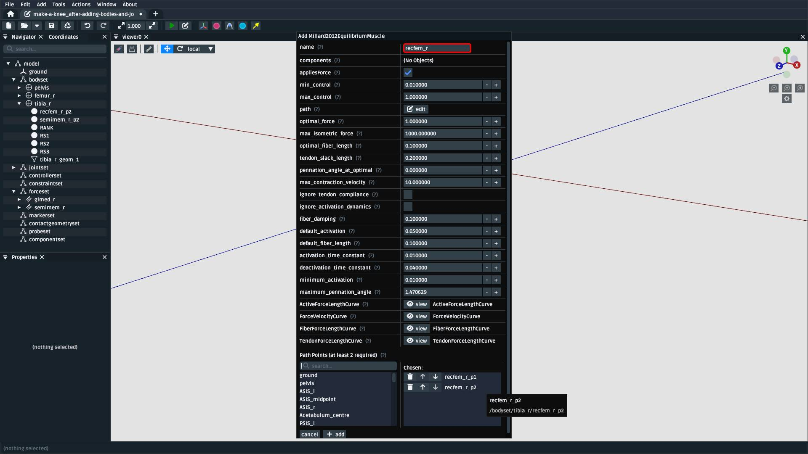
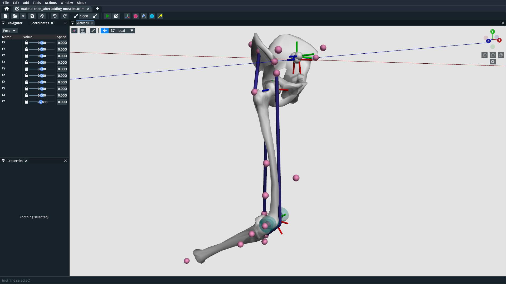

Make a Lower Leg
================

.. warning::

    This tutorial is new ⭐, and uses ``StationDefinedFrame``\s, which require OpenSim >= v4.5.1.
    The content of this tutorial should be valid long-term, but we are waiting for OpenSim GUI
    v4.6 to be released before we remove any "experimental" labelling. We also anticipate
    adding some handy tooling around re-socketing existing joints and defining ``StationDefinedFrame``\s.

In this tutorial, we will be making a basic model of a lower leg using OpenSim Creator:

.. figure:: _static/make-a-lower-leg/after-adding-path-wrap-to-muscle.jpeg
    :width: 60%

    The model created by this tutorial. It contains three bodies, two joints, three muscles,
    and a wrap cylinder. This covers the basics of using OpenSim Creator's model editor
    to build a model with biological components (see :doc:`make-a-bouncing-block` for
    a more mechanical example).

This tutorial will primarily use the model editor workflow to build a model from scratch
that contains some of the steps/components necessary to build a human model. In
essence, the content here will be similar to that in :doc:`make-a-bouncing-block`, but
with a focus on using landmark data, :doc:`station-defined-frames`, and wrap surfaces
to build a model of a biological system.

Prerequisites
-------------

This tutorial assumes you:

- Have a basic working knowledge of OpenSim, which is covered in :doc:`make-a-pendulum`
  and :doc:`make-a-bouncing-block`.
- (*optional*) The modelling process will also include adding a ``StationDefinedFrame`` to
  the model. The details of how they work is explained in :doc:`station-defined-frames`.
- (*optional*) The building process uses externally-provided landmarks from CSV files (e.g.
  ``femur_r.landmarks.csv``). If you would like to know how to manually place landmarks
  on a mesh, we recommend reading through :doc:`the-mesh-importer`.

Topics Covered by this Tutorial
-------------------------------

* Creating an OpenSim model by adding bodies and joints.
* Adding ``StationDefinedFrame``\s to the model in order to define anatomically
  representative joint frames.
* Adding a muscle to the model.
* Adding a wrap surface to the model and associating muscles to that surface.

.. _make-a-lower-leg-resources-link:

Download Resources
------------------

In order to follow this tutorial, you will need to download the associated
resources (:download:`download here <_static/the-model-warper/walkthrough-model.zip>`)
and unzip them on your computer.

Create a New Model
------------------

Create a new model, as described in :doc:`make-a-pendulum` (:ref:`create-new-model`).

Add a ``pelvis`` Body
---------------------

Add a pelvis body. For this model, use the following parameters:

.. figure:: _static/make-a-lower-leg/add-pelvis-body.jpeg
    :width: 60%

    Create a body called ``pelvis``. The mass and intertia can be handled later.
    ``pelvis`` should directly (no offset frames) be joined to ``ground`` with
    a ``FreeJoint`` called ``pelvis_to_ground``. Pelvis meshes are attached in
    the next step.

Adding bodies is explained in more detail in :ref:`add-body-with-weldjoint` and
:ref:`create-the-foot`.

Attach Pelvis Meshes to the ``pelvis`` Body
-------------------------------------------

The resources zip described in :ref:`make-a-lower-leg-resources-link` contain two
separate pelvis meshes for the left- and right-side. For this model, we are simplifiying
the pelvis to a single rigid body (``pelvis``). Both meshes need to be attached to it.

To attach meshes to ``pelvis``, right-click it in the ``Navigator`` panel and use
the ``Add > Geometry`` context menu to attach each pelvis mesh:

.. figure:: _static/make-a-lower-leg/add-geometry-to-pelvis-context-menu.jpeg
    :width: 60%

    Use ``pelvis``'s context menu to ``Add > Geometry`` to it, then select one
    of the pelvis meshes (``pelvis_l.obj`` or ``pelvis_r.obj``). Repeat this process
    for the other pelvis mesh.

.. figure:: _static/make-a-lower-leg/after-attaching-both-pelvis-meshes-to-pelvis.jpeg
    :width: 60%

    The model after attaching both ``pelvis_l.obj`` and ``pelvis_r.obj`` to the
    ``pelvis`` body. For context, assume the reference subject was lying down
    when these bones were scanned. A major part of the model building procedure involves defining
    frames that transform experimental measurements into standardized coordinate
    systems.

.. _import-pelvis-landmarks:

Import Pelvis Landmarks
-----------------------

This model will use a landmark-defined approach to define the pelvis frame and
the hip/knee joint frames (explained in :doc:`station-defined-frames`). To do
that, we'll initially import landmarks on the ``pelvis`` body and (later) on the
femur body. The landmarks we will use roughly correspond to those explained
in `Grood et. al.`_; however, our knee joint definition will use the Z axis to
define knee extension/flexion (Grood et. al. use the X axis) because OpenSim's
``PinJoint`` always uses the Z axis for rotation.

To import the landmarks, you can use the point importer in the model editor from
the top menu bar, located at ``Tools > Import Points``. It will show a popup
that you can use to import the pelvis landmarks file (``pelvis.landmarks.csv``) as
markers that are attached to the ``pelvis`` body:

.. figure:: _static/make-a-lower-leg/import-points-dialog-for-pelvis-landmarks.jpeg
    :width: 60%

    The ``Import Points`` dialog, after selecting ``pelvis.landmarks.csv``. Make sure to
    choose ``/bodyset/pelvis`` as the body to attach the landmarks to. Otherwise, they
    will end up attached to ``ground``.

.. _add-pelvis-root-sdf:

Add a ``StationDefinedFrame`` on ``pelvis`` for the Pelvis Frame
----------------------------------------------------------------

Now that the appropriate ``pelvis`` landmarks are imported into the model, you can
now define a ``StationDefinedFrame`` on the ``pelvis`` that describes the model's top-level
transform. OpenSim models tend to be oriented such that Y points up and X points forwards.
Adding a ``pelvis_frame`` is described in the following two figures:

.. figure:: _static/make-a-lower-leg/add-station-defined-frame-menu-for-pelvis.jpeg
    :width: 60%

    A ``StationDefinedFrame`` can be added as a child of ``pelvis`` by right-clicking
    the ``pelvis`` component in the ``Navigator`` panel and using the ``Add`` menu to
    add a ``StationDefinedFrame``.

    When creating the ``StationDefinedFrame``, call it ``pelvis_frame``, make ``ASIS_midpoint``
    the frame ``origin_point`` and ``point_a``, ``PSIS_midpoint`` ``point_b``, and ``ASIS_r`` ``point_c``
    Addtionally, ensure that ``ab_axis`` is ``-x`` and ``ab_x_ac_axis`` is ``+y``. The :doc:`station-defined-frames`
    page explains ``StationDefinedFrame``\s in more detail.

.. _reassign-pelvis-root-joint:

Reassign ``pelvis_to_ground`` to the ``StationDefinedFrame``
------------------------------------------------------------

With a "root" ``StationDefinedFrame`` created on ``pelvis``, you can now reassign the
pelvis-to-ground joint (``pelvis_to_ground``) to use ``pelvis_frame`` instead of ``pelvis``.
To do that, right-click the appropriate joint in the ``Navigator`` panel and use the
``Sockets`` menu to reassign its ``child_frame``:

    Use the ``Navigator`` panel to find and right-click ``pelvis_to_ground``, then
    find ``child_frame`` in the ``Sockets`` menu and ``change`` it to 
    ``pelvis_frame``.

    Reassigning the joint this way causes the pelvis to be located and oriented
    similarly to existing OpenSim models.

Add a ``StationDefinedFrame`` on ``pelvis`` for the Hip Joint
-------------------------------------------------------------

The next step is to describe where the right hip joint should be placed on the
pelvis. This process is the same as :ref:`add-pelvis-root-sdf`, but we instead
define a ``StationDefinedFrame`` on ``pelvis`` called ``hip_r_frame`` as follows:

.. figure:: _static/make-a-lower-leg/add-pelvis-sdf.jpeg
    :width: 60%

    Right-click the ``pelvis`` body and add a ``StationDefinedFrame``. Call it
    ``hip_r_frame``, make ``Acetabulum_centre`` the frame ``origin_point``,
    ``PSIS_midpoint`` ``point_a``, ``ASIS_midpoint`` ``point_b``, and ``ASIS_l``
    ``point_c``. Addtionally, ensure that ``ab_axis`` is ``+x`` and ``ab_x_ac_axis``
    is ``+y``.

.. figure:: _static/make-a-lower-leg/after-adding-hip-sdf.jpeg
    :width: 60%

    The relationship between the landmarks defines the ``hip_r_frame`` (highlighted).

.. _add-femur-body:

Add a Femur Body
----------------

Add a femur body with the femur mesh (``femur_r.obj``) attached to the ``hip_r_frame``
we just defined. For this model, use the following parameters:

.. figure:: _static/make-a-lower-leg/add-femur-body-to-pelvis-model.jpeg
    :width: 60%

    Create a body called ``femur_r`` and join it directly (no offset frames) to
    ``hip_r_frame`` with a ``BallJoint`` called ``hip_r``. Attach ``femur_r.obj``
    geometry to it.

Adding bodies is explained in more detail in :ref:`add-body-with-weldjoint` and
:ref:`create-the-foot`.

.. _import-femur-landmarks:

Import Femur Landmarks
----------------------

This process is exactly the same as :ref:`import-pelvis-landmarks`, but we are now
importing ``femur_r.landmarks.csv`` and attaching them to the ``femur_r`` body:

.. figure:: _static/make-a-lower-leg/import-femur-landmarks.jpeg
    :width: 60%

    The ``Import Points`` dialog, with ``femur_r.landmarks.csv``. Make sure to
    select ``femur_r`` as the body to attach the landmarks to. Otherwise, they will end up
    attached to ``ground``.

.. _add-sdf-hip:

Add a ``StationDefinedFrame`` on ``femur_r`` for the Hip Joint
--------------------------------------------------------------

This process is exactly the same as :ref:`add-pelvis-root-sdf`, but we are now defining
how the femur attaches to the hip by defining a frame on ``femur_r`` based on
the landmarks attached to it:

.. figure:: _static/make-a-lower-leg/add-femur-sdf-hip.jpeg
    :width: 60%

    Right-click the ``femur_r`` body and add a ``StationDefinedFrame``. Call it
    ``hip_r_child_frame``, make  ``femur_r_head_centre`` the ``origin_point`` and
    ``point_b``, ``femur_r_epicondyle_centroid`` ``point_a``, and ``femur_r_epicondyle_lat``
    ``point_c``. Addtionally, specify that ``ab_axis`` is ``+y`` and
    ``ab_x_ac_axis`` is ``+x``.

.. figure:: _static/make-a-lower-leg/after-adding-hip-child-sdf.jpeg
    :width: 60%

    The relationship between the landmarks defines the hip joint's child frame
    on ``femur_r``, which lets us join them together in the next step.

.. _change-hip-child-frame:

Reassign ``hip_r``'s Child Frame to the ``StationDefinedFrame``
---------------------------------------------------------------

This process is exactly the same as :ref:`reassign-pelvis-root-joint`, but we
now make the hip joint join ``hip_r_frame`` (parent) to the ``hip_r_child_frame``
(child) we just created:

.. figure:: _static/make-a-lower-leg/change-hip-child-frame.jpeg
    :width: 60%

    Use the ``Navigator`` panel to find and right-click the hip joint (``jointset/hip_r``),
    then find ``child_frame`` in the ``Sockets`` menu and ``change`` it to the
    ``StationDefinedFrame`` created in the previous step (``/bodyset/femur_r/hip_r_child_frame``).

    After reassigning the hip joint to the ``StationDefinedFrame``\s, the femur should
    now be correctly transformed with respect to the pelvis.

.. _add-sdf-knee:

Add a ``StationDefinedFrame`` on ``femur_r`` for the Knee Joint
---------------------------------------------------------------

For the knee joint, we can create another ``StationDefinedFrame`` on ``femur_r`` at the
epicondyle centroid. The steps are similar to :ref:`add-sdf-hip` but, this time, we define
the ``origin_point`` as the ``femur_r_epicondyle_centroid`` landmark instead of
the ``femur_r_head_centre``.

.. figure:: _static/make-a-lower-leg/add-femur-sdf.jpeg
    :width: 60%

    Right-click the ``femur_r`` body and add a ``StationDefinedFrame``. Call it
    ``knee_r_frame``, make the ``femur_r_epicondyle_centroid`` the frame
    ``origin_point`` and ``point_a``, ``femur_r_head_centre`` ``point_b``, and
    ``femur_r_epicondyle_lat`` ``point_c``. Addtionally, specify that ``ab_axis``
    is ``+y`` and ``ab_x_ac_axis`` is ``+x``.

.. figure:: _static/make-a-lower-leg/after-femur-sdf-added.jpeg
    :width: 60%

    The relationship between these landmarks specifies the knee's coordinate system. Once added, you
    should be able to see the ``StationDefinedFrame`` in the model. This is the "parent" half of the
    knee joint definition in OpenSim.

Add a Tibia Body
----------------

.. note::
    
    To reduce repitition, we have provided ``tibia_r.vtp`` and ``tibia_r.landmarks.csv`` in an
    already-knee-joint-centered coordinate system. If they were in the same coordinate
    system as the femur and pelvis, we would similarly need to define a ``StationDefinedFrame``
    for the knee on the tibia.

Similar to :ref:`add-femur-body`, add a tibia body with the tibia mesh (``tibia_r.vtp``)
attached to it to the model. For this model, use the following parameters:

.. figure:: _static/make-a-lower-leg/add-tibia-body.jpeg
    :width: 60%

    Add the ``tibia`` body to the model with these properties. Make sure to attach the
    ``tibia_r.vtp`` mesh to the body.

.. figure:: _static/make-a-lower-leg/after-add-tibia-body.jpeg
    :width: 60%

    To save some time, the provided tibia mesh data (``tibia_r.vtp``) is already defined
    with respect to the knee origin, which means that we do not need to define a
    ``StationDefinedFrame`` for the tibia. (available in supplied resources as
    ``make-a-knee_after-adding-bodies-and-joints.osim``).

Import Tibia Landmarks
----------------------

This process is exactly the same as :ref:`import-pelvis-landmarks`, but we are now
importing ``tibia_r.landmarks.csv`` and attaching them to the ``tibia_r`` in preparation
for using them as muscle points and markers later on:

    The ``Import Points`` dialog, with ``tibia_r.landmarks.csv``. Make sure to
    select ``tibia_r`` as the body to attach the landmarks to. Otherwise, they will end up
    attached to ``ground``.

Add Muscles
-----------

Now that all bodies have been added and joined together, we can define muscles that emit
forces on those bodies.

The ``.landmarks.csv`` files imported in previous steps also include muscle points, which
we can use to define three muscles. Right-click somewhere in the scene and use the ``Add`` menu
(or alternatively, use the ``Add`` menu at the top) to add ``Millard2012EquilibriumMuscle``\s with
the following names and muscle points:

    Create a ``Millard2012EquilibriumMuscle`` called ``glmed_r`` with ``glmed_r_p1``
    and ``glmed_r_p2`` as path points.

    Create a ``Millard2012EquilibriumMuscle`` called ``semimem_r`` with ``semimem_r_p1``
    and ``semimem_r_p2`` as path points.

    Create a ``Millard2012EquilibriumMuscle`` called ``recfem_r`` with ``recfem_r_p1``
    and ``recfem_r_p2`` as path points.

.. _model-after-adding-muscles:

.. figure:: _static/make-a-lower-leg/after-adding-muscle.jpeg
    :width: 60%

    The model after adding the muscles and flexing by approximately 90
    degrees. As can be seen, ``recfem_r`` will clip through the knee. This
    is fixed with wrapping, which is described in the next section.

Add a Knee Wrap Cylinder Wrap Surface
-------------------------------------

Now that muscles have been added to the model, you'll see a problem: ``recfem_r`` clips
through the femur (:numref:`model-after-adding-muscles`)! This is because
we haven't told OpenSim how the muscle should wrap around things. To do that,
we need to add a wrapping cylinder that approximates the shape of the knee:

.. figure:: _static/make-a-lower-leg/add-wrapcylinder-to-femur.jpeg
    :width: 60%

    Right-click the ``knee_frame`` ``StationDefinedFrame`` and then ``Add > Wrap Object > WrapCylinder``
    to add a wrap cylinder to the knee. **Warning**: it will initially be very
    large (1 m radius).

.. figure:: _static/make-a-lower-leg/knee-wrap-cylinder-added.jpeg
    :width: 60%

    Using the properties panel, rename the wrap cylinder to ``knee_wrap``, give
    it a ``quadrant`` of ``+x`` (so that muscles always wrap over its X
    quadrant), a ``radius`` of ``0.0225``, and a ``length`` of ``0.1``, so that
    is somewhat matches the shape of the knee. ``recfem_r`` muscle won't wrap
    over the cylinder yet. That's handled in the next step.

Associate the Muscle with the Wrap Surface
------------------------------------------

Once ``knee_wrap`` has been added, you may notice that ``recfem`` the isn't wrapping
over it yet. This is because OpenSim uses "Path Wrap"s to describe which wrap objects
are associated with each muscle in the model.

To create this association, you can right-click a muscle and add a path wrap:

.. figure:: _static/make-a-lower-leg/add-muscle-path-wrap-for-cylinder.jpeg
    :width: 60%

    Use ``recfem_r``'s context menu to ``Add`` a ``Path Wrap`` association with the
    ``knee_wrap`` ``WrapCylinder``.

.. figure:: _static/make-a-lower-leg/after-adding-path-wrap-to-muscle.jpeg
    :width: 60%

    After adding the path wrap, the muscle should now correctly wrap over the X quadrant
    of the ``WrapCylinder``, which more closely mimics how an anatomically-correct muscle
    would wrap over the knee.

Minimal Modelling Steps Complete!
---------------------------------

At this point in the tutorial, we have completed some of the most crucial model
building steps: adding bodies, joining them, and adding muscle paths. This doesn't
mean the model is production ready---for example, we still have to handle body
masses, body centers of mass, inertia, and muscle parameters---but these initial
components act as a suitable canvas that can be refined into the final model:

    The model after adding bodies, joints, and muscle paths (available in supplied
    resources as ``make-a-knee_after-adding-muscles.osim``).

*Optional*: Clean up the Model
------------------------------

The model we have created is functional, but would benefit from a few cleanups to
make it easier to work with (especially for when we use it in :doc:`the-model-warper`).
The cleanup steps are described below.

Delete Markers Used to Define Muscles
^^^^^^^^^^^^^^^^^^^^^^^^^^^^^^^^^^^^^

**Note**: With the muscle created, you can now delete the ``Marker``\s that were used to initialize it: they
have served their purpose. The resulting muscle isn't connected or related to the ``Marker``\s from which
it was created.

Rename and Define Correct Ranges for the Joint Coordinates
^^^^^^^^^^^^^^^^^^^^^^^^^^^^^^^^^^^^^^^^^^^^^^^^^^^^^^^^^^

TODO

Move Experimental Markers into ``/markerset``
^^^^^^^^^^^^^^^^^^^^^^^^^^^^^^^^^^^^^^^^^^^^^

TODO

Make Mesh Paths Relative
^^^^^^^^^^^^^^^^^^^^^^^^

TODO: quickly explain that ``StationDefinedFrame``\s are a newer feature that require
the latest OpenSim. Direct users to the ``Tools > WIP: Bake Station Defined Frames``
tool to replace ``StationDefinedFrame``\s with traditional ``PhysicalOffsetFrame``\s.

Bake ``StationDefinedFrame``\s
^^^^^^^^^^^^^^^^^^^^^^^^^^^^^^

**Note**: this is only necessary if your model needs to be compatible
with OpenSim <4.6.

TODO: describe baking frames.

Summary
-------

This tutorial was a brief overview of some of the available techniques for building a
biological model using OpenSim Creator's model editor workflow. The key points are:

- It's possible to import/export 3D point data from/to CSV files, which can be handy when using
  external scripts/tools.
- You can use ``StationDefinedFrame``\s to define frames based on anatomical landmarks. How
  they work is explained in more detail in :doc:`station-defined-frames`. ``StationDefinedFrame``\same
  have the advantage that they are usable with warping algorithms that operate on points (see
  :doc:`the-mesh-warper` and :doc:`the-model-warper`).
- There's a few ways to add muscles to a model. Muscles can be created from at least two other
  locations in the model. This means that you can import/place those points before creating the
  muscle. Alternatively, you can create a dummy muscle and edit the path later on.
- Wrap geometry is crucial when designing muscle paths that wrap over geometry like bones. Wrapping
  is usually a two-step process (add the wrap geometry, associate the geometry with a path).

Next Steps
----------

- Once you have a model, you will probably want to start using it with the rest of the OpenSim
  ecosystem. For example, you can now use it with the analysis tools in OpenSim GUI.

- If you want to re-use this model with multiple subjects, then scaling or warping of the model
  is required. OpenSim Creator's solution to this is :doc:`the-model-warper`, which uses the model
  created in this tutorial as an input.

.. _Grood et. al.:  https://doi.org/10.1115/1.3138397
