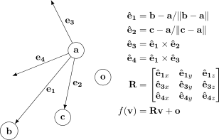
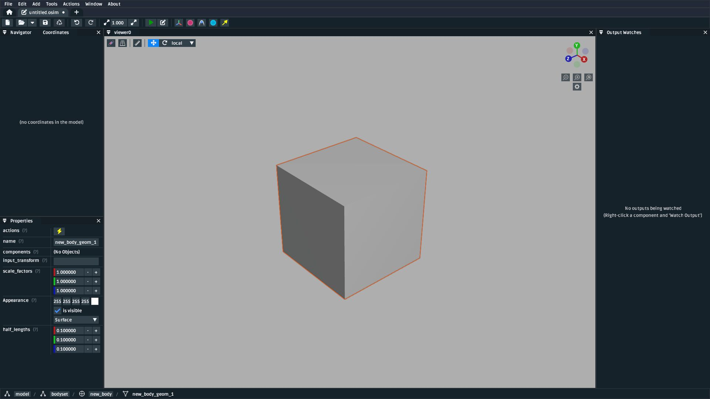
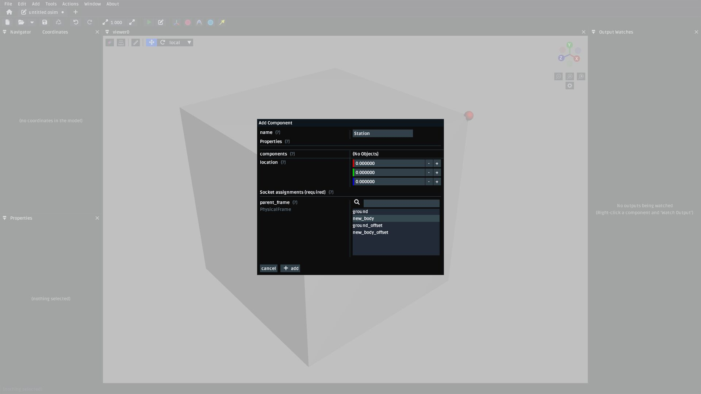
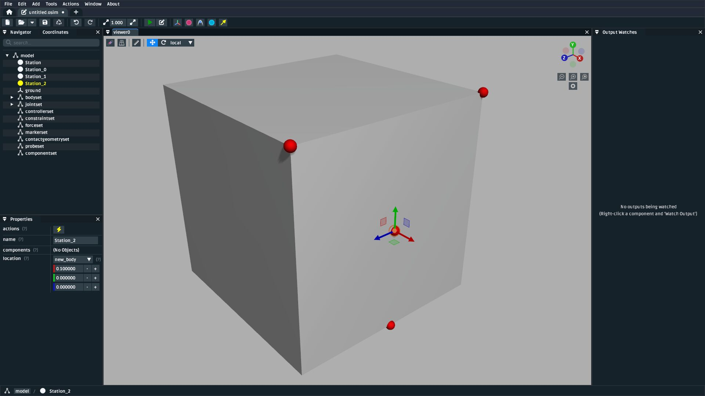
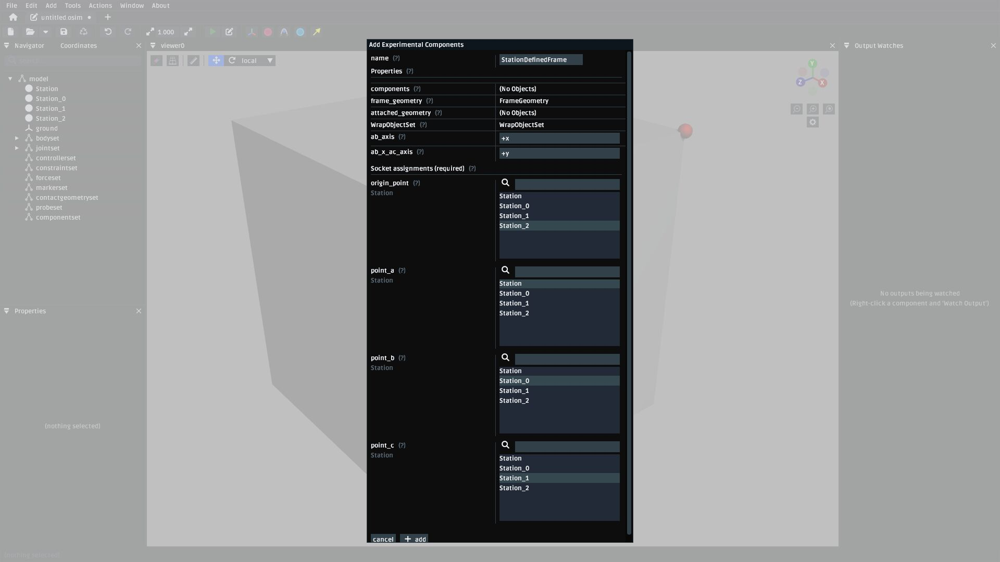
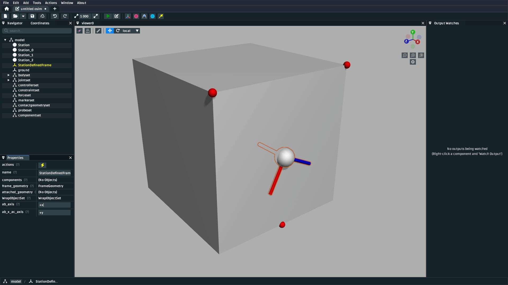
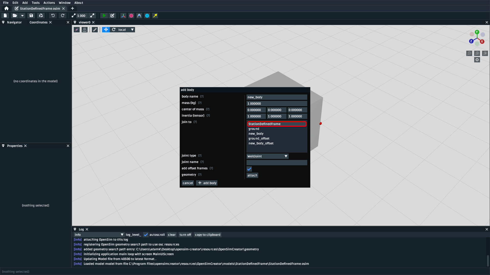

Station Defined Frames
======================

This tutorial focuses on the ``StationDefinedFrame`` component, which was
merged into OpenSim in `opensim-core/pull/3694`_  and should be available in
OpenSim >= v4.5.1. Specifically, this tutorial focuses on adding
``StationDefinedFrames`` via OpenSim Creator. If you're more interested
in the underlying implementation, or its associated OpenSim API,
then `StationDefinedFrame.h`_ provides a technical (C++) description.

Overview
--------

Frames are defined to compose a right-handed set of three orthogonal axes (an
orientation) and an origin point (a translation). OpenSim has a ``Frame`` abstraction
that it uses when defining almost all spatial relationships. Joints
join ``Frames`` bodies are a ``Frame`` ; muscle path points are defined within
``Frames`` (as are markers); and meshes, contact geometry, and wrap surfaces are
attached to (and defined in) ``Frames``.

A ``Frame`` 's transform can be constant (e.g. ``Ground``), based on constraints (e.g. ``Body``),
or user-defined (e.g. ``PhysicalOffsetFrame``). User-defined ``Frame`` s are the primary
way that modellers define spatial relationships in an OpenSim model.

.. admonition:: ``PhysicalOffsetFrame`` Example
    
    An OpenSim model might contain a ``PinJoint`` definition that attaches to
    a ``PhysicalOffsetFrame`` in order to customize the joint center. The offset frame's
    osim XML may look something like this:

    .. code-block:: XML

        <PhysicalOffsetFrame name="body_offset">
            <socket_parent>/bodyset/some_body</socket_parent>
            <translation>0 0.8 0</translation>
            <orientation>1.5707 0 0</orientation>
        </PhysicalOffsetFrame>

    Where ``socket_parent`` indicates which frame ``body_offset`` is defined in,
    ``translation`` defines its translation within the parent (here, ``some_body``),
    and ``orientation`` defines its orientation with respect to that
    parent. OpenSim uses this information like this at runtime to figure out
    where (e.g.) bodies and muscle points are.

``StationDefinedFrame`` s are user-defined ``Frame`` s that derive their transform
from relationships between stations (body-fixed points) in the model. This more
closely mirrors how anatomical joint/body frames are formally defined
(e.g. `Grood et. al.`_, `Wu et. al.`_). It's also compatible with algorithms
that operate on points (e.g. TPS warping, see :doc:`the-mesh-warper`). The
mathematical relationship between stations in the model and the ``StationDefinedFrame``
are shown in :numref:`sdf-maths-figure`.

.. _sdf-maths-figure:

    The relationship between stations and a ``StationDefinedFrame``. :math:`\mathbf{a}`,
    :math:`\mathbf{b}`, :math:`\mathbf{c}`, and :math:`\mathbf{o}` (origin) are four
    stations in the model that must be attached---either directly, or indirectly (e.g.
    via a ``PhysicalOffsetFrame``)---to the same body. The ``StationDefinedFrame``
    implementation uses the stations to derive :math:`f(\mathbf{v})`, its transform
    function. The origin station, :math:`\mathbf{o}`, may be coincident with one of
    the other stations.

Practically speaking, this means is that ``StationDefinedFrame`` s let modellers
define frames by choosing/calculating 3 or 4 stations (landmarks) on each body. Once
that relationship is established, the resulting frame is automatically recalculated
whenever the the stations moved (e.g. due to scaling, warping, shear, etc.).

Example Walkthrough
-------------------

OpenSim Creator includes example models that use ``StationDefinedFrame``:

- ``StationDefinedFrame.osim`` : A simple example that contains four stations defined
  in one body with a ``StationDefinedFrame`` that's defined by the stations.

- ``StationDefinedFrame_Advanced.osim``: A more advanced example that contains multiple
  ``StationDefinedFrame`` s that are chained and use stations attached via
  ``PhysicalOffsetFrame`` s.

This walkthrough outlines creating something similar to ``StationDefinedFrame.osim``, so
that you can get an idea of how the mathematics (:numref:`sdf-maths-figure`) is exposed via
OpenSim's component system.

Make a One-Body Model
~~~~~~~~~~~~~~~~~~~~~

1. Create a blank OpenSim model (e.g. from the splash screen or main menu).
2. Add a body to the model (as described in :ref:`add-body-with-weldjoint`), attach a brick
   geometry to the body, so it's easier to visualize.
3. You should end up with something like :numref:`blank-model-single-body-with-brick-figure`.

.. _blank-model-single-body-with-brick-figure:

    A model containing one body with a brick geometry attached to it.

Add Stations to the Body
~~~~~~~~~~~~~~~~~~~~~~~~

With a body defined, we now need to define four stations in the body. Mathematically, each
of these stations is equivalent to the :math:`\mathbf{a}`, :math:`\mathbf{b}`, :math:`\mathbf{c}`,
and :math:`\mathbf{o}` point vectors in :numref:`sdf-maths-figure`. Repeat the following process
four times:

1. Open the ``Add`` context menu by right-clicking somewhere in a 3D visualizer. Add a ``Station``
   by finding it in this menu (``Component`` > ``Station``). This will bring up a dialog that looks
   like :numref:`add-station-dialog` through which you can add a ``Station`` component.

.. _add-station-dialog:

    The add ``Station`` dialog. Use this to attach four stations to the body by choosing the body as
    the ``parent_frame``.

2. Place the four stations somewhere in the model. An example is shown in :numref:`station-placement-example`. In
it, all the stations were placed on the brick face and the origin station (:math:`\mathbf{o}`) was placed
in the center.

.. _station-placement-example:

    The model after placing four stations attached to the body.

Add a ``StationDefinedFrame``
~~~~~~~~~~~~~~~~~~~~~~~~~~~~~

.. note::
    ``StationDefinedFrame`` is currently placed in the ``Experimental Components`` section because, although
    it's supported/merged into upstream OpenSim, it's only supported in versions >= v4.5.1. At time of
    writing (2025/05/15), the latest available version of OpenSim GUI is v4.5.0, which doesn't
    support ``StationDefinedFrame`` s yet 😞.

1. Open the ``Add`` context menu by right-clicking somewhere in a 3D visualizer. Add a ``StationDefinedFrame``
   by finding it in this menu (``Experimental Components`` > ``StationDefinedFrame``). This will bring up a dialog that looks
   like :numref:`add-stationdefinedframe-dialog` through which you can add a ``StationDefinedFrame`` component.

2. Make sure to select the correct ``Station`` s for ``point_a``, ``point_b``, etc.

.. _add-stationdefinedframe-dialog:

    The add ``StationDefinedFrame`` dialog. The ``ab_axis`` property is used to customize
    which axis the :math:`\widehat{\mathbf{b} - \mathbf{a}}` axis actually maps onto when
    the implementation ultimately calculates the frame's rotation (:math:`\mathbf{R}`, in
    :numref:`sdf-maths-figure`). The ``ab_x_ac_axis`` is used to customize which axis the
    cross product maps onto (:math:`\hat{\mathbf{e_3}}` in :numref:`sdf-maths-figure`). You
    don't need to use either ``ab_axis`` or ``ab_x_ac_axis`` yet, but just be aware that they
    are available if you want to flip/change an axis later on.

3. After adding the ``StationDefinedFrame`` to the model, you should be able to see it in the
   visualizer (:numref:`after-adding-stationdefinedframe`)

.. _after-adding-stationdefinedframe:

    The model after adding a ``StationDefinedFrame``. The frame's location and orientation is
    entirely derived from the ``Station`` s, which more closely mimics how frames are defined
    in biomechanical systems.

The resulting ``StationDefinedFrame`` can be used with anything in OpenSim that depends on a
``Frame``, such as joints, geometry, stations, offset frames, and so on. In principle, you
could have used a ``PhysicalOffsetFrame`` to reach the same point, but that would require
manually calculating the origin and rotation - and wouldn't be anywhere near as useful when
scaling or warping the model.

Join Something to the ``StationDefinedFrame``
~~~~~~~~~~~~~~~~~~~~~~~~~~~~~~~~~~~~~~~~~~~~~

The most common use for a ``StationDefinedFrame`` is to use it in a joint definition, because
that's an important part of designing models. There's two ways to do this, outlined below.

Using a ``StationDefinedFrame`` as a Parent Frame When Adding a New Body
^^^^^^^^^^^^^^^^^^^^^^^^^^^^^^^^^^^^^^^^^^^^^^^^^^^^^^^^^^^^^^^^^^^^^^^^

When adding a body to a model (e.g. as described in :ref:`add-body-with-weldjoint`) a
joint is also added (the body has to join to *something*, as far as OpenSim is
concerned) and you can select the added ``StationDefinedFrame`` as what it joints to
directly in the add body dialog (:numref:`add-body-show-joining-to-sdf`).

.. _add-body-show-joining-to-sdf:

    When adding a new body, you can select a ``StationDefinedFrame`` that's already in
    the model as the parent frame for the body's joint.

Once you have added the new body this way, you might want to then define a
``StationDefinedFrame`` on the new body. That's fine: the procedure is identical to this
walkthrough. After you have a ``StationDefinedFrame`` on the new body, you can then use the
procedure below to modify the joint to use that frame.

Using a ``StationDefinedFrame`` as a Parent/Child Frame in an Existing Joint
^^^^^^^^^^^^^^^^^^^^^^^^^^^^^^^^^^^^^^^^^^^^^^^^^^^^^^^^^^^^^^^^^^^^^^^^^^^^

``StationDefinedFrame`` s can be added to existing bodies in an existing OpenSim model. They
only require that all of the stations used to define the frame are attached to the same body. Joints
in OpenSim models work by coupling two frames that are referenced via sockets (named ``parent_frame``
and ``child_frame``) on the joint. Therefore, assuming you have a ``StationDefinedFrame`` called ``sdf``
in your model and you want to use it in a model that already contains bodies and joints, you can
follow this procedure:

1. Identify which joint you want to re-socket.
2. Right-click the joint and use the ``Sockets`` menu to change either the joint's
   ``parent_frame`` or ``child_frame`` sockets to point to your ``StationDefinedFrame``
   (TODO REF).

TODO: must ensure this works for ``child_frame`` because the ``StationDefinedFrame`` might
be on a body that's already somewhere in the kinematic chain

.. _opensim-core/pull/3694: https://github.com/opensim-org/opensim-core/pull/3694
.. _StationDefinedFrame.h: https://github.com/opensim-org/opensim-core/blob/main/OpenSim/Simulation/Model/StationDefinedFrame.h
.. _Grood et. al.:  https://doi.org/10.1115/1.3138397
.. _Wu et. al.: https://doi.org/10.1016/0021-9290(95)00017-C
