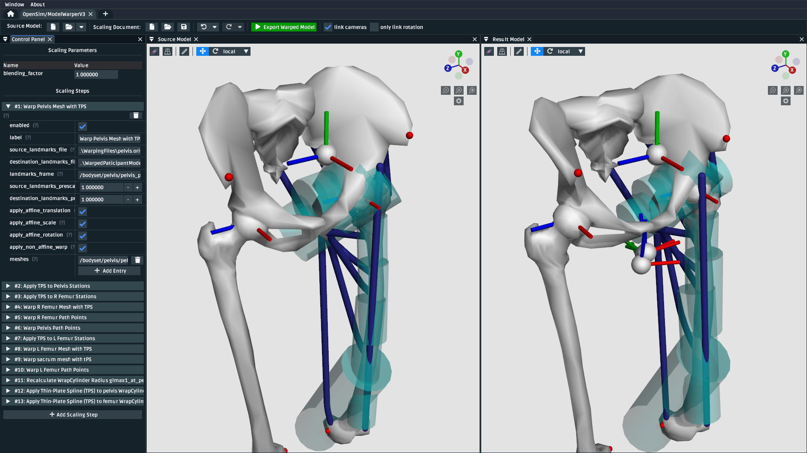

.. _the-model-warper:

The Model Warper
================

.. warning::

    **The model warper is very very 🪄 experimental 🪄.**

    The model warper has been in development since 2023 and has undergone several
    redesigns from its initial version (an extended form of :ref:`the-mesh-warper`)
    to what it is now (a way of combining various scaling steps in a linear pipeline).
    This is because because non-linear "model warping" combines a variety of scaling
    algorithms in a model-specific way - our goal is to provide clear UI tooling
    that makes combining those algorithms easier.

    We invite you to try the model warper out and get a feel for how it might be
    useful. Maybe it's already useful enough for you to use it in something
    serious (some researchers already have 🎉).

In this tutorial, we will be using the model warper to create a warping pipeline that
can be used to warp an entire OpenSim model using experimental measurements, such as
CT scans and weight measurements. The benefit of the model warper is that it lets you
combine various, potentially non-uniform, scaling steps into a single warping pipeline
that's standard, introspectible, and reusable.

.. _model-warper-ui:

    The model warping UI. This tutorial goes through top-level model warping concepts
    and how OpenSim Creator's UI tooling helps design and execute a model warping
    procedure.

Prerequisites
-------------

* **You can diagnose and work with OpenSim models**. This tutorial assumes that
  you're able to diagnose the models that go into, and come out of, the model
  warping UI. If you don't feel comfortable with working on OpenSim models, then
  we recommend going through some model-building tutorials (e.g. :doc:`make-a-pendulum`,
  :doc:`make-a-bouncing-block`).

* **A basic understanding of the Thin-Plate Spline (TPS) technique**. The walkthrough
  in this tutorial uses the TPS technique to warp parts of the model. Therefore, it's
  recommended that you have already gone through :doc:`the-mesh-warper`, which outlines
  pairing landmarks between two corresponding meshes as inputs for the TPS technique.

* **Familiarity with StationDefinedFrames**. The walkthrough in this tutorial uses 
  ``StationDefinedFrame``\s so that non-linear TPS scaling steps correctly recompute
  the source model's joint frames. The :doc:`station-defined-frames` documentation
  outlines what ``StationDefinedFrame``\s are and how to add them to models.

Topics Covered by this Tutorial
-------------------------------

* A technical overview of how the model warper works
* A concrete walkthrough of warping a simple model
* An explanation of how model warping behavior can be customized

Technical Overview
------------------

A **model warping procedure** applies a sequence of **scaling steps** to the
**source model** one-at-a-time to yield a **result model**. Each scaling
step may require some sort of **scaling parameter**, or external data, to execute
successfully. Model warping procedures are customizable. The number, order, and
behavior of each scaling step may differ from procedure to procedure. This is to
accomodate a variety of source models and experiments, which may have different
scaling requirements.

OpenSim Creator provides a user interface for designing and running a model warping
procedure. **TODO SCREENSHOT. OVERVIEW OF AVAILABLE PANELS AND GENERAL USAGE TODO.**

    The model warping UI contains a toolbar with buttons for creating/loading the
    source model, warping procedure, and other useful functions (top); a control
    panel for editing the scaling parameters of a single warping procedure run and
    an editable list of toggleable scaling steps which are applied in-order (left);
    and 3D views that show both the source model and the result model after applying
    those scaling steps (right).

Walkthrough
-----------

This walkthrough goes through the process of building a model warping procedure from
scratch.

Load Source Model
^^^^^^^^^^^^^^^^^

**TODO**: explain the model, its use of ``StationDefinedFrame``\s, how many degrees of freedom it has, etc. - ensure the user gets a download link for it.

Add Mesh Scaling Step
^^^^^^^^^^^^^^^^^^^^^

**TODO**: walk through adding a Thin-Plate Spline scaling step for a mesh in the model. Mention any gotchas w.r.t. where the data should be stored, how it should be stored, etc.

Add Frame Scaling Step
^^^^^^^^^^^^^^^^^^^^^^

**TODO**: walk through adding a scaling step that scales the stations associated with a ``StationDefinedFrame``. Should explain that this is one of the reasons why SDFs are useful etc.

Add Mass Scaling Step
^^^^^^^^^^^^^^^^^^^^^

**TODO**: add a mass scaling step. This is just another scaling step but is a good opportunity to discuss the relevance of having scaling parameters.

Export Result Model
^^^^^^^^^^^^^^^^^^^

**TODO**: export the result model to a model editor and prompt the reader to save it if they like it.

Summary
-------

**TODO**: quick runthrough of what was communicated, why/where model warping can be useful
and an invite to try it on other models!
