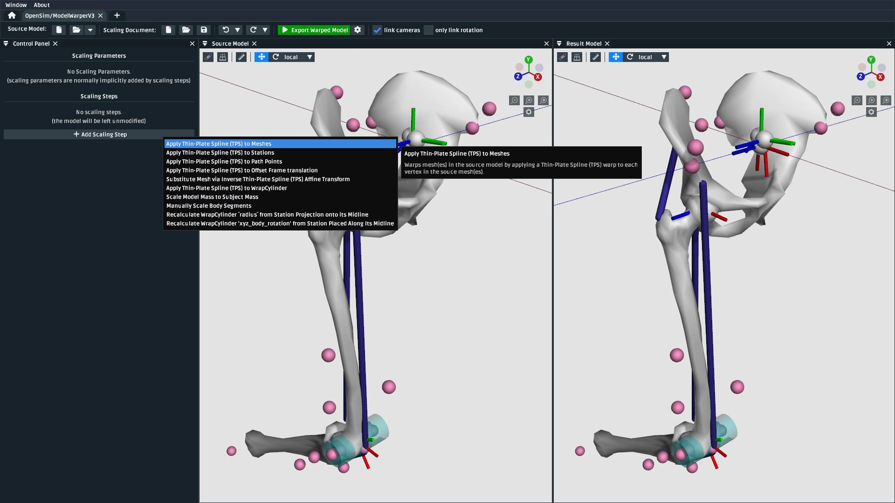
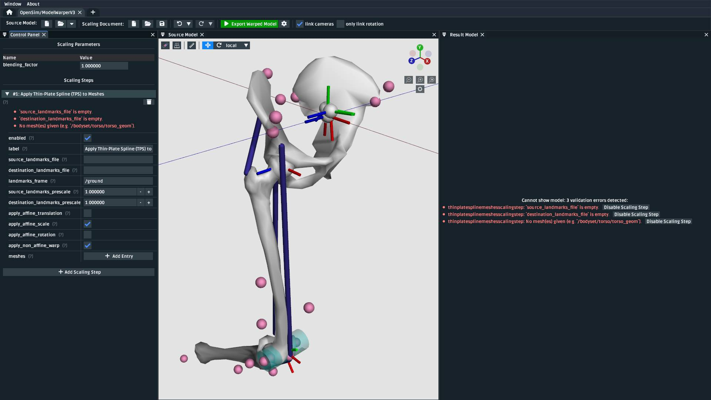

.. _the-model-warper:

The Model Warper
================

.. warning::

    **The model warper is very very 🪄 experimental 🪄.**

    The model warper has been in development since 2023 and has undergone several
    redesigns from its initial version (an extended form of :ref:`the-mesh-warper`)
    to what it is now. This is because because non-linear "model warping" combines
    a variety of scaling algorithms in a model-specific way - our goal is to
    provide clear UI tooling that makes combining various scaling algorithms into a
    single pipeline easier.

    We invite you to try the model warper out and get a feel for how it might be
    useful. Maybe it's already useful enough for you to use it in something
    serious.

In this tutorial, we will be using the model warper to create a warping pipeline that
can be used to warp an entire OpenSim model using subject-specific data, such as CT
scans and weight measurements. The benefit of the model warper is that it lets you
combine various, potentially non-uniform, scaling steps into a single warping pipeline
that's standard, introspectible, and reusable.

.. _model-warper-ui:

    The model warping UI. This tutorial goes through top-level model warping concepts
    and how OpenSim Creator's UI tooling helps design and execute a model warping
    procedure.

Prerequisites
-------------

* **You can diagnose and work with OpenSim models**. This tutorial assumes that
  you're able to diagnose the models that go into, and come out of, the model
  warping UI. If you don't feel comfortable with working on OpenSim models, then
  we recommend going through some model-building tutorials (e.g. :doc:`make-a-pendulum`,
  :doc:`make-a-bouncing-block`).

* **A basic understanding of the Thin-Plate Spline (TPS) technique**. The walkthrough
  in this tutorial uses the TPS technique to warp parts of the model. Therefore, it's
  recommended that you have already gone through :doc:`the-mesh-warper`, which outlines
  pairing landmarks between two corresponding meshes as inputs for the TPS technique.

* **Familiarity with StationDefinedFrames**. The walkthrough in this tutorial uses 
  a model that contains ``StationDefinedFrame``\s so that non-linear TPS scaling steps
  correctly recompute the model's joint frames. The :doc:`station-defined-frames`
  documentation outlines what ``StationDefinedFrame``\s are and how to add them to
  models.

* **Familiarity with the previous tutorial**: The model created in :doc:`make-a-lower-leg`
  is the source model in this one, so going through it will provide valuable context about
  the source model's design.

Topics Covered by this Tutorial
-------------------------------

* A technical overview of how the model warper works
* A concrete walkthrough of warping the model from :doc:`make-a-lower-leg`
* An explanation of how model warping behavior can be customized

Technical Overview
------------------

A **model warping procedure** applies a sequence of **scaling steps** to the
**source model** one-at-a-time to yield a **result model**. Each scaling
step may require some sort of **scaling parameter**, or external data, to execute
successfully. Model warping procedures are customizable. The number, order, and
behavior of each scaling step may differ from procedure to procedure. This is to
accomodate a variety of source models, experiments, and scaling requirements.

OpenSim Creator provides a workflow for designing and executing a model warping
procedure, pictured in :numref:`model-warper-overview-screenshot`. The workflow
UI is designed to provide visual feedback about each scaling step, so that you
can incrementally build a warping procedure one scaling step at a time. The model
warping procedure (scaling document) can then be saved to a standard XML file so
that it can be reused and modified.

.. _model-warper-overview-screenshot:

    The model warping workflow UI contains a toolbar with buttons for creating/loading
    the source model, warping procedure, and various other useful functions (top); a
    control panel for editing the scaling parameters of a warping procedure and
    an editable list of toggleable scaling steps which are applied in-order (left);
    and 3D views that show the source model and result (warped) model after applying
    the scaling steps side-by-side (right).

Walkthrough
-----------

This walkthrough goes through the process of building a model warping procedure for the
model made in :doc:`make-a-lower-leg` from scratch. The aim is to show how the model
warping workflow can be used to build a multi-step model warping pipeline containing
non-linear scaling steps.

The warping procedure we design here will try to account for femoral torsion in the
subject. Torsion is tricky to handle because standard scaling techniques, which
typically perform linear scaling, cannot account for localized, morpological
changes.

Open the Model Warper Workflow UI
^^^^^^^^^^^^^^^^^^^^^^^^^^^^^^^^^

The model warper is a specialized workflow in OpenSim Creator and can be accessed from the
splash screen:

.. figure:: _static/the-model-warper/model-warper-open-button-on-splash-screen.jpeg
    :width: 60%

    The model warper can be opened from the splash screen of OpenSim Creator (circled red).

This should open a blank model that has no scaling steps:

.. figure:: _static/the-model-warper/blank-model-warper-ui.jpeg
    :width: 60%

    A screenshot of the model warping UI when it's first opened.

Load the Source Model
^^^^^^^^^^^^^^^^^^^^^

.. note::

  The source model for this workflow is the final (cleaned up) model made in :doc:`make-a-lower-leg`. You
  can access it by downloading `Walkthrough Model ZIP`_, which contains the final model built in
  that tutorial, named ``make-a-lower-leg_final.osim``.

  Briefly, if you're unfamiliar with the model:

  - It contains three bodies (``pelvis``, ``femur_r``, and ``tibia_r``).
  - Joints at the hip (``hip_r``, a ``BallJoint``) and knee (``knee_r``, a ``PinJoint``).
  - Three muscles (``glmed_r``, ``semimem_r``, and ``recfem_r``).
  - One of the muscles (``recfem_r``) wraps over a ``WrapCylinder`` at the knee.
  - All joint frames in the model are ``StationDefinedFrame``\s, which means they can be recalculated
    by warping their associated ``Station``\s (crucial).

Use the ``Source Model`` entry in the model warper's toolbar to load ``make-a-lower-leg_final.osim``
as the source model. This should load the model and show it in the ``Source Model`` UI panel:

.. _model-warper-after-loading-model:
.. figure:: _static/the-model-warper/model-warper-after-loading-source-model.jpeg
    :width: 60%

    The model warper after loading ``make-a-lower-leg_final.osim`` from `Walkthrough Model ZIP`_. For
    clarity, the visual aids of the scene (grid button, top left of a visualizer panel) were
    adjusted to disable the floor and enale axis lines.

Add a Mesh Warping Step
^^^^^^^^^^^^^^^^^^^^^^^

The model warper is designed around applying scaling steps to the source model one-by-one
to produce the result model. :numref:`model-warper-after-loading-model` shows the most
trivial case of this process, which is to apply no scaling steps and produce a result
model that's identical to the source model.

Building a model warping procedure involves incrementally adding scaling steps that
can take the available subject-specific data and apply it to the model. In this
case, we have access to CT scans of the source and subject's femurs, which means
we can use the Thin-Plate Spline technique, as described in :doc:`the-mesh-warper`,
to warp the source bone mesh using paired landmarks on the femur meshes.

.. note::

  In preparation for the non-linear warping steps, we have already established paired
  landmarks *from* the source femur mesh in the model *to* a subject-specific femur
  in :doc:`the-mesh-warper`. Here's a screenshot of how that looked:

  .. figure:: _static/the-model-warper/mesh-warper-showing-basic-TPS-warp-of-femur.jpeg
    :width: 40%

    Screenshot of how landmarks were paired between the source femur (``femur_r.obj``,
    ``femur_r_warp.landmarks.csv``) and the subject femur (``subject_femur_r.obj``,
    ``subject_femur_r.landmarks.csv``) in :doc:`the-mesh-warper`. Rotation and
    translation (i.e. reorientation) of the mesh was removed from the TPS warp using the
    appropriate checkboxes to correct for subject/scanner orientation. Destination data
    was pre-scaled by 0.001 to account for a difference in units between the mesh
    files (meters vs. millimeters).

To warp the femur mesh, add a "Apply Thin-Plate Spline (TPS) to Meshes" scaling step:

.. _model-warper-apply-tps-to-meshes-button:

    The "Add Scaling Step" button in the model warper UI opens a menu where you can select
    the type of scaling step to add to the model warping procedure. In this first step, we
    add a "Apply Thin-Plate Spline (TPS) to Meshes" step.

Once you add the scaling step, you will find that the ``Result Model`` panel is blanked out with
error messages (:numref:`model-warper-after-adding-mesh-warping-step`). This is because the scaling
step has been added, but the model warping procedure now needs additional information (in this case,
which mesh to warp and the two corresponding ``.landmarks.csv`` files) in order to apply the
scaling step to the source model:

.. _model-warper-after-adding-mesh-warping-step:

    After adding the "Apply Thin-Plate Spline (TPS) to Meshes" scaling step, the UI stops showing
    the resultant (output) model because the warping procedure is missing the information it needs
    to apply the step.

The model warper's TPS-based mesh scaling step requires two sequences of landmarks. The
`Walkthrough Model ZIP`_ includes a ``Geometry/`` directory that contains ``femur_r_warp.landmarks.csv``
and ``subject_femur_r.landmarks.csv``, which represent ``femur_r.obj``\'s landmarks and
landmarks ``subject_femur_r.obj``\'s landmarks respectively.

To fix the errors shown in :numref:`model-warper-after-adding-mesh-warping-step`, you need to fill
in the values from :numref:`model-warper-mesh-scaling-properties` in the appropriate input boxes. Once
you do that, you should end up with something resembling :numref:`model-warper-after-applying-tps-mesh-warp`.

.. _model-warper-mesh-scaling-properties:
.. list-table:: Property values for the femur's "Apply Thin-Plate Spline (TPS) Warp to Meshes" scaling step.
   :widths: 25 25 50
   :header-rows: 1

   * - Property Name
     - Value
     - Comment
   * - ``source_landmarks_file``
     - ``Geometry/femur_r_warp.landmarks.csv``
     - Source landmark locations
   * - ``destination_landmarks_file``
     - ``Geometry/subject_femur_r.landmarks.csv``
     - Destination landmark locations
   * - ``landmarks_frame``
     - ``/bodyset/femur_r``
     - The coordinate frame that the two landmark files are defined in.
   * - ``meshes``
     - ``/bodyset/femur_r/femur_r_geom_1``
     - Path within the OpenSim model to the femur mesh component that should be warped by this scaling step.

.. _model-warper-after-applying-tps-mesh-warp:
.. figure:: _static/the-model-warper/after-applying-tps-mesh-warp.jpeg
    :width: 60%

    The model after applying the mesh warping step. The warped mesh is shorter
    and slightly twisted when compared to the source mesh. Warping the joint frames, muscle
    points, and wrap geometry is handled later in this walkthrough. An easy way to see what
    a scaling step is doing is to toggle the ``enabled`` button of the step.

Warping the femur mesh only warps the mesh data while keeping the rest of the model the
same. This means the model now looks wrong because the femur mesh is too small compared
to the rest of the model. To fix that, we need to scale the remaining components.

.. _model-warper_add-station-warping-step:

Add a Station Warping Step
^^^^^^^^^^^^^^^^^^^^^^^^^^

The next components we recommend scaling are ``Station``\s. The reason why is because, in
this model, ``StationDefinedFrame``\s were used to define frames on the femur. So if we
warp the stations, we also recompute the femur's joint frame definitions. See :doc:`station-defined-frames`
for more information on ``StationDefinedFrame``\s, and :doc:`make-a-lower-leg` for more
context about how they were added into this model.

To warp the stations, add a "Apply Thin-Plate Spline (TPS) to Stations" scaling step:

.. figure:: _static/the-model-warper/apply-thin-plate-spline-to-stations-scaling-step-button.jpeg
    :width: 60%

    Use the "Add Scaling Step" menu to add a "Apply Thin-Plate Spline (TPS) to Stations" scaling step.

Similar to the previous step, you will need to fix the errors shown by filling in
the appropriate values. This time, from :numref:`stations-to-warp-for-knee-definition`:

.. _stations-to-warp-for-knee-definition:
.. list-table:: Property values for the femur's "Apply Thin-Plate Spline (TPS) to Stations" scaling step.
   :widths: 25 25 50
   :header-rows: 1

   * - Property Name
     - Value
     - Comment
   * - ``source_landmarks_file``
     - ``Geometry/femur_r_warp.landmarks.csv``
     - Source landmark locations
   * - ``destination_landmarks_file``
     - ``Geometry/subject_femur_r.landmarks.csv``
     - Destination landmark locations
   * - ``landmarks_frame``
     - ``/bodyset/femur_r``
     - The coordinate frame that the two landmark files are defined in.
   * - ``stations``
     - ``/bodyset/femur_r/femur_r_epicondyle_centroid``, ``/bodyset/femur_r/femur_r_epicondyle_lat``, ``/bodyset/femur_r/femur_r_epicondyle_med``, ``/bodyset/femur_r/femur_r_head_center``, ``/markerset/RT1``, ``/markerset/RT2``, ``/markerset/RT3``, and ``/markerset/RKNE``
     - Path within the OpenSim model to the ``Station``\s that should be warped by this scaling step.
     
After warping the stations, the femur should now be correctly joined to the pelvis and knee, but
some further adjustments are still necessary:

.. _model-warper-after-applying-tps-frame-station-warp:
.. figure:: _static/the-model-warper/after-applying-tps-frame-station-warp.jpeg
    :width: 60%

    The model after applying the station warping step to ``Station``\s attached to
    the femur. Compared to :numref:`model-warper-after-applying-tps-mesh-warp`,
    it can be seen that the pelvis and knee joint frames are now correctly joined
    with the warped femur mesh, but a muscle (``glmed_r``) is clearly detatched
    from the femur.

Add a Path Point Warping Step
^^^^^^^^^^^^^^^^^^^^^^^^^^^^^

The muscle point ``glmed_r-P2`` is defined in terms of the femur in the source model, so
it must also be warped. This process is simliar to :ref:`model-warper_add-station-warping-step`.

To warp the muscle path point, add a "Apply Thin-Plate Spline (TPS) to Path Points" scaling step:

    Use the "Add Scaling Step" menu to add a "Apply Thin-Plate Spline (TPS) to Path Points" scaling step.

Similar to the previous step, you will need to fix the errors shown by filling in
the appropriate values. This time, from :numref:`path-points-to-warp-for-knee-definition`:

.. _path-points-to-warp-for-knee-definition:
.. list-table:: Property values for the femur's "Apply Thin-Plate Spline (TPS) to Path Points" scaling step.
   :widths: 25 25 50
   :header-rows: 1

   * - Property Name
     - Value
     - Comment
   * - ``source_landmarks_file``
     - ``Geometry/femur_r_warp.landmarks.csv``
     - Source landmark locations
   * - ``destination_landmarks_file``
     - ``Geometry/subject_femur_r.landmarks.csv``
     - Destination landmark locations
   * - ``landmarks_frame``
     - ``/bodyset/femur_r``
     - The coordinate frame that the two landmark files are defined in.
   * - ``path_points``
     - ``/forceset/glmed_r/path/glmed_r-P2``
     - Path within the OpenSim model to the muscle path point(s) that should be warped.

After warping ``glmed_r-P2``, you should see that it is now correctly attached to the warped femur:

.. _model-warper-after-applying-tps-path-points-warp:
.. figure:: _static/the-model-warper/after-applying-tps-path-points-warp.jpeg
    :width: 60%

    The model after applying the path point warping step to ``glmed_r-P2``. Compared
    to :numref:`model-warper-after-applying-tps-frame-station-warp`, it can be seen that the
    ``glmed_r`` muscle now correctly attaches to the warped femur mesh.

Manually Scale Other Body Segments
^^^^^^^^^^^^^^^^^^^^^^^^^^^^^^^^^^

To keep this tutorial brief, we will only non-linearly warp the femur. If warping was required
on the other body segments, the same steps would be used. Here, the other body segments (``pelvis``, ``tibia_r``),
will be manually scaled with a scale factor. This is equivalent to the scaling that's already
available in OpenSim.

.. note::
  
  The scale factors used in this section were approximated using the scale and inverse
  kinematics tools in OpenSim on experimental marker data collected from the subject. This
  is a common way to scale models in OpenSim. However, we have omitted scaling ``femur_r``
  here because it has already been warped by the other Thin-Plate Spline (TPS) scaling
  steps.

  If you're curious about the difference between linear and non-linear scaling, the equivalent
  ``femur_r`` linear scale factors would be ``(0.853983, 0.826068, 0.839395)``. You could even
  add a manual scaling step for ``femur_r`` here and disable the TPS warping steps to create
  a side-by-side comparison of the two scaling techniques.

To manually scale ``pelvis``, add a "Manually Scale Body Segments" scaling step:

    Use the "Add Scaling Step" menu to add a "Manually Scale Body Segments" scaling step.

And add ``/bodyset/pelvis`` to ``bodies``, followed by setting the ``scale_factors`` to
``(0.75828, 0.73484, 0.771248)``. Next, add a second "Manually Scale Body Segments" scaling
step with ``/bodyset/tibia_r`` in ``bodies`` and ``scale_factors`` of ``(0.776503, 0.849965, 0.890335)``.

You should end up with two manual scaling steps for the other two body segments, which
should scale the rest of the model to roughly match the femur:

.. figure:: _static/the-model-warper/after-applying-manual-scaling-steps.jpeg
    :width: 60%

    The model after applying manual scaling steps to ``pelvis`` and ``tibia_r``. Compared
    to :numref:`model-warper-after-applying-tps-path-points-warp`, it can be seen that the
    pelvis and tibia are smaller and more closely match the size of the (warped) femur.

Scale Wrap Cylinder
^^^^^^^^^^^^^^^^^^^

.. error::
  
  TODO: there are appropriate wrap-cylinder-scaling steps available but the markers that
  were supplied don't include a knee surface marker and it might be better to supply a
  "manually scale wrap objects" scaling step to match the previous manual scaling step -
  depends if everything should be point-driven!

Export Result Model
^^^^^^^^^^^^^^^^^^^

With everything warped, we can now export the result model as a new OpenSim model.

Exporting was possible at any point in the walkthrough where there wasn't any error messages shown in
the result model panel, and it can be good idea to occasionally export the model to explore what
scaling steps are missing. The export process involves clicking the "Export Warped Model" button,
located in the toolbar:

.. figure:: _static/the-model-warper/export-warped-model-button.jpeg
    :width: 60%

    To export the warped result model, press the green "Export Warped Model" (circled in red). This
    will apply all scaling steps to the source model and create a new OpenSim model in memory that
    can be edited, examined, or saved in the model editor. The gear icon (⚙️) next to the button
    shows some customization points (e.g. where the exporter should write warped mesh data).

.. warning::

  If your warped model needs to be compatible with OpenSim <4.6, you should also enable the
  "Bake StationDefinedFrames" option using the gear icon (⚙️) next to the "Export Warped Model"
  button:

  .. figure:: _static/the-model-warper/bake-station-defined-frames-option.jpeg
    :width: 40%

    The "Bake StationDefinedFrames" checkbox causes the model warper to also convert all
    ``StationDefinedFrame``\s in the source model into ``PhysicalOffsetFrame``\s, which are
    compatible with OpenSim <4.6.

This will then open a standard OpenSim model editor tab (:numref:`model-editor-after-exporting-model`, the
same workflow that's used to edit an ``.osim`` file). You can then save the ``.osim`` file, if you'd
like, or investigate/edit the resulting model further.

.. _model-editor-after-exporting-model:
.. figure:: _static/the-model-warper/final-exported-model.jpeg
    :width: 60%

    The final warped model after exporting it, which opens it in the model editor workflow. The exported
    model is only held in memory, rather than written to disk, so you'll need to save it. All the usual
    ``.osim`` model editing capabilities are available in this workflow (e.g. live muscle moment arm
    plotting, as pictured), so you can also perform any final investigations/edits here before saving
    the model.

Summary
^^^^^^^

In this tutorial, we built a subject-specific warping pipeline using the model warper in OpenSim
Creator. We warped the femur with Thin-Plate Spline (TPS) techniques, adjusted stations and muscle path
points to maintain correct anatomical relationships, and manually scaled the pelvis and tibia. By
incrementally adding and customizing scaling steps, we created a reusable pipeline that accounted
for non-linear changes such as femoral torsion.

Main takeaways:

- We combined multiple scaling steps (mesh, station, path point, manual) into one pipeline.
- TPS warping handled localized, non-linear changes while manual scaling adjusted remaining segments.
- Using ``StationDefinedFrames`` ensured joint frames updated correctly during warping.
- The result was a reusable, exportable OpenSim model tailored to subject-specific data.

Next Steps
^^^^^^^^^^

- **Validate and analyze the warped model**. Leverage OpenSim Creator’s built-in tools to plot
  and monitor model quantities (e.g., joint frames, muscle paths, moments). You can also export
  your warped model and examine it in the full OpenSim GUI, which provides additional analysis
  workflows such as Static Optimization, Computed Muscle Control, and Inverse Dynamics.

- **Enhance model fidelity by scaling inertial properties**. Consider expanding your pipeline
  to include mass and inertia scaling of the rigid body segments—a capability that isn’t yet
  supported natively in OpenSim Creator. Adjusting these properties using external tools or
  manual methods can significantly improve dynamic simulation accuracy (e.g., joint moments and balance).

- **Explore muscle parameter scaling for realistic muscle dynamics**. To refine the muscular behavior
  in your model, you can adjust key muscle parameters—such as maximum isometric force, optimal fiber
  length, tendon slack length, and contraction velocity—which are available in OpenSim’s muscle
  components.

.. _Walkthrough Model ZIP: _static/the-model-warper/make-a-lower-leg_resources.zip
