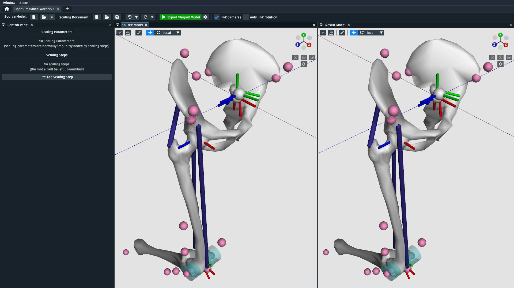
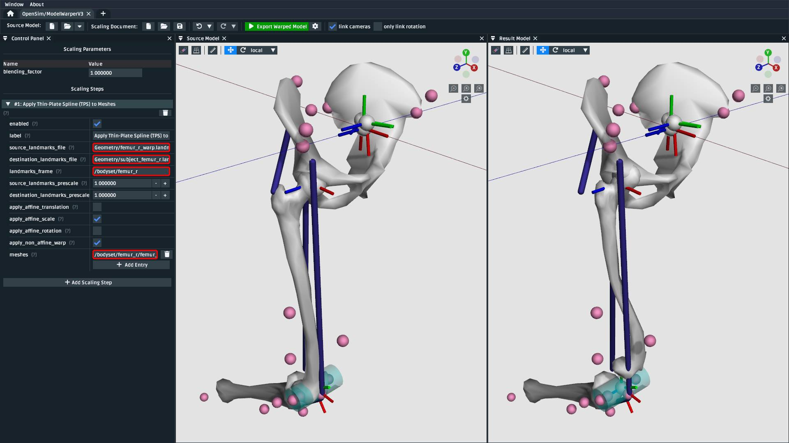
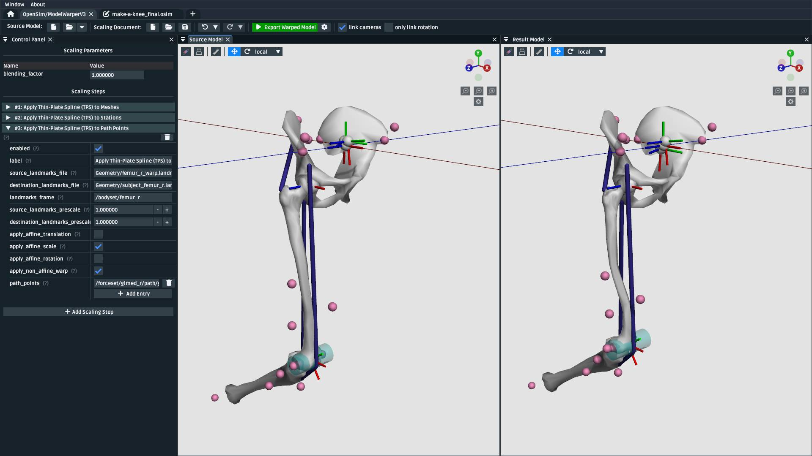
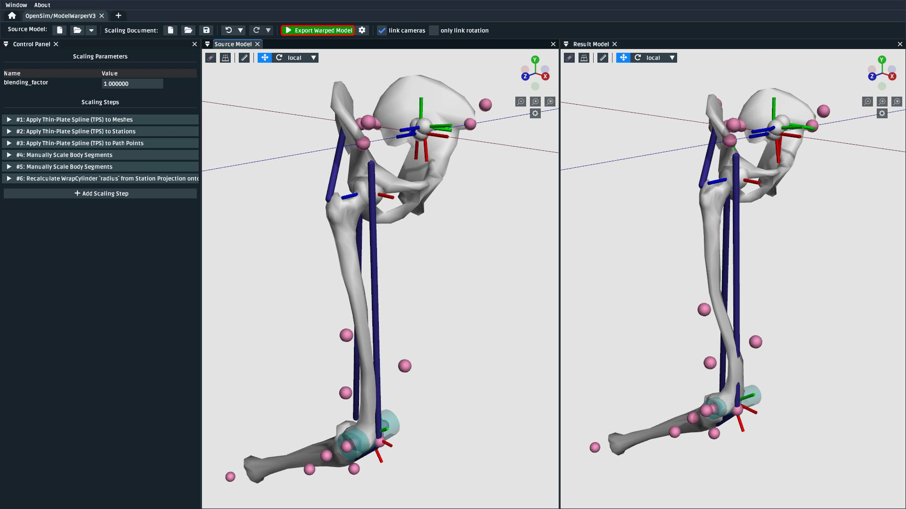
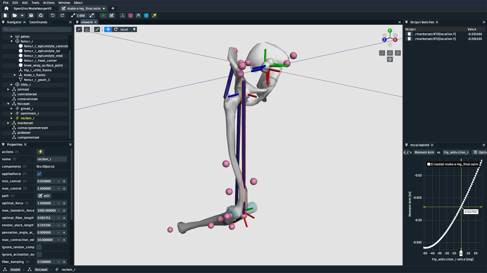

.. _the-model-warper:

The Model Warper
================

.. warning::

    **The model warper is very very 🪄 experimental 🪄.**

    The model warper has been in development since 2023 and has undergone several
    redesigns from its initial version (an extended form of :ref:`the-mesh-warper`)
    to what it is now (a way of combining various scaling steps in a linear pipeline).
    This is because because non-linear "model warping" combines a variety of scaling
    algorithms in a model-specific way - our goal is to provide clear UI tooling
    that makes combining those algorithms easier.

    We invite you to try the model warper out and get a feel for how it might be
    useful. Maybe it's already useful enough for you to use it in something
    serious (some researchers already have 🎉).

In this tutorial, we will be using the model warper to create a warping pipeline that
can be used to warp an entire OpenSim model using experimental measurements, such as
CT scans and weight measurements. The benefit of the model warper is that it lets you
combine various, potentially non-uniform, scaling steps into a single warping pipeline
that's standard, introspectible, and reusable.

.. _model-warper-ui:
.. figure:: _static/the-model-warper/model-warper.jpg
    :width: 60%

    The model warping UI. This tutorial goes through top-level model warping concepts
    and how OpenSim Creator's UI tooling helps design and execute a model warping
    procedure.

Prerequisites
-------------

* **You can diagnose and work with OpenSim models**. This tutorial assumes that
  you're able to diagnose the models that go into, and come out of, the model
  warping UI. If you don't feel comfortable with working on OpenSim models, then
  we recommend going through some model-building tutorials (e.g. :doc:`make-a-pendulum`,
  :doc:`make-a-bouncing-block`).

* **A basic understanding of the Thin-Plate Spline (TPS) technique**. The walkthrough
  in this tutorial uses the TPS technique to warp parts of the model. Therefore, it's
  recommended that you have already gone through :doc:`the-mesh-warper`, which outlines
  pairing landmarks between two corresponding meshes as inputs for the TPS technique.

* **Familiarity with StationDefinedFrames**. The walkthrough in this tutorial uses 
  ``StationDefinedFrame``\s so that non-linear TPS scaling steps correctly recompute
  the source model's joint frames. The :doc:`station-defined-frames` documentation
  outlines what ``StationDefinedFrame``\s are and how to add them to models.

Topics Covered by this Tutorial
-------------------------------

* A technical overview of how the model warper works
* A concrete walkthrough of warping a simple model
* An explanation of how model warping behavior can be customized

Technical Overview
------------------

A **model warping procedure** applies a sequence of **scaling steps** to the
**source model** one-at-a-time to yield a **result model**. Each scaling
step may require some sort of **scaling parameter**, or external data, to execute
successfully. Model warping procedures are customizable. The number, order, and
behavior of each scaling step may differ from procedure to procedure. This is to
accomodate a variety of source models, experiments, and scaling requirements.

OpenSim Creator provides a workflow for designing and executing a model warping
procedure, pictured in :numref:`model-warper-overview-screenshot`. The workflow
UI is designed to provide visual feedback about each scaling step, so that you
can incrementally build a warping procedure one scaling step at a time. The model
warping procedure can then be saved to a standard XML file so that it can be reused
and modified.

.. _model-warper-overview-screenshot:
.. figure:: _static/the-model-warper/model-warper.jpg
    :width: 60%

    The model warping workflow UI contains a toolbar with buttons for creating/loading
    the source model, warping procedure, and various other useful functions (top); a
    control panel for editing the scaling parameters of a warping procedure and
    an editable list of toggleable scaling steps which are applied in-order (left);
    and 3D views that show the source model and result (warped) model after applying
    the scaling steps side-by-side (right).

Walkthrough
-----------

This walkthrough goes through the process of building a model warping procedure from
scratch. The aim is to show how the model warping workflow can be used to build tricky
non-linear model warping procedures.

In particular, we will develop a procedure that warps a simple healthy leg model to account
for femoral torsion. Torsion is tricky to handle because standard scaling techniques, which
typically perform linear scaling, cannot handle non-linear, localized, morpological
changes. Therefore, a designer who's familiar with the model, the underlying biomechanics,
and the available experimental scaling parameters needs to develop a custom scaling/warping
procedure, which is where the model warping workflow may help.

Open the Model Warper Workflow UI
^^^^^^^^^^^^^^^^^^^^^^^^^^^^^^^^^

The model warper is a specialized workflow in OpenSim Creator and can be accessed from the
splash screen:

.. figure:: _static/the-model-warper/model-warper-open-button-on-splash-screen.jpeg
    :width: 60%

    The model warper can be opened from the splash screen of OpenSim Creator (circled red).

This should open a blank model that has no scaling steps:

    A screenshot of the model warping UI when it's first opened.

Load the Source Model
^^^^^^^^^^^^^^^^^^^^^

.. note::

  We have already prepared a source model for this workflow, you can download it at `Walkthrough Model ZIP`_.

  The model contains two bodies (upper leg, lower leg) joined together with a pin joint that
  uses :doc:`station-defined-frames` to represent (very roughly) a knee and one muscle that
  crosses that joint over a single wrap cylinder to represent (again, roughly) how the muscle
  wraps over bone.

Use the ``Source Model`` entry in the model warper's toolbar to load the source model ``.osim``
file. This should load the model and show it in the ``Source Model`` UI panel:

.. _model-warper-after-loading-model:

    The model warper after loading contents of `Walkthrough Model ZIP`_.

Add a Mesh Warping Step
^^^^^^^^^^^^^^^^^^^^^^^

The model warper is designed around applying scaling steps to the source model one-by-one
to produce the result model. :numref:`model-warper-after-loading-model` shows the most
trivial case of this process, which is to apply no scaling steps and produce a result
model that's identical to the source model.

The essence of building a model warping procedure is to incrementally add the scaling
steps you need. The first step is to apply the subject's (target) femoral torsion to
the femur bone mesh in the model. There are external tools available online to do
this (e.g. `this one <https://simtk.org/projects/bone_deformity>`_) but, for this
walkthrough, we will use the Thin-Plate Spline technique, as described in
:doc:`the-mesh-warper`, because the model warper has in-built support for it.

.. note::

  In preparation for the mesh warping step, we have already established a TPS warp
  *from* the source femur mesh in the model *to* a subject-specific femur mesh by
  pairing landmarks between them in :doc:`the-mesh-warper`. Here's a screenshot of
  how that looked:

  .. figure:: _static/the-model-warper/mesh-warper-showing-basic-TPS-warp-of-femur.jpeg
    :width: 60%

    Screenshot of how landmarks were paired between the source mesh and the destination one
    in the mesh warper. Rotation and translation (i.e. reorientation) of the mesh was removed
    from the TPS warp using the appropriate checkboxes to correct for subject/scanner
    orientation. Destination data was pre-scaled by 0.001 to account for a difference in
    units between the mesh files (meters vs. millimeters).

  For the pruposes of model warping, all you need to know is that the TPS warping technique
  requires a ``.landmarks.csv`` for the "source" and a ``.landmarks.csv`` for the destination.
  Where the landmarks in those files come from is up to you (:doc:`the-mesh-warper` is one way).
  The model warping implementation uses pairs of landmarks from those files to warp, scale, reorient,
  and translate the applicable mesh, station, or muscle point.

The model warper's TPS-based mesh scaling step requires two sequences of landmarks. The `Walkthrough Model ZIP`_
includes a ``Geometry/`` directory that contains ``femur_r.landmarks.csv`` and ``subject_femur_r.landmarks.csv``, which
represent ``femur_r.vtp``\'s landmarks and landmarks ``subject_femur_r.stl``\'s landmarks respectively.

To add a scaling step in the model warper UI, click the appropriate button and add a "Apply Thin-Plate
Spline (TPS) to Meshes" step (pictured in :numref:`model-warper-apply-tps-to-meshes-button`).

.. _model-warper-apply-tps-to-meshes-button:
.. figure:: _static/the-model-warper/apply-thin-plate-spline-to-meshes-scaling-step-button.jpeg
    :width: 60%

    The "Add Scaling Step" button in the model warper UI opens a menu where you can select
    the type of scaling step to add to the model warping procedure. In this first step, we
    add a "Apply Thin-Plate Spline (TPS) to Meshes" step.

Once you add the scaling step, you will find that the ``Result Model`` panel is blanked out with
error messages (:numref:`model-warper-after-adding-mesh-warping-step`). This is because the step
has been added, but the model warping procedure now needs additional information (i.e. which mesh
to warp and the two corresponding ``.landmarks.csv`` files) in order to apply the scaling step to
the source model.

.. _model-warper-after-adding-mesh-warping-step:
.. figure:: _static/the-model-warper/error-after-adding-mesh-warping-scaling-step.jpeg
    :width: 60%

    After adding the "Apply Thin-Plate Spline (TPS) to Meshes" scaling step, the UI stops showing
    the resultant (output) model because the warping procedure is missing the information it needs
    to apply the step.

To fix this issue, you need to fill in the values from :numref:`model-warper-mesh-scaling-properties`
in the appropriate input boxes. Once you do that, you should end up with something resembling
:numref:`model-warper-after-applying-tps-mesh-warp`.

.. _model-warper-mesh-scaling-properties:
.. list-table:: Property values for the TPS femur mesh scaling step.
   :widths: 25 25 50
   :header-rows: 1

   * - Property Name
     - Value
     - Comment
   * - ``source_landmarks_file``
     - ``Geometry/femur_r.landmarks.csv``
     - Source landmark locations
   * - ``destination_landmarks_file``
     - ``Geometry/subject_femur_r.landmarks.csv``
     - Destination landmark locations
   * - ``landmarks_frame``
     - ``/bodyset/femur_r``
     - The coordinate frame that the two landmark files are defined in.
   * - ``destination_landmarks_prescale``
     - 0.001
     - The destination landmarks (and mesh) were defined in millimeters.
   * - ``meshes``
     - ``/bodyset/femur_r/femur_r_geom_1``
     - Path within the OpenSim model to the femur mesh component that should be warped.

.. _model-warper-after-applying-tps-mesh-warp:

    The model after applying the mesh warping step. The warped mesh is shorter
    and slightly twisted when compared to the source mesh. Warping the joint frames, muscle
    points, and wrap geometry is handled later in this walkthrough. An easy way to see what
    a scaling step is doing is to toggle the ``enabled`` button on the step.

Add a Frame Warping Step
^^^^^^^^^^^^^^^^^^^^^^^^

Warping the femur mesh only warps the mesh data while keeping the rest of the model the
same. This means the model now looks wrong (the femur mesh is too small compared to the
rest of the model). To fix that, we need to scale the remaining components.

The next component we recommend scaling is the joint frame of the knee. The reason why
is because it will help move the downstream components (the wrap cylinder and lower-leg
muscle points) into a better location. As for *how* to scale the knee frame, it makes
sense to use the TPS technique, given the femur was already scaled that way.

.. note::

  The TPS technique operates on points in space, not frames, which typically combine a
  reorientation and a translation.

  The way we work around that problem is by ensuring that frames in the source model use
  ``StationDefinedFrame``\s, as described in :doc:`station-defined-frames`, rather than
  ``PhysicalOffsetFrame``\s, which encode an orientation.

  The difference between the two frame definitions is subtle, but significant: ``StationDefinedFrame``\s
  are entirely defined in terms of points in space, which can be warped via the TPS technique,
  whereas ``PhysicalOffsetFrame``\s include a not-TPS-warpable reorientation.

  If you have a model that uses ``PhysicalOffsetFrame``\s, then the TPS technique can only
  reliably warp the translation part of the frame. It can *approximately* warp the
  orientation, but this relies on reprojection/orthogonalization techniques, which
  require tweaking and aren't anywhere near as robust as using a ``StationDefinedFrame``\.

In this model, the knee joint (``knee_r``) is defined as joining ``femur_r_knee_frame``
(a ``StationDefinedFrame``) to the lower leg (``lower_leg_r``). Therefore, to warp the
femur's side of ``knee_r``'s joint definition we should warp the stations that are used
to define ``femur_r_knee_frame`` (listed in :numref:`stations-to-warp-for-knee-definition`).

.. _stations-to-warp-for-knee-definition:
.. list-table:: Stations that are used to define ``femur_r_knee_frame`` in the model. These should be warped via the TPS technique.
   :header-rows: 1

   * - .. centered:: Absolute Path in Model
   * - .. centered:: ``/bodyset/femur_r/femur_r_head``
   * - .. centered:: ``/bodyset/femur_r/femur_r_med_condyl``
   * - .. centered:: ``/bodyset/femur_r/femur_r_lat_condyl``
   * - .. centered:: ``/bodyset/femur_r/femur_r_condyls_midpoint``

Concretely, we start by adding a "Apply Thin-Plate Spline (TPS) to Stations" scaling step to the
model by clicking the appropriate menu item (:numref:`model-warper-apply-tps-to-stations-button`):

.. _model-warper-apply-tps-to-stations-button:
.. figure:: _static/the-model-warper/apply-thin-plate-spline-to-stations-scaling-step-button.jpeg
    :width: 60%

    The "Add Scaling Step" button in the model warper UI opens a menu where you can select
    the type of scaling step to add to the model warping procedure. In this first step, we
    add a "Apply Thin-Plate Spline (TPS) to Stations" step.

And then we use the same parameters as the mesh warping step (see :numref:`model-warper-mesh-scaling-properties`),
apart from the ``meshes`` property (a station scaling step doesn't have this) - instead,
the stations from :numref:`stations-to-warp-for-knee-definition` should be listed in the
scaling step's ``stations`` property. After doing that, the knee should now look more
correct, but the wrap cylinder clearly needs to be fixed (:numref:`model-warper-after-applying-tps-frame-station-warp`):

.. _model-warper-after-applying-tps-frame-station-warp:

    The model after applying the station warping step to the knee joint's frame
    definition stations. Compared to :numref:`model-warper-after-applying-tps-mesh-warp`,
    it can be seen that the knee joint frame is now correctly positioned on the
    warped femur mesh. The wrap cylinder is defined in terms of the ``femur_r``
    body, rather than the ``femur_r_knee_frame``, so it requires separate correction.

Add a Wrap Cylinder Scaling Step
^^^^^^^^^^^^^^^^^^^^^^^^^^^^^^^^

With the knee frame definition warped, the warped model looks closer to what we want.
However, the knee's wrap cylinder still needs to be scaled.

It makes sense to use the TPS technique to warp the wrap cylinder---we've used it for
all previous scaling steps, after all---but using the TPS technique on a wrap cylinder
is tricky because its parameterized with a position, orientation, radius, and length. Only
one of those (position) is a point in space that can be simply passed into the transform
yielded by the TPS technique. The others require special handling.

The model warper tool comes with an "Apply Thin-Plate Spline (TPS) to WrapCylinder" step
that's specialized for this job. Its algorithm is explained in the tooltip that pops up
when you mouse over the option in the "Add Scaling Step" menu. In short, it works by
generating a point along the cylinder's midline and a point on the cylinder's surface
followed by TPS warping them and figuring out the cylinder's new parameters from their
new positions.

.. note::

  Heuristics like those used by the wrap cylinder scaling step are sometimes necessary
  because the source model doesn't encode *why* the cylinder has the given parameterization.
  As a modeller, you can *guess* why (the patella, skin thickness, and so on) but, in the
  absence of a clear, scalable, parameterization, the scaling engine can't robustly
  figure out what how to handle it.

  ``StationDefinedFrame``\s were specifically added to OpenSim when we developed the model
  warper to address problems like these. We imagine that, long term, OpenSim will need many
  more component parameterizations in order to support robust, non-linear subject-specific
  scaling (e.g. ``StationDefinedWrapCylinder``, ``MarkerParameterizedBySubjectBMI``, etc.).

To add a wrap cylinder scaling step, click the "Add Scaling Step" button followed by
clicking the appropriate menu item (:numref:`model-warper-apply-tps-to-wrapcylinders-button`):

.. _model-warper-apply-tps-to-wrapcylinders-button:
.. figure:: _static/the-model-warper/apply-thin-plate-spline-to-wrapcylinder-scaling-step-button.jpeg
    :width: 60%

    To warp the warp cylinder, click the "Add Scaling Step" button followed by "Apply Thin-Plate Spline
    (TPS) to WrapCylinder". The hover tooltip for the button (pictured) explains what this step does.

Once the step has been added, you won't be able to see the result model until the necessary
parameters are provided. For this step---and similarly to the previous step where we warped the
frame stations---we will use the parameters that were used to scale the mesh, which are listed
in :numref:`model-warper-mesh-scaling-properties`. The only difference is that the wrap cylinder
scaling step has a ``wrap_cylinders`` property, which you should list the (OpenSim) path to the
knee's wrap cylinder (:numref:`model-warper-after-applying-tps-wrapcylinder-warp`):

.. _model-warper-after-applying-tps-wrapcylinder-warp:
.. figure:: _static/the-model-warper/after-applying-tps-wrapcylinder-warp.jpeg
    :width: 60%

    The model after applying the wrap cylinder scaling step. Compared to :numref:`model-warper-after-applying-tps-frame-station-warp`,
    it can be seen that the wrap cylinder in the model is now correctly placed with respect
    to the femur mesh.

Add a Muscle Point Scaling Step
^^^^^^^^^^^^^^^^^^^^^^^^^^^^^^^

Now that the wrap cylinder is warped, the model is looking a lot better (:numref:`model-warper-after-applying-tps-wrapcylinder-warp`). However,
we haven't accounted for the fact that the origin/insertion points of any muscles attached to the (warped)
femur should also be warped.

.. note::

  Now that we've done it a few times, you can probably guess what the (TPS-based) process for scaling
  the muscle path points looks like:

  - Add an appropriate scaling step (in this case, "Apply Thin-Plate Spline (TPS) to Path Points")
  - Use the same (i.e. copy and paste) the TPS warp parameters that were used on the femur mesh (:numref:`model-warper-mesh-scaling-properties`)

  If this feels familiar, great! Try doing it yourself! The rest of this section will outline
  the process step-by-step for comprehensiveness.

To scale the muscle path points, click "Add Scaling Step" followed by "Apply Thin-Plate Spline (TPS) Warp
to Path Points" (:numref:`model-warper-apply-tps-to-path-points-button`):

.. _model-warper-apply-tps-to-path-points-button:
.. figure:: _static/the-model-warper/apply-thin-plate-spline-to-path-points.jpeg
    :width: 60%

    To warp the path points, click the "Add Scaling Step" button followed by "Apply Thin-Plate Spline
    (TPS) to Path Points" menu item.

Once the step has been added, you won't be able to see the result model until the necessary
parameters are provided. For this step we will use the parameters that were used to scale the
mesh, which are listed in :numref:`model-warper-mesh-scaling-properties`. The only difference
is that the path points scaling step has a ``path_points`` property in which you should list
the (OpenSim) path to the relevant muscle points (:numref:`model-warper-after-applying-tps-path-points-warp`):

.. _model-warper-after-applying-tps-path-points-warp:

    The model after applying the path point scaling step. Compared to :numref:`model-warper-after-applying-tps-wrapcylinder-warp`,
    it can be seen that the path point at the top of the femur was slightly adjusted by
    the TPS warp.

With that, the muscle path points have been scaled/warped by the same TPS technique that was used
on the mesh, so the muscle points should now more closely represent the subject's morphology. Given
this is a very simple model (one muscle, one origin point, one insertion point), the effect of
warping the muscle points is going to be very subtle, but on larger, more complicated, models with
more dramatic warping requirements, the effect of warping the muscle points will be much bigger.

Export Result Model
^^^^^^^^^^^^^^^^^^^

With the meshes, joint frames, wrap cylinder, and muscle point warped, we can now export the result
model as a new OpenSim model.

Exporting was possible at any point in the walkthrough where there wasn't any error messages, and it
can be good idea to occasionally export the model to explore what scaling steps are missing. The export
process involves clicking the "Export Warped Model" button, located in the toolbar:

    To export the warped result model, press the green "Export Warped Model" (circled in red). This
    will apply all scaling steps to the source model and create a new OpenSim model in memory that
    can be edited, examined, or saved in the model editor. The gear icon (⚙️) next to the button
    shows some customization points (e.g. where the exporter should write warped mesh data).

This will then open a standard OpenSim model editor tab (:numref:`model-editor-after-exporting-model`, the
same workflow that's used to edit an ``.osim`` file). You can then save the ``.osim`` file, if you'd
like, or investigate/edit the resulting model further.

.. _model-editor-after-exporting-model:

    The final warped model after exporting it, which opens it in the model editor workflow. The exported
    model is only held in memory, rather than written to disk, so you'll need to save it. All the usual
    ``.osim`` model editing capabilities are available in this workflow (e.g. live muscle moment arm
    plotting, as pictured), so you can also perform any final investigations/edits here before saving
    the model.

.. _Walkthrough Model ZIP: _static/the-model-warper/walkthrough-model.zip