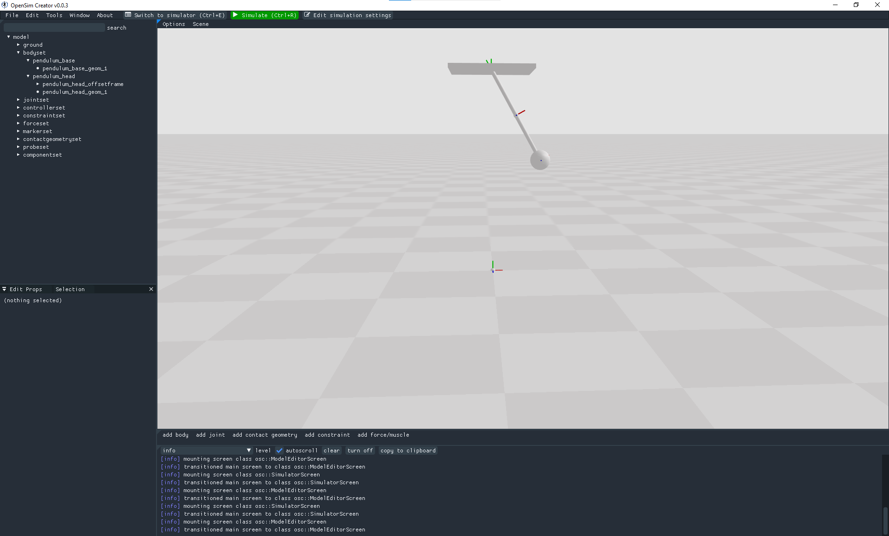
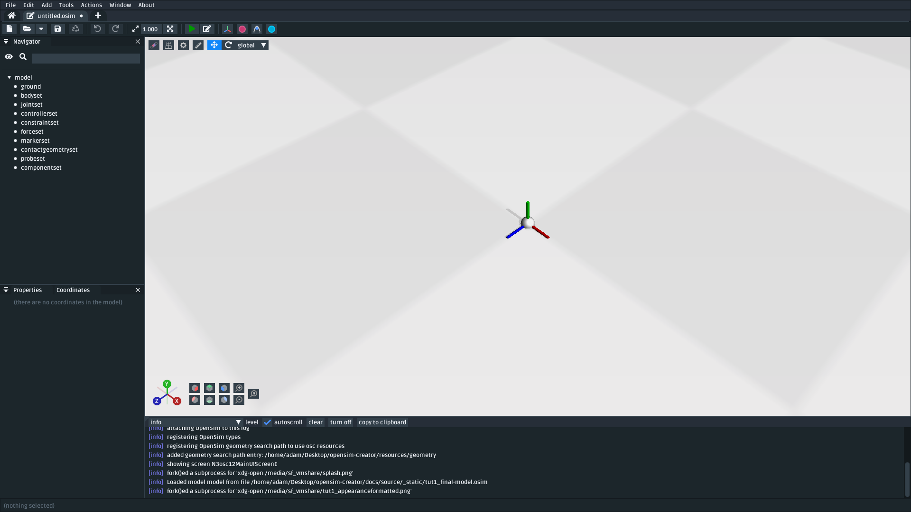
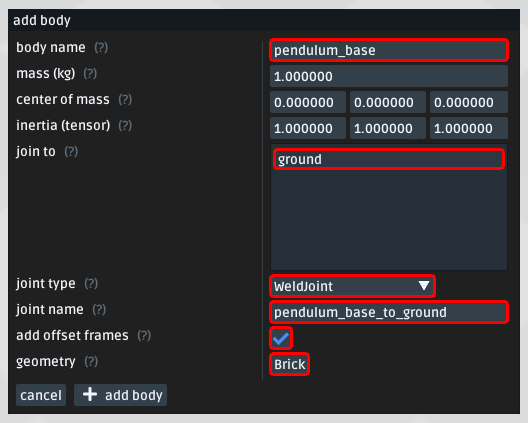
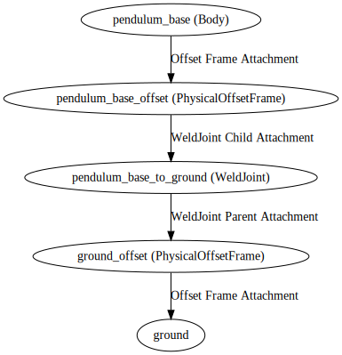
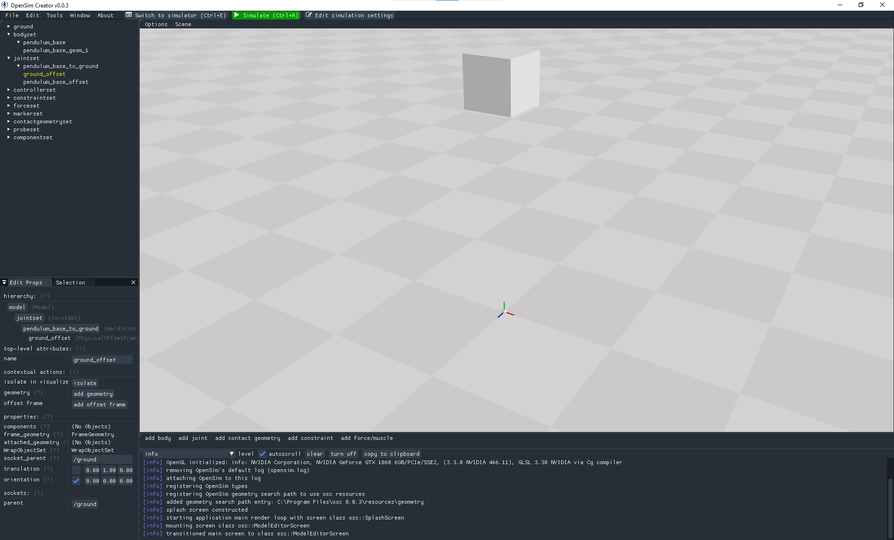
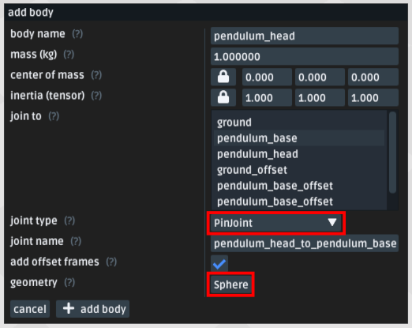
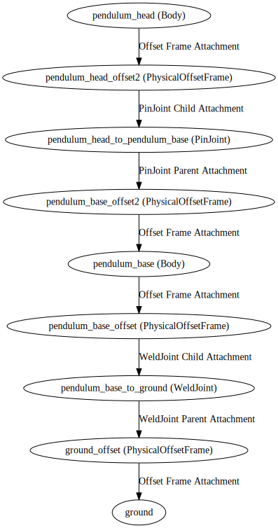
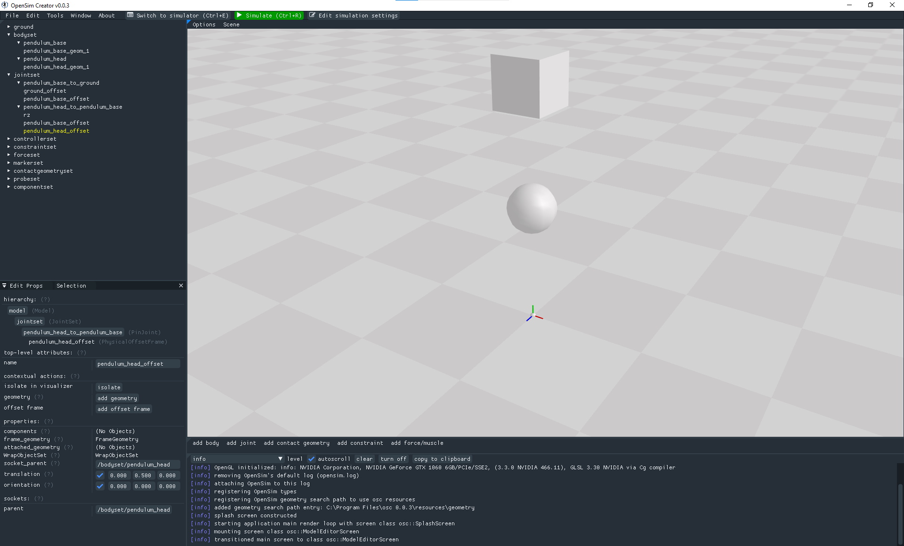
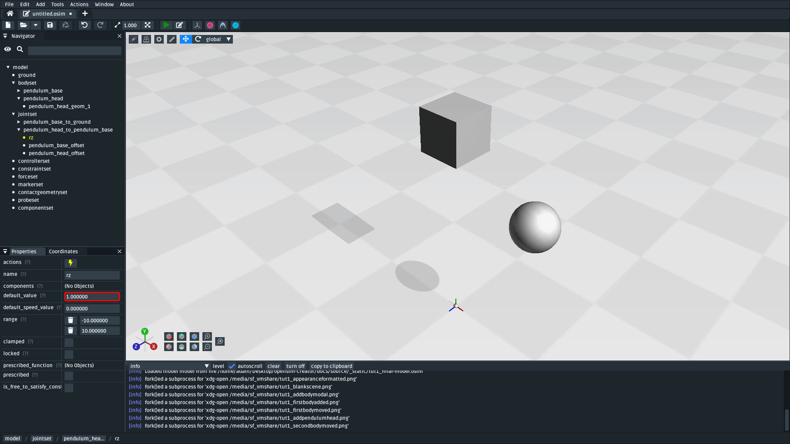
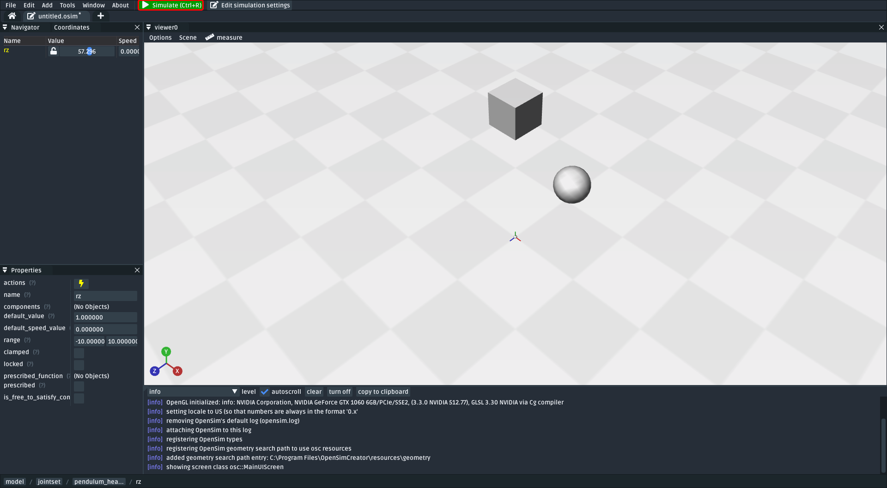

.. _tut1:

Make a Pendulum
===============

In this first tutorial, we will be making a conventional pendulum using OpenSim Creator:

    The pendulum created by this tutorial. Although OpenSim is commonly associated with biomechanical simulations, it can also be used to simulate "conventional" rigid-body models (:download:`download model <_static/tut1_final-model.osim>`).

OpenSim is based on `Simbody`_, a physics library for science- and engineering-quality simulations of articulated mechanisms. This means that OpenSim Creator can be used to simulate things like pendulums, robots, and biomechanical systems. This tutorial focuses on creating a pendulum--one of the simplest physical systems--because it introduces core concepts that are common to all kinds of models.

Prerequisites
-------------

This is a beginner-level introduction. The only thing you need to ensure is that you have followed the :ref:`gettingstarted` steps.

Topics Covered by this Tutorial
-------------------------------

* Creating a basic OpenSim model containing bodies, joints, and decorative geometry
* Coordinate systems in OpenSim
* OpenSim model topology
* (optional) Decorating the model to resemble what it's modelling

Create a New Model
------------------

In OpenSim Creator, create a new model. You can create a new model by clicking "New Model" in the home screen, or pressing ``Ctrl+N``. It should create a blank model that looks like this:

    A blank OpenSim model, with the ground frame shown in the middle. When shown, frames within a model are color-coded with red, green, and blue, which indicate :red:`X`, :green:`Y`, and :blue:`Z` respectively.

You should see a 3D viewer with a chequered floor and a set of axes in the middle. These axes are called **frames** in OpenSim. Frames express the position and orientation of something in the model. In this case, they are showing the position and orientation of the model's **ground**. The ground frame of a model is always located at ``(0, 0, 0)`` and is always aligned along the world's axes. This means that the red, green, and blue axes of the ground frame correspond to the :red:`+X`, :green:`+Y`, and :blue:`+Z` of the world.

.. note::

    OpenSim models are described using a **relative coordinate system**. This means that the position and orientation of each component (e.g. a body) in an OpenSim model is described relative to some other component in the model.

    This has practical implications. For example, setting a component's ``translation`` to +1 in X does not mean that the component will be positioned at ``(1, 0, 0)`` in the scene. The component may be positioned at ``parent.position + parent.orientation*(1, 0, 0)``, or at some other location, depending on what (and how) the component is attached to the other components in the model (the model's **topology**). This relative, topology-sensitive, approach is in contrast to artistic modelling software (e.g. `Blender <https://www.blender.org>`__), where scene elements are typically transformed independently and relative to the world.

    The only component that doesn't use relative coordinates is the **ground**. The ground is always the "root" of the model's connectivity graph and is always defined to be at, and aligned with, the origin of the world - ``(0, 0, 0)``. All other components within the model attach to ground directly or indirectly (i.e. via other components, such as joints).

Add a Body with a WeldJoint
---------------------------

In the UI, open the ``Add`` menu at the top, or right-click an empty part of the 3D scene and open the ``Add`` menu, followed by clicking the ``Body`` button.

A dialog should pop up that prompts you to fill in the body's details. Create a body with the following details:

.. note::
    To use the ``Brick`` analytic geometry, use the ``Generated Geometry`` dropdown when selecting the geometry. This is better than
    using a mesh file (e.g. ``brick.vtp``) because the resulting model will not be dependent on the existence of the mesh file.

    Body properties for ``pendulum_base``. **Note**: Make sure to use the same parameters, and to also attach a ``Brick`` generated geometry (highlighted).

After adding ``pendulum_base``, you should now see a cube in the 3D viewer. The cube is a decorative ``Brick`` geometry that you attached in the popup:

.. figure:: _static/tut1_firstbodyadded.png
    :width: 60%

    The scene after adding ``pendulum_base`` into the scene with a ``Brick`` as its attached geometry. Although OpenSim models bodies as points, many OpenSim models also attach 3D geometry to the bodies to make the model to make it easier to visualize (:download:`download model <_static/tut1_firstbodyadded.osim>`).

When we made ``pendulum_base``, we ticked the ``add offset frames`` checkbox. Adding a body like this added **four** components into the model:

- The body (``/bodyset/pendulum_base``)
- A ``WeldJoint`` (``/jointset/pendulum_base_to_ground``)
- An offset frame between the joint and the body (``/jointset/pendulum_base_to_ground/pendulum_base_offset``)
- An offset frame between the joint and ground (``/jointset/pendulum_base_to_ground/ground_offset``)

The body was added because we asked for it. The offset frames were added because they enable (effectively) moving the joint center later (by changing the offsets). However, why do we need a joint in the first place?

The reason we add joints is because bodies must be connected in a **model topology** to each other. That topology must ultimately connect to **ground**. This is because building an OpenSim model ultimately involves building a `Kinematic Chain`_ that the simulator (`Simbody`_) understands.

    The logical topology of the model after adding ``pendulum_base`` into the scene. This topology dictates the relative coordinates and physical dynamics of those elements in the model. Here, ``pendulum_base`` is attached to ``ground`` via a ``WeldJoint``. A ``WeldJoint`` has no degrees of freedom, so ``pendulum_base`` is effectively "anchored" in the scene.

.. note::

    OpenSim models are **stored** in a **hierarchy**. At the top of the hierarchy is the model, which contains child components (e.g. things like **bodies** and **joints**). Those components, in turn, may other child components--e.g. things like **offset frames** and **decorative geometry**.

    Clicking something in OpenSim Creator typically selects the component you clicked on, so clicking the ``Brick`` in the 3D scene will select the ``Brick`` geometry that's a child of the ``pendulum_base`` offset frame. You can use the navigator panel, or the component path in the status bar at the bottom of the UI, to see where the selected component is in the model's hierarchy.

    Components in an OpenSim model can also use **sockets** to form a **graph-like** connection to some other component. This enables components (which are **stored** hierarchically) to connect to each other in a non-hierarchical manner.

    For example, bodies and joints are direct children of a model--they are, *hierarchically speaking*, siblings--but joints use sockets (``parent_frame`` and ``child_frame``) to connect to two frames/bodies and establish a **joint topology graph** (or **kinematic chain**).

    When these tutorials write about the **topology** (or **kinematics**) of the model, they're usually referring to how the various bodies, joints, and frames *physically* affect each other. That topology is usually dictated by the socket connectivity graph. By contrast, the model hierarchy, as shown in OpenSim Creator's navigator panel, shows you the hierarchical **storage** of the model. Storage affects things like where the component's data is ultimately saved in the resulting ``.osim`` model file.

Reposition the Body
-------------------

A ``WeldJoint`` mandates that the two frames it's joining must be constrained to the same location and orientation. If that's the case, how do we move ``pendulum_base``?

This is where the offset frames we added (``ground_offset`` and ``pendulum_base_offset``) come in handy. The ``WeldJoint`` (``pendulum_base_to_ground``) is attached to those offset frames, rather than being directly attached to ``pendulum_base`` or ``ground``. So although the ``WeldJoint`` will weld the *offset frames* together, each offset frame can independently be offset (orientation + translation) with respect to what *they* are attached to. This enables us to move things around by changing the offsets.

To reposition ``pendulum_base`` in the scene, we can change an offset frame's ``translate`` property. Changing the ``ground_offset`` has the effect of offsetting the joint center from ground. Changing ``pendulum_base_offset`` has the effect of offsetting the joint center from ``pendulum_base``.

To move ``pendulum_base`` away from the ground, take the following steps:

* Find ``jointset`` in the navigator panel and expand it
* Find the ``WeldJoint`` (``pendulum_base_to_ground``) in the ``jointset`` and expand it
* Find ``ground_offset`` and click it
* Use the properties panel, or the 3D dragging gizmo, to change ``ground_offset``'s ``translation`` property to ``(0.00, 1.00, 0.00)``

This will move the ``ground_offset`` frame +1 in Y (in ``ground``'s reference frame). Because ``ground``'s reference frame is the same as the world's Y, it will move ``ground_offset`` vertically upwards. This has the effect of *also* moving ``pendulum_base`` upwards because it's attached to ``ground_offset`` via the joint:

    Edit ``ground_offset``'s ``translation`` Y value to move the ``pendulum_base`` away from ground in the scene. Changing it also changed where ``pendulum_base`` is in the scene because of the topographical relationship between ``pendulum_base`` and ``ground_offset`` (:download:`download model <_static/tut1_firstbodymoved.osim>`).

.. note::

    Although this is only a small part of the model-building process, this first step covers *a lot* of core OpenSim topics such as adding bodies, selecting joints, attaching frames to each other, and understanding the relative coordinate system.

    Try to get familiar with these basics. You will encounter them frequently when using OpenSim. Experiment by changing the translation of the other offset frame (``base_offset``), use negative translations, attach different geometry, or change the geometry's appearance (for a ``Brick``, half widths can be changed to make it smaller/bigger).

Add the Pendulum Head
---------------------

In the previous step, we created ``pendulum_base``, which is a body that is "welded" into the scene at some vertical (Y) offset. The next step is to create a ``pendulum_head`` that is attached to ``pendulum_base`` with a ``PinJoint``. A ``PinJoint`` has one rotational degree of freedom along Z, which will enable the ``pendulum_head`` to swing relative to ``pendulum_base``.

In the UI, add another body. Create it with the following details:

    ``pendulum_head``'s' body properties. **Note**: Make sure ``join to`` is set to ``pendulum_base`` and to also attach a ``Sphere`` generated geometry so the body so that you can see it in the visualizer.

.. warning::
    This should add ``pendulum_head`` into the scene. **However** you may not be able to see it yet. This is because ``pendulum_head`` is initially at the exact same location as ``pendulum_base`` (it's attached to it) and its representation (a ``Sphere``) is smaller than ``pendulum_base``'s ``Brick``, so it's initially *inside* ``pendulum_base``.

Next, we need to move ``pendulum_head`` such that it is below ``pendulum_base`` in the scene. It's best to keep the model's topology in mind when doing this. After adding ``pendulum_head``, the new model graph looks something like this:

    Topology of the model after adding the ``pendulum_head`` body (and associated joint and offset frames).

The model's topology may look complicated but keep our main goal in mind: we want ``pendulum_head`` to be offset from the ``PinJoint`` that it will be swinging on. Therefore, we need to change the ``translation`` property of the ``pendulum_head_offset`` that the ``PinJoint`` (``pendulum_head_to_pendulum_base``) is attached to.

To change the offset between the pendulum head and the ``PinJoint`` it swings on:

* Find ``jointset`` in the Navigator panel and expand it
* Find ``pendulum_head_to_pendulum_base`` in the ``jointset`` and expand it
* Find ``pendulum_head_offset`` under that and click it
* Use the properties panel to change ``pendulum_head_offset``'s ``translation`` property to ``(0.0, 0.5, 0.0)``

After setting ``pendulum_head_offset``'s ``translation`` to ``(0.0, 0.5, 0.0)``, you should be able to see the pendulum head floating below the ``pendulum_base``:

    How the scene should look after adding ``pendulum_head`` (a ``Body``) and setting ``pendulum_head_offset``'s ``translation`` property to ``(0.0, 0.5, 0.0)``. The sphere is the decoration for ``pendulum_head`` and the cube is the decoration for ``pendulum_base`` (:download:`download model <_static/tut1_secondbodymoved.osim>`).

.. note::

    We just set the ``translation`` property of ``pendulum_head_offset`` to +0.5 in Y, but it moved down, not up, in the scene. Why?

    It's because of how the **relative coordinate system** interplays with the topology of the model.

    Looking at the topology graph (above), you'll see that the ``PinJoint`` is attached to both the ``pendulum_head_offset``  and ``pendulum_base_offset`` frames. The ``PinJoint`` enforces that the two frames its attached to are constrained to the same location (the only degree of freedom a ``PinJoint`` has is its single rotational axis). By setting ``pendulum_head_offset``'s translation to ``(0.0, 0.5, 0.0)``, we are stipulating that ``pendulum_head_offset`` *must* be 0.5Y above ``pendulum_head`` (in ``pendulum_head``'s coordinate system). The only way to do this, while ensuring that ``pendulum_head_offset`` is still at the same location as the ``PinJoint``, is to put the ``pendulum_head`` 0.5Y below ``pendulum_head_offset`` in the scene.

    A rule of thumb for understanding how OpenSim resolves locations in the scene is to mentally traverse the topology graph. Start at the ground, which *must* be at ``(0.0, 0.0, 0.0)``, and work towards what you are working on (in this case, ``pendulum_head``). Each element you encounter (e.g. a body, a ``PinJoint``, or an offset frame) may additively enforce some kind of constraint or change in orientation. A "hacky" trick is just to play around with the offsets to get an idea of their overall effect on the model's layout.

Pre-Swing the Pendulum Head
---------------------------

Next, we are going to rotate the pendulum head along its swing direction slightly. At the moment, ``pendulum_head`` is directly below ``pendulum_base``. The only force acting on the scene is gravity, so the pendulum head won't move when we simulate it. You can see this problem for yourself by running a simulation. The scene should be motionless.

We can "pre-swing" ``pendulum_head`` a little by starting it off at an angle. The ``PinJoint`` we used to attach the pendulum head to the pendulum base (``pendulum_head_to_pendulum_base``) has a single degree of freedom, ``rz``, which is exposed as a **coordinate** that can be edited. When the ``PinJoint`` was added, ``rz`` was given a default value of ``0.0`` (no rotation). You can edit the ``default_value`` property of ``rz``  to rotate ``pendulum_head`` along the ``PinJoint``'s degree of freedom slightly.

To change the ``rx`` coordinate of ``pendulum_head_to_pendulum_base``:

* Find ``jointset`` in the Navigator panel and expand it
* Find ``pendulum_head_to_pendulum_base`` in the ``jointset`` and expand it
* Find ``rz`` and click it
* Use the properties panel to change ``rz``'s ``default_value`` property to ``1.0`` (radians)

After changing ``rz``, the pendulum head should be rotated slightly:

    The pendulum after modifying the ``PinJoint``'s ``rz`` ``default_value``. By modifying the coordinate value, we are changing the angle between ``pendulum_base_offset`` and ``pendulum_head_offset`` (the parent + child of the ``PinJoint``). Because ``pendulum_head`` is attached to ``pendulum_head_offset``, this has the overall effect of moving the ``pendulum_head`` (:download:`download model <_static/tut1_pendulumheadjointrxchanged.osim>`).

Simulate the Model
------------------

    Pressing the green ``Simulate`` button (or ``Ctrl+R``) will start a forward-dynamic simulation of your model.

OpenSim Creator contains buttons to start a forward-dynamic (FD) simulation. An FD simulation will simulate your model's traversal through time by integrating things like forces, velocities, and positions over time.

If you simulate your pendulum model at this point (e.g. by pressing the green button, or ``Ctrl+R``), you should see that ``pendulum_head`` swings like a pendulum 😊, which means you've succeeded!

.. note::

    Hooray 🎉, we have created a functioning pendulum by adding two bodies and two joints into a model.

    Think about that for a second: at no point in this tutorial did we add anything pendulum-specific into the model (e.g. the pendulum equation). Instead, we created a physical system that has the same **topology** and **constraints** as a pendulum and simulated that system. The simulation then produced the same *behavior* as an ideal pendulum.

    This approach can be *extremely* useful. It lets us design physical systems on a computer from basic building blocks, followed by simulating those systems to yield physically-representative data. That data can then be compared to scientific predictions, or experimental measurements, to provide a deeper insight.

    Although a pendulum may not be all that impressive, the principles shown here scale more easily to complex systems. Maybe the pendulum equation is simple, but what about a double pendulum, or (dare we suggest) a triple pendulum? What if we attach the pendulums to each other with springs, or muscles? What about a human leg containing many bodies, muscles, and joints that are attached to each other?

(optional) Make the Pendulum Look Nicer
---------------------------------------

Although we have *logically* modelled a pendulum that meets our requirements (i.e. a mass joined at some distance to a pivot point), our model certainly doesn't *look* like a pendulum. Lets fix that.

First, we can make the base into a thinner ceiling-like brick by changing the ``Brick``'s ``half_lengths`` property:

* Click the ``pendulum_base``'s cube in the visualizer, or browse to ``pendulum_base_geom_1`` in the navigator panel
* Use the properties panel to change ``pendulum_base_geom_1``'s ``half_lengths`` property to something like ``(0.2, 0.01, 0.2)``. This property only represents the *appearance* of the model, not the *behavior*.

Next, we can make the pendulum head a little smaller by changing the ``Sphere``'s ``radius`` property:

* Click the ``pendulum_head``'s sphere in the visualizer, or browse to ``pendulum_head_geom_1`` in the navigator panel
* Use the properties panel to change ``pendulum_head_geom_1``'s ``radius`` property to something like ``0.05``

Finally--and this is the hardest part--we need to add a ``Cylinder`` between the ``pendulum_head`` and the ``PinJoint``. The cylinder will act as the pendulum's neck. The easiest way to do this is to add an offset frame between the base and the head (i.e. 0.25Y above ``pendulum_head``) and attach a ``Cylinder`` decoration to that frame. To do this:

* Select ``pendulum_head`` in the navigator panel (under ``bodyset``)
* Open ``pendulum_head``'s context menu by either:

  * Right-clicking it in the navigator panel
  * Clicking the lightning ("actions") icon

* Open the ``Add`` menu and click ``OffsetFrame``
* This should create and select ``pendulum_head_offsetframe``
* Use the properties panel to set ``pendulum_head_offsetframe``'s ``translation`` property to ``(0.0, 0.25, 0.0)``. This moves ``pendulum_head_offsetframe`` between the base and the head.
* Open ``pendulum_head_offsetframe``'s context menu by either:

  * Right-clicking it in the navigator panel
  * Clicking the lightning ("actions") icon

* Open the ``Add`` menu and click ``Geometry`` to add a ``Cylinder`` to ``pendulum_head_offsetframe`` (``pendulum_head_offsetframe_geom_1``).
* Click the cylinder in the visualizer, or find ``pendulum_head_offsetframe_geom_1`` in the navigator panel
* Use the properties panel to set ``pendulum_head_offsetframe_geom_1``'s ``radius`` property to ``0.01`` and its ``half_height`` property to ``0.25``

Once you've done that, you should end up with a more convincing-looking pendulum:

    Final pendulum model after updating the appearance (:download:`download model <_static/tut1_final-model.osim>`).

(Optional) Extra Exercises
--------------------------

* **Make a double pendulum**. Using similar steps to the ones above, create a second pendulum head that attaches to ``pendulum_head`` rather than ``pendulum_base``. This will create a double pendulum. An alternative solution to this exercise is covered in :ref:`tut3`.

* **Open the pendulum in the official OpenSim GUI**. Save your pendulum to an ``.osim`` file and open it in the official `OpenSim GUI`_. This will give you the chance to view your model in other software, which might give you extra modelling options (e.g. different plotting tools, more functionality).

Next Steps
----------

Although the model created here is simple, this tutorial had to  introduce quite a few OpenSim concepts that you will repeatably encounter. Concepts like **bodies**, **joints**, **constraints**, and the **relative coordinate system**.

The next tutorial will reinforce these concepts by creating a more complex (but not quite biomechanical, yet 😉) model using these concepts, while introducing new things like collision detection and data extraction.

.. _OpenSim GUI: https://github.com/opensim-org/opensim-gui
.. _Simbody: https://github.com/simbody/simbody
.. _Kinematic Chain: https://en.wikipedia.org/wiki/Kinematic_chain
