.. _tut2:

Tutorial 2: Make a Bouncing Block
=================================

In this tutorial, we will be making a bouncing block using OpenSim Creator:

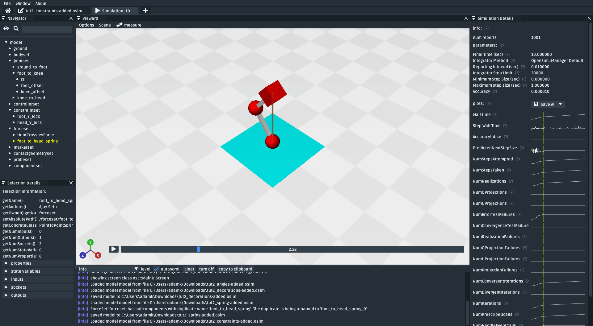

    The final model made in this tutorial. It is a three-body system with a spring attached between the head to the foot. Contact geometries are used to make the model bounce on the floor, and constraints are used to prevent it from rolling around (:download:`download model <_static/tut2_constraints-added.osim>`).

In :ref:`tut1`, we created one of the most basic physical systems that can be modelled. This tutorial reinforces those concepts by building a slightly more complex model that requires the use of **collisions**, **forces**, and **constraints**. This tutorial builds the model *incrementally* (i.e. from the ground up), so that we can explore each model-making decision one step at a time.

.. warning::

    This tutorial also assumes that you have already completed :ref:`tut1`. The content here will skip over some of the steps that were introduced in that tutorial. If you feel lost at any point, there should be partial solutions available along the way. Keep an eye out for the *download model* links.

Step 1: Create the Foot
-----------------------

Because of how OpenSim computes a model's spatial layout, the most straightforward way to develop a new OpenSim model is to start at whichever body will be directly attached to ground (e.g. ``foot``) followed by adding bodies that are, in turn, attached to that (e.g. ``knee``). Starting from the "middle" (e.g. ``knee``), or a "leaf", of a model's topography graph is more challening because the position and orientation of those entities may change when they are attached to bodies that are (topographically) closer to ground.

.. note::

    The body that is attached to ground does **not** need to be the closest body in the model. It just needs to be whichever body you think should be positioned relative to ground. In this tutorial, we are starting at the ``foot``, which happens to also be the body that's closest to the ground. However, OpenSim Creator's example models contain ``bouncing_block.osim``, which is similar to the model we will build here, but built from the ``head`` towards the ``foot``.

    The main benefit of building this model from the ``foot`` is that we can experiment with collisions earlier in this tutorial. If we built the model from the ``head``, we would have to wait until the ``knee``, ``foot``, and ``foot_collision`` were added to the model before we could experiment with collisions.

The first thing we need to add to our model is the ``foot`` body. As explained in the previous tutorial, all bodies (which are frames) need to be attached to other frames in the model and, ultimately, attached to ground. In our model, the ``foot`` will be an (initially) freely-moving element in the scene, so we will directly attach it to the ground with a ``FreeJoint``.

Using similar steps to the previous tutorial:

* Add a body called ``foot`` into the model. It should have a mass of ``1 kg`` (the default) and be joined to ``ground`` with a ``FreeJoint`` called ``foot_to_ground``. Attach a ``Sphere`` geometry to it.
* Click the sphere and change its ``Appearance`` to a red color.

You can then raise ``foot`` above the ground slightly by altering the ``foot_to_ground`` joint's ``ty`` coordinate:

* Select the ``foot_to_ground`` joint
* Select the ``ty`` coordinate
* Change ``ty``'s ``default_value`` from ``0.0`` to ``0.5``

This should produce a model with a red sphere (``foot``) that is raised above the ground:

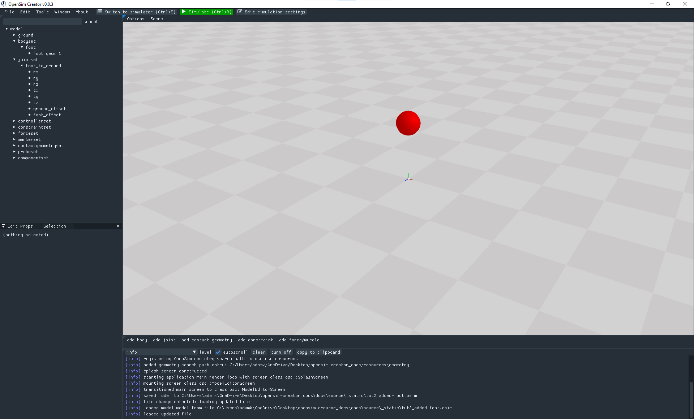

    The model after adding the ``foot`` body and changing ``foot_to_ground``'s ``ty`` to ``0.5`` (:download:`download model <_static/tut2_added-foot.osim>`)

.. note::

    Why do we change the ``ty`` coordinate, rather than changing (e.g.) the ``translation`` property of ``foot_offset``?

    In :ref:`tut1` we moved bodies around by altering the ``translation`` property of offset frames. Here, we are changing the ``ty`` coordinate. This exploits the fact that ``FreeJoint`` s have translation coordinates. Both of these approaches for moving bodies around in the model have equivalent side-effects. However, coordinates can *also* be freely edited in the official OpenSim GUI via the ``coordinates`` panel. This enables users to (e.g.) later change ``ty`` to make the model start higher off the ground.

Step 2: Add Contact Surfaces & Forces
-------------------------------------

If you simulate the model at this point, ``foot`` will just fall through the floor. The reason this happens is because the chequered floor is decorative, the ``foot`` body we have added is effectively a 0D point in space, and the sphere is decorative. We need to explicitly add ``ContactGeometry`` into the model at locations where we *logically* expect collisions to take place. In this case, we will add ``ContactGeometry`` at the same location as the decorations.

To attach a collideable floor (a ``ContactHalfSpace``) to the ground of the model:

* Click the ``add contact geometry`` button, then ``ContactHalfSpace``
* Give the ``ContactHalfSpace`` the following properties:

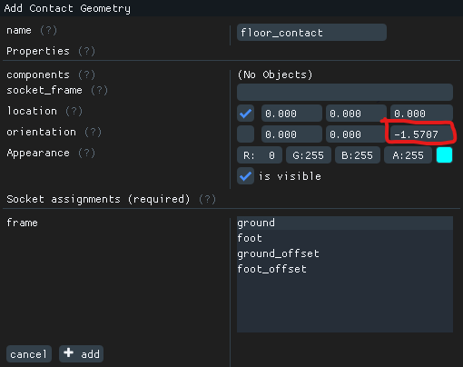

    Properties for the ``floor_contact`` component (a ``ContactHalfSpace``) attached to the ground. Careful that ``orientation`` is set to ``-1.5707`` in Z. ``+1.5707`` behaves differently, because a ``ContactHalfSpace`` only collides on one side.

To attach a collidable sphere (a ``ContactSphere``) to ``foot``:

* Click the ``add contact geometry`` button, then click ``ContactSphere``
* Give the ``ContactSphere`` the following properties:

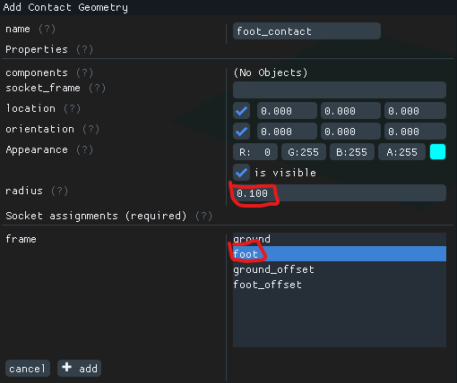

    Properties for the ``foot_contact`` component (a ``ContactSphere``). The ``radius`` is set to match the ``Sphere`` decoration used on the ``foot``. The ``ContactSphere`` is attached to ``foot`` so that collisions it encounters affect ``foot``. **Note**: You can edit the ``radius`` property of ``foot_contact`` if you can't see it in the scene. It may be hidden inside the ``foot`` sphere (they have the same radius).

With those two contact geometries added, the model now contains enough contact geometry to model the collisions we are interested in. However, if you try to simulate this model you will find that ``foot`` still just falls through the floor 😕. What's going on?

In OpenSim, contact geometries only express a geometry that *may* participate in contact (collision) detection. They do not express the *force* that is generated whenever contact occurs. We need to separately add a suitable contact force (in this case, a ``HuntCrossleyForce``) into the model. That force then handles what *physically* happens to the model (i.e. which *forces* are applied to model) whenever a collision occurs.

To add a contact force (``HuntCrossleyForce``) to the model:

* Click the ``add force/muscle`` button
* Click ``HuntCrossleyForce``
* Click ``add`` to add the force and close the popup
* Select the force
* In the properties editor, click ``add contact geometry`` and add ``floor_contact`` and ``foot_contact`` to the force

With the contact force added, a simulation of this model should show ``foot`` hit ``floor``, bounce a little, then stop. You can change the ``HuntCrossleyForce``'s properties to change how stiff the contact force is, how much energy is dissipated by the contact, etc.

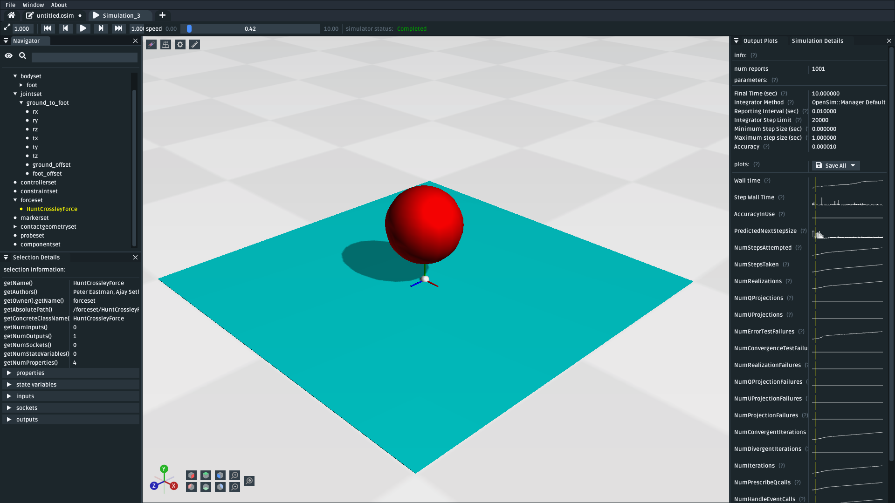

    The model after adding ``floor_contact``, ``foot_contact`` and a ``HuntCrossleyForce``. Simulating (``Ctrl+R``) the model should show the ``foot`` sphere fall through the scene until it collides with the surface. It should then bounce a little and stop (:download:`download model <_static/tut2_added-contact-stuff.osim>`).

Step 3: Attach the Knee & Head to the Foot
------------------------------------------

The next step is to add a "knee" and "head" to our ``foot``. This mostly involves the body-addition steps that were previously covered in more detail in :ref:`tut1`.

To add the ``knee`` to the model:

* Add a body called ``knee`` into the model. It should have a mass of ``1 kg`` and be joined to ``foot`` with a ``PinJoint`` called ``foot_to_knee``. Attach a sphere geometry to it.
* Change the ``foot_offset`` of the ``foot_to_knee`` joint from ``(0, 0, 0)`` to ``(0, 0.5, 0)``, so that the ``foot`` is offset from the origin of the ``foot_to_knee`` and ``knee`` is co-located with it (i.e. it swings at the knee).
* Make the sphere geometry red

To add the ``head`` to the model:

* Add a body called ``head`` into the model. It should have a mass of ``1 kg`` and be joined to ``knee`` with a ``PinJoint`` called ``knee_to_head``. Attach a ``Brick``. Attach a brick geometry to it.
* Change the ``knee_offset`` of the ``knee_to_head`` joint from ``(0, 0, 0)`` to ``(0, 0.5, 0)``, so that the ``knee`` is offset from the origin of ``knee_to_head`` and ``head`` is co-located with it (i.e. it swings at the head).
* Make the cube geometry red

These steps should create all the necessary bodies in the sytem, but it looks a little bit unusual (the "links" are missing):

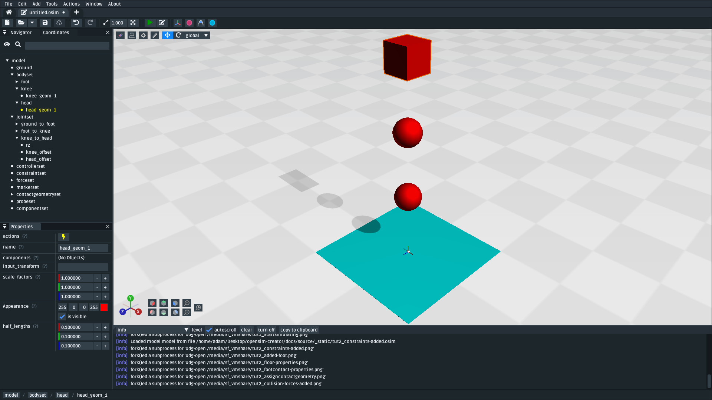

    The model after adding the ``knee`` and ``head`` bodies. The bodies are joined to eachover with ``PinJoint`` s that pivot on the knee and head respectively. The model looks unusual because there are no visual "links" between the bodies and because the model isn't angled yet (:download:`download model <_static/tut2_bodies-added.osim>`).

Much like at the end of :ref:`tut1`, we can make the model look better by adding extra geometry between the bodies by using offset frames.

To add a (decorative) link between ``foot`` and ``knee``:

* Select the ``foot`` body, add an offset frame to it with the ``add offset frame`` button
* Set the offset frame's ``translation`` property to ``(0.0, 0.25, 0.0)`` so that the offset frame sits between ``foot`` and ``knee``
* Attach a ``Brick`` geometry to the offset frame
* Change the ``Brick``'s ``half_widths`` property to something like ``(0.025, 0.25, 0.025)`` to create a thin "rod" between ``foot`` and ``knee``

To add a (decorative) link between ``knee`` and ``head``:

* Select ``knee``, add an offset frame to it with the ``add offset frame`` button
* Set the offset frame's ``translation`` property to ``(0.0, 0.25, 0.0)`` so that it sits between ``knee`` and ``head``
* Attach a ``Brick`` geometry to the offset frame
* Change the ``Brick``'s ``half_widths`` property to something like ``(0.025, 0.25, 0.025)`` to create a thin "rod" between ``knee`` and ``head``

These steps *decorative* features to the model that make it easier to see what's going on. You should have something that looks like this:

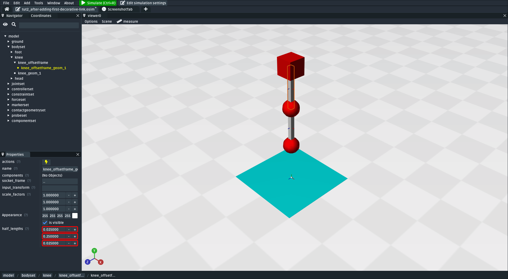

    The model after adding decorative bricks between the ``foot`` and the ``knee`` and between the ``knee`` and the ``head`` (:download:`download model <_static/tut2_decorations-added.osim>`).

If you try simulating this model now, you will find that it falls vertically and remains mostly motionless. The reason why that happens is because all of the bodies in the model (``foot``, ``knee``, and ``head``) are perfectly aligned along Y. To make the model more interesting, we are going to angle the whole model and also change the initial joint angle of ``foot_to_knee`` to give the knee a "kink".

To angle the whole model:

* Select the ``rz`` coordinate in the ``ground_to_foot`` ``FreeJoint``. Change the coordinate's ``default_value`` property to ``0.698``. 
* This will have the effect of rotating the entire model around the Z axis.

To add a "kink" to the knee:

* Select the ``rz`` coordinate in the ``foot_to_knee`` ``PinJoint``. Change the coordinate's ``default_value`` property to ``-1.396``.
* This will have the effect of angling the knee slightly

These steps should put the model into a more interesting arrangement:

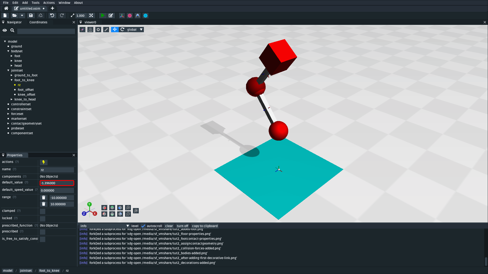

    The model after altering the ``ground_to_foot``'s and ``foot_to_knee``'s ``rz`` values. Altering those values angles the model slightly (:download:`download model <_static/tut2_angles-added.osim>`).

Step 4: Add a Spring between ``foot`` and ``head``
--------------------------------------------------

We now have the bodies and joints that make up the model. However, the only forces acting on the model are gravity and the collision force. If you simulate the model, it won't be very impressive. The model will fall a little, then ``foot`` will collide with ``floor``, then the rest of the (non-colliding) model will roll around and clip through the floor.

The reason this model is unexciting is because there are no forces between the model's bodies. We have attached three bodies (``foot``, ``knee``, and ``head``) with two ``PinJoint`` s and let them drop through space. The only forces acting on the model are external (i.e. gravity), so the model is acting like a passive swing and rolling along its joints.

We can add **forces** to the model to make it more interesting. This step will add a ``PointToPointSpring`` between ``foot`` and ``head`` to make the model's head "bounce" away from the foot whenever the model hits the floor.

To add a ``PointToPointSpring`` between ``foot`` and ``head``:

* Click the ``add force/muscle`` button
* Click ``PointToPointSpring``
* Give the spring the following properties:

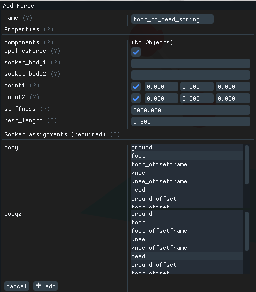

    Properties for a ``PointToPointSpring`` between the ``foot`` and the ``head`` in the model. The spring's ``stiffness`` and ``rest_length`` properties are chosen to try and make the model equilibriate towards the ``foot`` being separated from the ``head`` slightly (after a few bounces).

If you simulate the model after adding the spring, you should see that the model hits the floor, collides, bounces a little bit, and then starts to roll:

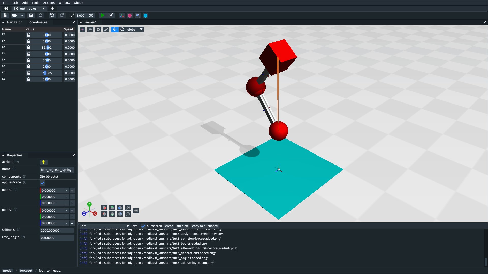

    The model after adding a ``PointToPointSpring`` between the ``foot`` and the ``head``. The spring prevents the ``head`` from clipping through the ``foot`` and makes the simulation more interesting-looking. However, when simulating, the model bounces around a little bit and begins to roll around. This is because the model isn't constrained along the vertical axis. Because the model's center of mass isn't perfectly balanced, it will roll around (:download:`download model <_static/tut2_spring-added.osim>`).

Step 5: Constrain ``foot`` and ``head`` to stay along Y
-------------------------------------------------------

The model is now *logically* complete--in the sense that it contains all of the mechanical components we want--but it isn't particularly *stable*. If you simulate the model, you will find that it bounces a little bit and then starts to roll around on its foot, rather than continuing to bounce up and down. 

The reason this happens is because the model isn't perfectly balanced. It is slightly heavier on one side, which causes the whole model to start leaning and, ultimately, roll around. One way to prevent this from happening is to add **constraints** into the model that prevent it from rolling.

One way to think of constraints is as extra "rules" the model must obey. When the model is assembled and simulated, the simulator has to ensure that each state of the model obeys the model's constraints. A common use-case for constraints is to constrain a degree of freedom in the model to simplify the model in some way.

OpenSim has support for a few different constraints, such as:

* Enforcing a constant distance between two frames in the model (``ConstantDistanceConstraint``)
* Enforcing that a frame "follows along" some other frame. E.g. that the frame is only allowed to be some distance along the Y axis of some other frame (``PointOnLineConstraint``)
* Enforcing that two frames must be at the same location and orientation (``WeldConstraint``)

For our model, we want to enforce that the ``foot`` and ``head`` are constrained to always be along the ``Y`` axis (i.e. ``X = 0 && Z = 0``). This enforces that both ``foot`` and ``head`` fall and bounce vertically, which means that the ``foot_to_head_spring`` is always bounced straight-on.

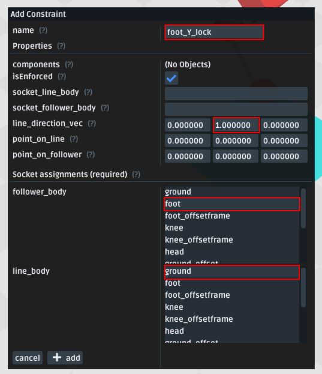

    Properties for ``foot_Y_lock``. This constraint prevents the foot from being able to roll along the floor to a different X/Z coordinate in the scene by enforcing ``foot`` to *follow* the ``(0.0, 1.0, 0.0)`` line from ``ground``.

After adding that constraint, you should find that ``foot`` no longer rolls around, but ``head`` still freely swings around as much as it can. To fix ``head``, we also constrain it along the Y axis:

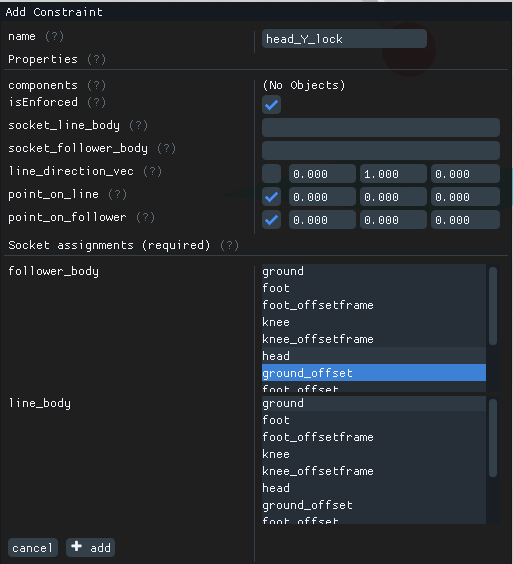

    Properties for ``head_Y_lock``. This constraint prevents ``head`` from being able to swing around the ``foot`` wildly, which ensures that it always bounces towards ``foot`` straight-on.

With both of those constraints in place, the model now bounces up and down without rolling around. This is very useful for figuring out what tuning parameters (e.g. ``head`` weight, ``foot_to_head_spring`` stiffness) lead to an optimal bounce without having to *also* handle balancing.

    The final model after adding ``PointOnLineConstraint`` s that make the ``head`` and ``foot`` bodies stay along the Y axis, rather than having the freedom to roll around (:download:`download model <_static/tut2_constraints-added.osim>`).

.. note::

    Wait a second, did we just cheat? A "real" model wouldn't have these invisible constraints, right?

    Using constraints in this way is a design choice. It depends what you want out of your model.

    Take this model as an example. If your main objective is to figure out which angles, masses, and spring strains lead to a perfectly balanced model (e.g. because optimizing the model's *balance* is the thing you're interested in), then you probably don't want to use constraints: they're interrupting the main objective of the model.

    Conversely, if your main objective is to tune the spring and weights to get the vertical "bounce" you want, and you know that the model's balance isn't relevant (e.g. because other investigations or assumptions indicate it will not be relevant),  then you probably do want to use constraints: they will make it easier to focus on the main objective of the model.

    Choosing the right constraints is even more important with complex models. Sure, you *could* perfectly balance a perfectly-represented human on a perfectly-designed bicycle, and ensure that the various muscle controls etc. keep the bike balanced, but getting that right will *probably* take a very long time. For your particular research problem, you might be satisfied with a lower-resolution (e.g. 2D) representation of someone riding a bike. 

    The art of modelling is in figuring out which constraints and simplifications are suitable for your problem. There's a reason why physicists tend to model everything as a sphere - and usually get away with it 😉.

(Optional) Extra Exercises
--------------------------

Now that you have a working model, you can experiment a little bit by doing these extra exercises.

* **Experiment with the body masses and spring parameters**. What happens if ``head`` is heavier? How does the spring ``stiffness`` affect how the model bounces? Can the floor's contact forces be modified to reduce how much of the drop force is dissipated each bounce? Can you make it bounce for longer?

* **Try opening your model in the official OpenSim GUI**. Save your model to an ``.osim`` and open it in the official OpenSim GUI. This should let you edit coordinates, plot things, etc. The official GUI has features that OpenSim Creator does not have. The benefit of using open file types (here, ``.osim`` s) is that you can use multiple tools with the same file.

Next Steps
----------

This tutorial was similar to :ref:`tut1`, but it focused on introducing some of the more practical parts of designing a more complex model. Things like adding **collision geometry**, adding **forces**, and deciding on **constraints**. These are all important parts of the model-building process that come up repeatably when designing OpenSim models.

The next tutorial, :ref:`tut3`, is going to focus on **muscles**, which can be seen as a specialized forces (e.g. like the ``PointToPointSpring`` force we used here) that are typically used in biomechanical models.
