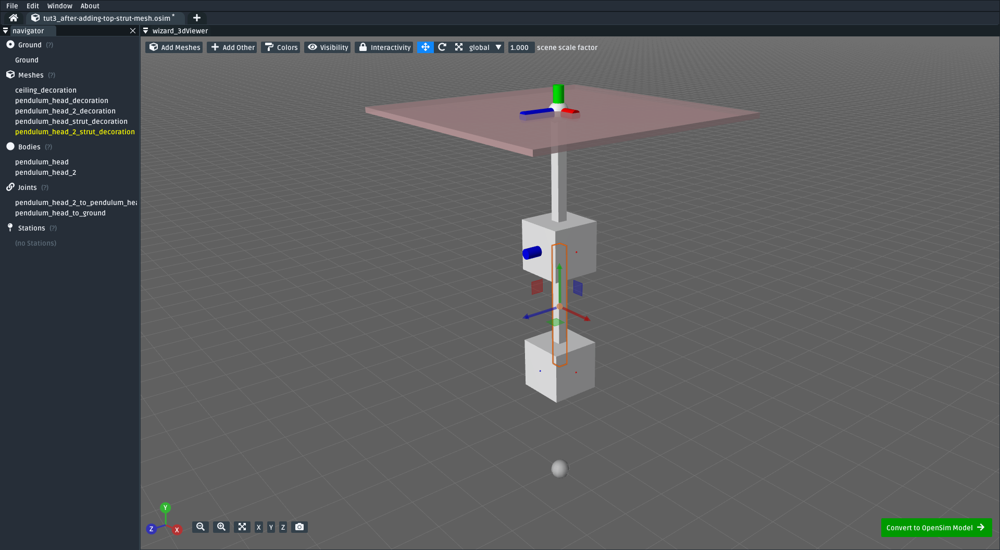
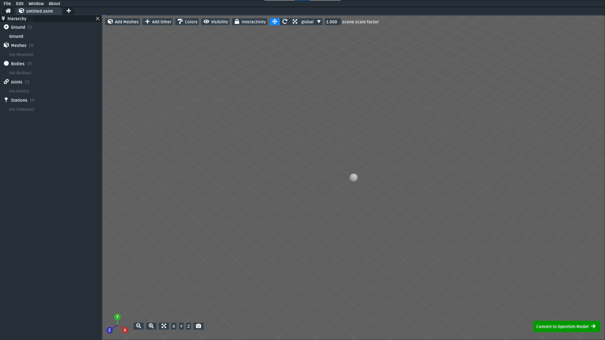
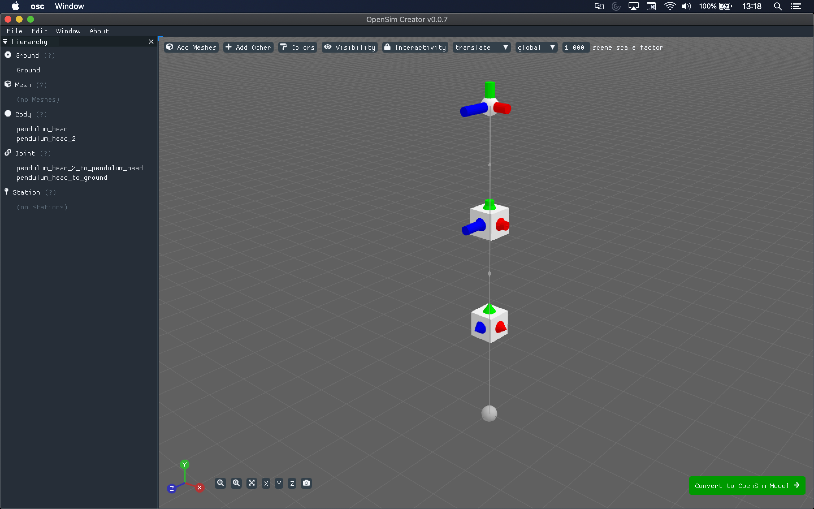
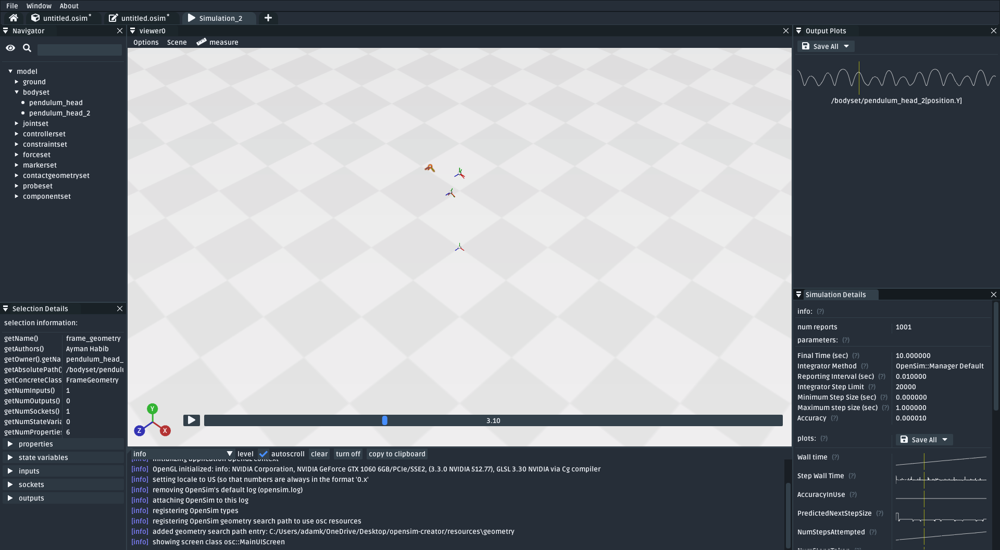
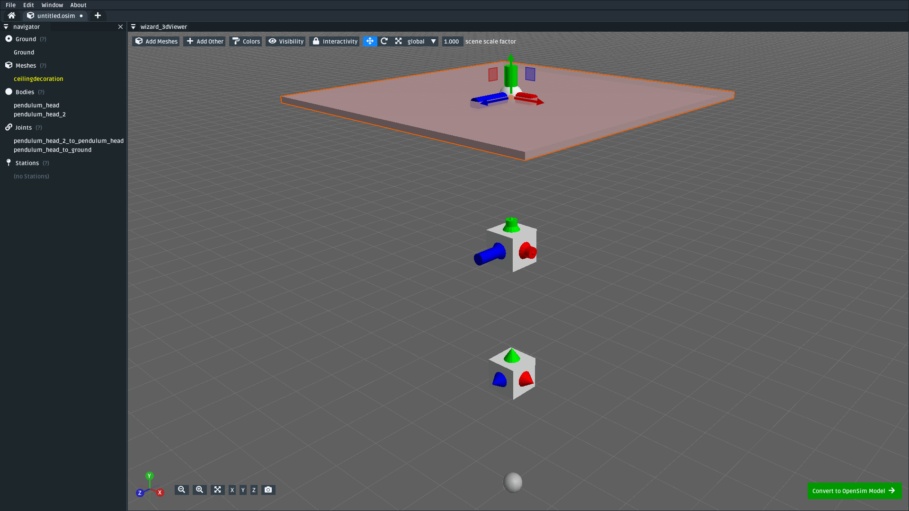
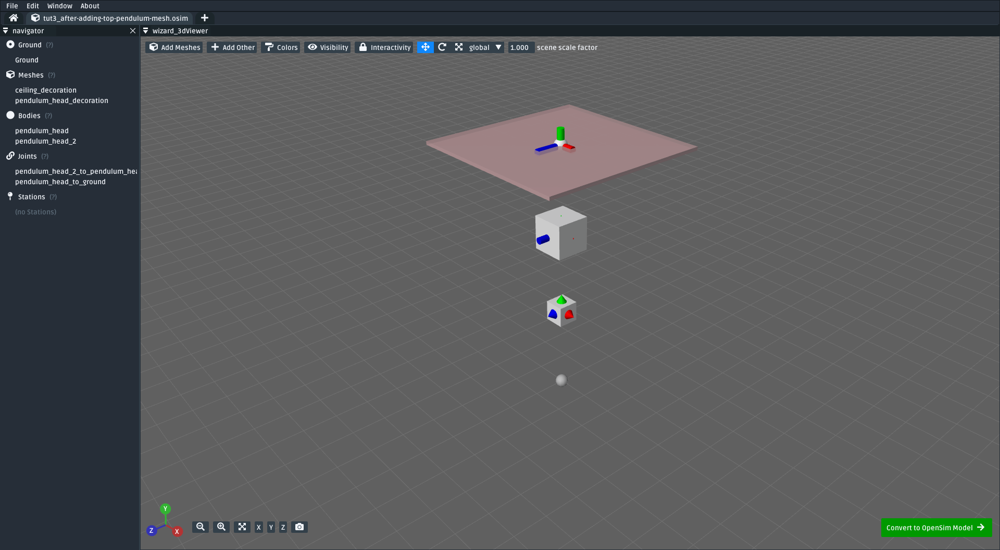
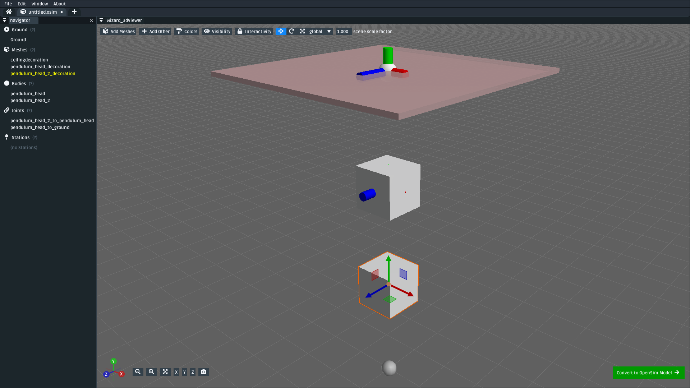
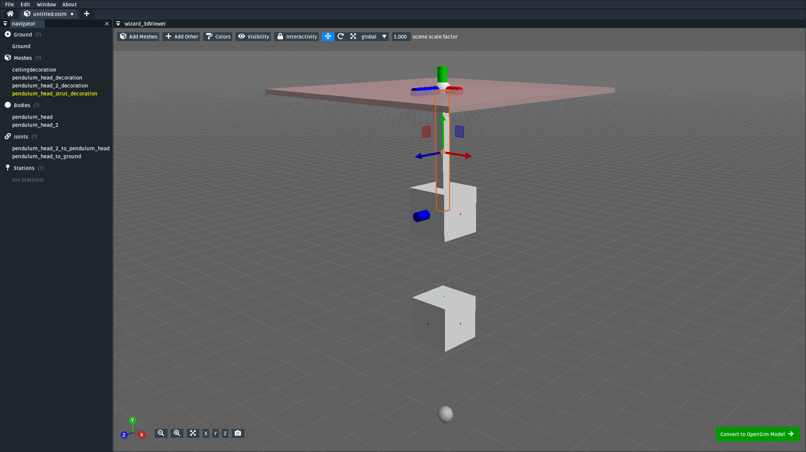
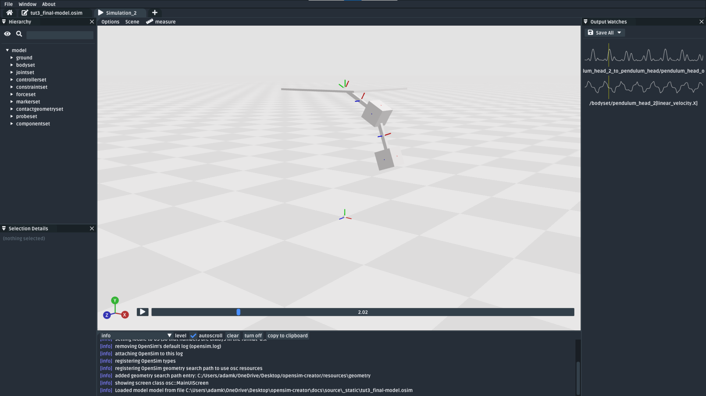

.. _tut3:

Use the Mesh Importer
=====================

In this tutorial, we will be using the mesh importer feature of OpenSim Creator to create a double pendulum:

    The final model made in this tutorial, as-seen in the mesh importer. It is a double pendulum made from two bodies and two pin joints, with decorative meshes used for the heads + struts. (:download:`📥 download model <_static/tut3_final-model.osim>`)

The mesh importer is "looser" than the main ``osim`` editor. This can make placing and orienting bodies/joints easier. However, its disadvantage is that it doesn't directly edit an ``osim`` file. Rather, it edits a simplified "model" that can be exported to the (more complex) ``osim`` format. For this reason, the mesh importer is recommended as a *first-step* utility that helps set up the top-level ``osim`` model in preparation for the ``osim`` editor to tackle the things like adding/editing forces, contact surfaces, etc.

Although the **model** we will make in this tutorial is effectively an extension of :ref:`tut1`, the **approach** used is different. Here, we will be using the mesh importer feature of OpenSim Creator to create the model, rather than building the model directly in the OpenSim model (``.osim``) editor.

This tutorial assumes the reader knows a little bit more about OpenSim, bodies, joints, etc. Because of that, each step here will require more--but hopefully, by now, familiar--actions. You're getting faster ⚡!

Topics Covered by this Tutorial
-------------------------------

* Using the mesh importer to create a basic OpenSim model
* UI features and shortcuts in the mesh importer
* Exporting + simulating the model created by the mesh importer

Open the Mesh Importer
----------------------

The mesh importer is a separate UI from the main ``osim`` editor. It creates/manipulates a free-form 3D scene that can be exported to an ``osim`` model. You can open the mesh importer from the home tab through either the main menu, the ``+`` button on the tab bar, or the green button in the center of the home tab:s

.. figure:: _static/tut3_open-meshimporter.png
    :width: 60%

    The mesh importer can be opened from the center of the home tab, the plus button, or the main menu.

One opened, you will be greeted with a new mesh importer scene, which will be used for the next few steps of this tutorial:

    The mesh importer, which initially loads with a blank scene that's ready for your masterpiece 🎨. The majority of this tutorial is carried out through the mesh importer.

Add Bodies & PinJoints
----------------------

.. note::

    In the mesh importer, bodies are added into the scene by either right-clicking somewhere in the 3D scene and clicking ``Add Other > Body`` or by using the dropdown button at the top of the scene: ``Add Other > Body``.

    Joints are added by right-clicking on a **body** in the scene and clicking ``Join to`` or ``Add > Joint``, followed by selecting what to join to. The body that was initially right-clicked will become the joint's child, the thing being joined to becomes the joint's parent.

    All scene elements in the mesh importer can be edited by right-clicking them. Feel free to experiment with the available menus/actions 👩‍🔬. Accidents can always be reversed with **undo** (``Ctrl+Z`` or ``Edit > Undo``).

To add the various bodies + joints into the model, you will need to complete the following sub-steps:

Create the body of the top pendulum
~~~~~~~~~~~~~~~~~~~~~~~~~~~~~~~~~~~

* Add a body into the scene. 
* Name it ``pendulum_head``.
* Translate it to where the top pendulum head should be (recommended: ``(0.0, 0.5, 0.0)``).

Create the body of the bottom pendulum
~~~~~~~~~~~~~~~~~~~~~~~~~~~~~~~~~~~~~~

* Add another body into the scene.
* Name it ``pendulum_head_2``.
* Translate it to where the bottom pendulum head should be (recommended: ``(0.0, 0.25, 0.0)``)

Join the two pendulums with a PinJoint
~~~~~~~~~~~~~~~~~~~~~~~~~~~~~~~~~~~~~~

* Right-click the bottom pendulum, click ``Join to``, followed by clicking the top pendulum to create a new joint between them.
* Name it ``pendulum_head_2_to_pendulum_head``.
* Translate it to the location of the top pendulum (i.e. the pivot point, either type in ``pendulum_head``'s translation, or use ``Translate > to parent``, to move it).
* Change its joint type to ``PinJoint`` through the right-click menu.

Join the top pendulum to ground with a PinJoint
~~~~~~~~~~~~~~~~~~~~~~~~~~~~~~~~~~~~~~~~~~~~~~~

* Right-click the top pendulum, click ``Join to``, followed by clicking ground to create a new joint between the top pendulum and ground.
* Name it ``pendulum_head_to_ground``
* Translate it to the location of the "ceiling" in this model, recommended: ``(0.0, 0.75, 0.0)``)
* Change its joint type to ``PinJoint`` through the right-click menu.

The above steps set up all the bodies + joints in the model. You should have something that looks like this:

    The pendulum model after its two bodies and two pin joints. (:download:`📥 download model <_static/tut3_after-adding-bodies-and-joints.osim>`)

Convert the scene to an osim (for testing)
~~~~~~~~~~~~~~~~~~~~~~~~~~~~~~~~~~~~~~~~~~

Next, you will temporarily convert the mesh importer scene into an OpenSim model (``osim``) so that you can test whether your model is correct. Conversion is a one-way process, but your progress in the mesh importer will be **not** be lost.

To convert the mesh importer scene into an ``osim`` (for testing), you will need to:

* **Convert your scene into an OpenSim model**. Click the ``Convert to OpenSim Model``. This will convert your scene to an ``osim`` and open it in an ``osim`` editor tab. You can then see how the free-form scene was converted into an OpenSim model.
* **Try simulating the todel**. Adjust the pin joint coordinates (``pendulum_head_to_ground_rz`` and ``pendulum_head_2_to_pendulum_head_rz``) to start the pendulum off at an angle. Start simulating the model (``Ctrl+R``) to see it swinging. Confirm that both bodies swing like a double pendulum. If they don't, close the simulation (and editor), then reopen the mesh importer tab and start fixing things 🔧.
* **Save the model as an .osim**. After conversion, you can then save your model to disk and use external tooling (e.g. XML editors, OpenSim GUI) to further modify it.

    Although the model hasn't been decorated yet, it can still be simulated and measured. The pendulum body frames should swing around like a pendulum (:download:`📥 download model <_static/tut3_after-adding-bodies-and-joints.osim>`)

Add Decorative Geometry
-----------------------

.. note::

    These next steps are performed in the mesh importer (converting to an osim was purely for testing). You can close the editor (& simulator) tabs and return to the mesh importer tab for these next steps.

Although the previous steps create a *functionally* complete model, the model doesn't look like a particularly convincing pendulum. These steps add decorative geometry to fix that.

The mesh importer has the ability to add **meshes** into the scene, freely move/rotate them, and attach them to bodies/ground. This is in contrast to :ref:`tut1` and :ref:`tut2`, where we had to manually place offset frames wherever we wanted decorations. Internally, the mesh importer is performing similar steps, but automates them.

To decorate the model, complete the following sub-steps:

Attach a cube mesh to ground (the ceiling)
~~~~~~~~~~~~~~~~~~~~~~~~~~~~~~~~~~~~~~~~~~

* Right-click in an empty space in the scene, use the ``Add Other > Meshes`` menu to open the mesh file import popup
* In the popup, browse to OpenSim Creator's install directory, which contains a ``resources/geometry`` subdirectory
* Select ``block.vtp`` from that directory. This is a pre-made block mesh file.
* Rename  the block mesh to ``ceiling_decoration``
* Move the mesh to the location of the highest pin joint (``pendulum_head_to_ground``)
* Rescale the mesh so that it's displayed as a thin "ceiling" cuboid the pendulum hangs from, rather than a cube. To do this, use scale property in the mesh's context menu (right-click it) **or** the scaling gizmo (press ``S`` or change the manipulation dropdown at the top of the screen from ``translate`` to ``scale``). Recommended scale factors: ``(5.0, 0.1, 5.0)``.

    Mesh importer scene after adding ``ceiling_decoration``. It is red-tinted because it is attached to ground, rather than to a body (:download:`📥 download model <_static/tut3_after-adding-ceiling-mesh.osim>`).

Attach a cube mesh to the top pendulum
~~~~~~~~~~~~~~~~~~~~~~~~~~~~~~~~~~~~~~

* Right-click the body of the top pendulum (``pendulum_head``) and use the ``Add > Meshes`` to open the mesh file import popup
* Select the same (as above) ``block.vtp`` mesh file
* Rename it to ``pendulum_head_decoration``
* Move (``G``), Rotate (``R``), or Scale (``S``) the mesh however you like (recommended: leave it as-is) by either using the in-UI draggable gizmos or typing values into the context menu.

    Mesh importer scene after adding ``pendulum_head_decoration`` to ``pendulum_head`` (:download:`📥 download model <_static/tut3_after-adding-top-pendulum-mesh.osim>`).

Attach a cube mesh to the bottom pendulum
~~~~~~~~~~~~~~~~~~~~~~~~~~~~~~~~~~~~~~~~~

* As above, but right-click the bottom pendulum body (``pendulum_head_2``) and name it ``pendulum_head_2_decoration``.

    Mesh importer scene after adding ``pendulum_head_2_decoration`` to ``pendulum_head_2`` (:download:`📥 download model <_static/tut3_after-adding-bottom-pendulum-mesh.osim>`).

Attach a cube mesh between the top pendulum and the ceiling (a strut)
~~~~~~~~~~~~~~~~~~~~~~~~~~~~~~~~~~~~~~~~~~~~~~~~~~~~~~~~~~~~~~~~~~~~~

* This step adds another ``block.vtp`` mesh into the scene. This one will act as a strut between the top pendulum and the ceiling.
* It will move whenever the pendulum moves, so it should also be attached to the highest pendulum body (``pendulum_head``).
* As in previous steps, you can attach it by right-clicking the pendulum body (``pendulum_head``)  followed by ``Add > Meshes``.
* However, the pendulum body might now be occluded by the cube you added in the previous step  (``pendulum_head_decoration``). To work around this, you can either:

  * Right-click ``pendulum_head`` in the navigator panel, which will show the same menu as right-clicking it in the 3D viewer.
  * Temporarily make meshes invisible (in the ``Visibility`` menu).
  * Temporarily exclude meshes from being clickable (in the ``Interactivity`` menu).
  * Combine approaches by changing the color of the meshes to be semi-transparent (see ``Colors`` menu) and disable their interactivity.
  * Initially import the mesh by attaching it to ground, move it into place, ``Reassign Connection`` to the ``pendulum_head`` body.
  * The "best" approach depends on what kind of model you are working on.

* Once the mesh is attached, move it between the ``pendulum_head`` and ``pendulum_head_to_ground`` (right-click, ``Translate > Between Two Scene Elements`` or set translation to ``(0.0, 0.625. 0.0)``.
* Rename it to ``pendulum_head_strut_decoration``
* Rescale (``S``) it to make a long, thin, pendulum strut (recommended: ``(0.2, 2.5, 0.2``)).

    Mesh importer scene after adding ``pendulum_head_strut_decoration`` between ``pendulum_head`` and ``pendulum_head_to_ground`` (:download:`📥 download model <_static/tut3_after-adding-top-strut-mesh.osim>`).

Attach a cube mesh between the bottom and top pendulums
~~~~~~~~~~~~~~~~~~~~~~~~~~~~~~~~~~~~~~~~~~~~~~~~~~~~~~~

* As above, but this strut will track along with the bottom pendulum (``pendulum_head_2``), so make sure the mesh is attached to that. Name it ``pendulum_head_2_strut_decoration``.
* This mesh needs to be between the bottom pendulum and the top pendulum.

This should result in a fully-decorated pendulum model:

    The model after decorating it with some cube meshes. Functionally, this model is the same as the undecorated one; however, it now looks *a lot* more like a pendulum 😎. (:download:`📥 download model <_static/tut3_final-model.osim>`)

Export and Simulate
-------------------

Now that we have created a fully modelled and decorated pendulum, we can export it to an ``osim`` and simulate it. To do that:

* **Convert the model to an osim**. Click the ``Convert to OpenSim Model`` button in the mesh importer.
* **Tilt a pendulum head slightly**. Use the ``coordinates`` panel to change one of the joint's rotational ``value``, so that the pendulum is tilted slightly.
* **Request a pendulum head's velocity is plotted**. Right-click a pendulum head in the 3D viewer, go to ``Watch Output > pendulum_head > linear velocity`` and click ``magnitude``.
* **Simulate the model**. Press ``Ctrl+R`` (run simulation) to start running a forward-dynamic simulation. This should show the pendulum swinging.
* **View outputs**. Ensure the ``Outputs`` panel is showing (``Window > Outputs`` should be enabled). The requested output (magnitude of ``linear velocity``) should show a basic data plot of a pendulum head's linear velocity.

    A basic forward-dynamic simulation of the model can be ran through the UI by tilting the pendulum slightly and running a simulation. Output plots can be used to get basic information out of the model. (:download:`📥 download model <_static/tut3_final-model.osim>`)

*Et voilà*, you have created a functioning OpenSim model by mostly using the free-form mesh importer and got some useful data out of it 🎉. You're getting good at this.

(Optional) Extra Exercises
--------------------------

Now that you have played with both the mesh importer and ``osim`` editor a little bit, here are some extra things you can explore:

* **Create more complex joint topologies**: Try a triple pendulum, attach the pendulum to ground with a ``SliderJoint``, rather than a ``PinJoint`` and watch it slide around. Look up some basic mechanical devices on Google and see if you can roughly get them simulating by placing a few joints + bodies in the mesh importer, followed by adding a few springs and contact surfaces in the ``osim`` editor (see :ref:`tut2`).

* **Try attaching more complex meshes**: Swinging cubes are cool, but swinging skulls are even cooler 💀. Instead of a cuboid strut, why not join the pendulum pieces together with a finger bone mesh. Think about how you can use these simple techniques to "leap" from building simple mechanisms (pendulums) to more complex ones (human biomechanics).

Next Steps
----------

This tutorial mostly focused on using the mesh importer to accelerate the earliest parts of the model building process. The benefit of knowing this approach in addition to the approaches covered in :ref:`tut1` and :ref:`tut2` is that it's easier to place/rotate bodies/joints in the mesh importer.

Now that we've introduced OpenSim Creator's general toolset (specifically, the mesh importer, ``osim`` editor, and simulator), we are going to start increasing the complexity of the models we work on. :ref:`tut4` focuses on using the techniques we've covered to build something more complex.
