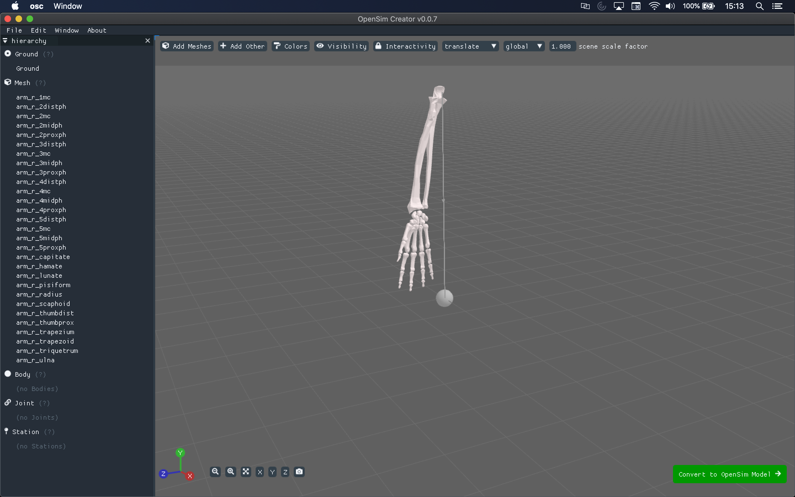
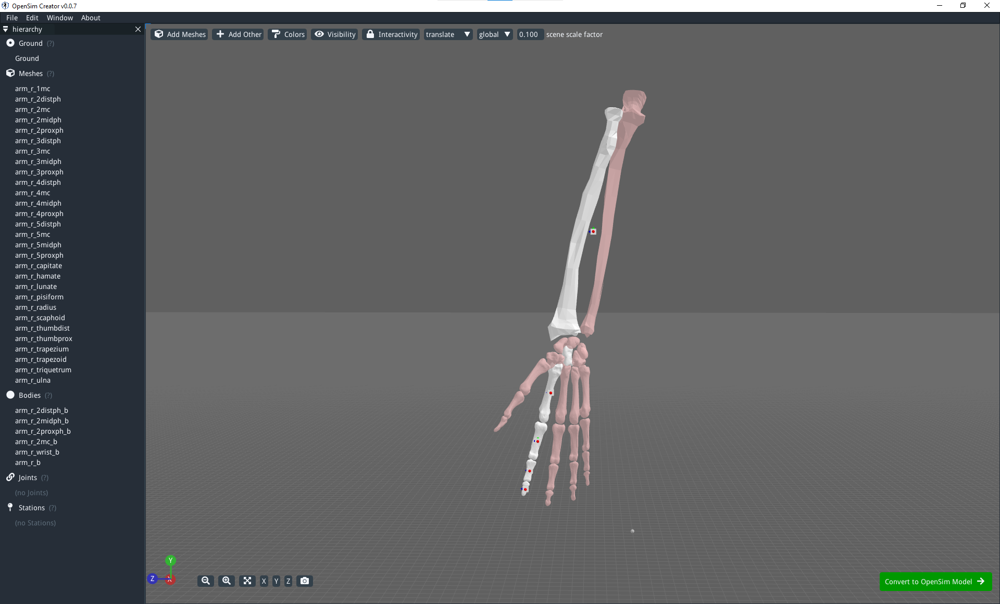
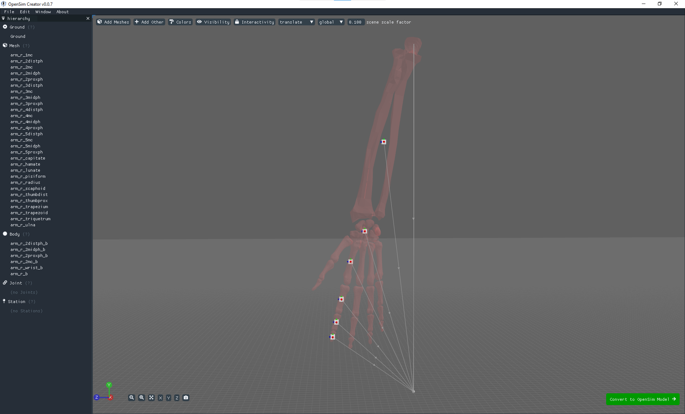
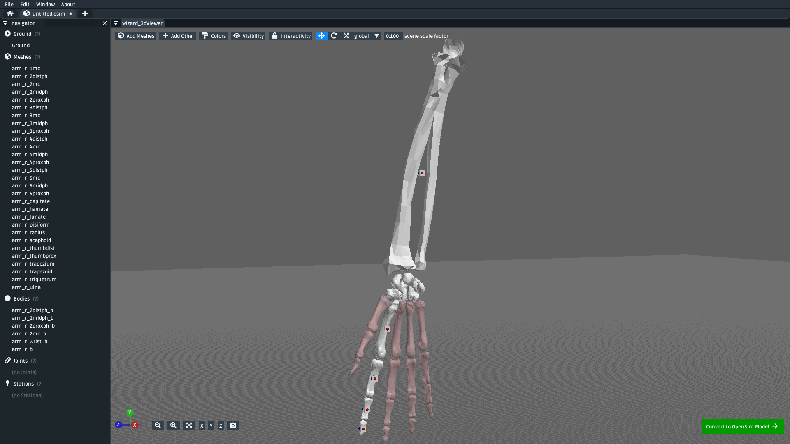
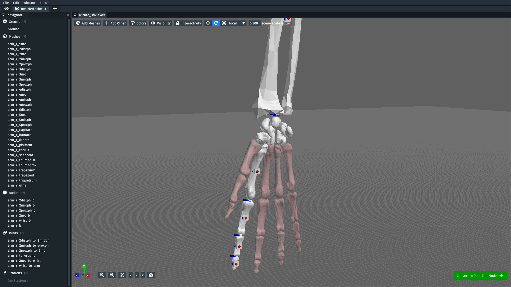
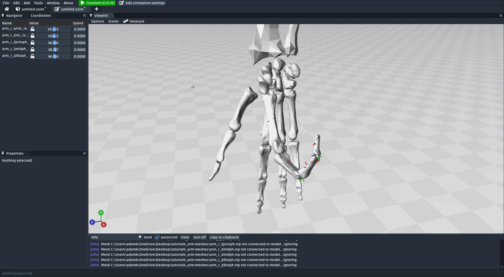

.. _tut4:

Tutorial 4: Make an Arm
=======================

In this tutorial, we will be using OpenSim Creator to create a basic human hand from some mesh files:

    TODO: correct screenshot and model + meshes. The model created from these :download:`📥 meshes <_static/tutorial4_arm-meshes.zip>`. TODO download model link etc.

This tutorial will use the **mesh importer** to import mesh files that represent an arm, followed by using the mesh importer to assign the meshes to custom-placed **bodies** and **joints**. Once they are placed, the tutorial then introduces using **stations** to mark "points of interest" that can be used in the ``osim`` editor to define **muscle paths**.

This is a harder tutorial that builds on top of several techniques that were demonstrated in previous tutorials:

* :ref:`tut1`: Adding components into an osim, editing component values
* :ref:`tut2`: Adding forces into a model, making refinements/simplications based on preliminary simulation results
* :ref:`tut3`: Importing meshes and placing bodies/joints with the mesh importer

Those techniques are used *ad nauseam* here. Therefore, it is strongly recommended that you consult those tutorials if you aren't sure what's going on here.

Topics Covered by this Tutorial
-------------------------------

- **Importing meshes** with the mesh importer.
- Using the mesh importer to **attach meshes to bodies** and **join bodies with joints**
- Using the mesh importer to mark points of interest in the model by **adding stations**
- Using the ``osim`` editor to add **muscle paths** to the model

Step 1: Import Meshes
---------------------

The first step is to get these  :download:`📥 meshes <_static/tutorial4_arm-meshes.zip>` into OpenSim Creator. The easiest way to do this is with the **mesh importer screen**, which was described in :ref:`tut3`. You need to:

* Open OpenSim Creator's mesh importer screen
* Import these :download:`📥 meshes <_static/tutorial4_arm-meshes.zip>` by either:

  * Using the `Meshes` button in the right-click menu
  * Dragging & dropping the mesh files into the mesh importer screen.
* Move all the meshes together such that they are above ground

This will give you a scene with the meshes in roughly the right place:

    The mesh importer screen after initially importing the :download:`📥 meshes <_static/tutorial4_arm-meshes.zip>` and moving them above ground.

Step 2: Add Bodies to the Meshes
--------------------------------

The next step is to place bodies in the model. As described previous tutorials, bodies are (effectively) points in space with a mass. In this step, we are going to add bodies where we think the main mass centers in the model should be (based on the meshes) and attach the meshes to the bodies. Attaching the meshes ensures that the mesh moves along with the body, rather than being immobilized in ground.

.. note::

    Change the mesh importer's ``scene scale factor`` to **0.1** for this, which is smaller than the default (1.0). The scale factor has no effect on the model, but makes it easier to place bodies/joints in smaller meshes.

To keep things short, we will initially only assign bodies to the model's index finger. To do that:

* For each of the four bone meshes in the index finger (``arm_r_2distph``, ``arm_r_2midph``, ``arm_r_2proxph``, and ``arm_r_2mc``):
  
  * Right-click the mesh then navigate to ``Add > Body`` and click ``At Bounds Center`` to add a mesh at the center of the mesh's bounds
  * Right-click the added body, rename it to the mesh name followed by ``_b`` (to indicate body). E.g. ``arm_r_2distph_b``

* As a simplification, only add one body to the mesh in the middle of the wrist. For example, add one to ``arm_r_capitate`` and call it ``arm_r_wrist`` (because it will act as a body for all wrist bones).
* As a simplification, only add one body to the arm and move it between the arm mesh bones. For example, add one to ``arm_r_radius`` and call it ``arm_r_b`` (because it will act as the body for both the ``radius`` and ``ulna``).

This will yield a model with all the meshes imported and **six** bodies added into the scene. In my case, the six bodies were called:

* ``arm_r_2disph_b``
* ``arm_r_2midph_b``
* ``arm_r_2proxph_b``
* ``arm_r_2mc_b``
* ``arm_r_wrist_b``
* ``arm_r_b``

The model should look something like this:

    The scene after assigning the first six bodies for the index finger up to the arm. Grey lines in the UI indicate the connectivity between the bodies. Because we haven't assigned joints (yet), all the bodies are connected to ground.

We also need to assign the appropriate meshes to each body. When we imported the meshes, they were imported as **unassigned** (i.e. attached to ground). If you change the **color** of unassigned meshes (there is a dropdown menu for this near the top of the UI), you can clearly see which ones are assigned to ground:

    The scene after changing visualization settings. For subsequent screenshots, I recolored unassigned meshes as :red:`red` with an alpha of 64 and I recolored assigned meshes with an alpha of 64. 

.. note::

    Sage tip 🧙: when you're having problems seeing/clicking things, try changing your visualization options.

    The mesh importer has options for changing the ``colors``, ``visibility``, and ``interactivity`` of various scene elements (e.g. meshes). These options can be **very** useful when working on complicated models, like this one, because your scene may end up containing a lot of overlapping geometry (e.g. bodies embedded inside meshes).

For this model, we will assign the finger, wrist, and arm meshes to the appropriate bodies. The other finger meshes are attached to the wrist body so that they move whenever the wrist moves - even though they haven't had all of their bodies/joints assigned yet.

To assign assign a mesh, right-click the mesh, click ``reassign connection > parent``, then click the body the mesh should be attached to. You need to:

* Attach each finger mesh to the corresponding body (e.g. ``arm_r_2proxph --> arm_r_2proxph_b``)
* Attach all wrist bone meshes to the wrist body (``arm_r_wrist_b``)
* Attach the arm bone meshes to the arm body (``arm_r_b``)

Which should result in most of the model being assigned. I have skipped assigning the other fingers, but you can do it if you want (assign each of the unassigned finger bone meshes to ``arm_r_wrist_b``):

   The scene after assigning the bone meshes to the corresponding bodies. Here, I have left the other finger meshes unassigned, but you can (optionally) assign them to the wrist body (``arm_r_wrist_b``) if you'd like them to track along with the wrist.

Step 3: Add Joints Between the Bodies
-------------------------------------

Now that we have roughly positioned our bodies in the scene, the next step is to place joints between those bodies. Joints express how the bodies can move relative to each other. In this (simplified) model, we will assume all parts of the finger and wrist can be attached to each other with pin joints. This isn't technically true, but is close enough quickly build a model that can be simulated. The joint type can be changed to a more suitable joint (e.g. a custom joint) later.

To add pin joints between each body:

* Right-click the "child" body (e.g. ``arm_r_2distph_b``) and click ``Join To``.
* Select the body it should attach to (e.g. ``arm_r_2midph_b``), this will create a ``FreeJoint`` joint center between the two bodies.
* Right-click the joint center and change its joint type to a ``PinJoint`` and its name to something that describes the connection (e.g. ``arm_r_2distph_to_2midph``)
* Move the joint center to where it should be (i.e. between the bones)
* Rotate the joint center such that :red:`X` is oriented toward the parent (here: ``arm_r_2midph_b``) and :blue:`Z` is where the "pin" should be.

You should **also** add a weld joint between the arm body (``arm_r_b``) and ground. This will anchor the model relative to ground, preventing it from falling or flopping around.

.. note::

    Knowing the available translation/orientation options makes this part easier.

    Whenever you select something in the editor, you can translate/orient them by:

    * Dragging them in the 3D scene using the drag or rotation handles. You can switch between the handle type by either pressing the grab (``G``) hotkey or the rotate (``R``) hotkey, or by changing the ``translate`` dropdown at the top of the UI to ``rotate``
    * Right-clicking and typing values into the ``Translation`` and ``Rotation`` boxes. These values are **absolute**.
    * Right-clicking and using the ``translate`` and ``reorient`` submenus, which include handy macros like ``reorient > X > towards parent``

    The editor also supports switching between ``local`` and ``global`` coordinate spaces for the drag/rotation handles. This lets you rotate *along* an axis, which is particularly handy if you use something like ``reorient > X > towards parent`` followed by rotating along ``X`` to position the other two axes.

Following these steps, you should end up adding **six** pin joints into the scene. In my case, the names of the pin joints were:

* ``arm_r_2disph_to_2midph``
* ``arm_r_2midph_to_2proxph``
* ``arm_r_2proxph_to_2mc``
* ``arm_r_2mc_to_wrist``
* ``arm_r_wrist_to_arm``
* ``arm_r_to_ground`` (WeldJoint)

And the scene looked as follows:

   The scene after adding five pin joints between the six bodies and one weld joint between the arm and ground. The pin joints were placed between the meshes, roughly where the joint is expected to be. The :blue:`Z` axis of each pin joint's center is the axis the pin rolls along. The weld joint was moved to the location of ``arm_r_b``.

(*optional*) Now that you've assigned some bodies, meshes, and joints, this is now a good time to spot-check your model. To do so, click the ``Convert to OpenSim model`` button, which should put your scene in the ``osim`` editor. You can then change some of the joint **coordinates** to see if the finger moves as-expected:

   (*optional*) Now that bodies, meshes, and joints have been added via the importer, you can test your progress by importing the scene into the ``osim`` editor and changing a few joint coordinates. The unassigned meshes might look unusual (they will stay where they are, in ground, when the wrist moves), but the rest of the finger should move roughly as expected.

Step 4: Mark Points of Interest on the Meshes
---------------------------------------------

Now that we've added bodies, meshes, and joints, the next step is to think about where we will ultimately be placing muscles.

Although the mesh importer doesn't directly support defining muscles, it does support placing **stations** in the scene. A **station** is some location in the scene that is attached to something else (typically, a body in the scene). When the scene is converted into an ``osim``, the station will be attached to the appropriate exported object and expressed in OpenSim's **relative** coordinate system.

The utility of adding stations is that they're relatively easy to (re)attach, and move around while working in the mesh importer. Once exported, the exported (``OpenSim``) stations can later be used to easily define a **muscle path**. Usually, defining a muscle path is challening because it requires figuring out the relative coordinates of each muscle-path-point within each frame. However, stations already cover the point-within-a-frame part of that definition, leaving you to focus on connecting them to create paths.

To add stations into the model:

* Instruct to right-click meshes in the 3D viewer or hierarchy viewer. Use ``Add > Station`` add a station at the click locaiton. Make it clear that they can also be freely moved around in 3D space afterwards.
* Instruct to assign stations along the same finger-to-elbow path as before
* Screenshot of assignment up to the elbow
* This tutorial skips assigning the rest (have it as an extra exercise)
* Include naming conventions for the muscles
* Screenshot of the assigned model

Step 5: Convert to an OpenSim Model
-----------------------------------

TODO guide for converting to an opensim model

* Instruct to click the button
* Advise running some basic simulations on the model
* Advise playing around with the joint coordinates a little bit
* Advise saving as an osim and opening in the official OpenSim GUI
* Screenshot of some basic simulation running with the muscle-less model

Step 6: Add Muscle Paths
------------------------

TODO guide for adding muscle paths into the model

* Instruct to click ``Add Muscle > Thelen`` or something
* Instruct to add points to the muscle path (TODO: needs to be added into UI). Instruct to use the stations as places the points can be added
* Instruct to add all muscles for the stations that were marked up (entire finger and up to the elbow)
* Instruct to play around with muscle parameters, try simulating with different params, etc.
* Screenshot of the model with a muscle assigned

Summary
-------

* In this guide, we covered etc. etc. etc.

(Optional) Extra Exercises
--------------------------

* Assign the rest of the muscles
* Try different muscles
* Try adding contact surfaces? (maybe this should be a separate tutorial - advanced model compositing or whatever)

Next Steps
----------
