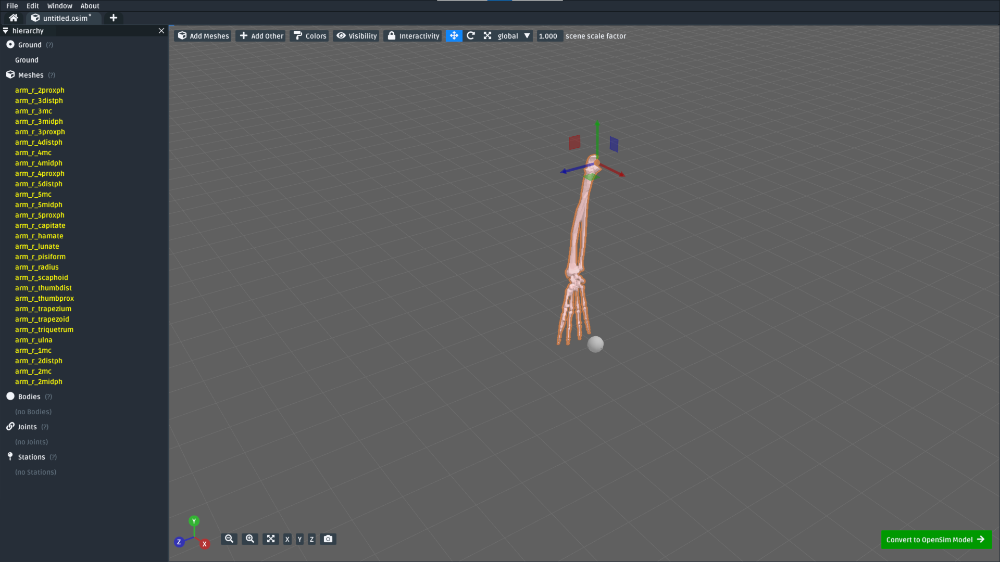
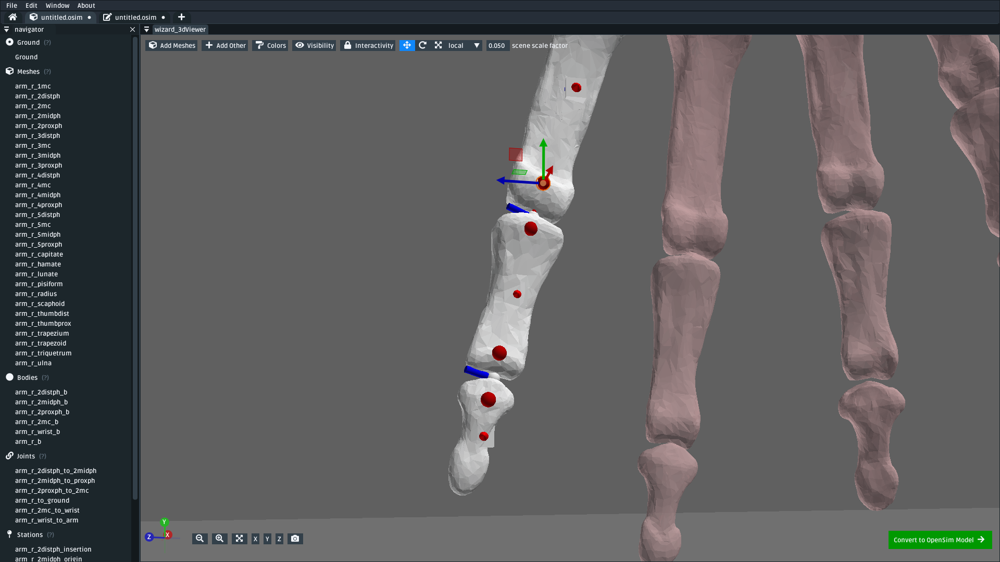
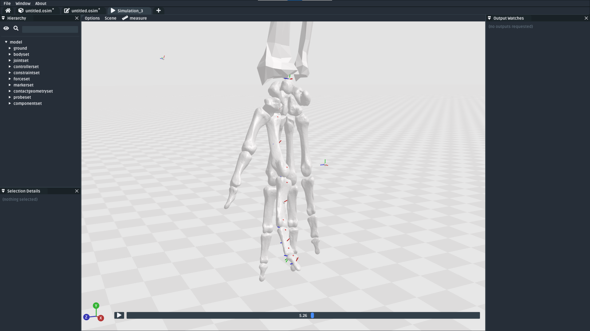
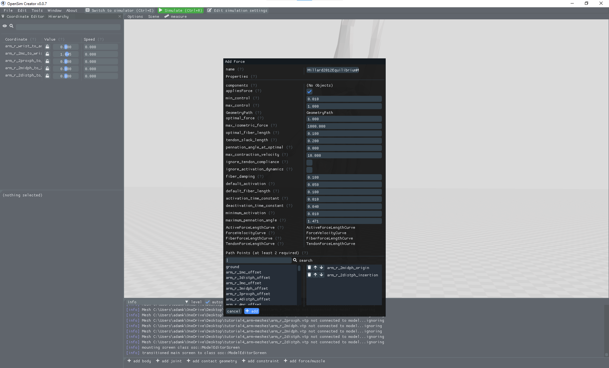

.. _tut4:

Make an Arm
===========

In this tutorial, we will be using OpenSim Creator to create a basic human hand from some mesh files:

.. figure:: _static/tut4_final-result.png
    :width: 60%

    The model created from these :download:`📥 meshes <_static/tutorial4_arm-meshes.zip>`. Final version of the model available here :download:`📥 download model <_static/tut4_after-adding-basic-muscles.osim>`

This tutorial will use the **mesh importer** to import mesh files that represent an arm, followed by using the mesh importer to assign the meshes to custom-placed **bodies** and **joints**. Once those are placed, the tutorial then introduces using **stations** to mark "points of interest" that can be used in the ``osim`` editor to define **muscle paths**.

This is a harder tutorial that builds on top of several techniques that were demonstrated in previous tutorials:

* :ref:`tut1`: Adding components into an osim, editing component values
* :ref:`tut2`: Adding forces into a model, making refinements/simplifications based on preliminary simulation results
* :ref:`tut3`: Importing meshes and placing bodies/joints with the mesh importer

Those techniques are used *ad nauseam* in this tutorial. Therefore, it is strongly recommended that you consult those tutorials if you aren't sure what's going on here.

Topics Covered by this Tutorial
-------------------------------

- **Importing meshes** with the mesh importer.
- Using the mesh importer to **attach meshes to bodies** and **join bodies with joints**
- Using the mesh importer to mark points of interest in the model by **adding stations**
- Using the ``osim`` editor to add **muscle paths** to the model

Import Meshes
-------------

The first step is to get these  :download:`📥 meshes <_static/tutorial4_arm-meshes.zip>` into OpenSim Creator. The easiest way to do this is with the **mesh importer screen**, which was described in :ref:`tut3`. You need to:

* Open OpenSim Creator's mesh importer screen
* Import these :download:`📥 meshes <_static/tutorial4_arm-meshes.zip>` by either:

  * Using the `Meshes` button in the right-click menu
  * Dragging & dropping the mesh files into the mesh importer screen.
* Move all the meshes together such that they are above ground

This will give you a scene with the meshes in roughly the right place:

    The mesh importer screen after initially importing the :download:`📥 meshes <_static/tutorial4_arm-meshes.zip>` and moving them above ground.

Add Bodies to the Meshes
------------------------

The next step is to place bodies in the model. As described previous tutorials, bodies are (effectively) points in space with a mass. In this step, we are going to add bodies where we think the main mass centers in the model should be (based on the meshes) and attach the meshes to the bodies. Attaching the meshes ensures that the mesh moves along with the body, rather than being immobilized in ground.

.. note::

    Change the mesh importer's ``scene scale factor`` to **0.1** for this, which is smaller than the default (1.0). The scale factor has no effect on the model, but makes it easier to place bodies/joints in smaller meshes.

To keep things short, we will initially only assign bodies to the model's index finger. To do that:

* For each of the four bone meshes in the index finger (``arm_r_2distph``, ``arm_r_2midph``, ``arm_r_2proxph``, and ``arm_r_2mc``):
  
  * Right-click the mesh then navigate to ``Add > Body`` and click ``At Bounds Center`` to add a mesh at the center of the mesh's bounds. Alternatively, hover the mesh and press the ``B`` (add body) hotkey, which does the same thing.
  * Right-click the added body, rename it to the mesh name followed by ``_b`` (to indicate body). E.g. ``arm_r_2distph_b``

* As a simplification, only add one body to the mesh in the middle of the wrist. For example, add one to ``arm_r_capitate`` and call it ``arm_r_wrist_b`` (because it will act as a body for all wrist bones).
* As a simplification, only add one body to the arm and move it between the arm mesh bones. For example, add one to ``arm_r_radius`` and call it ``arm_r_b`` (because it will act as the body for both the ``radius`` and ``ulna``).

This will yield a model with all the meshes imported and **six** bodies added into the scene. In my case, the six bodies were called:

* ``arm_r_2distph_b``
* ``arm_r_2midph_b``
* ``arm_r_2proxph_b``
* ``arm_r_2mc_b``
* ``arm_r_wrist_b``
* ``arm_r_b``

The model should look something like this:

.. figure:: _static/tut4_after-adding-first-6-bodies.png
    :width: 60%

    The scene after assigning the first six bodies for the index finger up to the arm. When hovering something, grey lines in the UI indicate the connectivity between the bodies. :download:`📥 download model <_static/tut4_after-adding-first-6-bodies.osim>`

Assign Unassigned Meshes to Appropriate Bodies
----------------------------------------------

We also need to assign the appropriate meshes to each body. When we imported the meshes, they were imported as **unassigned** (i.e. attached to ground). Unassigned meshes are slightly red-tinted compared to assigned meshes.

.. note::

    Sage tip 🧙: when you're having problems seeing/clicking things, try changing your visualization options.

    The mesh importer has options for changing the ``colors``, ``visibility``, and ``interactivity`` of various scene elements (e.g. meshes). These options can be **very** useful when working on complicated models, like this one, because your scene may end up containing a lot of overlapping geometry (e.g. bodies embedded inside meshes).

For this model, we will assign the finger, wrist, and arm meshes to the appropriate bodies. The other finger meshes are attached to the wrist body so that they move whenever the wrist moves - even though they haven't had all of their bodies/joints assigned yet.

To assign assign a mesh, right-click the mesh, click ``reassign connection > parent``, then click the body the mesh should be attached to. Alternatively, you can hover over the mesh and press ``A`` (assign). You need to assign the following meshes:

* Attach all wrist bone meshes to the wrist body (``arm_r_wrist_b``)
* Attach the unassigned ulna arm bone mesh (``arm_r_ulna``) to the arm body (``arm_r_b``)

This should result in most of the model being assigned. I have skipped assigning the other fingers, but you can do it if you want (assign each of the unassigned finger bone meshes to ``arm_r_wrist_b``):

.. figure:: _static/tut4_after-assigning-meshes-to-bodies.png
   :width: 60%

   The scene after assigning the bone meshes to the corresponding bodies. Here, I have left the other finger meshes unassigned, but you can (optionally) assign them to the wrist body (``arm_r_wrist_b``) if you'd like them to track along with the wrist. :download:`📥 download model <_static/tut4_after-assigning-meshes-to-bodies.osim>`

Add Joints Between the Bodies
-----------------------------

Now that we have roughly positioned our bodies in the scene, the next step is to place joints between those bodies.

Joints express how the bodies can move relative to each other. In this (simplified) model, we will assume all parts of the finger and wrist can be attached to each other with pin joints. This isn't technically true, but it is close enough quickly build a model that can be simulated. The joint type can be changed to a more suitable joint (e.g. a custom joint) later.

To add pin joints between each body:

* Right-click the body at the end of the finger (e.g. ``arm_r_2distph_b``) and click ``Join To``. Alternatively, hover over the body/mesh and press ``J`` (join to).
* Select the body it should attach to (e.g. ``arm_r_2midph_b``), this will create a ``WeldJoint`` joint center between the two bodies.
* Right-click the joint center and change its joint type to a ``PinJoint``.
* Right-click the joint center and change its name to something that describes the connection (e.g. ``arm_r_2distph_to_2midph``)
* Move the joint center to where it should be (i.e. between the bones). The ``Translate > between two mesh points`` menu can be handy here.
* Rotate the joint center such that :red:`X` is oriented toward the parent (here: ``arm_r_2midph_b``) and :blue:`Z` is where the "pin" should be. The ``Reorient > X > towards`` menu is handy for this, follow it up by rotating (``R``) along the ``local`` X axis to position ``Z``.

You should **also** add a weld joint between the arm body (``arm_r_b``) and ground. This will anchor the model relative to ground, preventing it from falling or flopping around.

.. note::

    Knowing the available translation/orientation options makes this part easier.

    Whenever you select something in the editor, you can translate/orient them by:

    * Dragging them in the 3D scene using the drag or rotation handles. You can switch between the handle type by either pressing the grab (``G``) hotkey or the rotate (``R``) hotkey, or by changing the ``translate`` dropdown at the top of the UI to ``rotate``
    * Right-clicking and typing values into the ``Translation`` and ``Rotation`` boxes. These values are **absolute**.
    * Right-clicking and using the ``translate`` and ``reorient`` sub-menus, which include handy macros like ``reorient > X > towards parent``

    The editor also supports switching between ``local`` and ``global`` coordinate spaces for the drag/rotation handles. This lets you rotate *along* an axis, which is particularly handy if you use something like ``reorient > X > towards parent`` followed by rotating along ``X`` to position the other two axes.

Following these steps, you should end up adding **six** joints (five pin joints, one weld joint) into the scene. In my case, the names of the joints were:

* ``arm_r_2distph_to_2midph``
* ``arm_r_2midph_to_2proxph``
* ``arm_r_2proxph_to_2mc``
* ``arm_r_2mc_to_wrist``
* ``arm_r_wrist_to_arm``
* ``arm_r_to_ground`` (WeldJoint)

And the scene looked as follows:

.. figure:: _static/tut4_after-adding-joints-renaming-and-moving.png
   :width: 60%

   The scene after adding five pin joints between the six bodies and one weld joint between the arm and ground. The pin joints were placed between the meshes, roughly where the joint is expected to be. The :blue:`Z` axis of each pin joint's center is the axis the pin rolls along. The weld joint was moved to the location of ``arm_r_b``. :download:`📥 download model <_static/tut4_after-adding-joints-renaming-and-moving.osim>`

(*optional*) Now that you've assigned some bodies, meshes, and joints, this is now a good time to spot-check your model. To do so, click the ``Convert to OpenSim model`` button, which should put your scene in the ``osim`` editor. You can then change some of the joint **coordinates** to see if the finger moves as-expected:

.. figure:: _static/tut4_spot-checking-joints.png
   :width: 60%

   (*optional*) Now that bodies, meshes, and joints have been added via the importer, you can test your progress by importing the scene into the ``osim`` editor and changing a few joint coordinates. The unassigned meshes might look unusual (they will stay where they are, in ground, when the wrist moves), but the rest of the finger should move roughly as expected.

Mark Points of Interest on the Meshes
-------------------------------------

Now that we've added bodies, meshes, and joints, the next step is to think about where we will ultimately be placing muscles.

Although the mesh importer doesn't directly support defining muscles, it does support placing **stations** in the scene. A **station** is some location in the scene that is attached to something else (typically, a body). When the scene is converted into an ``osim``, the station will be attached to the appropriate exported object and expressed in OpenSim's **relative** coordinate system.

The utility of adding stations is that they're relatively easy to (re)attach, and move around while working in the mesh importer. Once exported, the exported (``OpenSim``) stations can later be used to easily define a **muscle path**. Usually, defining a muscle path is challenging because it requires figuring out the relative coordinates of each muscle-path-point within each frame. However, stations already cover the point-within-a-frame part of that definition, leaving you to focus on connecting them to create paths.

To add stations into the model:

* Right-click a mesh, navigate to ``Add > Station`` and click ``At Click Position``. This will add a station wherever you right-clicked on the mesh. The station will be attached to whatever the mesh was attached to (e.g. right-clicking ``arm_r_2distph`` and adding the station will attach it to ``arm_r_2distph_b``). Alternatively, you can hover over where you want the station and press ``T`` (for s **t** ation - yes, the keybinds could use some work 😛)
* If the station isn't attached to the correct body, fix it by right-clicking the station and ``Reassign Connection``.
* The station can be freely moved around in the scene. It only has a position (no rotation).

Use the above points to assign muscle origin ``${name}_orig`` and insertion ``${name}_ins`` points into the scene:

* Add an insertion point at the end of the finger (``arm_r_2distph``), call it ``arm_r_2distph_ins``
* Add the corresponding origin point to the next bone up (``arm_r_2midph``), call it ``arm_r_2midph_orig``
* Repeat the process for each bone in the finger (``arm_r_2midph``, ``arm_r_2proxph``, ``arm_r_2mc``), finishing with an origin point on the wrist (``arm_r_trapezoid``)

This should result in **eight** stations with the following names (see figure below):

* ``arm_r_2distph_insertion``
* ``arm_r_2midph_origin``
* ``arm_r_2midph_insertion``
* ``arm_r_2proxph_origin``
* ``arm_r_2proxph_insertion``
* ``arm_r_2mc_origin``
* ``arm_r_2mc_insertion``
* ``arm_r_wrist_origin``

The stations should be placed in similar position to the figure below. These stations will be what we use when defining **muscle paths** later.

   The scene after defining eight stations along the index finger. These stations are "points of interest" that can be used later to define muscles. The utility of adding them now is that the mesh importer makes it easy to place, reattach, and move them around in the scene. :download:`📥 download model <_static/tut4_after-marking-stations.osim>`

Convert to an OpenSim Model
---------------------------

Now that we have added meshes, bodies, joints, and points of interest into the mesh importer, we are now (finally 🎉) ready to import the scene into an ``osim``, check for any basic issues, and perform any ``osim``-specific steps.

To convert and check the model:

* Press the ``Convert to OpenSim model`` button:

  * This imports the mesh importer scene into the ``osim`` editor
  * Your progress in the mesh importer is not lost, if you reopen the mesh importer you should still be able to see your scene as it was before converting it

* Experiment with changing model coordinates:

  * This should move parts of the finger

* Run a basic forward-dynamic simulation of the model

  * Press ``Ctrl+R`` to start simulating the model, or click the ``Simulate`` button
  * The arm should flop around in the scene. **Unassigned** (:red:`red`) meshes will be anchored to ground.
  * This is a basic check to ensure the model at least simulates (even if it's not a particularly interesting simulation)

You should be able to see the meshes, see that the joints are rotating (somewhat) correctly, and see the stations. If there are any problems, then return to the mesh importer and fix things.

   The ``osim`` model created from the mesh importer. Editing joint coordinates and simulating the model is a quick way to check if joint centers are correctly oriented. Here, you can see that the finger-to-wrist joint is off. This was fixed by returning to the mesh importer and reorienting that joint center. (:download:`📥 download model <_static/tut4_after-marking-stations.osim>`)

Add Muscle Paths
----------------

Now that we have an actual ``OpenSim`` model (``osim``), we can add any OpenSim components we want into it. In this step, we will focus on adding muscles.

To add muscles between the **stations** we added in previous steps:

* In the ``osim`` editor, click ``add force/muscle`` and add a ``Millard2012EquilibriumMuscle``

* In the ``Add Force`` dialog that pops up, choose path points between the stations we previously defined, e.g.:

  * Add ``arm_r_2midph_origin`` as the first path point and ``arm_r_2distph_insertion`` as the second path point to create a muscle between the two
  * Click ``Add`` to add the muscle into the model

* Repeat the above for all the ``_origin`` ``_insertion`` pairs created in Step 4

For example, this is how I added the first muscle:

   Example of adding a muscle between the ``arm_r_2midph_origin`` and ``arm_r_2distph_insertion`` stations.

Once all the (admittedly, basic) muscles have been added, you should now have the final model containing muscles 💪! Congratulations! It should look something like this:

.. figure:: _static/tut4_final-result.png
   :width: 60%

   The final hand model after adding meshes, bodies, joints, stations, and muscles. This tutorial only covers modelling one finger, but the same techniques can be applied to create the whole hand.

Summary
-------

In this tutorial, we covered a more complex modelling scenario. One where the model had to be created from a collection of mesh files. To keep the tutorial short, it only went through modelling one finger of the arm. However, the techniques covered here can be used to model the remaining fingers and to add more bodies into the wrist. The approach is largely the same.

This tutorial also covered using **stations** to mark out locations on the model. We then used the stations to add muscle paths between various parts of the model. The muscle paths added in this tutorial are extremely basic--they are just direct lines between the meshes--but more path points can be used to create a more realistic muscle path. To keep this tutorial short, we skipped doing that, but you can effectively just add more stations and chain them together when defining the path in the ``Add Force`` dialog. OpenSim also supports adding **wrap geometry** to muscle paths, enabling them to curve over things. OpenSim Creator doesn't natively support this (yet), so you will need to figure out how to add those into the ``osim`` file manually.

Overall, the techniques demonstrated in this tutorial are useful if you want to get *something* into OpenSim fairly quickly. Once you have an OpenSim model (``osim``), you can then use the entire ecosystem to add many more features. The world (of OpenSim) will be your oyster 🦪!

(Optional) Extra Exercises
--------------------------

* **Model the whole hand**. This tutorial kept things short by only modelling one finger. However, the mesh files provided at the start contain the meshes for all bones in the lower right-arm. You should be able to use the techniques described here to assign bodies + joints to all relevant parts of the lower-arm, which will produce a much more convincing model.

* **Add other OpenSim components to your imported model**. This tutorial only focuses on adding muscles, but OpenSim Creator also supports adding things like contact geometry, springs, and constraints. Try experimenting with OpenSim by adding some of these things - what's the worst that could happen 😉

* **Edit the osim file directly in a text editor**. OpenSim Creator only supports a subset of OpenSim because it takes time (and effort 😓) to add things into the UI. However, OpenSim Creator is able to *load* and *view* almost any OpenSim component - even if it can't *add* the component itself. OpenSim Creator also supports **hot reloading** in the osim editor, which means edits to the underlying ``osim`` file should automatically reload in OpenSim Creator. This can be useful if you're adding custom components via a text editor.
