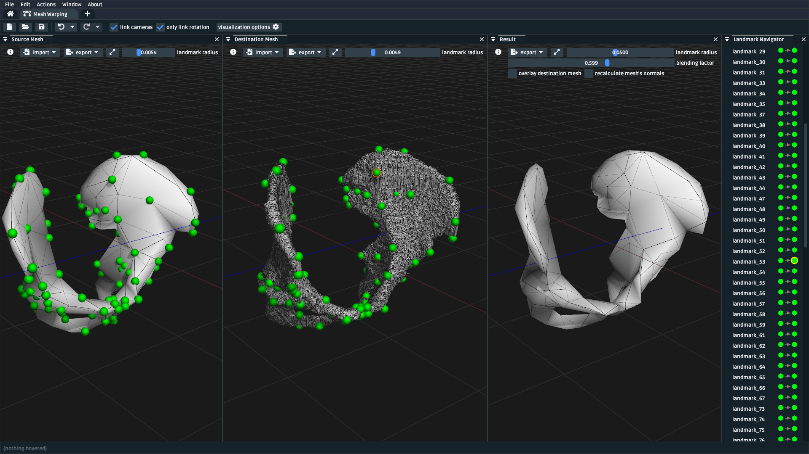
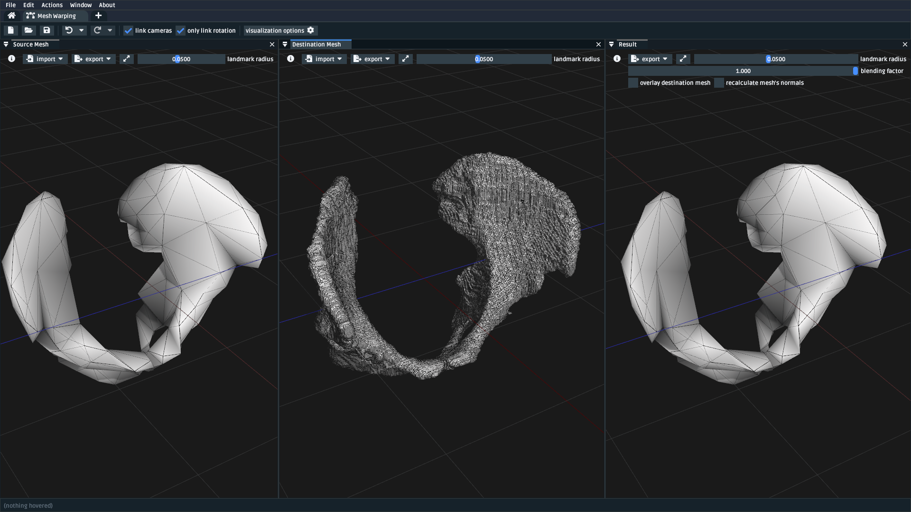
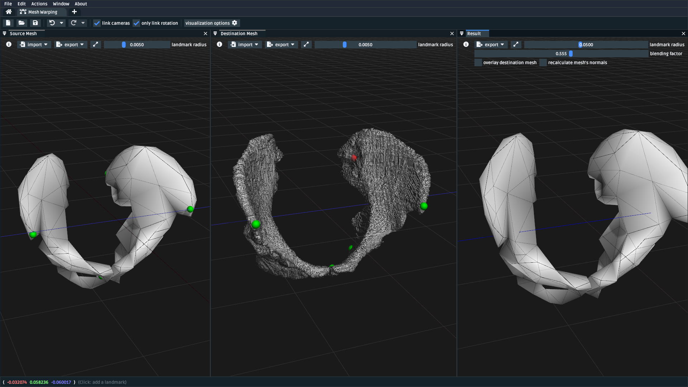

.. _tut5:

Use the Mesh Warper
===================

.. note::

  **This documentation is ⭐new⭐.**

  If you find an error in this tutorial, or you feel that something is
  fundamentally missing, then post an issue at `OpenSimCreator Issues`_

In this tutorial, we will be using the Mesh Warping UI to perform
landmark-driven mesh warping using the Thin-Plate Spline algorithm
(`explanation <TPS General Info_>`_, `literature source <TPS Primary Literature Source_>`_). The UI
provides tooling for loading two meshes and creating landmark pairs between them:

.. _cylinder-warp-example:
.. figure:: _static/tut5_mesh-warper-screenshot.png
    :width: 60%

    A screenshot of the mesh warping UI, which shows the source ("reference", left)
    destination ("target", middle) and result ("warped", right) meshes. Here, the
    warping quality is low. This is because of the low triangle and landmark count.

.. figure:: _static/tut5_mesh-warper-organic-screenshot.png
    :width: 60%

    Same as :numref:`cylinder-warp-example`, but showing an example of warping a clavicle bone. This example has many paired (left-to-middle) landmarks in a
    variety of locations along the surface of the bone, which improves the warp quality (right).

Prerequisites
-------------

* **This is a standalone tutorial**. The mesh warping UI is designed to be separate
  from OpenSim, so that it can specifically address the requirement of placing (+ pairing)
  landmarks on generic mesh files to perform non-uniform warping.

* **For your own work**, you will need two mesh files that are logically pair-able with
  landmarks. For example, two femur meshes with boney landmarks that are present (albeit,
  possibly in a different location) in both meshes. The meshes do not need to be
  anatomical: you can also use this technique to morph between entirely abstract shapes.

Topics Covered by this Tutorial
-------------------------------

- A theoretical overview of the underlying Thin-Plate Spline (TPS) technique
- A high-level overview of how OpenSim Creator's mesh warping UI works
- A concrete walkthrough of using the UI on an anatomical mesh

The Thin-Plate Spline (TPS) Technique
-------------------------------------

.. note::

    This section isn't going to explain the Thin-Plate Spline (TPS) technique in
    extensive detail. Instead, it will provide a simplified explanation
    that should be good enough to get an of what's happening when you use the
    mesh warping UI.

    If you want to know more about the TPS technique, we recommend consulting
    the `Relevant References`_ section, where we've listed a variety of relevant
    literature.

As a colloquial explanation, imagine placing a flat, thin plate with points
along its surface onto a table. Now imagine that each of those surface points
has a corresponding "target" point somewhere in 3D space. Now imagine you could
bend the plate. If you could figure out an "optimal" way to bend it, you could
minimize the distance between each surface point and its corresponding "target"
point.

The TPS technique models that idea, but in :math:`n`-dimensional space, by
making several assumptions:

- It describes "bending" the plate as a bounded linear combination of some
  basis function, :math:`U(v)`. The `original paper <TPS Primary Literature Source_>`_
  used :math:`U(v) = |v|^2 \log{|v|^2}`, but `other sources <SemilandmarksInThreeDimensions_>`_, including
  OpenSim Creator, use :math:`U(v) = |v|`.
- It treats the problem of transforming "source/reference" points (landmarks),
  :math:`x_i`, to "destination/reference" points (landmarks), :math:`y_i`, as an
  interpolation problem.
- And it solves the coefficients of that linear combination while minimizing the
  "bending energy". `Wikipedia example <TPS General Info_>`_:

.. math::

    E_{\mathrm{tps}}(U) = \sum_{i=1}^K \|y_i - U(x_i) \|^2

The coefficients that drop out of this process can then be used to warp any
point in the same space. If you'd like to know more, we recommend the literature
in the `Relevant References`_ section.

Here's how these high-level concepts from the TPS technique apply to
OpenSim Creator's mesh warping UI, which internally uses the TPS algorithm:

- **Source Mesh** and **Source Landmark** refer to data in the "reference", or
  "source" space. Each *source landmark* requires a corresponding *destination
  landmark* with the same name.

- **Destination Mesh** and **Destination Landmark** refer to data in the "target", or
  "destination" space. Each *destination landmark* must have a corresponding
  *source landmark* with the same name.

- **Warp Transform** is the product of the TPS technique after pairing the
  *source landmarks* with the *destination landmarks* and solving the
  relevant TPS coefficients. The *warp transform* can be applied
  to any point in the source space to warp it into the destination space. E.g.
  in the mesh warping UI, the transform is applied to the *source mesh* to produce
  the *result mesh*. It's also applied to *non-participating landmarks*
  to produce warped data points.

- **Result Mesh** is the result of applying the *warp transform* to the *source mesh*.

- **Non-Participating Landmark** is a landmark in the source mesh's space that
  should be warped by the warp transform but shouldn't participate in solving
  the TPS coefficients.

Opening the Mesh Warping UI
---------------------------

The mesh warping UI is an independent "workflow" UI that can be accessed from
OpenSim Creator's splash screen:

.. figure:: _static/tut5_open-mesh-warper-from-splash-screen.png
    :width: 60%

    A screenshot of OpenSim Creator's main splash screen. The mesh warping UI
    can be opened from the main splash screen of OpenSim Creator (highlighted red).

Mesh Warping UI Overview
------------------------

.. figure:: _static/tut5_mesh-warper-organic-screenshot.png
    :width: 60%

    A screenshot of the mesh warping UI with two clavicle meshes (+landmarks) opened
    in it. *Left*: the source mesh, with paired source landmarks shown in green.
    *Middle*: the destination mesh, with paired destination landmarks shown in green.
    *Right*: the result mesh, with the source mesh overlaid in red.

The mesh warping UI uses separate windows to display relevant warp information. You can
toggle each window from the ``Window`` menu at the top of the UI. Here is how each
window relates to mesh warping and the TPS technique:

- **Source Mesh (window)**: shows the source mesh, source landmarks,
  and non-participating landmarks. Source landmarks that have no corresponding
  destination landmark (an unpaired source landmark) are displayed in :red:`red`,
  paired landmarks in :green:`green`, and non-participating landmarks in :purple:`purple`.

- **Destination Mesh (window)**: shows the destination mesh and destination landmarks.
  Destination landmarks that have no corresponding source landmark (an unpaired
  destination landmark) are displayed in :red:`red`, paired landmarks in :green:`green`.

- **Result (window)**: shows the result mesh and any warped non-participating landmarks.
  There's also an option to overlay the destination mesh in this panel, which helps with
  evaluating how closely the result mesh (made by warping the source mesh) matches the
  destination mesh. There is also a ``Blending Factor`` control, which enables blending
  between "not warped" (i.e. source data) and "fully warped" on a linear scale.

- **Landmark Navigator (window)**: shows each (source/destination/non-participating)
  landmark the UI is editing. This is handy when editing many landmarks.

- **Toolbar (top)**: the main feature of note here is the ability
  to (un)lock the camera, which can make viewing paired meshes easier.

How you use these panels is up to you. A typical workflow has these steps:

1. Import/generate meshes in the source mesh and destination mesh panels
2. Import landmarks into each panel, **or** ``LeftClick`` on the mesh to place a
   landmark, **or** ``Ctrl+LeftClick`` to place a non-participating landmark on
   the source mesh.
3. View the result mesh and non-participating landmarks.
4. Export whatever you need elsewhere using the ``Export`` buttons

.. note::
  The main thing to take away from this high-level UI explanation is how each panel
  relates to the underlying TPS technique and how data can be ``import`` ed and
  ``export`` ed into each panel.

  Apart from that, the easiest way to get familiar with the UI is to actually
  use it. We recommend "playing around" with some generated geometry, or
  mesh files, to "get a feel for the algorithm", or continuing through
  this tutorial 📖

Walkthrough: Warping a Pelvis
-----------------------------

In this walkthrough, we'll go through pairing landmarks between two pelvis MRI
scans. For context, the pelvis scans we're showing in this section were originally
collected by Judith Cueto Fernandez and Eline van der Kruk, from the `BODIES lab`_,
who landmarked them in order to perform TPS-based model scaling in the model
warper.  **Due to privacy reasons, we cannot provide the raw  MRI scans. You
should use your own mesh data for this section - the fact we're using a pelvis
isn't significant for this tutorial.**

    A screenshot of the mesh warping UI with the two pelvis meshes opened, followed
    by opening the landmark CSVs for the source/destination. *Left Mesh*: the source mesh.
    *Middle Mesh*: the destination mesh. *Right Mesh*: the result mesh. The green
    spheres represent paired landmarks. *Right Panel*: the landmark navigator, which
    can be useful for figuring out which landmark is which.

Load Raw Mesh Data
^^^^^^^^^^^^^^^^^^

Typically, the first step to take when warping a mesh is to load the raw mesh
data for the source/destination into the mesh warping UI. To do that, we:

1. Ensured the ``Source Mesh``, ``Destination Mesh``, and ``Result Mesh`` panels
   were opened via the ``Window`` menu
2. Opened the source mesh via the ``Import`` dropdown in the top-left of the
   ``Source Mesh`` panel, which shown the source mesh.
3. Opened the destination mesh via the ``Import`` dropdown in the top-left of the
   ``Destination Mesh`` panel, which shown the destination mesh.

    A screenshot of the mesh warping UI after the source and destination meshes
    are loaded via the ``import`` dropdown.

Place Landmarks on the meshes
^^^^^^^^^^^^^^^^^^^^^^^^^^^^^

After loading the meshes, the next step is usually to place landmarks. In this
walkthrough's case we:

1. Changed the ``landmark radius`` from 0.05 to 0.005, because the pelvis meshes
   are quite small (larger landmarks can drown out the mesh).
2. Used the mouse to place a landmark on the source mesh, which initially appears
   red because it has no corresponding point.
3. Used the mouse to place a landmark on the destination mesh, which appears green,
   and changes the source landmark's color to green, because it is fully paired with
   the first landmark.
4. Repeated this process for 3 or 4 more pairs.

After doing this, you'll end up with something like the figure below. The key
features when landmarking are that you can always delete a landmark with the ``Delete``
or ``Backspace`` key, ``Undo``/``Redo`` work as normal, and the right-click context
menu manipulates the *pair* (e.g. ``Delete`` ing via the context menu will try
to delete both participants in the pair).

You'll also notice that, while we generally don't interact much with the ``Result Mesh``
panel when landmarking, it's useful for getting an idea of how well the Thin-Plate
Spline (TPS) technique is able to morph the source mesh to "fit" the destination mesh.
Playing around with the ``blending factor`` slider helps to show how the morph could
be incrementally applied to the source data, and  there's also an
``overlay destination mesh`` option, which helps with visually evaluating the
fitting quality.

    A screenshot of the mesh warping UI after the source and destination meshes
    are loaded via the ``import`` dropdown.

.. note::

  Don't be afraid to play 🎮 with the mesh warping UI. Undo/redo is quite robust,
  and it won't bite! There's a lot of things we haven't had time to cover in this
  tutorial.

Load Landmarks from CSV File (optional)
^^^^^^^^^^^^^^^^^^^^^^^^^^^^^^^^^^^^^^^

Another way of placing landmarks is to import them from a CSV file. This is useful
because other programs/scripts can easily write CSV data as an output, and because
the mesh warping UI can also export to CSV, which is how you can save your progress
to disk. OpenSim Creator prefers (but doesn't require) a convention of naming these
files ``MESHFILENAME.landmarks.csv`` and saving them next to the mesh files, so that
external tools have an easier time associating landmark data with mesh data. Here
is an example CSV file:

.. code-block::
  :linenos:
  :caption: mesh.landmarks.csv

  name,x,y,z
  landmark_0,-0.007511,-0.014189,0.122403
  some_other_landmark,-0.007254,-0.014904,-0.123190
  landmark_2,-0.022727,0.035774,0.130622

To import landmarks from a CSV file, you need to:

1. Use the ``Import`` menu in the top-left of the ``Source Mesh`` or ``Destination Mesh``
   panels.
2. Use the ``Import`` menu in the ``File`` menu of the UI.

After doing so, the mesh warper UI should show the landmarks (below), if it
doesn't, then try opening the ``Log`` panel through the ``Window`` menu and
see if there's any useful error messages.

    The mesh warping UI after loading two meshes and importing their associated
    landmarks via a CSV file. Importing from a CSV file should behave identically
    to placing them manually in the UI.

Next Steps
----------

With the theory, UI, and a concrete example covered, the next steps we would
recommend are:

* **Experiment with simple/generated meshes**. Experimenting with the mesh
  warping UI by warping a generated/simple will help you feel more
  comfortable with the layout, keybindings, and functionality of the UI.
* **Import/export** some data files/meshes to/from the UI. This will give you an
  idea of what the mesh warping UI can work with. For example, knowing the format
  of the landmark CSV files is useful for integrating the UI with scripts.
* **Go to the next section**. :doc:`tut6`, covers using this techniques as part
  of warping an entire OpenSim model.

.. _Relevant References:

Relevant References
-------------------

These references were found during the development of OpenSim Creator's mesh
warping support (`issue #467 <OSC TPS Github Issue_>`_). They are here in case
you (e.g.) want to write about this subject, or create your own implementation of
the algorithm.

- Wikipedia: Thin-Plate Spline (`link <TPS General Info_>`_)
    - Top-level explanation of the algorithm
- Principal warps: thin-plate splines and the decomposition of deformations, Bookstein, F.L. (`link <TPS Primary Literature Source_>`_)
    - Primary literature source
    - Note: newer publications tend to use a different basis function
- Manual Registration with Thin Plates, Herve Lombaert (`link <TPS Basic Explanation_>`_)
    - Easy-to-read explanation of the underlying maths behind the Thin-Plate Spline algorithm
    - Useful as a basic overview
- Thin Plates Splines Warping, Khanh Ha (`link <TPS Warping Blog Post_>`_)
    - Explanation of the low-level maths behind the Thin-Plate Spline algorithm (e.g. radial basis functions). Includes concrete C/C++/OpenCV examples
    - Useful as a basic overview for C++ implementors
- Image Warping and Morphing, Frédo Durand (`link <Image Warping and Morphing_>`_)
    - Full presentation slides that explain the problem domain and how warping can be used to solve practical problems, etc. Explains some of the low-level maths very well (e.g. RBFs) and is a good tour of the field. Does not contain practical code examples.
    - Useful as a top-level overview of warping in general
- Thin Plate Spline editor - an example program in C++, Jarno Elonen (`link <Thin-Plate Spline C++ Demo_>`_)
    - C++/OpenGL/libBLAS implementation of the TPS algorithm
    - Useful for implementors
- CThinPlateSpline.h, Daniel Fürth (`link <CThinPlateSpline_>`_)
    - C++/OpenCV Implementation
    - Useful for implementors
- Interactive Thin-Plate Spline Interpolation, Sarath Chandra Kothapalli  (`link <Interactive Thin-Plate Spline Interpolation_>`_)
    - Basic python implementation of TPS using numpy and matlab.
    - Contains basic explanation of the algorithm in the README
    - Useful for implementors
- 3D Thin Plate Spline Warping Function, Yang Yang (`link <3D Thin Plate Spline Warping Function_>`_)
    - MATLAB implementation of the algorithm
    - Useful for implementors
- 3D Point set warping by thin-plate/rbf function, Wang Lin (`link <3D Point set warping by thin-plate/rbf function_>`_)
    - MATLAB implementation of the algorithm
    - Useful for implementors
- A Practical Guide to Sliding and Surface Semilandmarks in Morphometric Analyses, Bardua, C et. al. (`link <A Practical Guide to Sliding and Surface Semilandmarks in Morphometric Analyses_>`_)
    - Introduces a UX for placing semi-landmarks (not supported by OpenSim Creator yet)
    - Useful for UI implementors

.. _OpenSimCreator Issues: https://github.com/ComputationalBiomechanicsLab/opensim-creator/issues
.. _TPS General Info: https://en.wikipedia.org/wiki/Thin_plate_spline
.. _TPS Primary Literature Source: https://ieeexplore.ieee.org/document/24792
.. _OSC TPS Github Issue: https://github.com/ComputationalBiomechanicsLab/opensim-creator/issues/467
.. _TPS Basic Explanation: https://profs.etsmtl.ca/hlombaert/thinplates/
.. _TPS Warping Blog Post: https://khanhha.github.io/posts/Thin-Plate-Splines-Warping/
.. _Image Warping and Morphing: http://groups.csail.mit.edu/graphics/classes/CompPhoto06/html/lecturenotes/14_WarpMorph.pdf
.. _Thin-Plate Spline C++ Demo: https://elonen.iki.fi/code/tpsdemo/
.. _CThinPlateSpline: https://github.com/tractatus/fisseq/blob/master/src/CThinPlateSpline.h
.. _Interactive Thin-Plate Spline Interpolation: https://github.com/sarathknv/tps
.. _3D Thin Plate Spline Warping Function: https://uk.mathworks.com/matlabcentral/fileexchange/37576-3d-thin-plate-spline-warping-function
.. _3D Point set warping by thin-plate/rbf function: https://uk.mathworks.com/matlabcentral/fileexchange/53867-3d-point-set-warping-by-thin-plate-rbf-function
.. _A Practical Guide to Sliding and Surface Semilandmarks in Morphometric Analyses: https://doi.org/10.1093/iob/obz016
.. _SemilandmarksInThreeDimensions: https://doi.org/10.1007/0-387-27614-9_3
.. _RayCasting: https://en.wikipedia.org/wiki/Ray_casting
.. _BODIES lab: https://bodieslab.com/