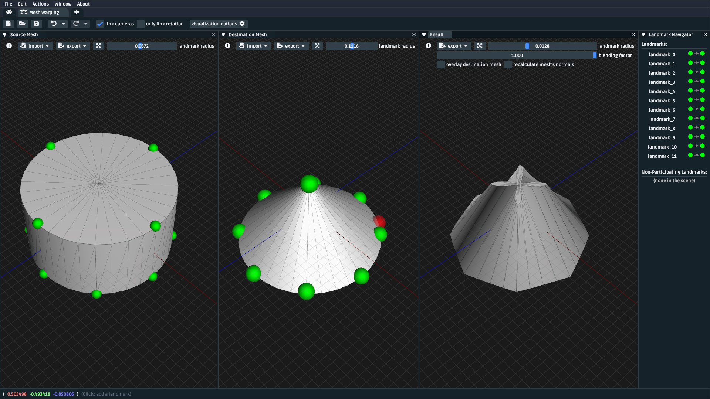
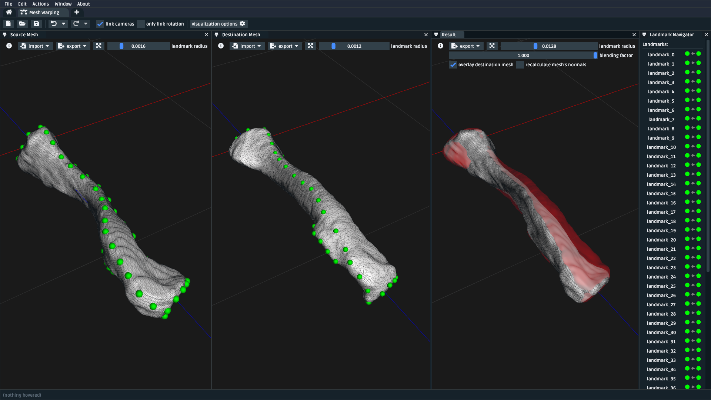
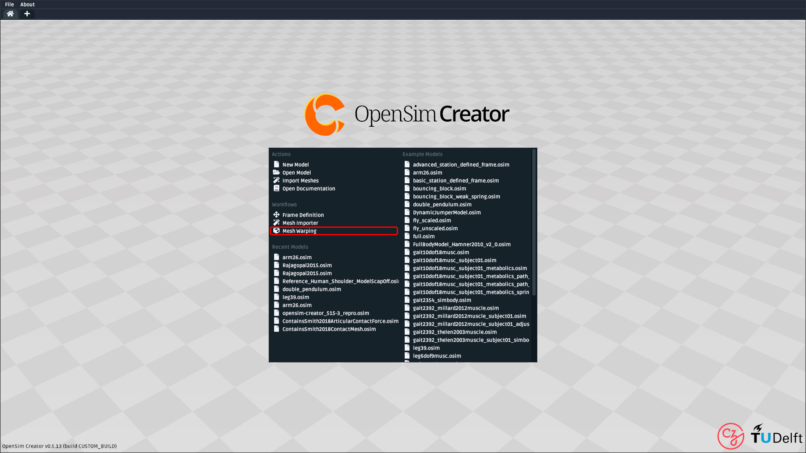

.. _tut5:

🪄 Use the Mesh Warper
======================

.. warning::

    **This documentation is 🪄 work-in-progress 🪄.**

    The mesh warping UI is mostly stable, but this documentation is still being
    improved. Therefore, this tutorial might still have sections missing or elements
    tagged with ``TODO``. However, what *is* here should be correct. Post an issue on
    OpenSim Creator's `issues page <OpenSimCreator Issues_>`_ if you think
    something's terribly wrong.

    This tutorial will be fleshed out over time. We figured it's better to show
    you what's happening as we develop it, rather than only releasing it once
    it's perfect.

In this tutorial, we will be using the Mesh Warping UI to perform
landmark-driven mesh warping using the Thin-Plate Spline algorithm
(`explanation <TPS General Info_>`_, `literature source <TPS Primary Literature Source_>`_). The UI
provides tooling for loading two meshes and creating landmark pairs between them:

.. _cylinder-warp-example:

    A screenshot of the mesh warping UI, which shows the source ("reference", left)
    destination ("target", middle) and result ("warped", right) meshes. Here, the
    warping quality is low. This is because of the low triangle and landmark count.

    Same as :numref:`cylinder-warp-example`, but showing an example of warping a clavicle bone. This example has many paired (left-to-middle) landmarks in a
    variety of locations along the surface of the bone, which improves the warp quality (right).

Prerequisites
-------------

* **This is a standalone tutorial**. The mesh warping UI is designed to be separate
  from OpenSim, so that it can specifically address the requirement of placing (+ pairing)
  landmarks on generic mesh files to perform non-uniform warping.

* **For your own work**, you will need two mesh files that are logically pair-able with
  landmarks. For example, two femur meshes with boney landmarks that are present (albeit,
  possibly in a different location) in both meshes. The meshes do not need to be
  anatomical: you can also use this technique to morph between entirely abstract shapes.

Topics Covered by this Tutorial
-------------------------------

- A theoretical overview of the underlying Thin-Plate Spline (TPS) technique
- A high-level overview of how OpenSim Creator's mesh warping UI works
- A concrete walkthrough of using the UI on an anatomical mesh

The Thin-Plate Spline (TPS) Technique
-------------------------------------

.. note::

    This section isn't going to explain the Thin-Plate Spline (TPS) technique in
    extensive detail. Instead, it will provide a simplified explanation
    that should be good enough to get an of what's happening when you use the
    mesh warping UI.

    If you want to know more about the TPS technique, we recommend consulting
    the `Relevant References`_ section, where we've listed a variety of relevant
    literature.

As a colloquial explanation, imagine placing a flat, thin plate with points
along its surface onto a table. Now imagine that each of those surface points
has a corresponding "target" point somewhere in 3D space. Now imagine you could
bend the plate. If you could figure out an "optimal" way to bend it, you could
minimize the distance between each surface point and its corresponding "target"
point.

The TPS technique models that idea, but in :math:`n`-dimensional space by

- Describing "bending" the plate as a bounded linear combination of some
  basis function, :math:`U(v)`. The `original paper <TPS Primary Literature Source_>`_
  used :math:`U(v) = |v|^2 \log{|v|^2}`, but `other sources <SemilandmarksInThreeDimensions_>`_ use :math:`U(v) = |v|`.
- Treating the problem of transforming "source/reference" points (landmarks),
  :math:`x_i`, to "destination/reference" points (landmarks), :math:`y_i`, as an
  interpolation problem.
- Solving the coefficients of that linear combination while minimizing the
  "bending energy". `Wikipedia example <TPS General Info_>`_:

.. math::

    E_{\mathrm{tps}}(U) = \sum_{i=1}^K \|y_i - U(x_i) \|^2

The coefficients that drop out of this process can then be used to warp any
point in the same space. If you'd like to know more, we recommend the `Relevant References`_
section.

Here's how these high-level concepts from the TPS technique apply to
OpenSim Creator's mesh warping UI, which internally uses the TPS algorithm:

- **Source Mesh** and **Source Landmark** refer to data in the "reference", or
  "source" space. Each *source landmark* requires a corresponding *destination
  landmark* with the same name.

- **Destination Mesh** and **Destination Landmark** refer to data in the "target", or
  "destination" space. Each *destination landmark* must have a corresponding
  *source landmark* with the same name.

- **Warp Transform** is the product of the TPS technique after pairing the
  *source landmarks* with the *destination landmarks* and solving the
  relevant TPS coefficients. The *warp transform* can be applied
  to any point in the source space to warp it into the destination space. E.g.
  in the mesh warping UI, the transform is applied to the *source mesh* to produce
  the *result mesh*. It's also applied to *non-participating landmarks*
  to produce warped data points.

- **Result Mesh** is the result of applying the *warp transform* to the *source mesh*.

- **Non-Participating Landmark** is a landmark in the source mesh's space that
  should be warped by the warp transform but shouldn't participate in solving
  the TPS coefficients.

Opening the Mesh Warping UI
---------------------------

The mesh warping UI is an independent "workflow" UI that's separate from the main
OpenSim Creator model editing/simulation UI:

    A screenshot of OpenSim Creator's main splash screen. The mesh warping UI
    can be opened from the main splash screen of OpenSim Creator (highlighted red).

Mesh Warping UI Overview
------------------------

    A screenshot of the mesh warping UI with two clavicle meshes (+landmarks) opened
    in it. *Left*: the source mesh, with paired source landmarks shown in green.
    *Middle*: the destination mesh, with paired destination landmarks shown in green.
    *Right*: the result mesh, with the source mesh overlaid in red.

The mesh warping UI uses separate windows to display relevant warp information. You can
toggle each window from the ``Window`` menu at the top of the UI. Here is how each
window relates to mesh warping and the TPS technique:

- **Source Mesh (window)**: "source", or "reference" meshes and landmarks. These are where
  you're starting from. In this panel, you can ``Import`` meshes, landmarks,
  and non-participating landmarks (datapoints, such as markers, that should
  be warped, but shouldn't participate in fitting TPS parameters).

- **Destination Mesh (window)**: ``TODO``

- **Result (window)**: ``TODO``

- **Landmark Navigator (window)**: ``TODO``

- **Toolbar (top)**: ``TODO``

Placing/Warping Landmarks
^^^^^^^^^^^^^^^^^^^^^^^^^

Although the TPS technique (explained above) only actually requires paired
landmarks in 3D space, the mesh warping UI focuses on using `ray casting <RayCasting_>`_
to make *surface* points easier. This approach makes sense when working with
physiological meshes. If you need to place a landmarks at an arbitrary location,
then you can right-click a landmark and type the 3D location in, or import the
points as CSV data.

Importing/Exporting Data
^^^^^^^^^^^^^^^^^^^^^^^^

* ``TODO``: Explain top-level UI design (what each panel does)
* ``TODO``: Explain key features (import, export, blending, etc.)

Walkthrough: Warping a Femur
----------------------------

* ``TODO``: Provide + Load Example Meshes
* ``TODO``: Step-by-step explanation
* ``TODO``: warping single points/non-participating landmarks

Next Steps
----------

* ``TODO``: encourage experimentation, maybe mention some open CT scan repositories?
* ``TODO``: mention relationship to model warping

.. _Relevant References:

Relevant References
-------------------

These references were found during the development of OpenSim Creator's mesh
warping support (`issue #467 <OSC TPS Github Issue_>`_). They are here in case
you (e.g.) want to write about this subject, or create your own implementation of
the algorithm.

- Wikipedia: Thin-Plate Spline (`link <TPS General Info_>`_)
    - Top-level explanation of the algorithm
- Principal warps: thin-plate splines and the decomposition of deformations, Bookstein, F.L. (`link <TPS Primary Literature Source_>`_)
    - Primary literature source
    - Note: newer publications tend to use a different basis function
- Manual Registration with Thin Plates, Herve Lombaert (`link <TPS Basic Explanation_>`_)
    - Easy-to-read explanation of the underlying maths behind the Thin-Plate Spline algorithm
    - Useful as a basic overview
- Thin Plates Splines Warping, Khanh Ha (`link <TPS Warping Blog Post_>`_)
    - Explanation of the low-level maths behind the Thin-Plate Spline algorithm (e.g. radial basis functions). Includes concrete C/C++/OpenCV examples
    - Useful as a basic overview for C++ implementors
- Image Warping and Morphing, Frédo Durand (`link <Image Warping and Morphing_>`_)
    - Full presentation slides that explain the problem domain and how warping can be used to solve practical problems, etc. Explains some of the low-level maths very well (e.g. RBFs) and is a good tour of the field. Does not contain practical code examples.
    - Useful as a top-level overview of warping in general
- Thin Plate Spline editor - an example program in C++, Jarno Elonen (`link <Thin-Plate Spline C++ Demo_>`_)
    - C++/OpenGL/libBLAS implementation of the TPS algorithm
    - Useful for implementors
- CThinPlateSpline.h, Daniel Fürth (`link <CThinPlateSpline_>`_)
    - C++/OpenCV Implementation
    - Useful for implementors
- Interactive Thin-Plate Spline Interpolation, Sarath Chandra Kothapalli  (`link <Interactive Thin-Plate Spline Interpolation_>`_)
    - Basic python implementation of TPS using numpy and matlab.
    - Contains basic explanation of the algorithm in the README
    - Useful for implementors
- 3D Thin Plate Spline Warping Function, Yang Yang (`link <3D Thin Plate Spline Warping Function_>`_)
    - MATLAB implementation of the algorithm
    - Useful for implementors
- 3D Point set warping by thin-plate/rbf function, Wang Lin (`link <3D Point set warping by thin-plate/rbf function_>`_)
    - MATLAB implementation of the algorithm
    - Useful for implementors
- A Practical Guide to Sliding and Surface Semilandmarks in Morphometric Analyses, Bardua, C et. al. (`link <A Practical Guide to Sliding and Surface Semilandmarks in Morphometric Analyses_>`_)
    - Introduces a UX for placing semi-landmarks (not supported by OpenSim Creator yet)
    - Useful for UI implementors

.. _OpenSimCreator Issues: https://github.com/ComputationalBiomechanicsLab/opensim-creator/issues
.. _TPS General Info: https://en.wikipedia.org/wiki/Thin_plate_spline
.. _TPS Primary Literature Source: https://ieeexplore.ieee.org/document/24792
.. _OSC TPS Github Issue: https://github.com/ComputationalBiomechanicsLab/opensim-creator/issues/467
.. _TPS Basic Explanation: https://profs.etsmtl.ca/hlombaert/thinplates/
.. _TPS Warping Blog Post: https://khanhha.github.io/posts/Thin-Plate-Splines-Warping/
.. _Image Warping and Morphing: http://groups.csail.mit.edu/graphics/classes/CompPhoto06/html/lecturenotes/14_WarpMorph.pdf
.. _Thin-Plate Spline C++ Demo: https://elonen.iki.fi/code/tpsdemo/
.. _CThinPlateSpline: https://github.com/tractatus/fisseq/blob/master/src/CThinPlateSpline.h
.. _Interactive Thin-Plate Spline Interpolation: https://github.com/sarathknv/tps
.. _3D Thin Plate Spline Warping Function: https://uk.mathworks.com/matlabcentral/fileexchange/37576-3d-thin-plate-spline-warping-function
.. _3D Point set warping by thin-plate/rbf function: https://uk.mathworks.com/matlabcentral/fileexchange/53867-3d-point-set-warping-by-thin-plate-rbf-function
.. _A Practical Guide to Sliding and Surface Semilandmarks in Morphometric Analyses: https://doi.org/10.1093/iob/obz016
.. _SemilandmarksInThreeDimensions: https://doi.org/10.1007/0-387-27614-9_3
.. _RayCasting: https://en.wikipedia.org/wiki/Ray_casting
