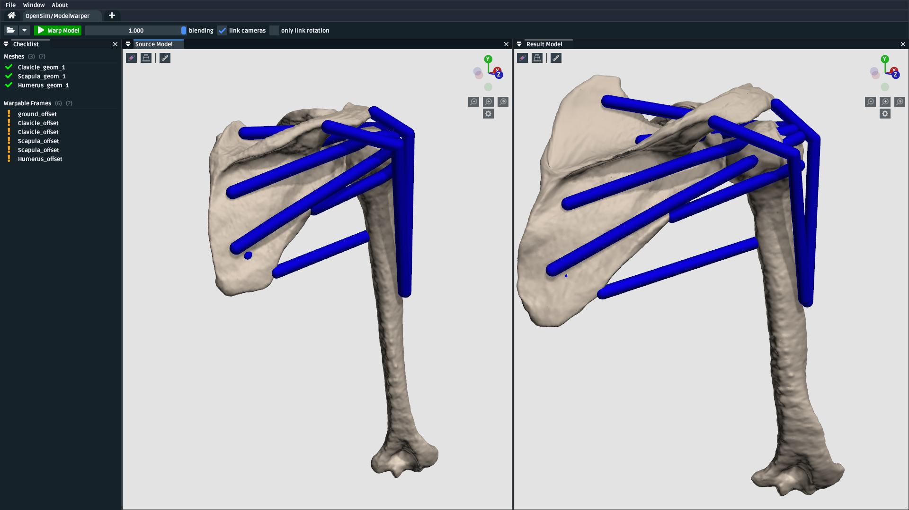
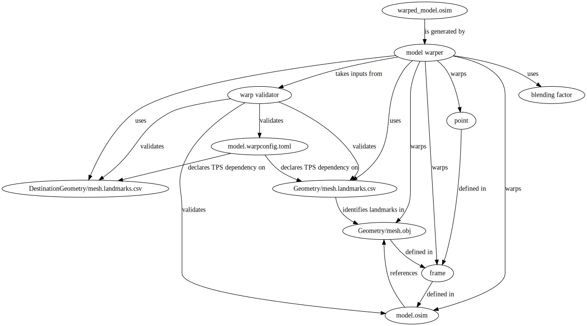

.. _tut6:

🪄 Use the Model Warper
=======================

.. warning::

    **Model warping is very 🪄 experimental 🪄.**

    We invite you to try model warping out and get a feel for how it might be
    useful. Maybe it's already useful enough for you to use it in something
    serious (some researchers already have 🎉).

    However, be aware that some implementation details of model warping, such
    as the structure of the ``.warpconfig.toml`` file, aren't stable yet. This
    means that they may change as model warping is developed.

    The documentation here is extremely work-in-progress, so expect many ``TODO`` s
    and ``FIXME`` s. This will be improved as the model warping feature is developed.
    We figured it's better to show you what's available as we develop it, rather
    than only releasing once it's perfect.
    

In this tutorial, we will be using the model warping UI to warp an entire
OpenSim model in a landmark-driven way. The benefit of this technique,
compared to standard scaling, is that it makes non-uniform, subject-specific
scaling possible.

.. _model-warper-ui:

    A screenshot of the model warping UI, showing how it can be used to warp
    a source/reference/template OpenSim model (left) into a new model (right).
    In this case, the warping relationship is possible because there are
    corresponding landmarks available for all meshes in both the source and
    target (which were placed as described in :doc:`tut5`).

Prerequisites
-------------

* **You can diagnose/work-with with OpenSim models**. This tutorial assumes that
  you're able to diagnose the models that go into, and come out of, the model
  warping UI. If you don't feel comfortable with working on OpenSim models, then
  we recommend going through earlier tutorials (e.g. :doc:`tut1`, :doc:`tut2`).

* **A basic understanding of the Thin-Plate Spline (TPS) technique**. The model
  warper applies the TPS technique to multiple components in the source model.
  Therefore, it's recommended that you have already gone through :doc:`tut5`, which
  outlines pairing landmarks between two corresponding meshes as inputs for the
  TPS technique.

Topics Covered by this Tutorial
-------------------------------

* A technical overview of how the model warper works
* How to prepare an existing OpenSim source/template model for warping
* Concrete walkthrough of warping a simple model
* Customizing model warping behavior
* Diagnosing and working around model warping issues
* Limitations, references, future work

Model Warping: Technical Overview
---------------------------------

.. warning::

  🪄 **Work in progress** 🪄: This explanation covers the internals of the
  warping engine and, ultimately, the direction that we want to develop it.
  However, the current engine only supports warping meshes, ``StationDefinedFrame`` s,
  and muscle ``PathPoint`` s.

Model warping is a general phrase OpenSim Creator uses to identify algorithms
from its warping engine. The engine combines multiple scaling algorithms
together in order to implement **warpable models**. At a high-level, the engine
performs four steps:

1. It loads a **source model** (sometimes called a *reference model* or a *template model*).

2. Then it finds (or defaults) an associated **warping configuration**, which
   describes how it should warp the source model.

3. Then it validates the warping configuration against the source model,
   reporting errors, ambiguities, missing files, etc. through the UI.

4. If steps 1-3 go well, it then generates a new (warped) model.

*How* the engine warps the model is very customizable. This is because
source models can have a variety of scaling requirements. For example, some
components might suit using uniform scaling, while other components might
suit non-uniform scaling. The flexibility of model warping, combined with
OpenSim's inherent component-based flexibility, makes model warping more
complicated than mesh warping (as described in :doc:`tut5`).

  A directed graph showing the dependencies used to create a warped model
  (``warped_model.osim`` ). The engine loads the source model (``model.osim``) and
  warping configuration (``model.warpconfig.toml``). The configuration declares
  that some components in the model (e.g. ``point``) should be warped with a
  TPS technique, which creates dependencies on corresponding ``.landmarks.csv``
  files.

  The model warping engine's job is to provide a consistent framework for
  designing warp behavior. The UI's job is to present the underlying
  complexity as readable checklists, warnings, and errors (:numref:`model-warper-ui`).

.. note::

  If this technical explanation seems a bit complicated, **don't panic** 😨. It's
  only here to give you a vague idea of what's happening under the hood, so that
  you can develop a general intuition about what's *actually* going on, rather
  than it feeling like magic.

  The **practical** usage of the tool (covered next) is designed to be very
  linear, provide constant feedback, suggestions, debug messages, and so on.

Preparing an OpenSim Model for Warping
--------------------------------------

.. warning::

  🪄 **Work in progress** 🪄: This explanation assumes that you're only warping
  the meshes, frames, and muscle path points of the model using the Thin-Plate
  Spline (TPS) technique. The requirements are likely to be relaxed once other
  (simpler) warping techniques are additionally supported.

``TODO`` : explain what the model warper can/can't warp. Explain ``StationDefinedFrame``
and limitations around warping frames, muscle scaling, etc.

Basic Example: Two-body model
-----------------------------

``TODO`` : provide a very stripped-down model that meets the requirements for warp-ability

Customizing Model Warping behavior
----------------------------------

``TODO`` : Explain how the user can use the ``.warpconfig.toml`` file to customize how the
model warper warps models.

Diagnosing Warping Issues
-------------------------

``TODO`` : explanation of any known issues, recommendations for working around them
etc.

Advanced Example: Many-Bodied Model with Custom Requirements
------------------------------------------------------------

``TODO`` : an example model that requires the user to specialize/specify customization
in the warp config (e.g. tell the warp engine to skip some steps, warp X using
technique Y, etc.)
