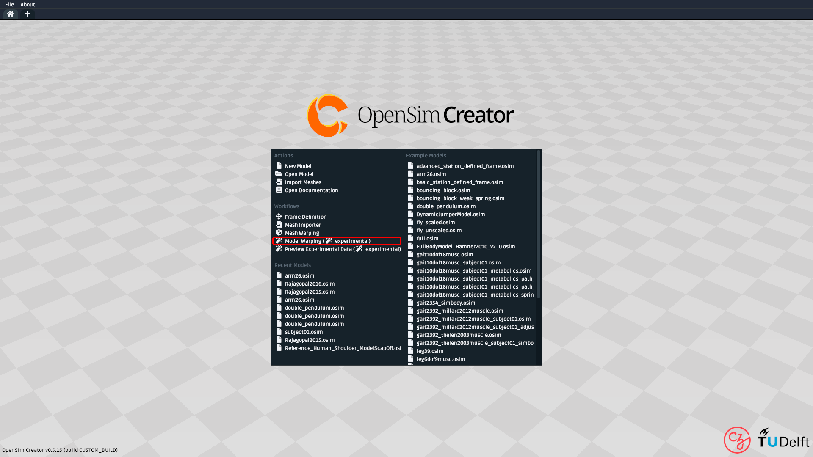
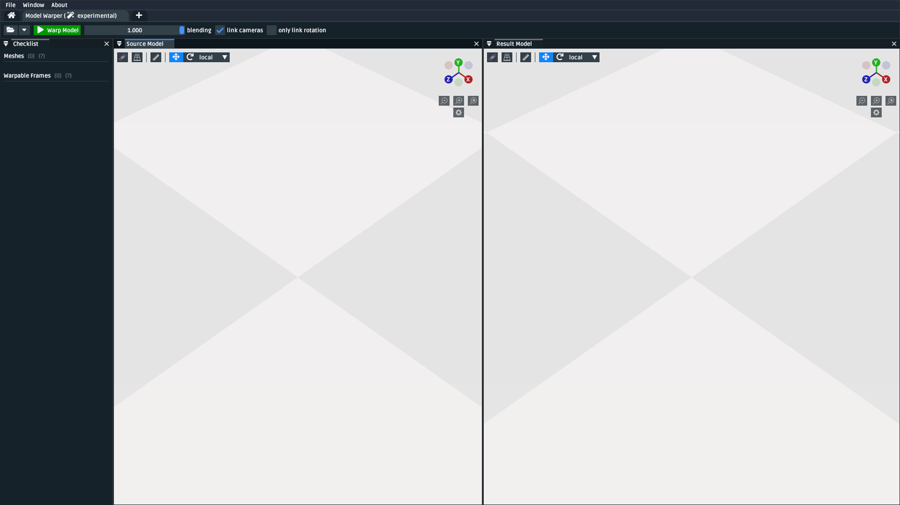

.. _tut6:

🪄 Use the Model Warper
=======================

.. warning::

    **Model warping is very 🪄 experimental 🪄.**

    We invite you to try model warping out and get a feel for how it might be
    useful. Maybe it's already useful enough for you to use it in something
    serious (some researchers already have 🎉).

    However, be aware that some implementation details of model warping, such
    as the structure of the ``.warpconfig.toml`` file, aren't stable yet. This
    means that they may change as model warping is developed.

    The documentation here is extremely work-in-progress, so expect many ``TODO`` s
    and ``FIXME`` s. This will be improved as the model warping feature is developed.
    We figured it's better to show you what's available as we develop it, rather
    than only releasing once it's perfect.
    

In this tutorial, we will be using the model warping UI to warp an entire
OpenSim model in a landmark-driven way. The benefit of this technique,
compared to standard scaling, is that it makes non-uniform, subject-specific
scaling possible.

.. _model-warper-ui:
.. figure:: _static/tut6_model-warper.png
    :width: 60%

    A screenshot of the model warping UI, showing how it can be used to warp
    a source/reference/template OpenSim model (left) into a new model (right).
    In this case, the warping relationship is possible because there are
    corresponding landmarks available for all meshes in both the source and
    target (which were placed as described in :doc:`tut5`). Those landmarks
    enable the non-uniform scaling shown above (e.g. the scapula has a
    different size *and* shape).

Prerequisites
-------------

* **You can diagnose and work with OpenSim models**. This tutorial assumes that
  you're able to diagnose the models that go into, and come out of, the model
  warping UI. If you don't feel comfortable with working on OpenSim models, then
  we recommend going through earlier tutorials (e.g. :doc:`tut1`, :doc:`tut2`).

* **A basic understanding of the Thin-Plate Spline (TPS) technique**. The model
  warper applies the TPS technique to multiple components in the source model.
  Therefore, it's recommended that you have already gone through :doc:`tut5`, which
  outlines pairing landmarks between two corresponding meshes as inputs for the
  TPS technique.

Topics Covered by this Tutorial
-------------------------------

* A technical overview of how the model warper works
* How to prepare an existing OpenSim source/template model for warping
* A concrete walkthrough of warping a simple model
* An explanation of how model warping behavior can be customized
* Diagnosing and working around model warping issues
* Limitations, references, future work

Model Warping: Technical Overview
---------------------------------

.. warning::

  🪄 **Work in progress** 🪄: This explanation covers the internals of the
  warping engine and, ultimately, the direction that we want to develop it.
  However, the current (experimental) engine only supports warping
  meshes, ``StationDefinedFrame`` s, and muscle ``PathPoint`` s.

Model warping is a general phrase OpenSim Creator uses to identify algorithms
from its warping engine. The engine combines multiple scaling algorithms
together in order to implement **warpable models**. At a high-level, the engine
performs four steps:

1. It loads a **source model** (sometimes called a *reference model* or a *template model*).

2. Then it finds (or defaults) an associated **warping configuration**, which
   describes how it should warp the source model.

3. Then it validates the warping configuration against the source model by
   checking for potential ambiguities, missing input files (e.g. ``.landmarks.csv``),
   and inconsistent model references. It reports any validation warnings/errors
   through the UI, potentially halting the process until all errors are fixed.

4. If steps 1-3 go well, it then generates a new (warped) model.

*How* the engine warps the model is very customizable. This is because
source models can have a variety of scaling requirements. For example, some
components might suit uniform scaling, while other components might suit
non-uniform warping. The flexibility of model warping, combined with OpenSim's
inherent flexibility (many different components, wrapping, custom joints, etc.),
makes model warping more complicated than mesh warping (as described
in :doc:`tut5`).

.. figure:: _static/tut6_model-warping-dependencies-example.svg
  :width: 80%

  An example directed graph that shows the dependencies used to create a warped model
  (``warped_model.osim`` ). Arrows indicate dependencies (they point *from* something
  that *depdends on* something else). In this example, the engine loads the source
  model (``model.osim``) and warping configuration (``model.warpconfig.toml``), which
  declares that some components in the model (e.g. ``point``) should be warped with a
  TPS technique, which creates dependencies on corresponding ``.landmarks.csv``
  files. The model warping engine's job is to provide a consistent framework for
  designing warp behavior. The UI's job is to present the underlying
  complexity as readable checklists, warnings, and errors (:numref:`model-warper-ui`).

.. note::

  **Don't Panic**: This technical explanation is only here to give you a vague
  high-level idea of what's happening under the hood, so that you can develop
  a general intuition about what's *actually* going on, rather than it feeling
  like magic.

  The **practical** usage of the tool (covered next) is designed to
  present the process as a linear sequence of steps with constant feedback,
  suggestions, debug messages, and so on.

Walkthroughs: How to Warp Models With the Model Warper
------------------------------------------------------

.. warning::

  🪄 **Work in progress** 🪄: This explanation assumes that you're only warping
  the meshes, frames, and muscle path points of the model using the Thin-Plate
  Spline (TPS) technique. The requirements are likely to be relaxed once other
  (simpler) warping techniques are additionally supported.

**Beware**: this walkthrough section is going to be a little different from other
tutorials' walkthroughs.

In contrast to previous tutorials, which typically go through a linear
sequence of steps that go from zero to something complicated, this section
is instead going to go through separate step-by-step walkthroughs that
each add something new to the model. This is to help familiarize you with
the warping engine because, as your needs evolve, you may end up combining
*a lot* of these steps into a single warpable model.

Opening the Model Warping UI
^^^^^^^^^^^^^^^^^^^^^^^^^^^^

The model warping warping UI is an independent "workflow" UI that can be
accessed from OpenSim Creator's splash screen:

  A screenshot of OpenSim Creator's main splash screen. The model warping UI
  can be opened from the main splash screen of OpenSim Creator (highlighted
  red).

Model Warping UI Overview
^^^^^^^^^^^^^^^^^^^^^^^^^

After opening the model warping UI, you will be presented with a UI containing
three panels (``Checklist``, ``Source Model``, and ``Result Model``) and a
toolbar:

  A screenshot of the model warping UI after opening it. It initially shows a
  model warp for a blank model (i.e. no bodies, joints, or meshes). *Left*\: the
  ``Checklist`` panel. *Middle*\: The ``Source Model`` panel. *Right*\: the
  ``Result Model`` panel. *Third Row from the Top*\: the model-warping-specific
  toolbar.

Here is the role of each element in the UI:

:Checklist: Lists each component that the model warper is attempting to
            warp. Contains useful feedback about what's happening (which
            algorithms are being used, which input files are being used, etc.)
            and will list any validation errors related to that component (
            e.g. missing input files, ambiguities).
:Source Model: The "source" OpenSim model (``.osim``) that the model warper is
               trying to warp. This model is combined with the warping
               configuration, and input data/parameters, to produce the result
               model.
:Result Model: The "result" OpenSim model that the model warper has managed to
               produce - assuming there are no warping errors. This is the model
               that's ultimately exported when you click ``Warp Model`` in the
               UI.
:Toolbar: Shows workflow-specific actions. Notably, you can use the buttons in
          the toolbar to load the source model, warp the source model (i.e. export
          the result model to a new ``.osim`` editor tab), and blend between the
          source/result models.

When the model warping UI is initially loaded, it shows a blank model. This is
is trivially warpable (there's nothing to warp!), so you can immediately complete
the process by clicking ``Warp Model``. However, warping nothing isn't interesting.
We'll use the next few walkthroughs to make it more interesting - at the cost of
being more complicated 😉.

Walkthrough: Warping a Zero-Body One-Mesh Model
^^^^^^^^^^^^^^^^^^^^^^^^^^^^^^^^^^^^^^^^^^^^^^^

The next step up in complexity from the trivial case (an empty model) is a model
containing a mesh that's directly connected to ground (origin). This roughly
mirrors what's seen when using the mesh warper (see :ref:`tut5`).

To do this, you'll need the source model with source and destination ``.landmarks.csv``
files.

``TODO`` put this list into a ``collapse`` block so it doesn't get in the way
of the rest of the content. Provide a download link to the model zip ``TODO``

- Use the mesh warper to create a warp between generated geometry and some
  result. Save the generated source geometry as an ``obj`` in a folder at
  ``Geometry/mesh.obj`` . Save the source landmarks in the same folder at
  ``Geometry/mesh.landmarks.csv`` . Save the destination landmarks in the
  same folder at ``DestinationGeometry/mesh.landmarks.csv``.
- Use the model editor to create a blank model. Save it in the folder at ``./model.osim``.
  Right-click the ``ground`` component in the blank model, ``Add``,
  ``Geometry``, select the ``mesh.obj`` file.

Walkthrough: Warping a One-Body, One-Mesh, One-Muscle Model
^^^^^^^^^^^^^^^^^^^^^^^^^^^^^^^^^^^^^^^^^^^^^^^^^^^^^^^^^^^

``TODO``: create/offer a model that is the same as above, but with the meshes
attached to a body (and, therefore, there's a joint, and joint frames, to
consider).

Walkthrough: Warping a One-Body, One-Mesh, One-Muscle Model
^^^^^^^^^^^^^^^^^^^^^^^^^^^^^^^^^^^^^^^^^^^^^^^^^^^^^^^^^^^

``TODO``: create/offer a model that is the same as above, but contains a single

``TODO`` : explain what the model warper can/can't warp. Explain ``StationDefinedFrame``
and limitations around warping frames, muscle scaling, etc.

Basic Example: Two-body model
-----------------------------

``TODO`` : provide a very stripped-down model that meets the requirements for warp-ability

Customizing Model Warping behavior
----------------------------------

``TODO`` : Explain how the user can use the ``.warpconfig.toml`` file to customize how the
model warper warps models.

Diagnosing Warping Issues
-------------------------

``TODO`` : explanation of any known issues, recommendations for working around them
etc.

Advanced Example: Many-Bodied Model with Custom Requirements
------------------------------------------------------------

``TODO`` : an example model that requires the user to specialize/specify customization
in the warp config (e.g. tell the warp engine to skip some steps, warp X using
technique Y, etc.)
