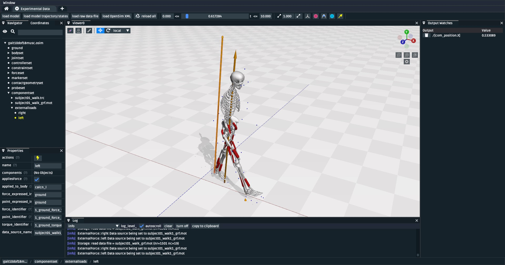
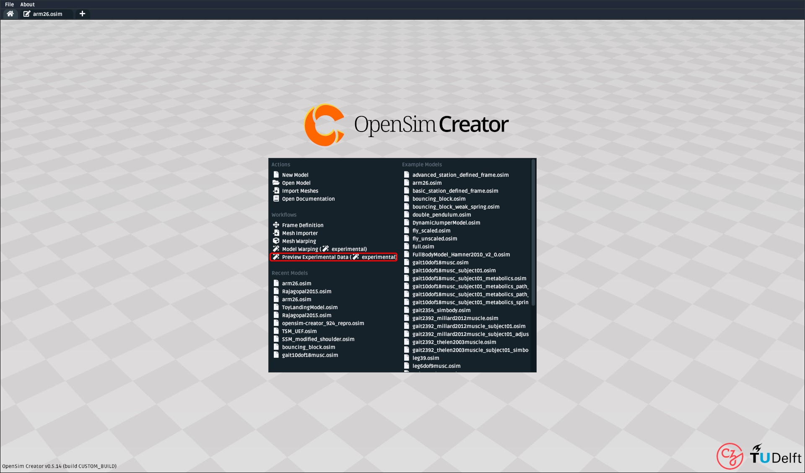
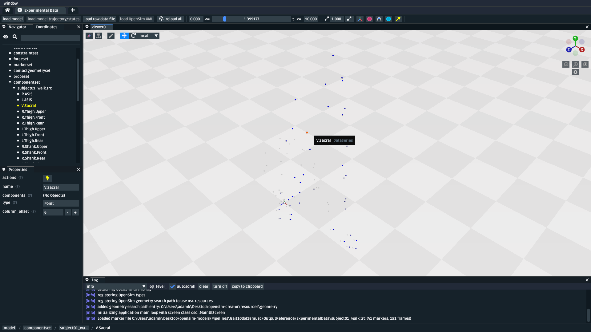
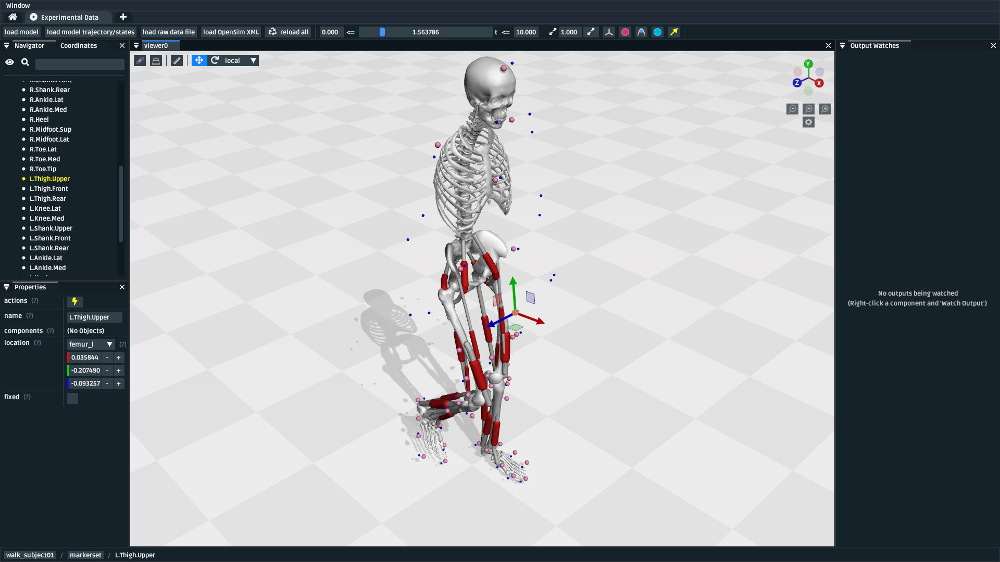
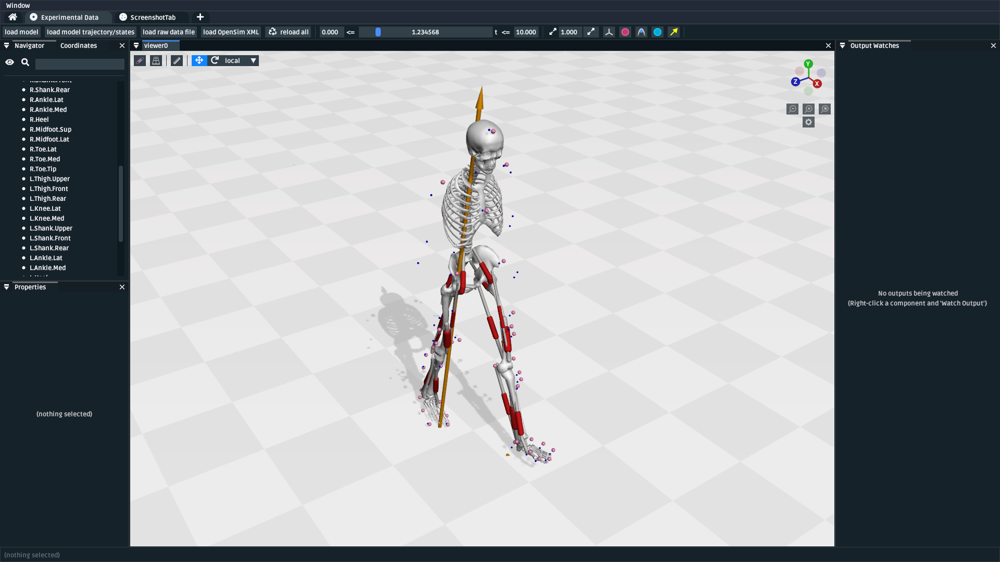
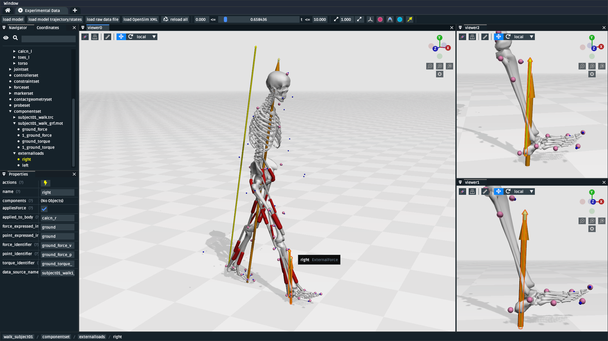

.. _tut7:

Preview Experimental Data
=========================

.. note::

    **Previewing Experimental Data is a ⭐new⭐ feature.**

    It should be safer to use than an 🪄experimental🪄 feature, but it still
    has some rough edges 🪨. If you think you've found a major bug, you should
    report it to the `OpenSim Creator Issues Page`_. Minor bug reports are also
    appreciated, but our current priority is to fix any big problems so that it
    can evolve into an established feature.

In this tutorial, we will be using the preview experimental data workflow to
visualize, validate, and connect experimental data to an OpenSim model. This
is typically required when you have external experimental data that you want
to use with an OpenSim solver.

    A screenshot of the preview experimental data UI. Here, the ``subject01.osim``
    model file from the `OpenSim Models Repository`_ is loaded, which shows
    the model file; additionally, the ``subject01_walk.trc`` (markers, blue spheres) and
    ``subject01_walk_grf.mot`` (ground-reaction forces, orange arrows) are
    overlaid as raw data files. The model's trajectory (``subject01_walk_IK.mot``),
    as calculated from OpenSim's inverse kinematic (IK) solver, was loaded against
    the model, showing it's computed motion. This is useful for verifying that
    the various experimental data files, and solver results, make sense when combined.

Prerequisites
-------------

* **This is a standalone tutorial**. The preview experimental data workflow is
  a standalone UI for handling experimental data. You don't necessarily need
  to know how to build or handle an OpenSim model in order to use it
  effectively, but those skills are useful for debugging a model-specific issue.

* **For your own work**, you will need to have your experimental data files in
  a format that's compatible with OpenSim (e.g. ``trc``, ``sto``). Typically, this
  requires either using an OpenSim-aware data exporter, or writing a script
  that converts your experimental data from your source format into an
  OpenSim-compatible format. The data formats used by OpenSim are typically
  simple plaintext formats, which means that you can generally (e.g.) use a
  one-off python script to generate them. We recommend looking at some existing
  OpenSim-compatible data files (e.g. this `Example MOT File`_
  from the `OpenSim Models Repository`_) for inspiration.

Topics Covered by this Tutorial
-------------------------------

- A high-level overview of the preview experimental data workflow UI.
- A concrete walkthrough of using the preview experimental data UI in
  a typical experimental workflow.

Opening the Preview Experimental Data UI
----------------------------------------

The preview experimental data UI is an independent "workflow" UI that can be
accessed from OpenSim Creator's splash screen, in the ``Workflows`` section:

    How to open the preview experimental data UI from the splash screen. It's
    also accessible from the ``File`` menu.

Preview Experimental Data UI Overview
-------------------------------------

    The preview experimental data UI. In its current (🪄 experimental) iteration,
    it has buttons for loading a model, the model's associated trajectory, raw
    data files (unassociated to the model), and OpenSim XML files (e.g. ``ExternalLoads``).

The preview experimental data UI provides similar panels to the model editor
UI (e.g. ``Coordinates``, ``Navigator``), but with some key differences that
are tailored towards visualizing and debugging experimental data:

- **It can load a model trajectory**. The ``load model trajectory`` button in the top
  toolbar lets you load a trajectory (e.g. ``sto``) against the current. This
  is useful for (e.g.) debugging whether the output from OpenSim's Inverse
  Kinematics (IK) solver matches your experimental data.

- **It can load raw experimental data files**. The ``load raw data file`` button
  in the top toolbar lets you load raw data files into the scene. The data series
  in the raw data file can then be clicked, inspected, scrubbed, etc. to
  visualize how OpenSim understands them. Because they are "raw" data files
  they are unconnected to any frame in the model and always display in ground.

- **It can load associated OpenSim XML files**. The ``load OpenSim XML`` button
  in the top toolbar reads any ``<OpenSimDocument>`` and puts it in the model's
  ``componentset``, which associates it with the model. This is useful for (e.g.)
  associating an ``ExternalLoads`` to a model which, when force-vector visualization
  is enabled in a 3D viewer, lets you view when/where those forces are applied to
  the model.

- **It has a time scrubber**. There's a time scrubber (slider) in the top toolbar,
  which lets you set/modify the currently-viewed time. This doesn't involve any
  kind of solver or simulation (e.g. forward-dynamics). It only sets the current
  model's time, so that (e.g.) any associated motions, raw data, or ``ExternalLoads``
  reflect their impact at that point in time. This is useful for ensuring data
  behaves as-expected over time.

- **It can reload all of the above with a single click**. The ``reload all``
  button in the top toolbar is designed to reload everything in one click and
  scrub to the currently-scrubbed-to time. This is useful for debugging/fixing/editing
  the external files in an external editor, followed by reloading.

In combination, these features let you set up a single workplace where you can
work on/with experimental data to solve your research problems. The next section
describes, concretely, how they interplay in an example workflow.

Walkthrough: Markers to Motion
------------------------------

In this section, we will go through a typical workflow that uses the preview
experimental data UI.

This walkthrough makes more sense if we use a little bit of 🧙‍♂️ **roleplay** to
explain each step's context. Imagine that you've already recorded some experimental
data and have made/acquired ``subject01.osim``. You are now at the stage in your
project where problems like loading/validating raw data and linking it to the
OpenSim model are bottlenecks.

Download Raw Data and Models
^^^^^^^^^^^^^^^^^^^^^^^^^^^^

.. note::

  🧙‍♂️ **Roleplay**: you painstakingly collected this data from the lab, probably.

In this section, we will be using experimental data from the `OpenSim Models Repository`_.
Specifically, the ``Gait10dof18musc``'s ``OutputReference`` data (`Gait10dof18musc Model Direct Link`_).

1. **Download the data**: go to the ``TODO JUST PACKAGE IT UP BECAUSE IT'S A PITA
   FOR USERS TO HAVE TO FIGURE OUT GITHUB``
2. **Unzip it somewhere**: todo

.. _Load Raw Marker Data:

Load Raw Marker Data
^^^^^^^^^^^^^^^^^^^^

.. note::

  🧙‍♂️ **Roleplay**: you want to check the marker data before using it with
  OpenSim's IK solver. Does it have reasonable locations, reasonable motion,
  and correct labels?

The first step is to load the raw marker data (``.trc``) file into the UI. To do
that, you will need to:

1. Click the ``load raw data file`` button in the toolbar
2. Select the ``subject01_walk.trc`` file (full path: ``Pipelines\Gait10dof18musc\OutputReference\ExperimentalData\subject01_walk.trc``).

Once loaded, it should look something like this:

    The preview experimental data UI after loading ``subject01_walk.trc``. The
    UI shows the marker locations as blue spheres. The time range for scrubbing
    can be adjusted using the min/max boxes either side of the scrubbing slider.

With the markers loaded, you can now:

- **Inspect whether they match your expectations**. The top toolbar lets you scrub
  to different times in raw data, which helps with visualizing the motion of the
  model.
- **Double-check marker labels**. You can hover/click the markers to see their
  name, or view the names in the ``Navigator`` panel. This can be handy for
  double-checking that the marker data was labelled correctly. The OpenSim IK
  solver generally assumes that the data labels match the names of ``OpenSim::Marker`` s
  in your model.
- **Edit the .trc file**. If there's any problems, you can edit the underlying
  ``.trc`` file using a text editor (e.g. Visual Studio Code, Notepad++) and then
  click ``Reload All`` in the Preview Experimental Data UI to reload the data. This
  is useful for tweaking labels, reversing axes, etc.

Load IK Result
^^^^^^^^^^^^^^

.. note::

  🧙‍♂️ **Roleplay**: you were satisfied with the marker data and used it with OpenSim's
  IK solver in a process described `here <https://opensimconfluence.atlassian.net/wiki/spaces/OpenSim/pages/53089741/Tutorial+3+-+Scaling+Inverse+Kinematics+and+Inverse+Dynamics>`_.
  You now want to inspect the IK result.

After confirming that the marker data looks reasonable, you can then use it with
your model and OpenSim's IK solver to yield a trajectory. You can overlay the
model + trajectory in the preview experimental data UI with the following steps:

1. **Load the model**: Click ``load model`` and choose ``Pipelines\Gait10dof18musc\OutputReference\subject01.osim``,
   which, in this example, was the model that was used with the IK solver.

2. **Load the trajectory**: Click ``load trajectory/states`` and choose ``Pipelines\Gait10dof18musc\OutputReference\IK\subject01_walk_IK.mot``,
   which, in this example, is the result from OpenSim's IK solver.

Once loaded, you should be able to see the raw marker data, your model, and its
motion all overlaid:

    The preview experimental data UI after loading the raw marker data, the model,
    and the IK result. This is useful for visually inspecting how closely the model
    trajectory from IK matches the input marker locations.

Load Raw Ground Reaction Forces
^^^^^^^^^^^^^^^^^^^^^^^^^^^^^^^

.. note::

  🧙‍♂️ **Roleplay**: your experiment also recorded ground reaction forces (GRFs) on
  a force plate. You want to make sure that the GRFs are synchronized with the rest
  of the data and point in the right direction.

This step is identical to `Load Raw Marker Data`_ :

1. Click the ``load raw data file`` button in the toolbar
2. Select the GRF data, ``subject01_walk_grf.mot`` (full path: ``Pipelines\Gait10dof18musc\OutputReference\ExperimentalData\subject01_walk_grf.mot``).

Once loaded, you should be able to see the marker data, your model, the model's motion,
and your GRF vectors overlaid:

    The preview experimental data UI after loading the marker data, model, IK
    trajectory, and GRFs. The UI shows the GRFs are orange arrows.

Similarly to `Load Raw Marker Data`_, you can edit the underlying GRF file to
fix any issues, such as vectors pointing in the wrong direction or invalid
column headers.

Learn about ``ExternalLoads`` (optional)
^^^^^^^^^^^^^^^^^^^^^^^^^^^^^^^^^^^^^^^^

.. note::

  🧙‍♂️ **Roleplay**: you want to use the GRFs with OpenSim's Inverse Dynamics
  (ID) solver. However, OpenSim requires either an ``ExternalLoads`` XML file
  to link the GRFs to the model. You want to know what that means.

OpenSim's tools don't usually use raw experimental data directly. Instead, they
tend accept a description of how the raw data should be combined with the model.
``ExternalLoads`` is one such description. However, writing an ``ExternalLoads`` file
is a common source of errors. This section aims to demystify what's going on.

Experimental Motivation
  Imagine you've attached an accelerometer to a subject's hand. If you
  load its measurements into the UI with ``load raw data file``, then the
  UI will show the measurements with respect to the origin (ground). This
  represents what the accelerometer recorded.

  However, **you** know where that sensor was attached (the hand). So you
  know where those raw measurements should be expressed--and applied to--in
  your model. ``ExternalLoads`` is how you "explain" that relationship to
  OpenSim.

It's a good idea to carefully read through and understand an example ``ExternalLoads``
file. Although your use-case is likely to be different from this walkthrough's,
all ``ExternalLoads`` files ultimately contain the same fields. Here is a
slightly stripped-down version of ``subject01_walk_grf.xml``, used later in
the next part of this walkthrough:

.. code-block:: xml
  :linenos:

  <?xml version="1.0" encoding="UTF-8" ?>
  <OpenSimDocument Version="30000">
    <ExternalLoads name="WalkingGRF">
      <objects>
        <ExternalForce name="left">
          <!--Flag indicating whether the force is disabled or not. Disabled means that the force is not active in subsequent dynamics realizations.-->
          <isDisabled>false</isDisabled>
          <!--Name of the body the force is applied to.-->
          <applied_to_body>calcn_l</applied_to_body>
          <!--Name of the body the force is expressed in (default is ground).-->
          <force_expressed_in_body>ground</force_expressed_in_body>
          <!--Name of the body the point is expressed in (default is ground).-->
          <point_expressed_in_body>ground</point_expressed_in_body>
          <!--Identifier (string) to locate the force to be applied in the data source.-->
          <force_identifier>1_ground_force_v</force_identifier>
          <!--Identifier (string) to locate the point to be applied in the data source.-->
          <point_identifier>1_ground_force_p</point_identifier>
          <!--Identifier (string) to locate the torque to be applied in the data source.-->
          <torque_identifier>1_ground_torque_</torque_identifier>
          <!--Name of the data source (Storage) that will supply the force data.-->
          <data_source_name>Unassigned</data_source_name>
        </ExternalForce>

        <!-- further <ExternalForce> blocks can be added here-->

      </objects>
      <groups />
      <!--Storage file (.sto) containing (3) components of force and/or torque and point of application.Note: this file overrides the data source specified by the individual external forces if specified.-->
      <datafile>subject01_walk_grf.mot</datafile>
    </ExternalLoads>
  </OpenSimDocument>

The comments (``<!-- comment -->``) explain the role of each field. The most
common problems that tend to be encountered are:

1. The ``datafile`` is incorrect. It should name the associated raw data file.
   Paths are relative to where the ``ExternalLoads`` file is saved.

2. The ``_identifier`` fields don't match the headers in ``datafile``. Internally,
   OpenSim uses the ``_identifier`` s in a prefix search through ``datafile``'s
   columns. For example, if you specify ``point_identifier`` as ``my_force_p``
   then OpenSim is going to search ``datafile`` for 3 adjacent columns named
   ``my_force_px``, ``my_force_py``, ``my_force_pz``.

3. The data is in the wrong coordinate system (left-handed, rather than
   right-handed), or the wrong units. This is visualized via the preview
   experimental data UI, which tries to draw the resulting force vectors
   on the model (explained later). You may need to use external software/scripts
   to make your data suitable for use in an ``ExternalLoads``.

The key takeaways from this (optional) explanation section are to understand
what ``ExternalLoads`` does and how to modify it for your purposes. If it still
seems unclear, we suggest going through the ``Pipelines/`` section of the `OpenSim Models Repository`_
and looking at how previous researchers wrote the files.

Associate an ``ExternalLoads`` to the Model
^^^^^^^^^^^^^^^^^^^^^^^^^^^^^^^^^^^^^^^^^^^

.. note::

  🧙‍♂️ **Roleplay**: you've written an ``ExternalLoads`` file for your GRFs and
  now you want to verify that it's correct before (e.g.) using it with OpenSim's
  Inverse Dynamics (ID) solver.

An ``ExternalLoads`` XML file can be associated to a model that's loaded in the
preview experimental data UI. Concretely, with the example data, you can do
that with the following steps:

1. **Load the ExternalLoads' XML**: Click ``load OpenSim XML`` in the toolbar
   and open ``subject01_walk_grf.xml`` (full path: ``Pipelines\Gait10dof18musc\OutputReference\ExperimentalData\subject01_walk_grf.xml``).
2. **Enable 3D Body / Point Force Visualization**: In the top-left of any 3D
   viewer panel, there's a grid icon for toggling visual aids. Enabling either
   ``Forces on Bodies``, ``Torques on Bodies``, or ``Point Forces`` should draw
   the ``ExternalForce``'s force vectors.

Once loaded, you should be able to see the marker data, your model, the model's
motion, your raw GRF vectors, and the ``ExternalForces`` from the ``ExternalLoads``
file overlaid:

    The preview experimental data UI after loading the marker data, model, IK
    trajectory, raw GRFs, and ``ExternalLoads``. Dark-orange arrows are raw GRF
    measurements, light-yellow arrows are the forces applied via the ``ExternalLoads``. Here, three 3D viewer panels
    were opened with different visual aids\: *Left*: muscles, body forces, and
    point forces. *Top-Right*\: body forces. *Bottom-Right*\: point forces.

    Because the point forces are well-aligned with the raw GRF data, it's likely
    that the ``ExternalLoads`` file applies the forces in the correct coordinate
    system. Visualizing the body force vectors shows which bodies are ultimately
    receiving the forces.

A key benefit of the preview experimental data UI is that the raw data files,
model, and trajectory can be loaded separately into a single 3D scene on a
single timeline, which makes debugging synchronization and spatial issues easier.
Another benefit is that the UI keeps track of which files were opened, so that
the ``Reload All`` button is capable of reloading everything from scratch. This
means that you can (e.g.) edit the ``ExternalLoads`` file in an external editor
followed by reloading the scene in the UI in order to fix any data issues.

Summary
-------

In this tutorial, we covered (typical use-cases of) the preview experimental data
UI. This is useful when trying to connect experimental data to OpenSim models. We
hope to add more functionality to the UI over time.

----

More generally, this tutorial also outlines a general philosophy for handling
experimental data. This is because it's challenging. The general philosophies
we are trying to encourage are:

- **Work Incrementally**: handle each data file, or configuration file,
  one-at-a-time. Handle any errors as you go along. Otherwise, debugging
  will be much more complicated.

- **Don't Fly Blind**: always aim to have some kind of visual feedback when
  going through each step. Confirm that the something's there *and* that it
  looks reasonable.

- **Be Deliberate**: Don't just (e.g.) copy and paste an ``ExternalLoads`` file
  from the internet, or use a wizard, because it's required by a solver in the
  OpenSim GUI. Figure out *why* it's necessary and *what* it's doing. Read
  through the file - they don't bite, much 🧛‍♀️.

If you follow those steps, we believe you'll find it easier to integrate
experimental data with OpenSim models. 

(Optional) Extra Exercises
--------------------------

- **Play with previous models that have experimental data**. The `OpenSim Models Repository`_ contains
  a collection of OpenSim models and examples of how those models were used with
  experimental data (in ``Pipelines/``). It's an excellent source for seeing how
  previous researchers have combined OpenSim with experimental data to do something
  useful. One of the pipelines from that repository ``Gait10dof18musc`` was used
  to write the walkthrough section of this tutorial. `SimTK.org`_ is also a good
  source for published OpenSim models.

.. _OpenSim Creator Issues Page: https://github.com/ComputationalBiomechanicsLab/opensim-creator/issues
.. _OpenSim Models Repository: https://github.com/opensim-org/opensim-models
.. _Gait10dof18musc Model Direct Link: https://github.com/opensim-org/opensim-models/tree/c62c24b0da1f89178335cf10f646a39c90d15580/Pipelines/Gait10dof18musc/OutputReference
.. _Example MOT File: https://github.com/opensim-org/opensim-models/blob/master/Pipelines/Gait10dof18musc/ExperimentalData/subject01_walk_grf.mot
.. _SimTK.org: https://simtk.org/
.. _OpenSim IK Tutorial: https://opensimconfluence.atlassian.net/wiki/spaces/OpenSim/pages/53089741/Tutorial+3+-+Scaling+Inverse+Kinematics+and+Inverse+Dynamics
