Visual Studio Development Environment Setup
===========================================

.. note::

    This guide was written against Visual Studio 2026

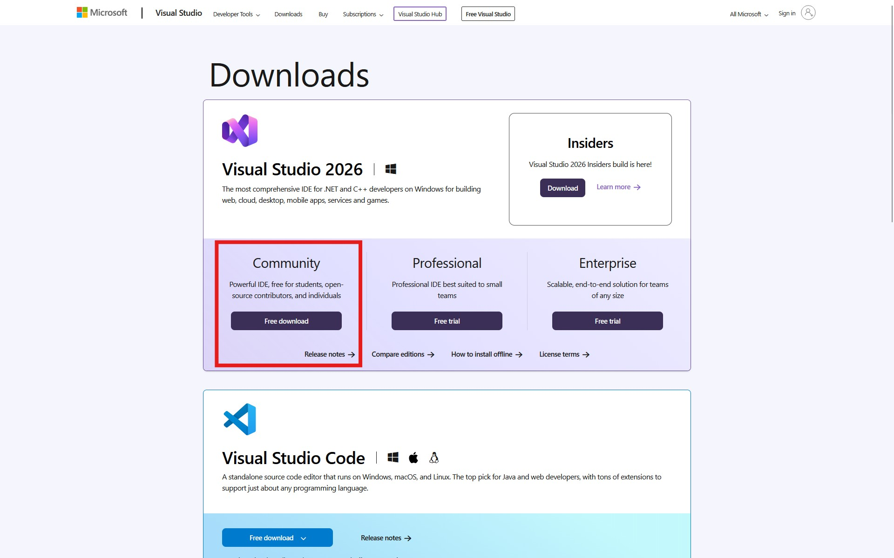

    TODO: caption

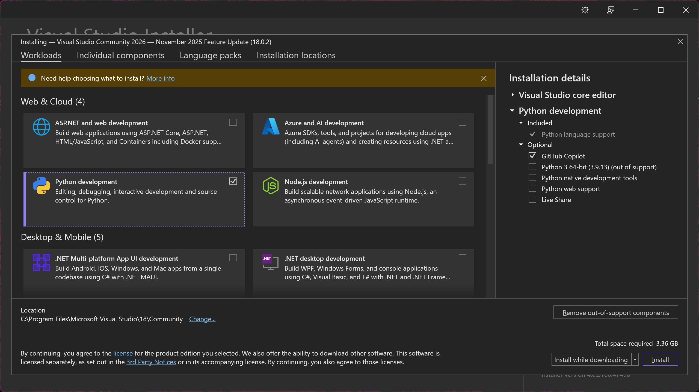

    TODO: caption

.. figure:: _static/visual-studio-development-environment-setup/3_enable-cpp-development.jpg
    :width: 80%

    TODO: caption

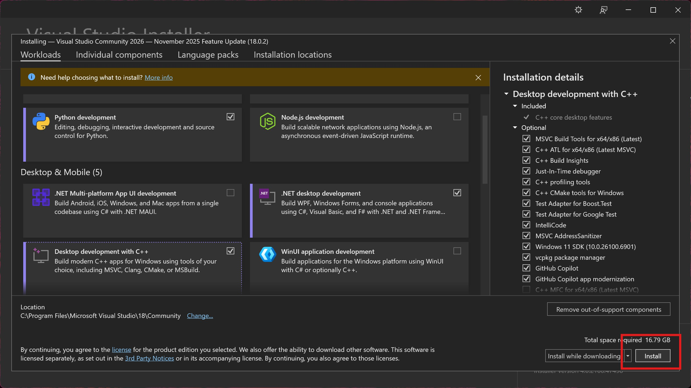

    TODO: caption

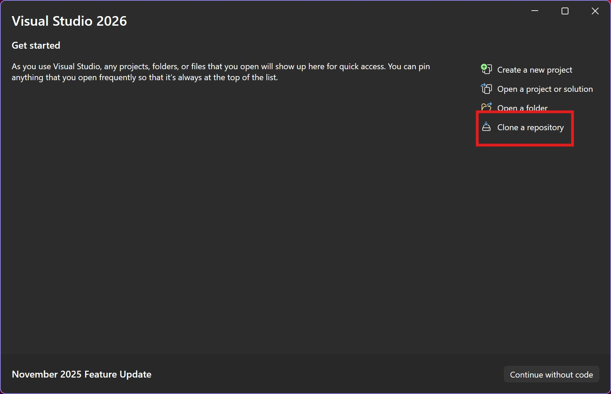

    TODO: caption

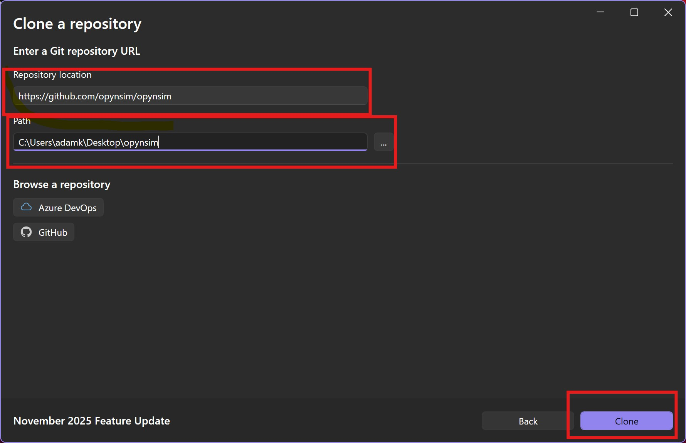

    TODO: caption

.. figure:: _static/visual-studio-development-environment-setup/7_switch-to-folder-view.jpg
    :width: 80%

    TODO: caption

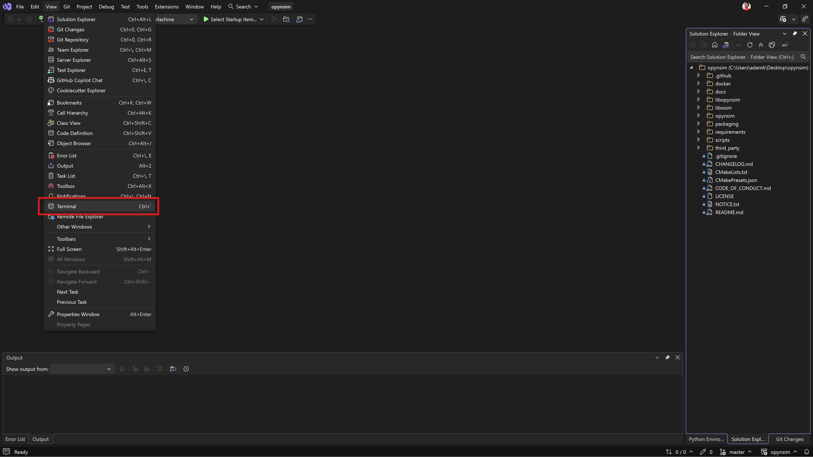

    TODO: caption

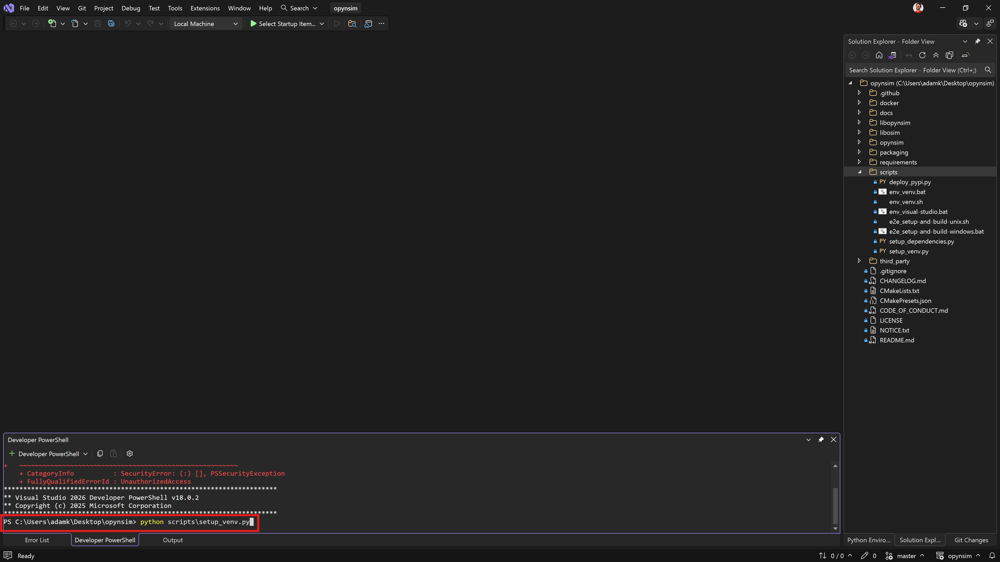

    TODO: caption

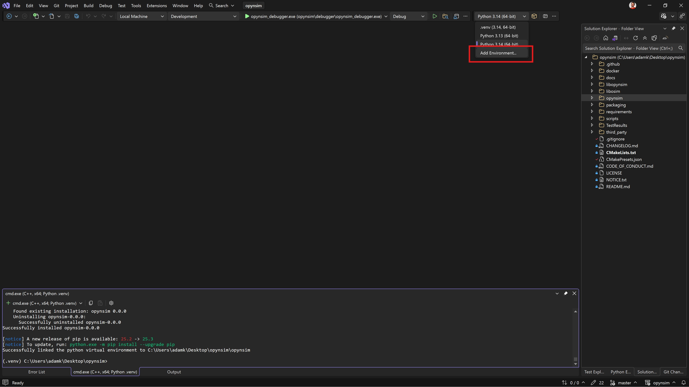

    TODO: caption

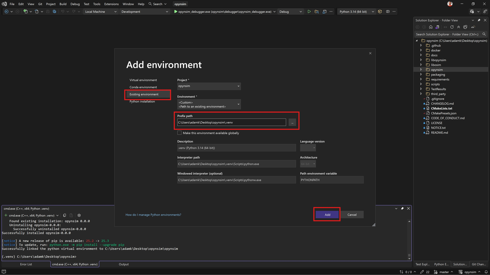

    TODO: caption

.. figure:: _static/visual-studio-development-environment-setup/12_validate-python-environment.jpg
    :width: 80%

    TODO: caption

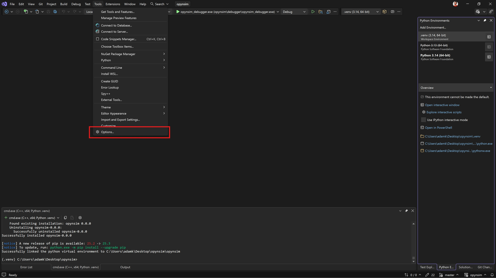

    TODO: caption

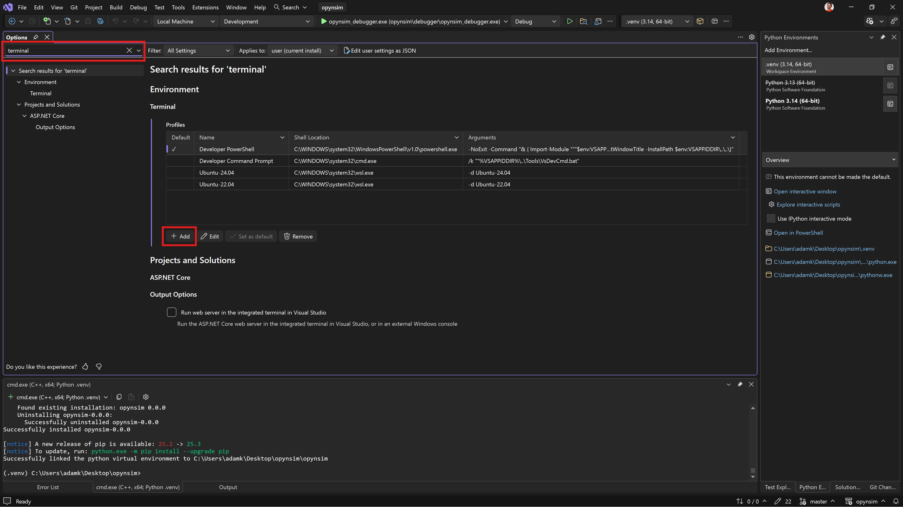

    TODO: caption

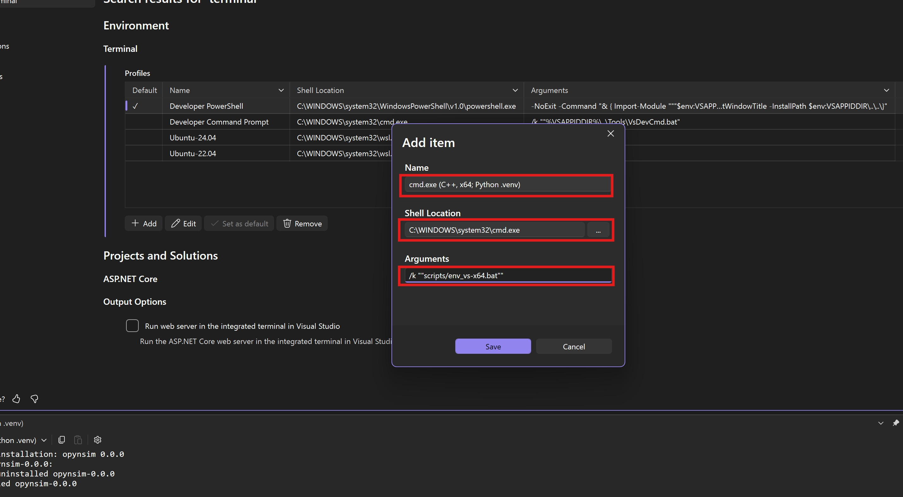

    TODO: caption

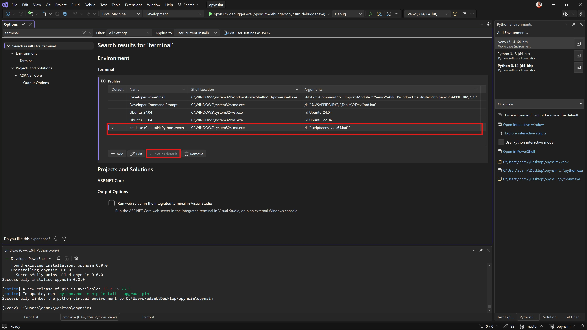

    TODO: caption

.. figure:: _static/visual-studio-development-environment-setup/17_activate-development-terminal.jpg
    :width: 80%

    TODO: caption

.. figure:: _static/visual-studio-development-environment-setup/18_build-dependencies.jpg
    :width: 80%

    TODO: caption

.. figure:: _static/visual-studio-development-environment-setup/19_after-all-dependencies-built.jpg
    :width: 80%

    TODO: caption

.. figure:: _static/visual-studio-development-environment-setup/20_run-development-workflow.jpg
    :width: 80%

    TODO: caption

.. figure:: _static/visual-studio-development-environment-setup/21_ran-development-workflow.jpg
    :width: 80%

    TODO: caption

.. figure:: _static/visual-studio-development-environment-setup/22_run-python-debugger.jpg
    :width: 80%

    TODO: caption

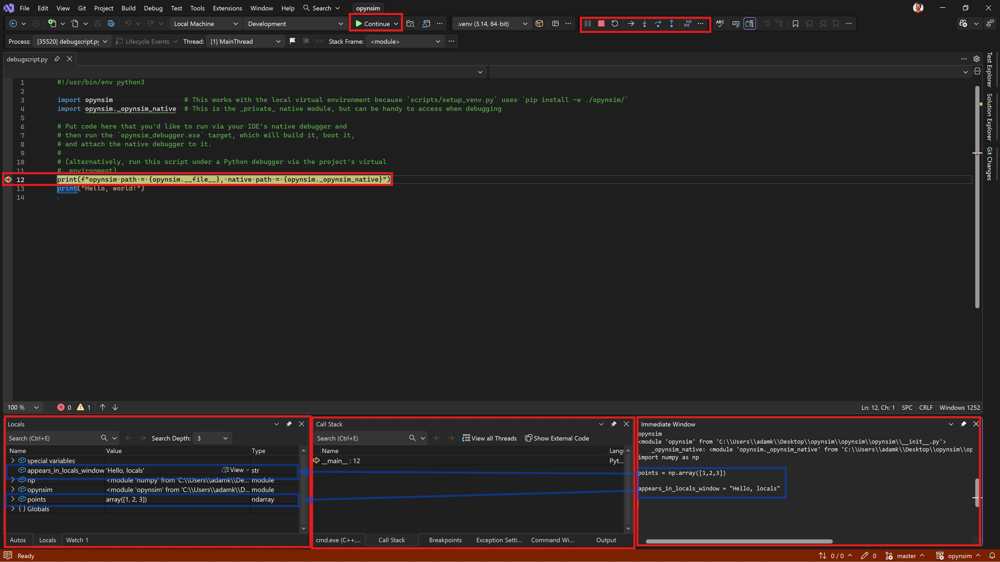

    TODO: caption

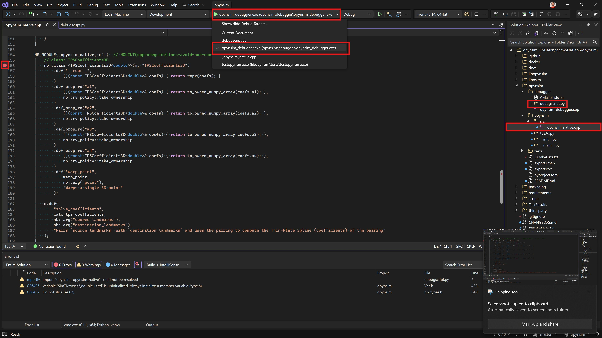

    TODO: caption

.. figure:: _static/visual-studio-development-environment-setup/25_native-debugging-example.jpg
    :width: 80%

    TODO: caption

