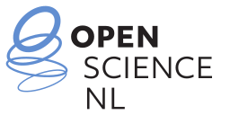

> [!CAUTION]
> This is currently **PRE-ALPHA** software. You can (of course) use it, but major
> architectural pieces are still being moved around.

<h1 align="center">
    
</h1>

OPynSim is a Python-native API for musculoskeletal modeling that doesn't compromise on nearly
20 years of research and feature development in the field.

- **Documentation**: [https://docs.opynsim.eu](https://docs.opynsim.eu)
- **Source code**: [https://github.com/opynsim/opynsim](https://github.com/opynsim/opynsim)

OPynSim provides:

- **A Python-native interface** for building and manipulating musculoskeletal models.
- **An integrated visualization API** that supports real-time 3D rendering.
- **High-performance bindings**, implemented with [nanobind](https://github.com/wjakob/nanobind).
- **Almost zero runtime dependencies**. It only depends on `numpy` ≥1.26.0.
- **Stable Python ABI implementation**. Works Python ≥3.12 on Windows, macOS, and Linux.
- **Excellent compatibility with OpenSim**. Can import/export `.osim` files and be used alongside the `opensim` Python API.

## 📖 Citing/Acknowledging

If you want to cite the OPynSim project, cite its proposal (we will publish something later on):

> Kewley, A., & Seth, A. (2026). OPynSim: A python-native library for interoperable biomechanical
> simulations. Zenodo. https://doi.org/10.5281/zenodo.19493285.

Alternatively, if you want to make it clear that OPynSim is an active project, rather than
a proposal, cite its NWO grant DOI: https://doi.org/10.61686/KYYRQ22856.

If you want to cite a specific version of OPynSim (e.g., for reproducibility, open science), then
additionally cite the unique Zenodo DOI corresponding to that version, for example:

> Adam Kewley. (2026). opynsim/opynsim: 0.0.7: Pre-Alpha Development Release (Version v0.0.7) [Computer software]. Zenodo. https://doi.org/10.5281/zenodo.21373996

## ❤️ Acknowledgements

We would like to thank [Open Science NL (NWO)](https://www.openscience.nl/), which
currently funds OPynSim's development through its "Open Science Infrastructure"
grant call ([grant](https://doi.org/10.61686/KYYRQ22856), [announcement](https://www.openscience.nl/en/news/45-projects-strengthen-dutch-open-science-infrastructure)). You can read OPynSim's
proposal on [Zenodo](https://doi.org/10.5281/zenodo.19493285).

We would also like to thank the [Department of Biomechanical Engineering at TU Delft](https://www.tudelft.nl/3me/over/afdelingen/biomechanical-engineering),
which provides the institutional support necessary to keep OPynSim's
development administered, supported, and stable.

<table align="center">
  <tr>
    <td colspan="2" align="center">Project Sponsors</td>
  </tr>
  <tr>
    <td align="center">
      <a href="https://www.tudelft.nl/3me/over/afdelingen/biomechanical-engineering">
        
         
        Biomechanical Engineering at TU Delft
      </a>
    </td>
    <td align="center">
      <a href="https://www.openscience.nl/en">
        
         
        Open Science NL
      </a>
    </td>
  </tr>
</table>
