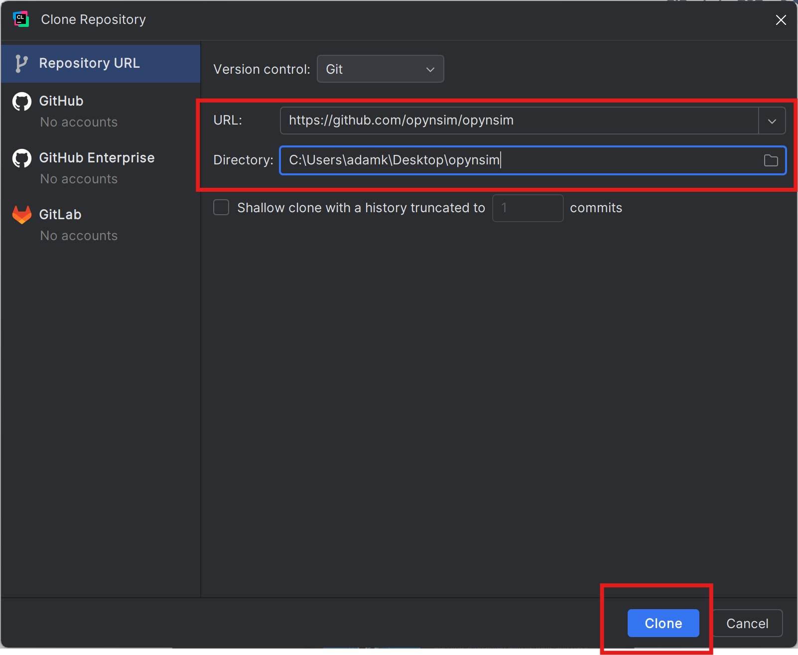
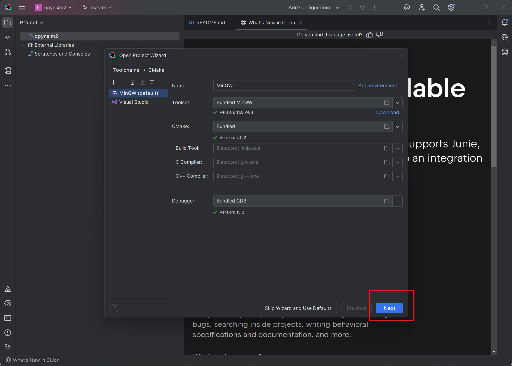

CLion Development Environment Setup
===================================

.. note::

    This guide was written against CLion 2025.2

This page walks through the process of setting up a `CLion`_ development
environment that's suitable for developing OPynSim's C++ and python code on
Windows, Mac, and Linux.

This guide assumes the user isn't particularly familar with large project
development and strives to make things easier by doing everything via CLion,
rather than (e.g.) asking the reader to use a mixture of applications and the
terminal.

Download and Install Python
---------------------------

OPynSim is a hybrid C++ and python project. CLion includes C++, but not Python. Therefore,
you need to install Python (at least version 3.12) and ensure that it is available on
the system PATH.

- **Windows**: Download python from `python.org <https://www.python.org/downloads/>`_, make
  sure to add it to the PATH when you install it. You can verify it's installed by Shift+Right-clicking
  on your desktop, ``Open in Terminal``, running ``python --version`` should work, as should running
  ``pip --version``.
- **Linux**: Most major distributions already include python. Verify it by opening a terminal and
  running ``python3 --version`` and ``pip3 --version``. Some distributions may require separately
  installing ``pip`` (google/ChatGPT it).
- **MacOS**: MacOS includes ``python`` and ``pip``. Verify it by opening a terminal (Command+Space, "term", Enter),
  and running ``python3 --version`` and ``pip3 --version``.

Download and Install CLion
--------------------------

Download the install `CLion`_ from the offical jetbrains website (always works) or
from your operating system's app store (usually easier - the Ubuntu App Store has
CLion). The default installation settings are usually fine.

You may need to create a JetBrains account in order to use CLion. CLion community
edition is free and suitable for open-source development (e.g. developing
OPynSim), but larger institutes/companies usually purchase a site license that
permits commercial development (check with your IT department). Additionally, keep
in mind that you may be entitled for a special status license (student, startup, etc.).

Use CLion to get OPynSim from GitHub
------------------------------------

OPynSim's source code is stored in the `OPynSim Git Repository`_, which CLion is
capable of cloning. The following screenshots describe how to clone the repository
in CLion:

.. figure:: _static/clion-development-environment-setup/clone-repository-button.jpg
    :width: 60%

    When opening CLion for the first time, or when no projects are open, this screen
    is shown. Click the highlighted button.

    Enter the URL of the OPynSim git repository (https://github/opynsim/opynsim). Optionally,
    set the directory where the code should be downloaded to (I prefer the desktop). Press
    the ``Clone`` button to begin the download process.

Select Toolchain
----------------

This step depends on your operating system and the C/C++ toolchains you already
have installed on the system. OPynSim's C++ code should be portable enough to
compile in all major compilers.

As a concrete example, on my Windows machine, which also has `Visual Studio`_
installed on it, I can select either MinGW (bundled with CLion) or Visual Studio's
MSVC compiler (bundled with Visual Studio). Either should work:

    When first opening a project in CLion, it will ask you which toolchain
    (i.e. build system + compiler) you want to use. OPynSim can be compiled
    with all major C++ compilers so, most of the time, you can just click ``Next``.

Select Third-Party Development Build Profile
--------------------------------------------

OPynSim includes a ``CMakePresets.json`` file, which tells IDEs like CLion and
Visual Studio how to configure themselves when the (CLion) project is first
opened.

OPynSim's development environment setup is performed in two steps:

- Setup and build third-party code and a python virtual environment
- Setup OPynSim to use the built code and python virtual environment

This step does the first part.

.. _CLion: https://www.jetbrains.com/clion/
.. _Python: https://www.python.org/downloads/
.. _OPynSim Git Repository: https://github.com/opynsim/opynsim
.. _Visual Studio: https://visualstudio.microsoft.com/downloads/
